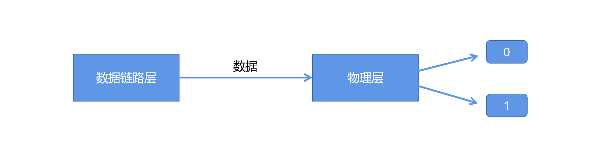

# 计算机网络

## 1. 计算机网络产生的条件

### 1.1 芯片技术

* 早期计算机体积大（一个教室）
* 集成电路产生，计算机体积下降
* 杰克基尔.比发明时间上第一个芯片，体积非常小

### 1.2 理论发展

* Paul Baran 提出分布式可适应信息块交换集成电路
* Donald Davies 提出封包交换

> 封包交换算法: 解决数据如何从一个点通过一个复杂网络到达另一个点的问题。

### 1.3 材料发展

* 同轴电缆: 一个导体，速度慢。
* 双绞线电缆: 导线两两缠绕，传输速度由导体材料决定，速度较快。
* 光纤: 光传输，速度快（10Gbps）,能量耗损低。

## 2. OSI 七层模型

### 2.1 OSI 模型介绍

OSI 模型指的是 Open System Interconnection Reference Model， 即开方式系统互联模型。它是世界上第一个试图在世界范围内规范网络标准的框架。

### 2.2 七层模型详解

* 应用层（Application Layer）
* 表现层（Presentation Layer）
* 会话层（Session Layer）
* 传输层（Transport Layer）
* 网络层（Network Layer）
* 数据链路层 （Data Link Layer）
* 物理层 （Physical Layer）

#### 2.2.1 应用层（Application Layer）

* 应用层位于OSI模型最上方
* 只关心业务逻辑，不关心数据的传输

#### 2.2.2 表现层（Presentation Layer）

负责协商用于传输的数据格式，并转换数据格式

#### 2.2.3 会话层（Session Layer）

* 负责管理两个连网实体间的连接
* 功能及特点: 建立连接、维持通信、释放连接

#### 2.2.4 传输层（Transport Layer）

负责将数据从一个实体（一个服务或应用）传输到另一个实体，但不负责传输的方式

> 传输层的能力
>
> * 数据分隔重组： 将数据拆分后按顺序重组
> * 纠错：在数据传输过程中出现问题后采取方式进行纠正
> * 管理连接：处理数据的频繁交换
> * 流量控制：控制传输数据的速率
> * 端口寻址：标明参与传输的实体的端口号

#### 2.2.5 网络层（Network Layer）

负责把一个封包从一个IP地址传输到另一个IP地址

#### 2.2.6 数据链路层（Data Link Layer）

* 确保两个临近设备间数据的传输，并隐藏底层实现
* 帧同步：两个设备之间传输时的协商速率问题
* 数据纠错

#### 2.2.7 物理层（Physical Layer）

* 封装和隐藏具体的传输手段，并且提供稳定的传输接口

