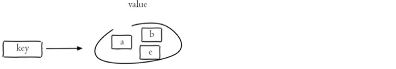

# Redis

## 1. redis介绍

### 1.1 常识

**磁盘：** 

1. 寻址：ms

2. 带宽：G/M

**内存：** 

1. 寻址：ns

2. 带宽：很大

> 秒>毫秒>微秒>纳秒 磁盘比内存在寻址上慢了10W倍

**I/O buffer：成本问题** 

磁盘与磁道，扇区，一扇区 512Byte带来一个成本变大：索引

操作系统默认每次从磁盘读取数据的大小: 4K

**数据库:**  

关系型数据库建表：必须给出schema

类型：字节宽度

存：倾向于行级存储

> 数据库：表很大，性能下降？
>
> 如果表有索引
>
> 增删改变慢
>
> 查询速度呢？
>
> 在硬盘能完全存下所有数据，内存也刚刚把所有的树干都能存下，然后没有溢出，没有问题的情况下：
>
> 1，1个或少量查询依然很快
>
> 2，并发大的时候会受硬盘带宽影响速度

> **学习网站:**  https://db-engines.com/en

### 1.2 Redis 简介

​		Redis 是一个开源（BSD许可）的，内存中的数据结构存储系统，它可以用作数据库、缓存和消息中间件。它支持多种类型的数据结构，如 字符串（strings）， 散列（hashes）， 列表（lists）， 集合（sets）， 有序集合（sorted sets） 与范围查询， bitmaps， hyperloglogs 和 地理空间（geospatial） 索引半径查询。 

​		Redis 内置了 复制（replication），LUA脚本（Lua scripting）， LRU驱动事件（LRU eviction），事务（transactions） 和不同级别的 磁盘持久化（persistence）， 并通过 Redis哨兵（Sentinel）和自动 分区（Cluster）提供高可用性（high availability）。

#### 1.2.1 Redis 与 memcache 

memcache 与 redis都是键值对数据库

* **memcache: ** value 无类型的概念

  memcache 读取数据时，返回所有的数据到 client端；

  当并发量大的时候，读取速度会受到网卡I/O的限制；

  在client端，需要程序员自己实现对数据的解码(例如: 计算解析json)。

* **redis:**  value 有类型的概念

  **类型其实不是很重要，重要的是redis server 中对每种类型都有自己的方法；** 

  也就是说其实它可能给你提供一个什么？基于index()，让你给出一个索引下标；

  在读取数据时，并不需要将数据全部取走，且不需要在客户端写很多代码。

  > 计算向数据移动

#### 1.2.2 Redis 数据类型

Redis存储的是key-value结构的数据，其中key是字符串类型，value有5种常用的数据类型: 


1. **String **  
   * 字符类型
   * 数值类型
   * **bitmaps** 
2. **hashes ** 
3. **lists ** 
4. **sets** 
5. **sorted sets**  

**解释说明：** 

> 字符串(string)：普通字符串，常用
>
> 哈希(hash)：适合存储对象
>
> 列表(list)：按照插入顺序排序，可以有重复元素
>
> 集合(set)：无序集合，没有重复元素
>
> 有序集合(sorted set / zset)：集合中每个元素关联一个分数（score），根据分数升序排序，没有重复元素


### 1.3 Redis 安装

首先去阅读 `README.md` 文档。

```shell
admind@manager:~$ apt install wget
admind@manager:~$ cd ~
admind@manager:~$ mkdir soft
admind@manager:~$ wget https://download.redis.io/releases/redis-6.2.6.tar.gz
admind@manager:~$ tar xf redis...tar.gz
admind@manager:~$ cd redis-src
admind@manager:~$ vim README.md
admind@manager:~$ make
... apt install gcc
... make distclean
admind@manager:~$ make
admind@manager:~$ cd src ...生成了可执行程序
admind@manager:~$ cd ..
admind@manager:~$ make install PREFIX=/opt/soft/redis6
admind@manager:~$ vim /etc/profile
... export REDIS_HOME=/opt/soft/redis6
... export PATH=${REDIS_HOME}/bin:$PATH
admind@manager:~$ source /etc/profile
admind@manager:~$ cd utils
admind@manager:~$ ./install_server.sh (可以执行多次)
admind@manager:~$ ps -ef | grep redis
```

> 1. 一个物理机中可以有多个redis实例(进程)，通过 port 区分
> 2. 可执行程序就一份在目录中，但是内存中未来的多个实例需要各自的配置文件
> 3. service redis_6379 start/stop/status > linux /etc/init.d/****
> 4. 脚本会自动启动 redis server

## 2. redis 常用命令

可以使用 `help @ + 分组查看帮助` (`help @string` 查看 string 组的命令) 

访问 https://redis.io/commands 进行相关命令的查看

访问 https://www.redis.net.cn redis 中文网站进行学习

### 2.1 通用命令

Redis中的通用命令，主要是针对 key 进行操作的相关命令：

* **KEYS ** pattern:  查找所有符合给定模式 (pattern) 的 key  (`*` 表示匹配所有) 
* **EXISTS** key:  检查给定 key 是否存在
* **TYPE** key:   返回 key 所存储的值的类型
* **DEL** key:   该命令用于在 key 存在是删除 key 
* **OBJECT** subcommand [arguments [arguments ...]]:  查看 redis 对象的内部结构  (`OBJECT encoding k1` 查看k1 value 的编码) 
* **MOVE** key db:   将当前数据库的 key 移动到给定的数据库 db 中。
* **TTL** key:   返回给定 key 的剩余生存时间(TTL, time to live)，以秒为单位

> 更多命令使用 `help @generic` 查看
>
> 访问 https://redis.io/commands 进行相关命令的查看

 

### 2.2 string 类型 & bitmap

#### 2.2.1 字符串 

* **SET** key value         设置指定 key 的值
* **GET** key                   获取指定 key 的值
* **SETEX** key value     设置指定 key 的值，并将 key 的过期时间设置为 seconds 秒
* **SETNX** key value     只有在 key 不存在时设置 key 的值
* **SET** key value  xx    只有 key 存在时设置 key 的值
* **APPEND** key value  给指定 key 追加值
* **SETRANGE** key value 从指定的偏移量开始重写字符串的key处的部分
* **STRLEN** key             获取 key 存储的值的长度
* **GETSET** key value   设置指定 key 的值并返回旧的值

> 更多命令使用 `help @string` 查看
>
> 访问 https://redis.io/commands 进行相关命令的查看

#### 2.2.2 数值

* **INCR** key      将 key 中存储的数字值增1

* **INCRBY** key increment       将 key 中存储的数字加上指定的增量值

* **INCRBYFLOAT ** key increment   将 key 中所存储的值加上指定的浮点数增量值。

* **DECR** key    将 key中存储的数字减1

* **DECRBY** key decrement  将 key 中存储的数字减去指定的增量值

> 更多命令使用 `help @string` 查看
>
> 访问 https://redis.io/commands 进行相关命令的查看

#### 2.2.3 bitmap

* **BITCOUNT** key [start end]   统计字符串中设置位1的个数 
* **BITSET** key  offset value  用于对 key 所存储的字符串值，设置或清除指定偏移量上的位(bit) 
* **BITPOS**  key bit [start] [end]  返回字符串中第一个被设为 1 或 0 位的位置 
* **BITOP** operation destkey key [key ... ]  在多个键(包含字符串值)之间执行按位操作，并将结果存储在目标键中
* **GETBIT**  key offset 返回存储在key处的字符串值中位于offset处的位值。

> 更多命令使用 `help @string` 查看
>
> 访问 https://redis.io/commands 进行相关命令的查看


### 2.3 list 类型

Redis 列表是简单的字符串列表，按照插入顺序排序，常用命令：

- **LPUSH** key value1 [value2]         将一个或多个值插入到列表头部

- **LRANGE** key start stop                获取列表指定范围内的元素

- **RPOP** key                                       移除并获取列表最后一个元素

- **LLEN** key                                        获取列表长度

- **BRPOP** key1 [key2 ] timeout       移出并获取列表的最后一个元素， 如果列表没有元素会阻塞列表直到等待超    时或发现可弹出元素为止

- **LREM** key count element              从存储在key处的列表中删除第一个等于element的元素的出现次数。count参数以以下方式影响操作:

  * count > 0:删除元素等于元素从头部移动到尾部。
  * count < 0:删除元素等于元素从尾部移动到头部。
  * count = 0:删除所有元素。

- **LMOVE** source destination LEFT|RIGHT LEFT|RIGHT 从存储在 source 处的列表中删除一个元素，添加到另一个列表中，并返回该元素。LEFT|RIGHT 和 LEFT|RIGHT 表示:

  - LEFT|RIGHT   从列表的左边或右边删除一个元素
  - LEFT|RIGHT   从列表的左边或右边添加一个元素

  > * 可靠队列: 
  >
  >   Redis经常被用作消息服务器来实现后台任务或其他类型的消息传递任务的处理。一种简单的队列形式通常是将值推入生产者端列表中，然后在消费者端使用RPOP(使用轮询)等待这些值，或者如果客户端通过阻塞操作得到更好的服务，则使用BRPOP。
  >
  >   然而，在这种情况下，获得的队列是不可靠的，因为消息可能会丢失，例如在出现网络问题或消费者在收到消息后立即崩溃，但仍然需要处理消息。
  >
  >   LMOVE(或阻塞变体的BLMOVE)提供了一种避免这个问题的方法:使用者获取消息，同时将其推入处理列表。它将使用LREM命令，以便在处理完消息后从处理列表中删除消息。
  >
  >   另一个客户端可能会监视处理列表中停留时间过长的项目，并在需要时将那些超时的项目再次推入队列。
  >
  > * 循环列表
  >
  >   使用具有相同源键和目标键的LMOVE，客户端可以在O(N)中依次访问N个元素列表中的所有元素，而无需使用单个LRANGE操作将完整列表从服务器传输到客户端。
  >
  >   在以下两个条件下，上述模式仍然有效:
  >
  >   有多个客户端循环列表:它们将获取不同的元素，直到访问列表中的所有元素，并重新启动进程。
  >
  >   即使其他客户积极地将新项目推到列表的末尾。
  >
  >   以上这些使得实现一个系统非常简单，在这个系统中，一组项必须尽可能快地由N个工作者连续处理。一个例子是一个监控系统，它必须检查一组网站是可达的，以尽可能最小的延迟，使用许多并行工作者。
  >
  >   请注意，worker的这种实现是可伸缩和可靠的，因为即使消息丢失，项目仍然在队列中，并将在下一次迭代中处理。


> 更多命令使用 `help @list` 查看
>
> 访问 https://redis.io/commands 进行相关命令的查看


### 2.4 hash 类型

Redis hash 是一个string类型的 field 和 value 的映射表，hash特别适合用于存储对象，常用命令：

- **HSET** key field value             将哈希表 key 中的字段 field 的值设为 value
- **HGET** key field                       获取存储在哈希表中指定字段的值
- **HDEL** key field                       删除存储在哈希表中的指定字段
- **HKEYS** key                              获取哈希表中所有字段
- **HVALS** key                              获取哈希表中所有值
- **HGETALL** key                         获取在哈希表中指定 key 的所有字段和值


> 更多命令使用 `help @hash` 查看
>
> 访问 https://redis.io/commands 进行相关命令的查看


### 2.5 set 类型

Redis set 是string类型的无序集合。集合成员是唯一的，这就意味着集合中不能出现重复的数据，常用命令：

- **SADD** key member1 [member2]            向集合添加一个或多个成员

- **SMEMBERS** key                                         返回集合中的所有成员

- **SCARD** key                                                  获取集合的成员数

- **SINTER** key1 [key2]                                   返回给定所有集合的交集

- **SUNION** key1 [key2]                                 返回所有给定集合的并集

- **SDIFF** key1 [key2]                                      返回给定所有集合的差集

- **SREM** key member1 [member2]            移除集合中一个或多个成员

- **SMOVE** source destination member       将 source 集合中的某个元素移动到 destination 集合中

- **SPOP** key [count]     移除并返回一个或多个随机成员

- **SRANDMEMBER** key count  从集合中返回一个或多个随机成员

  - 当参数 count 为正值时，该命令的行为如下:

    不返回重复的元素。

    如果count大于集合的基数，该命令将只返回不包含其他元素的整个集合。

    返回的元素的顺序并不是真正随机的，因此如果需要，由客户机对它们进行shuffle。

  - 当计数为负值时，行为变化如下:

    重复元素是可能的。

    精确计数元素，或者如果集合为空(不存在的键)，则返回空数组。

    返回的元素的顺序是真正随机的。



> 更多命令使用 `help @set` 查看
>
> 访问 https://redis.io/commands 进行相关命令的查看


### 2.6 sorted_set 类型

Redis sorted set 有序集合是 string 类型元素的集合，且不允许重复的成员。每个元素都会关联一个double类型的分数(score) 。redis正是通过分数来为集合中的成员进行从小到大排序。有序集合的成员是唯一的，但分数却可以重复，分数相同则按照字母顺序进行排序。

常用命令：

- **ZADD** key [NX | XX]  [GT | LT] [CH] [INCR] score1 member1 [score2 member2]     向有序集合添加一个或多个成员，或者更新已存在成员的 分数
  - XX: 只更新已经存在的元素，并不添加新元素
  - NX: 只添加新元素，并不更新已存在的元素
  - LT: 只有当新分数小于当前分数时，才更新现有的元素。这个标志不会阻止添加新元素。
  - GT: 只有当新分数大于当前分数时，才更新现有的元素。这个标志不会阻止添加新元素。
  - CH: 将返回值从添加的新元素数修改为更改的元素总数(CH是changed的缩写)。更改的元素是添加的新元素和已经存在的元素，并为此更新了分数。因此，在命令行中指定的具有与过去相同分数的元素将不被计算。注:通常ZADD的返回值只计算添加的新元素的个数。
  - INCR: 当指定此选项时，ZADD的行为类似于ZINCRBY。该模式下只能指定一个score-element对。
- **ZRANGE** key start stop [WITHSCORES]                     通过索引区间返回有序集合中指定区间内的成员
- **ZINCRBY** key increment member                              有序集合中对指定成员的分数加上增量 increment
- **ZREM** key member [member ...]                                移除有序集合中的一个或多个成员
- **ZCOUNT** key min max                                               返回分数在 min 和 max 区间的成员数量
- **ZCARD** key                                                                 返回存储在key处的已排序集合的基数(元素数)。


> 更多命令使用 `help @set` 查看
>
> 访问 https://redis.io/commands 进行相关命令的查看


## 3.  redis pipeline

​		可以实现请求/响应服务器，这样即使客户端还没有读取旧的响应，它也能够处理新请求。通过这种方式，可以向服务器发送多个命令，而无需等待响应，并最终在一个步骤中读取响应。

下面是一个使用原始netcat工具的例子:

```shell
admind@manager:~$ echo -e "set k1 99\nincr k1\nget k1" | nc localhost 6379
+OK
:100
$3
100
```

使用 pipeline 时每个命令间必须使用 `\n` 换行符隔开。

第一个 OK 表示成功创建 k1；第二个100是`incr k1` 返回值；`$3` 是100这个宽度是3；第三个返回值是 `get k1` 的值，返回100。

> 重要提示:
>
> ​		当客户端使用流水线发送命令时，服务器将被迫使用内存对响应进行排队。因此，如果您需要使用流水线发送大量命令，最好是将它们作为批次发送，每个批次包含一个合理的数量，例如10k命令，读取回复，然后再次发送另一个10k命令，以此类推。速度将几乎相同，但使用的额外内存将最多达到为这些10k命令排队响应所需的内存。


## 4. redis 消息订阅

​		订阅，取消订阅和发布实现了发布/订阅消息范式(引自wikipedia)，发送者（发布者）不是计划发送消息给特定的接收者（订阅者）。而是发布的消息分到不同的频道，不需要知道什么样的订阅者订阅。订阅者对一个或多个频道感兴趣，只需接收感兴趣的消息，不需要知道什么样的发布者发布的。这种发布者和订阅者的解耦合可以带来更大的扩展性和更加动态的网络拓扑。

例如，为了订阅通道foo和bar，客户端会发出一个subscribe，提供通道的名称:

```shell
SUBSCRIBE foo bar
```

其他客户端发送到这些通道的消息将被Redis推送到所有订阅的客户端。


> 使用 `help @pubsub` 查看相关操作
>
> 访问 https://redis.io进行相关学习


## 5. Redis 事务 

[MULTI](https://redis.io/commands/multi), [EXEC](https://redis.io/commands/exec), [DISCARD](https://redis.io/commands/discard) 和 [WATCH](https://redis.io/commands/watch) 是 Redis 事务的基础， 它们允许在一个步骤中执行一组命令，并且有两个重要的保证:

* 事务中所有的命令都被序列化并按顺序执行，在 Redis 事务执行过程中，一个由其他客户端惹出的请求是不可能被执行的，这保证了这些命令是作为单个隔离操作执行的。
* 要么所有的命令都被处理，要么不处理，因此Redis事务也是原子性的。EXEC命令触发事务中执行的所有命令,所以如果客户端失去了连接到服务器之前事务的上下文中调用EXEC命令执行的操作,而如果EXEC命令,执行的所有操作。当使用仅追加文件时，Redis确保使用单一的write(2)系统调用将事务写到磁盘上。然而，如果Redis服务器崩溃或被系统管理员以某种艰难的方式杀死，可能只有部分操作被注册。Redis将在重启时检测到这种情况，并将退出并报错。使用redis-check-aof工具可以修复append only文件，该文件将删除部分事务，以便服务器可以重新启动。

### 5.1 使用

使用MULTI命令输入Redis事务。该命令总是以OK回答。此时，用户可以发出多个命令。而不是执行这些命令，Redis将它们排队。调用EXEC后，将执行所有命令。

而调用DISCARD将清空事务队列并退出事务。

下面的例子是对foo和bar键进行原子递增。

```shell
> MULTI
OK
> INCR foo
QUEUED
> INCR bar
QUEUED
> EXEC
1) (integer) 1
2) (integer) 1
```

从上面的会话中可以看到，EXEC返回一个应答数组，其中每个元素都是事务中单个命令的应答，顺序与发出命令的顺序相同。

当Redis连接在MULTI请求的上下文中时，所有的命令都将以字符串QUEUED(从Redis协议的角度来看，作为一个Status reply发送)来响应。队列命令只是在调用EXEC时调度执行。

> 使用 `help @transaction` 查看相关操作
>
> 访问 https://redis.io/topics/transactions 进行相关学习


