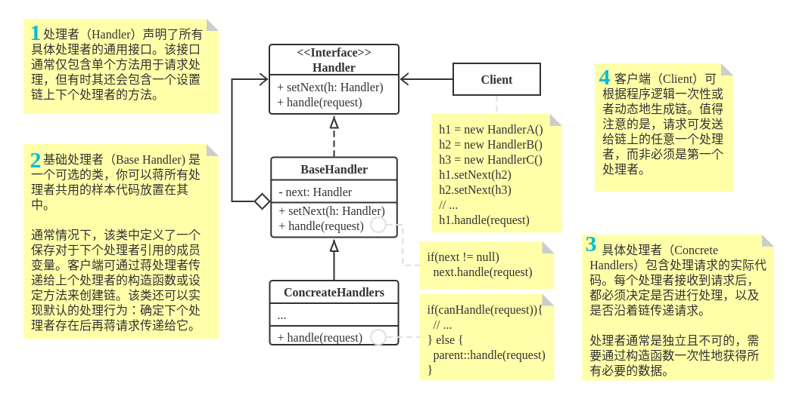

# Chain Of Responsibility

**亦称：**职责链模式、命令链、CoR、Chain of Command、Chain of Responsibility

**责任链模式**是一种行为设计模式， 允许你将请求沿着处理者链进行发送。 收到请求后， 每个处理者均可对请求进行处理， 或将其传递给链上的下个处理者。

> 拓展阅读: https://refactoring.guru/design-patterns/chain-of-responsibility


## 1. 责任链模式通用类图



## 2. 小案例

### middleware

####  **middleware/Middleware.java:**  基础验证接口

```java
package refactoring_guru.chain_of_responsibility.example.middleware;

/**
 * Base middleware class.
 */
public abstract class Middleware {
    private Middleware next;

    /**
     * Builds chains of middleware objects.
     */
    public Middleware linkWith(Middleware next) {
        this.next = next;
        return next;
    }

    /**
     * Subclasses will implement this method with concrete checks.
     */
    public abstract boolean check(String email, String password);

    /**
     * Runs check on the next object in chain or ends traversing if we're in
     * last object in chain.
     */
    protected boolean checkNext(String email, String password) {
        if (next == null) {
            return true;
        }
        return next.check(email, password);
    }
}
```

####  **middleware/ThrottlingMiddleware.java:** 检查请求数量限制

```java
package refactoring_guru.chain_of_responsibility.example.middleware;

/**
 * ConcreteHandler. Checks whether there are too many failed login requests.
 */
public class ThrottlingMiddleware extends Middleware {
    private int requestPerMinute;
    private int request;
    private long currentTime;

    public ThrottlingMiddleware(int requestPerMinute) {
        this.requestPerMinute = requestPerMinute;
        this.currentTime = System.currentTimeMillis();
    }

    /**
     * Please, not that checkNext() call can be inserted both in the beginning
     * of this method and in the end.
     *
     * This gives much more flexibility than a simple loop over all middleware
     * objects. For instance, an element of a chain can change the order of
     * checks by running its check after all other checks.
     */
    public boolean check(String email, String password) {
        if (System.currentTimeMillis() > currentTime + 60_000) {
            request = 0;
            currentTime = System.currentTimeMillis();
        }

        request++;
        
        if (request > requestPerMinute) {
            System.out.println("Request limit exceeded!");
            Thread.currentThread().stop();
        }
        return checkNext(email, password);
    }
}
```

####  **middleware/UserExistsMiddleware.java:** 检查用户登录信息

```java
package refactoring_guru.chain_of_responsibility.example.middleware;

import refactoring_guru.chain_of_responsibility.example.server.Server;

/**
 * ConcreteHandler. Checks whether a user with the given credentials exists.
 */
public class UserExistsMiddleware extends Middleware {
    private Server server;

    public UserExistsMiddleware(Server server) {
        this.server = server;
    }

    public boolean check(String email, String password) {
        if (!server.hasEmail(email)) {
            System.out.println("This email is not registered!");
            return false;
        }
        if (!server.isValidPassword(email, password)) {
            System.out.println("Wrong password!");
            return false;
        }
        return checkNext(email, password);
    }
}
```

####  **middleware/RoleCheckMiddleware.java:** 检查用户角色

```java
package refactoring_guru.chain_of_responsibility.example.middleware;

/**
 * ConcreteHandler. Checks a user's role.
 */
public class RoleCheckMiddleware extends Middleware {
    public boolean check(String email, String password) {
        if (email.equals("admin@example.com")) {
            System.out.println("Hello, admin!");
            return true;
        }
        System.out.println("Hello, user!");
        return checkNext(email, password);
    }
}
```

###  **server** 

####  **server/Server.java:** 授权目标

```java
package refactoring_guru.chain_of_responsibility.example.server;

import refactoring_guru.chain_of_responsibility.example.middleware.Middleware;

import java.util.HashMap;
import java.util.Map;

/**
 * Server class.
 */
public class Server {
    private Map<String, String> users = new HashMap<>();
    private Middleware middleware;

    /**
     * Client passes a chain of object to server. This improves flexibility and
     * makes testing the server class easier.
     */
    public void setMiddleware(Middleware middleware) {
        this.middleware = middleware;
    }

    /**
     * Server gets email and password from client and sends the authorization
     * request to the chain.
     */
    public boolean logIn(String email, String password) {
        if (middleware.check(email, password)) {
            System.out.println("Authorization have been successful!");

            // Do something useful here for authorized users.

            return true;
        }
        return false;
    }

    public void register(String email, String password) {
        users.put(email, password);
    }

    public boolean hasEmail(String email) {
        return users.containsKey(email);
    }

    public boolean isValidPassword(String email, String password) {
        return users.get(email).equals(password);
    }
}
```

####  **Demo.java:** 客户端代码

```java
package refactoring_guru.chain_of_responsibility.example;

import refactoring_guru.chain_of_responsibility.example.middleware.Middleware;
import refactoring_guru.chain_of_responsibility.example.middleware.RoleCheckMiddleware;
import refactoring_guru.chain_of_responsibility.example.middleware.ThrottlingMiddleware;
import refactoring_guru.chain_of_responsibility.example.middleware.UserExistsMiddleware;
import refactoring_guru.chain_of_responsibility.example.server.Server;

import java.io.BufferedReader;
import java.io.IOException;
import java.io.InputStreamReader;

/**
 * Demo class. Everything comes together here.
 */
public class Demo {
    private static BufferedReader reader = new BufferedReader(new InputStreamReader(System.in));
    private static Server server;

    private static void init() {
        server = new Server();
        server.register("admin@example.com", "admin_pass");
        server.register("user@example.com", "user_pass");

        // All checks are linked. Client can build various chains using the same
        // components.
        Middleware middleware = new ThrottlingMiddleware(2);
        middleware.linkWith(new UserExistsMiddleware(server))
                .linkWith(new RoleCheckMiddleware());

        // Server gets a chain from client code.
        server.setMiddleware(middleware);
    }

    public static void main(String[] args) throws IOException {
        init();

        boolean success;
        do {
            System.out.print("Enter email: ");
            String email = reader.readLine();
            System.out.print("Input password: ");
            String password = reader.readLine();
            success = server.logIn(email, password);
        } while (!success);
    }
}
```

####  **OutputDemo.txt:** 执行结果

```
Enter email: admin@example.com
Input password: admin_pass
Hello, admin!
Authorization have been successful!


Enter email: user@example.com
Input password: user_pass
Hello, user!
Authorization have been successful!
```


