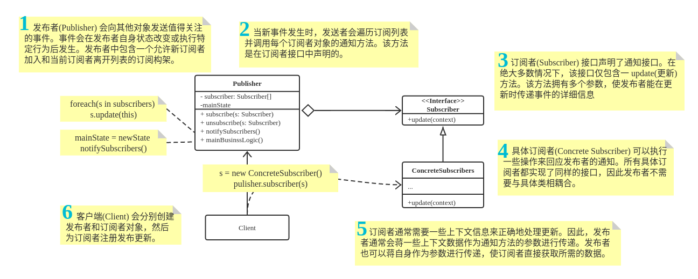

# Observer

**亦称：** 事件订阅者、监听者、Event-Subscriber、Listener、Observer

**观察者模式**是一种行为设计模式， 允许你定义一种订阅机制， 可在对象事件发生时通知多个 “观察” 该对象的其他对象。

> 扩展阅读: https://refactoringguru.cn/design-patterns/observer


## 1. 观察者模式通用类图




## 2. 观察者模式适用场景

* 当一个对象状态的改变需要改变其他对象， 或实际对象是事先未知的或动态变化的时， 可使用观察者模式。

* 当你使用图形用户界面类时通常会遇到一个问题。 比如， 你创建了自定义按钮类并允许客户端在按钮中注入自定义代码， 这样当用户按下按钮时就会触发这些代码。

* 观察者模式允许任何实现了订阅者接口的对象订阅发布者对象的事件通知。 你可在按钮中添加订阅机制， 允许客户端通过自定义订阅类注入自定义代码。

* 当应用中的一些对象必须观察其他对象时， 可使用该模式。 但仅能在有限时间内或特定情况下使用。

* 订阅列表是动态的， 因此订阅者可随时加入或离开该列表。


## 3. 观察者模式实现方式

1. 仔细检查你的业务逻辑， 试着将其拆分为两个部分： 独立于其他代码的核心功能将作为发布者； 其他代码则将转化为一组订阅类。

2. 声明订阅者接口。 该接口至少应声明一个 `update`方法。

3. 声明发布者接口并定义一些接口来在列表中添加和删除订阅对象。 记住发布者必须仅通过订阅者接口与它们进行交互。

4. 确定存放实际订阅列表的位置并实现订阅方法。 通常所有类型的发布者代码看上去都一样， 因此将列表放置在直接扩展自发布者接口的抽象类中是显而易见的。 具体发布者会扩展该类从而继承所有的订阅行为。

   但是， 如果你需要在现有的类层次结构中应用该模式， 则可以考虑使用组合的方式： 将订阅逻辑放入一个独立的对象， 然后让所有实际订阅者使用该对象。

5. 创建具体发布者类。 每次发布者发生了重要事件时都必须通知所有的订阅者。

6. 在具体订阅者类中实现通知更新的方法。 绝大部分订阅者需要一些与事件相关的上下文数据。 这些数据可作为通知方法的参数来传递。

   但还有另一种选择。 订阅者接收到通知后直接从通知中获取所有数据。 在这种情况下， 发布者必须通过更新方法将自身传递出去。 另一种不太灵活的方式是通过构造函数将发布者与订阅者永久性地连接起来。

7. 客户端必须生成所需的全部订阅者， 并在相应的发布者处完成注册工作。


## 4. 观察者模式优缺点

**优点: ** 

-  *开闭原则*。 你无需修改发布者代码就能引入新的订阅者类 （如果是发布者接口则可轻松引入发布者类）。
-  你可以在运行时建立对象之间的联系。

**缺点: ** 

-  订阅者的通知顺序是随机的。


## 5. 观察者模式与其他模式的关系

- [Chain Of Responsibility](https://refactoringguru.cn/design-patterns/chain-of-responsibility)、 [Command](https://refactoringguru.cn/design-patterns/command)、 [Mediator](https://refactoringguru.cn/design-patterns/mediator)和[Observer](https://refactoringguru.cn/design-patterns/observer)用于处理请求发送者和接收者之间的不同连接方式：

  - *责任链*按照顺序将请求动态传递给一系列的潜在接收者， 直至其中一名接收者对请求进行处理。
  - *命令*在发送者和请求者之间建立单向连接。
  - *中介者*清除了发送者和请求者之间的直接连接， 强制它们通过一个中介对象进行间接沟通。
  - *观察者*允许接收者动态地订阅或取消接收请求。

- [Mediator](https://refactoringguru.cn/design-patterns/mediator)和[Observer](https://refactoringguru.cn/design-patterns/observer)之间的区别往往很难记住。 在大部分情况下， 你可以使用其中一种模式， 而有时可以同时使用。 让我们来看看如何做到这一点。

  

  *中介者*的主要目标是消除一系列系统组件之间的相互依赖。 这些组件将依赖于同一个中介者对象。 *观察者*的目标是在对象之间建立动态的单向连接， 使得部分对象可作为其他对象的附属发挥作用。

  

  有一种流行的中介者模式实现方式依赖于*观察者*。 中介者对象担当发布者的角色， 其他组件则作为订阅者， 可以订阅中介者的事件或取消订阅。 当*中介者*以这种方式实现时， 它可能看上去与*观察者*非常相似。

  

  当你感到疑惑时， 记住可以采用其他方式来实现中介者。 例如， 你可永久性地将所有组件链接到同一个中介者对象。 这种实现方式和*观察者*并不相同， 但这仍是一种中介者模式。

  

  假设有一个程序， 其所有的组件都变成了发布者， 它们之间可以相互建立动态连接。 这样程序中就没有中心化的中介者对象， 而只有一些分布式的观察者。

## 6. 案例

### 6.1 Publisher

**publisher/EventManager.java: Basic publisher** 

```java
import refactoring_guru.observer.example.listeners.EventListener;

import java.io.File;
import java.util.ArrayList;
import java.util.HashMap;
import java.util.List;
import java.util.Map;

public class EventManager {
    Map<String, List<EventListener>> listeners = new HashMap<>();

    public EventManager(String... operations) {
        for (String operation : operations) {
            this.listeners.put(operation, new ArrayList<>());
        }
    }

    public void subscribe(String eventType, EventListener listener) {
        List<EventListener> users = listeners.get(eventType);
        users.add(listener);
    }

    public void unsubscribe(String eventType, EventListener listener) {
        List<EventListener> users = listeners.get(eventType);
        users.remove(listener);
    }

    public void notify(String eventType, File file) {
        List<EventListener> users = listeners.get(eventType);
        for (EventListener listener : users) {
            listener.update(eventType, file);
        }
    }
}
```


### 6.2 Editor

**editor/Editor.java: Conrete publisher, tracked by other objects** 

```java
import refactoring_guru.observer.example.publisher.EventManager;

import java.io.File;

public class Editor {
    public EventManager events;
    private File file;

    public Editor() {
        this.events = new EventManager("open", "save");
    }

    public void openFile(String filePath) {
        this.file = new File(filePath);
        events.notify("open", file);
    }

    public void saveFile() throws Exception {
        if (this.file != null) {
            events.notify("save", file);
        } else {
            throw new Exception("Please open a file first.");
        }
    }
}
```


### 6.3 Listeners

**listeners/EventListener.java: Common observer interface** 

```java
import java.io.File;

public interface EventListener {
    void update(String eventType, File file);
}
```

**listeners/EmailNotificationListener.java: Sends email upon receiving notification** 

```java
import java.io.File;

public class EmailNotificationListener implements EventListener {
    private String email;

    public EmailNotificationListener(String email) {
        this.email = email;
    }

    @Override
    public void update(String eventType, File file) {
        System.out.println("Email to " + email + ": Someone has performed " + eventType + " operation with the following file: " + file.getName());
    }
}
```

**listeners/LogOpenListener.java: Writes a message to a log upon receiving notification** 

```java
import java.io.File;

public class LogOpenListener implements EventListener {
    private File log;

    public LogOpenListener(String fileName) {
        this.log = new File(fileName);
    }

    @Override
    public void update(String eventType, File file) {
        System.out.println("Save to log " + log + ": Someone has performed " + eventType + " operation with the following file: " + file.getName());
    }
}
```

**Demo.java: Initialization code** 

```java
import refactoring_guru.observer.example.editor.Editor;
import refactoring_guru.observer.example.listeners.EmailNotificationListener;
import refactoring_guru.observer.example.listeners.LogOpenListener;

public class Demo {
    public static void main(String[] args) {
        Editor editor = new Editor();
        editor.events.subscribe("open", new LogOpenListener("/path/to/log/file.txt"));
        editor.events.subscribe("save", new EmailNotificationListener("admin@example.com"));

        try {
            editor.openFile("test.txt");
            editor.saveFile();
        } catch (Exception e) {
            e.printStackTrace();
        }
    }
}
```

**OutputDemo.txt: Execution result** 

```txt
Save to log \path\to\log\file.txt: Someone has performed open operation with the following file: test.txt
Email to admin@example.com: Someone has performed save operation with the following file: test.txt
```


