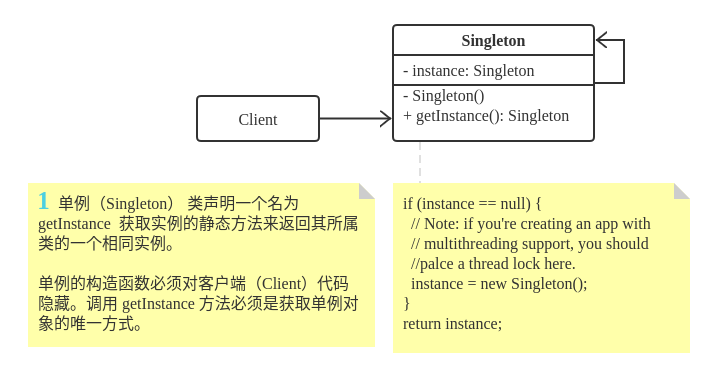

# Singleton

**单例模式**是一种创建型设计模式， 让你能够保证一个类只有一个实例， 并提供一个访问该实例的全局节点。

> 扩展: https://refactoring.guru/design-patterns/singleton

## 1. 单例模型通用类图




## 2. 单例模式适合应用场景

* **如果程序中的某个类对于所有客户端只有一个可用的实例， 可以使用单例模式。** 

* 单例模式禁止通过除特殊构建方法以外的任何方式来创建自身类的对象。 该方法可以创建一个新对象， 但如果该对象已经被创建， 则返回已有的对象。

* **如果你需要更加严格地控制全局变量， 可以使用单例模式。** 

* 单例模式与全局变量不同， 它保证类只存在一个实例。 除了单例类自己以外， 无法通过任何方式替换缓存的实例。

>  注意:  你可以随时调整限制并设定生成单例实例的数量， 只需修改 `获取实例`方法， 即 `getInstance` 中的代码即可实现。


## 3. 单例模式实现方式

1. 在类中添加一个私有静态成员变量用于保存单例实例。
2. 声明一个公有静态构建方法用于获取单例实例。
3. 在静态方法中实现"延迟初始化"。 该方法会在首次被调用时创建一个新对象， 并将其存储在静态成员变量中。 此后该方法每次被调用时都返回该实例。
4. 将类的构造函数设为私有。 类的静态方法仍能调用构造函数， 但是其他对象不能调用。
5. 检查客户端代码， 将对单例的构造函数的调用替换为对其静态构建方法的调用。


## 4. 单例模式优缺点

**优点: ** 

-  你可以保证一个类只有一个实例。
-  你获得了一个指向该实例的全局访问节点。
-  仅在首次请求单例对象时对其进行初始化。

**缺点:** 

-  违反了_单一职责原则_。 该模式同时解决了两个问题。
-  单例模式可能掩盖不良设计， 比如程序各组件之间相互了解过多等。
-  该模式在多线程环境下需要进行特殊处理， 避免多个线程多次创建单例对象。
-  单例的客户端代码单元测试可能会比较困难， 因为许多测试框架以基于继承的方式创建模拟对象。 由于单例类的构造函数是私有的， 而且绝大部分语言无法重写静态方法， 所以你需要想出仔细考虑模拟单例的方法。 要么干脆不编写测试代码， 或者不使用单例模式。


## 5. 与其他模式的关系

- [Facade](https://refactoringguru.cn/design-patterns/facade)类通常可以转换为[Singleton](https://refactoringguru.cn/design-patterns/singleton)类， 因为在大部分情况下一个外观对象就足够了。
- 如果你能将对象的所有共享状态简化为一个享元对象， 那么[Flywieght](https://refactoringguru.cn/design-patterns/flyweight)就和[Singleton](https://refactoringguru.cn/design-patterns/singleton)类似了。 但这两个模式有两个根本性的不同。
  1. 只会有一个单例实体， 但是*享元*类可以有多个实体， 各实体的内在状态也可以不同。
  2. *单例*对象可以是可变的。 享元对象是不可变的。
- [Abstract Factories](https://refactoringguru.cn/design-patterns/abstract-factory)、 [Builders](https://refactoringguru.cn/design-patterns/builder)和[Prototypes](https://refactoringguru.cn/design-patterns/prototype)都可以用[Singleton](https://refactoringguru.cn/design-patterns/singleton)来实现。


## 6. 案例

**Singleton.java: Singleton** 

```java
public final class Singleton {
    private static Singleton instance;
    public String value;

    private Singleton(String value) {
        // The following code emulates slow initialization.
        try {
            Thread.sleep(1000);
        } catch (InterruptedException ex) {
            ex.printStackTrace();
        }
        this.value = value;
    }

    public static Singleton getInstance(String value) {
        if (instance == null) {
            instance = new Singleton(value);
        }
        return instance;
    }
}
```

**DemoSingleThread.java: Client code** 

```java
public class DemoSingleThread {
    public static void main(String[] args) {
        System.out.println("If you see the same value, then singleton was reused (yay!)" + "\n" +
                "If you see different values, then 2 singletons were created (booo!!)" + "\n\n" +
                "RESULT:" + "\n");
        Singleton singleton = Singleton.getInstance("FOO");
        Singleton anotherSingleton = Singleton.getInstance("BAR");
        System.out.println(singleton.value);
        System.out.println(anotherSingleton.value);
    }
}
```

**OutputDemoSingleThread.txt: Execution result** 

```txt
If you see the same value, then singleton was reused (yay!)
If you see different values, then 2 singletons were created (booo!!)

RESULT:

FOO
FOO
```


