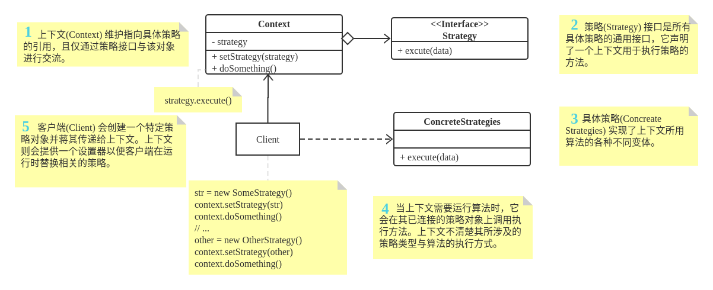

# Strategy

**策略模式**是一种行为设计模式， 它能让你定义一系列算法， 并将每种算法分别放入独立的类中， 以使算法的对象能够相互替换。

> 拓展阅读: https://refactoring.guru/design-patterns/strategy


## 1. 策略模式通用类图




## 2. 小案例

### **strategies** 

####  **strategies/PayStrategy.java:** Common interface of payment methods

```java
package refactoring_guru.strategy.example.strategies;

/**
 * Common interface for all strategies.
 */
public interface PayStrategy {
    boolean pay(int paymentAmount);
    void collectPaymentDetails();
}
```

####  **strategies/PayByPayPal.java:** Payment via PayPal

```java
package refactoring_guru.strategy.example.strategies;

import java.io.BufferedReader;
import java.io.IOException;
import java.io.InputStreamReader;
import java.util.HashMap;
import java.util.Map;

/**
 * Concrete strategy. Implements PayPal payment method.
 */
public class PayByPayPal implements PayStrategy {
    private static final Map<String, String> DATA_BASE = new HashMap<>();
    private final BufferedReader READER = new BufferedReader(new InputStreamReader(System.in));
    private String email;
    private String password;
    private boolean signedIn;

    static {
        DATA_BASE.put("amanda1985", "amanda@ya.com");
        DATA_BASE.put("qwerty", "john@amazon.eu");
    }

    /**
     * Collect customer's data.
     */
    @Override
    public void collectPaymentDetails() {
        try {
            while (!signedIn) {
                System.out.print("Enter the user's email: ");
                email = READER.readLine();
                System.out.print("Enter the password: ");
                password = READER.readLine();
                if (verify()) {
                    System.out.println("Data verification has been successful.");
                } else {
                    System.out.println("Wrong email or password!");
                }
            }
        } catch (IOException ex) {
            ex.printStackTrace();
        }
    }

    private boolean verify() {
        setSignedIn(email.equals(DATA_BASE.get(password)));
        return signedIn;
    }

    /**
     * Save customer data for future shopping attempts.
     */
    @Override
    public boolean pay(int paymentAmount) {
        if (signedIn) {
            System.out.println("Paying " + paymentAmount + " using PayPal.");
            return true;
        } else {
            return false;
        }
    }

    private void setSignedIn(boolean signedIn) {
        this.signedIn = signedIn;
    }
}
```

####  **strategies/PayByCreditCard.java:** Payment via credit card

```java
package refactoring_guru.strategy.example.strategies;

import java.io.BufferedReader;
import java.io.IOException;
import java.io.InputStreamReader;

/**
 * Concrete strategy. Implements credit card payment method.
 */
public class PayByCreditCard implements PayStrategy {
    private final BufferedReader READER = new BufferedReader(new InputStreamReader(System.in));
    private CreditCard card;

    /**
     * Collect credit card data.
     */
    @Override
    public void collectPaymentDetails() {
        try {
            System.out.print("Enter the card number: ");
            String number = READER.readLine();
            System.out.print("Enter the card expiration date 'mm/yy': ");
            String date = READER.readLine();
            System.out.print("Enter the CVV code: ");
            String cvv = READER.readLine();
            card = new CreditCard(number, date, cvv);

            // Validate credit card number...

        } catch (IOException ex) {
            ex.printStackTrace();
        }
    }

    /**
     * After card validation we can charge customer's credit card.
     */
    @Override
    public boolean pay(int paymentAmount) {
        if (cardIsPresent()) {
            System.out.println("Paying " + paymentAmount + " using Credit Card.");
            card.setAmount(card.getAmount() - paymentAmount);
            return true;
        } else {
            return false;
        }
    }

    private boolean cardIsPresent() {
        return card != null;
    }
}
```

####  **strategies/CreditCard.java:** A credit card class

```java
package refactoring_guru.strategy.example.strategies;

/**
 * Dummy credit card class.
 */
public class CreditCard {
    private int amount;
    private String number;
    private String date;
    private String cvv;

    CreditCard(String number, String date, String cvv) {
        this.amount = 100_000;
        this.number = number;
        this.date = date;
        this.cvv = cvv;
    }

    public void setAmount(int amount) {
        this.amount = amount;
    }

    public int getAmount() {
        return amount;
    }
}
```

####  **order/Order.java:** Order class

```java
package refactoring_guru.strategy.example.order;

import refactoring_guru.strategy.example.strategies.PayStrategy;

/**
 * Order class. Doesn't know the concrete payment method (strategy) user has
 * picked. It uses common strategy interface to delegate collecting payment data
 * to strategy object. It can be used to save order to database.
 */
public class Order {
    private int totalCost = 0;
    private boolean isClosed = false;

    public void processOrder(PayStrategy strategy) {
        strategy.collectPaymentDetails();
        // Here we could collect and store payment data from the strategy.
    }

    public void setTotalCost(int cost) {
        this.totalCost += cost;
    }

    public int getTotalCost() {
        return totalCost;
    }

    public boolean isClosed() {
        return isClosed;
    }

    public void setClosed() {
        isClosed = true;
    }
}
```

####  **Demo.java:** Client code

```java
package refactoring_guru.strategy.example;

import refactoring_guru.strategy.example.order.Order;
import refactoring_guru.strategy.example.strategies.PayByCreditCard;
import refactoring_guru.strategy.example.strategies.PayByPayPal;
import refactoring_guru.strategy.example.strategies.PayStrategy;

import java.io.BufferedReader;
import java.io.IOException;
import java.io.InputStreamReader;
import java.util.HashMap;
import java.util.Map;

/**
 * World first console e-commerce application.
 */
public class Demo {
    private static Map<Integer, Integer> priceOnProducts = new HashMap<>();
    private static BufferedReader reader = new BufferedReader(new InputStreamReader(System.in));
    private static Order order = new Order();
    private static PayStrategy strategy;

    static {
        priceOnProducts.put(1, 2200);
        priceOnProducts.put(2, 1850);
        priceOnProducts.put(3, 1100);
        priceOnProducts.put(4, 890);
    }

    public static void main(String[] args) throws IOException {
        while (!order.isClosed()) {
            int cost;

            String continueChoice;
            do {
                System.out.print("Please, select a product:" + "\n" +
                        "1 - Mother board" + "\n" +
                        "2 - CPU" + "\n" +
                        "3 - HDD" + "\n" +
                        "4 - Memory" + "\n");
                int choice = Integer.parseInt(reader.readLine());
                cost = priceOnProducts.get(choice);
                System.out.print("Count: ");
                int count = Integer.parseInt(reader.readLine());
                order.setTotalCost(cost * count);
                System.out.print("Do you wish to continue selecting products? Y/N: ");
                continueChoice = reader.readLine();
            } while (continueChoice.equalsIgnoreCase("Y"));

            if (strategy == null) {
                System.out.println("Please, select a payment method:" + "\n" +
                        "1 - PalPay" + "\n" +
                        "2 - Credit Card");
                String paymentMethod = reader.readLine();

                // Client creates different strategies based on input from user,
                // application configuration, etc.
                if (paymentMethod.equals("1")) {
                    strategy = new PayByPayPal();
                } else {
                    strategy = new PayByCreditCard();
                }
            }

            // Order object delegates gathering payment data to strategy object,
            // since only strategies know what data they need to process a
            // payment.
            order.processOrder(strategy);

            System.out.print("Pay " + order.getTotalCost() + " units or Continue shopping? P/C: ");
            String proceed = reader.readLine();
            if (proceed.equalsIgnoreCase("P")) {
                // Finally, strategy handles the payment.
                if (strategy.pay(order.getTotalCost())) {
                    System.out.println("Payment has been successful.");
                } else {
                    System.out.println("FAIL! Please, check your data.");
                }
                order.setClosed();
            }
        }
    }
}
```

####  **OutputDemo.txt:** Execution result

```
Please, select a product:
1 - Mother board
2 - CPU
3 - HDD
4 - Memory
1
Count: 2
Do you wish to continue selecting products? Y/N: y
Please, select a product:
1 - Mother board
2 - CPU
3 - HDD
4 - Memory
2
Count: 1
Do you wish to continue selecting products? Y/N: n
Please, select a payment method:
1 - PalPay
2 - Credit Card
1
Enter the user's email: user@example.com
Enter the password: qwerty
Wrong email or password!
Enter user email: amanda@ya.com
Enter password: amanda1985
Data verification has been successful.
Pay 6250 units or Continue shopping?  P/C: p
Paying 6250 using PayPal.
Payment has been successful.
```