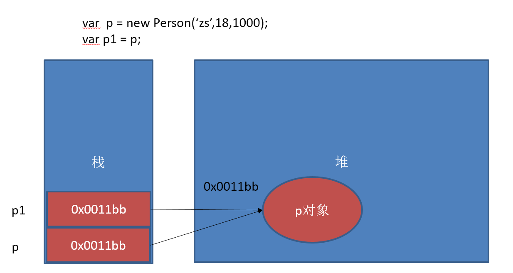

---
``学习目标:
  - 掌握编程的基本思维
  - 掌握编程的基本语法
typora-copy-images-to: media
---

# JavaScript基础

HTML和CSS   京东

## 网页、网站和应用程序

网页：单独的一个页面
网站：一些列相关的页面组成到一起
应用程序：可以和用户产生交互，并实现某种功能。

## 演示JavaScript的强大

http://impress.github.io/impress.js/
http://naotu.baidu.com/ 
https://codecombat.com/
https://ide.codemao.cn/

需要翻墙
https://developers.google.com/blockly/
blockly迷宫
https://blockly-games.appspot.com

blockly迷宫不需要翻墙
https://blockly.uieee.com/

## JavaScript介绍

### JavaScript是什么

HTML CSS 

JavaScript 编程语言   流程控制

Netscape在最初将其脚本语言命名为LiveScript，后来Netscape在与Sun合作之后将其改名为JavaScript。JavaScript最初受Java启发而开始设计的，目的之一就是“看上去像Java”，因此语法上有类似之处，一些名称和命名规范也借自Java。JavaScript与Java名称上的近似，是当时Netscape为了营销考虑与Sun微系统达成协议的结果。Java和JavaScript的关系就像张雨和张雨生的关系，只是名字很像。

​	Java  服务器端的编程语言

​	JavaScript  运行在客户端(浏览器)的编程语言

> JavaScript是一种运行在***客户端*** 的***脚本语言*** 
> JavaScript的解释器被称为JavaScript引擎，为浏览器的一部分，广泛用于客户端的脚本语言，最早是在HTML（标准通用标记语言下的一个应用）网页上使用，用来给HTML网页增加动态功能。

### JavaScript最初的目的

演示：http://baixiu.uieee.com/admin/login.php
最初的目的是为了处理表单的验证操作。

### JavaScript现在的意义(应用场景)

JavaScript 发展到现在几乎无所不能。

1. 网页特效
2. 服务端开发(Node.js)
3. 命令行工具(Node.js)
4. 桌面程序(Electron)
5. App(Cordova)
6. 控制硬件-物联网(Ruff)
7. 游戏开发(cocos2d-js)

### JavaScript和HTML、CSS的区别

1. HTML：提供网页的结构，提供网页中的内容
2. CSS: 用来美化网页
3. JavaScript: 可以用来控制网页内容，给网页增加动态的效果

## JavaScript的组成


### ECMAScript - JavaScript的核心 

ECMA 欧洲计算机制造联合会

网景：JavaScript

微软：JScript

定义了JavaScript的语法规范  

JavaScript的核心，描述了语言的基本语法和数据类型，ECMAScript是一套标准，定义了一种语言的标准与具体实现无关

### BOM - 浏览器对象模型

一套操作浏览器功能的API

通过BOM可以操作浏览器窗口，比如：弹出框、控制浏览器跳转、获取分辨率等

### DOM - 文档对象模型

一套操作页面元素的API

DOM可以把HTML看做是文档树，通过DOM提供的API可以对树上的节点进行操作

## JavaScript初体验

CSS：行内样式、嵌入样式、外部样式

### JavaScript的书写位置 

- 写在行内

```html
<input type="button" value="按钮" onclick="alert('Hello World')" />
```

- 写在script标签中

```html
<head>
  <script>
    alert('Hello World!');
  </script>
</head>
```

- 写在外部js文件中，在页面引入

```html
<script src="main.js"></script>
```

- 注意点

  ***引用外部js文件的script标签中不可以写JavaScript代码***

## 计算机组成

### 软件

- 应用软件：浏览器(Chrome/IE/Firefox)、QQ、Sublime、Word
- 系统软件：Windows、Linux、mac OSX

### 硬件

- 三大件：CPU、内存、硬盘    -- 主板
- 输入设备：鼠标、键盘、手写板、摄像头等
- 输出设备：显示器、打印机、投影仪等


## 变量

### 什么是变量

- 什么是变量

  变量是计算机内存中存储数据的标识符，根据变量名称可以获取到内存中存储的数据

- 为什么要使用变量

  使用变量可以方便的获取或者修改内存中的数据

### 如何使用变量

- var声明变量

```javascript
var age;
```

- 变量的赋值

```javascript
var age;
age = 18;
```

- 同时声明多个变量

```javascript
var age, name, sex;
age = 10;
name = 'zs';
```

- 同时声明多个变量并赋值


```javascript
var age = 10, name = 'zs';
```

### 变量在内存中的存储

```javascript
var age = 18;
```


### 变量的命名规则和规范

- 规则 - 必须遵守的，不遵守会报错

  - 由字母、数字、下划线、$符号组成，不能以数字开头

  - 不能是关键字和保留字，例如：for、while。

  - 区分大小写

- 规范 - 建议遵守的，不遵守不会报错

  - 变量名必须有意义
  - 遵守驼峰命名法。首字母小写，后面单词的首字母需要大写。例如：userName、userPassword

- 下面哪些变量名不合法

  ```
  a	    
  1
  age18
  18age
  name
  $name
  _sex
  &sex
  theworld  theWorld
  ```

### 案例

1. 交换两个变量的值
2. 不使用临时变量，交换两个数值变量的值

## 数据类型

### 简单数据类型

Number、String、Boolean、Undefined、Null

#### Number类型

- 数值字面量：数值的固定值的表示法

  110 1024  60.5

- 进制

```
十进制
	var num = 9;
	进行算数计算时，八进制和十六进制表示的数值最终都将被转换成十进制数值。
十六进制
	var num = 0xA;
	数字序列范围：0~9以及A~F
八进制
    var num1 = 07;   // 对应十进制的7
    var num2 = 019;  // 对应十进制的19
    var num3 = 08;   // 对应十进制的8
    数字序列范围：0~7
    如果字面值中的数值超出了范围，那么前导零将被忽略，后面的数值将被当作十进制数值解析
```

- 浮点数

  - 浮点数的精度问题

```
浮点数
	var n = 5e-324;   // 科学计数法  5乘以10的-324次方  
浮点数值的最高精度是 17 位小数，但在进行算术计算时其精确度远远不如整数
   var result = 0.1 + 0.2;    // 结果不是 0.3，而是：0.30000000000000004
   console.log(0.07 * 100);
   不要判断两个浮点数是否相等
```

- 数值范围

```
最小值：Number.MIN_VALUE，这个值为： 5e-324
最大值：Number.MAX_VALUE，这个值为： 1.7976931348623157e+308

无穷大：Infinity
无穷小：-Infinity
```

- 数值判断

  - NaN：not a number
    - NaN 与任何值都不相等，包括他本身
  - isNaN: is not a number

#### String类型

'abc'   "abc"

- 字符串字面量

  '程序猿'，'程序媛', "黑马程序猿"

  

  思考：如何打印以下字符串。
  我是一个"正直"的人 
  我很喜欢"黑马'程序猿'"

- 转义符

  

- 字符串长度

  `length` 属性用来获取字符串的长度

  ```javascript
  var str = '黑马程序猿 Hello World';
  console.log(str.length);
  ```

- 字符串拼接

  字符串拼接使用 + 连接

  ```javascript
  console.log(11 + 11);
  console.log('hello' + ' world');
  console.log('100' + '100');
  console.log('11' + 11);
  console.log('male:' + true);
  ```

  1. 两边只要有一个是字符串，那么+就是字符串拼接功能
  2. 两边如果都是数字，那么就是算术功能。

#### Boolean类型

- Boolean字面量：  true和false，区分大小写
- 计算机内部存储：true为1，false为0

#### Undefined和Null

1. undefined表示一个声明了没有赋值的变量，变量只声明的时候值默认是undefined
2. null表示一个空，变量的值如果想为null，必须手动设置

### 复杂数据类型

​	Object

### 获取变量的类型

`typeof` 

```javascript
var age = 18;
console.log(typeof age);  // 'number'
```

### 字面量

在源代码中一个固定值的表示法。

数值字面量：8, 9, 10

字符串字面量：'黑马程序员', "大前端"

布尔字面量：true，false

## 注释

### 单行注释

用来描述下面一个或多行代码的作用

```javascript
// 这是一个变量
var name = 'hm';
```

### 多行注释

用来注释多条代码

```javascript
/*
var age = 18;
var name = 'zs';
console.log(name, age);
*/
```

## 数据类型转换

如何使用谷歌浏览器，快速的查看数据类型？

字符串的颜色是黑色的，数值类型是蓝色的，布尔类型也是蓝色的，undefined和null是灰色的

### 转换成字符串类型

- `toString()` 

  ```javascript
  var num = 5;
  console.log(num.toString());
  ```

  > toString()     null和undefined  不能使用
  >
  > toString(进制)      可以用于进制转换

- `String()` 

  ```javacript
  String()函数存在的意义：有些值没有toString()，这个时候可以使用String()。比如：undefined和null
  ```

- 拼接字符串方式

  num  +  ""，当 + 两边一个操作符是字符串类型，一个操作符是其它类型的时候，会先把其它类型转换成字符串再进行字符串拼接，返回字符串

### 转换成数值类型

- `Number()` 

  ```
  Number()可以把任意值转换成数值，如果要转换的字符串中有一个不是数值的字符，返回NaN
  ```

- `parseInt()` 

  ```javascript
  var num1 = parseInt("12.3abc");  // 返回12，如果第一个字符是数字会解析知道遇到非数字结束
  var num2 = parseInt("abc123");   // 返回NaN，如果第一个字符不是数字或者符号就返回NaN
  ```

  > parseInt(numb, 进制)      # 进制转换

- `parseFloat()` 

  ```JavaScript
  parseFloat()把字符串转换成浮点数
  parseFloat()和parseInt非常相似，不同之处在与
  	parseFloat会解析第一个. 遇到第二个.或者非数字结束
  	如果解析的内容里只有整数，解析成整数
  ```

- +，-0等运算

  ```javascript
  var str = '500';
  console.log(+str);		// 取正
  console.log(-str);		// 取负
  console.log(str - 0);
  ```

### 转换成布尔类型

- `Boolean()` 

>  0、“”(空字符串)、 null、 undefined、 NaN 会转换成false  其它都会转换成true

## 操作符

运算符  operator 

5 + 6   

表达式  组成 操作数和操作符，会有一个结果

### 算术运算符

```
+ - * / %  
```

### 一元运算符

一元运算符：只有一个操作数的运算符

5 + 6  两个操作数的运算符 二元运算符

++  自身加1

-- 自身减1

- 前置++

  ```javascript
  var num1 = 5;
  ++ num1; 

  var num2 = 6;
  console.log(num1 + ++ num2);
  ```

- 后置++

  ```javascript
  var num1 = 5;
  num1 ++;    
  var num2 = 6 
  console.log(num1 + num2 ++);
  ```

- 猜猜看

  ```javascript
  var a = 1; var b = ++a + ++a; console.log(b);    
  var a = 1; var b = a++ + ++a; console.log(b);    
  var a = 1; var b = a++ + a++; console.log(b);    
  var a = 1; var b = ++a + a++; console.log(b);  
  ```

  

### 逻辑运算符(布尔运算符)
	&& 与 两个操作数同时为true，结果为true，否则都是false
	|| 或 两个操作数有一个为true，结果为true，否则为false
	!  非  取反

### 关系运算符(比较运算符)
	<  >  >=  <=  == != === !==
```javascript
==与===的区别：==只进行值得比较，===类型和值同时相等，则相等

var result = '55' == 55;  	// true
var result = '55' === 55; 	// false 值相等，类型不相等
var result = 55 === 55; 	// true
```

### 赋值运算符

=   +=   -=   *=   /=   %=
```javascript
例如：
var num = 0;
num += 5;	//相当于  num = num + 5;
```


### 运算符的优先级
	优先级从高到底
		1. ()  优先级最高
		2. 一元运算符  ++   --   !
		3. 算数运算符  先*  /  %   后 +   -
		4. 关系运算符  >   >=   <   <=
		5. 相等运算符   ==   !=    ===    !==
		6. 逻辑运算符 先&&   后||
		7. 赋值运算符

```	javascript
// 练习1：
4 >= 6 || '人' != '阿凡达' && !(12 * 2 == 144) && true
// 练习2：
var num = 10;
5 == num / 2 && (2 + 2 * num).toString() === '22'
```
## 表达式和语句 

### 表达式

>一个表达式可以产生一个值，有可能是运算、函数调用、有可能是字面量。表达式可以放在任何需要值的地方。

### 语句

>语句可以理解为一个行为，循环语句和判断语句就是典型的语句。一个程序有很多个语句组成，一般情况下;分割一个一个的语句
## 流程控制

>程序的三种基本结构

### 顺序结构

 从上到下执行的代码就是顺序结构

**程序默认就是由上到下顺序执行的**

### 分支结构	

根据不同的情况，执行对应代码

### 循环结构

循环结构：重复做一件事情

## 分支结构

### if语句

语法结构

```javascript
if (/* 条件表达式 */) {
  // 执行语句
}

if (/* 条件表达式 */){
  // 成立执行语句
} else {
  // 否则执行语句
}

if (/* 条件1 */){
  // 成立执行语句
} else if (/* 条件2 */){
  // 成立执行语句
} else if (/* 条件3 */){
  // 成立执行语句
} else {
  // 最后默认执行语句
}
```
案例：
    求两个数的最大数
    判断一个数是偶数还是奇数
    分数转换，把百分制转换成ABCDE   <60  E  60-70 D  70-80 C  80-90 B  90 - 100 A
作业：
    判断一个年份是闰年还是平年
      闰年：能被4整除，但不能被100整除的年份 或者 能被400整除的年份
    判断一个人的年龄是否满18岁(是否成年)

### 三元运算符
	表达式1 ? 表达式2 : 表达式3
	是对if……else语句的一种简化写法

案例：
	是否年满18岁
	从两个数中找最大值

### switch语句

语法格式:
```javascript
switch (expression) {
  case 常量1:
    语句;
    break;
  case 常量2:
    语句;
    break;
  case 常量3:
    语句;
    break;
  …
  case 常量n:
    语句;
    break;
  default:
    语句;
    break;
}
```
	break可以省略，如果省略，代码会继续执行下一个case
	switch 语句在比较值时使用的是全等操作符, 因此不会发生类型转换（例如，字符串'10' 不等于数值 10）

案例：
	显示星期几
	素质教育（把分数变成ABCDE）千万不要写100个case哟

### 布尔类型的隐式转换

流程控制语句会把后面的值隐式转换成布尔类型

	转换为true   非空字符串  非0数字  true 任何对象
	转换成false  空字符串  0  false  null  undefined

```javascript
// 结果是什么？
var a = !!'123';
```


### 案例

```javascript
var message;
// 会自动把message转换成false
if (message) {     
  // todo...
}
```


## 循环结构

> 在javascript中，循环语句有三种，while、do..while、for循环。

### while语句

基本语法：

```javascript
// 当循环条件为true时，执行循环体，
// 当循环条件为false时，结束循环。
while (循环条件) {
  //循环体
}
```

代码示例：

```javascript
// 计算1-100之间所有数的和
// 初始化变量
var i = 1;
var sum = 0;
// 判断条件
while (i <= 100) {
  // 循环体
  sum += i;
  // 自增
  i++;
}
console.log(sum);
```

案例：
    打印100以内 7的倍数
    打印100以内所有偶数
    打印100以内所有偶数的和
作业：
    打印100以内的奇数
    打印100以内的奇数的和

### do...while语句

> do..while循环和while循环非常像，二者经常可以相互替代，但是do..while的特点是不管条件成不成立，都会执行一次。

基础语法：

```javascript
do {
  // 循环体;
} while (循环条件);
```

代码示例：

```javascript
// 初始化变量
var i = 1;
var sum = 0;
do {
  sum += i;//循环体
  i++;//自增
} while (i <= 100);//循环条件
```

案例：

```
求100以内所有3的倍数的和
使用do-while循环：输出询问“我爱你，嫁给我吧？”，选择“你喜欢我吗？(y/n):"，如果输入为y则打印”我们形影不离“，若输入为n,则继续询问 
```

### for语句

>  while和do...while一般用来解决无法确认次数的循环。for循环一般在循环次数确定的时候比较方便

for循环语法：

```javascript
// for循环的表达式之间用的是;号分隔的，千万不要写成,
for (初始化表达式1; 判断表达式2; 自增表达式3) {
  // 循环体4
}
```

执行顺序：1243  ----  243   -----243(直到循环条件变成false)

1. 初始化表达式
2. 判断表达式
3. 自增表达式
4. 循环体

案例：

```
打印1-100之间所有数
求1-100之间所有数的和
求1-100之间所有数的平均值
求1-100之间所有偶数的和
同时求1-100之间所有偶数和奇数的和
打印正方形
// 使用拼字符串的方法的原因
// console.log 输出重复内容的问题
// console.log 默认输出内容介绍后有换行
var start = '';
for (var i = 0; i < 10; i++) {
  for (var j = 0; j < 10; j++) {
    start += '* ';
  }
  start += '\n';
}
console.log(start);
打印直角三角形
var start = '';
for (var i = 0; i < 10; i++) {
  for (var j = i; j < 10; j++) {
    start += '* ';
  }
  start += '\n';
}
console.log(start);

打印9*9乘法表
var str = '';
for (var i = 1; i <= 9; i++) {
  for (var j = i; j <=9; j++) {
    str += i + ' * ' + j + ' = ' + i * j + '\t';
  }
  str += '\n';
}
console.log(str);
```

作业：

```
求1-100之间所有数的乘积
求1-100之间所有奇数的和
计算1-100之间能3整除的数的和
计算1-100之间不能被7整除的数的和
// 讲解思路。如果不会写程序，可以先把数学公式准备好
本金10000元存入银行，年利率是千分之三，每过1年，将本金和利息相加作为新的本金。计算5年后，获得的本金是多少？
有个人想知道，一年之内一对兔子能繁殖多少对？于是就筑了一道围墙把一对兔子关在里面。已知一对兔子每个月可以生一对小兔子，而一对兔子从出生后第3个月起每月生一对小兔子。假如一年内没有发生死亡现象，那么，一对兔子一年内（12个月）能繁殖成多少对？（兔子的规律为数列，1，1，2，3，5，8，13，21）
```


### continue和break

> break:立即跳出整个循环，即循环结束，开始执行循环后面的内容（直接跳到大括号）
>
> continue:立即跳出当前循环，继续下一次循环（跳到i++的地方）

案例：

```javascript
求整数1～100的累加值，但要求碰到个位为3的数则停止累加
求整数1～100的累加值，但要求跳过所有个位为3的数
```

作业：

求1-100之间不能被7整除的整数的和（用continue）
求200-300之间所有的奇数的和（用continue）
求200-300之间第一个能被7整数的数（break）


### 调试

- 过去调试JavaScript的方式
  - alert()
  - console.log()
- 断点调试

>断点调试是指自己在程序的某一行设置一个断点，调试时，程序运行到这一行就会停住，然后你可以一步一步往下调试，调试过程中可以看各个变量当前的值，出错的话，调试到出错的代码行即显示错误，停下。

- 调试步骤

```javascript
浏览器中按F12-->sources-->找到需要调试的文件-->在程序的某一行设置断点
```

- 调试中的相关操作

```javascript
Watch: 监视，通过watch可以监视变量的值的变化，非常的常用。
F10: 程序单步执行，让程序一行一行的执行，这个时候，观察watch中变量的值的变化。
F8：跳到下一个断点处，如果后面没有断点了，则程序执行结束。
```

tips: ***监视变量，不要监视表达式，因为监视了表达式，那么这个表达式也会执行。***

1. 代码调试的能力非常重要，只有学会了代码调试，才能学会自己解决bug的能力。初学者不要觉得调试代码麻烦就不去调试，知识点花点功夫肯定学的会，但是代码调试这个东西，自己不去练，永远都学不会。
2. 今天学的代码调试非常的简单，只要求同学们记住代码调试的这几个按钮的作用即可，后面还会学到很多的代码调试技巧。


## 数组

### 为什么要学习数组

> 之前学习的数据类型，只能存储一个值(比如：Number/String。我们想存储班级中所有学生的姓名，此时该如何存储？

###  数组的概念

> 所谓数组，就是将多个元素（通常是同一类型）按一定顺序排列放到一个集合中，那么这个集合我们就称之为数组。
### 数组的定义
> 数组是一个有序的列表，可以在数组中存放任意的数据，并且数组的长度可以动态的调整。

通过数组字面量创建数组

```javascript
// 创建一个空数组
var arr1 = []; 
// 创建一个包含3个数值的数组，多个数组项以逗号隔开
var arr2 = [1, 3, 4]; 
// 创建一个包含2个字符串的数组
var arr3 = ['a', 'c']; 

// 可以通过数组的length属性获取数组的长度
console.log(arr3.length);
// 可以设置length属性改变数组中元素的个数
arr3.length = 0;
```

### 获取数组元素

数组的取值

```javascript
// 格式：数组名[下标]	下标又称索引
// 功能：获取数组对应下标的那个值，如果下标不存在，则返回undefined。
var arr = ['red',, 'green', 'blue'];
arr[0];	// red
arr[2]; // blue
arr[3]; // 这个数组的最大下标为2,因此返回undefined
```


### 遍历数组
> 遍历：遍及所有，对数组的每一个元素都访问一次就叫遍历。

数组遍历的基本语法：

```javascript
for(var i = 0; i < arr.length; i++) {
	// 数组遍历的固定结构
}
```
### 数组中新增元素
数组的赋值

```javascript
// 格式：数组名[下标/索引] = 值;
// 如果下标有对应的值，会把原来的值覆盖，如果下标不存在，会给数组新增一个元素。
var arr = ["red", "green", "blue"];
// 把red替换成了yellow
arr[0] = "yellow";
// 给数组新增加了一个pink的值
arr[3] = "pink";
```
### 数组的常用方法

* `arr.concat(item, item ...);`       

  ```javascript
  var arr1 = [4, 5, 6, 7, 8];
  var arr2 = ["aa", "bb", "cc"];
  var arr3 = arr1.concat(arr2);
  console.log(arr3);  // [4, 5, 6, 7, 8, "aa", "bb", "cc"];
  console.log(arr1);  // [4, 5, 6, 7, 8];
  ```

  > 意义： 合并数组
  >
  > 1. 返回数组

* `arr.join(分隔符);` 

  ```javascript
  var arr1 = [4, 5, 6, 7, 8];
  var str1 = arr1.join("-"); 
  console.log(str1);  // 4-5-6-7-8
  console.log(arr1);  // [4, 5, 6, 7, 8]
  ```

  > 意义：将数组中的元素按指定的字符号连接
  >
  > 1. 如果没有分隔符， 默认按 **“ , ”** 连接
  > 2. 返回字符串

* `arr.pop();`

  ```javascript
  var arr1 = [4, 5, 6, 7, 8];
  var a = arr1.pop();
  console.log(a);     // 8
  console.log(arr1);  // [4, 5, 6, 7]
  ```

  > 意义：删除数组末尾的值
  >
  > 1. 返回删除的值
  > 2. 如果对空数组进行操作，那么返回undefined

* `arr.push(value...);` 

  ```javascript
  var arr1 = [4, 5, 6, 7, 8];
  var number = arr1.push("yan");
  console.log(number);    // 6
  console.log(arr1);      // [4, 5, 6, 7, 8, "yan"]
  ```

  > 意义： 给数组的末尾添加值
  >
  > 1. 返回添加值后数组的长度

* `arr.shift()` 

  ```javascript
  var arr1 = [4, 5, 6, 7, 8];
  var a = arr1.shift();
  console.log(a);      // 4
  console.log(arr1);   // [5, 6, 7, 8]
  ```

  > 意义： 删除数组第一个元素的值
  >
  > 1. 返回删除的值
  > 2. 如果对空数组进行操作，那么返回undefined

* `arr.unshift(value)` 

  ```javascript
  var arr1 = [4, 5, 6, 7, 8];
  var a = arr1.unshift("yan");
  console.log(a);      // 6
  console.log(arr1);   // ["yan", 4, 5, 6, 7, 8]
  ```

  > 意义： 给数组的开始位置添加值
  >
  > 1. 返回添加值后数组的长度

* `arr.splice(startIndex, deletCount, values)` 

  ```javascript
  var arr1 = [4, 5, 6, 7, 8];
  var res = arr1.splice(1, 2, "yan", "aa", "44");
  console.log(res);        // [5, 10]
  console.log(arr1);       // [4, "yan", "aa", "44", 7, 8]
  ```

  > 1. **startIndex**    开始处理数据的值
  > 2. **deletCount**   删除的数量(包含开始位置)
  > 3. **values**           要添加的值
  > 4. 返回一个数组，存放删除的元素

* `arr.slice(startIndex, endIndex)` 

  ```javascript
  var arr1 = [4, 5, 6, 7, 8];
  var subArr = arr1.slice(0, 2);
  var subArr1 = arr1.slice(-3, 4);
  console.log(subArr);   // [4, 5]
  console.log(subArr1);  // [6, 7]
  ```

  > 意义： 截取指定位置数组元素
  >
  > 1. startIndex   开始位置
  >
  >    startIndex 为负数， 那么倒数第一位为-1，从右向左数，负几就是倒数第几位开始。
  >
  > 2. endIndex    结束位置
  >
  >    如果省略，会截取到元素的最后一位
  >
  > 3. 返回数组，内容为截取出来的元素

* `arr.sort()` 

  ```javascript
  var arr1 = [40, 5, 60, 7, 8];
  var res = arr1.sort(function (a, b){
      return a - b;       // 升序
      // return b - a;    // [60, 40, 8, 7, 5] 降序
  })
  console.log(res);  // [5, 7, 8, 40, 60]
  ```

  > 意义： 按 unicode 编码排序

* `arr.reverse()` 

  ```javascript
  var arr1 = [40, 5, 60, 7, 8];
  var res = arr1.reverse();
  console.log(res);    // [8, 7, 60, 5, 40]
  ```

  > 意义： 反序

### 数组排序

#### 冒泡排序

​	概念：比较两个相邻的元素，如果前面的数大于后面的数，则交换位置

```javascript
function maoPaoOrder(arr) {
    for(let i = 0; i < arr.length - 1; i++){
        for(let j = 0; j < arr.length - 1 - i; j++){
            if(arr[j] > arr[j + 1]){
                arr[j] = arr[j] + arr[j + 1];
                arr[j + 1] = arr[j] - arr[j + 1];
                arr[j] = arr[j] - arr[j + 1];
            }
        }
    }
    return arr;
}
```

#### 选择排序

​	概念： 从数组的开头开始，将一个位置的元素和其他元素进行比较，检查完所有元素后，最小的元素会放在数组的第一个位置，然后算法会从第二个位置继续。这个过程一直进行，当进行到数组的倒数第二个位置时，所有的数据便完成了排序

循环  

次数   12, 3, 45, 34, 32, 22, 8, 6, 49       比较次数

```javascript
function selectSort(arr){
    var len = arr.length;
    var minIndex, tmp;
    for (let i = 0; i < len - 1; i++){
        minIndex = 1;
        for (let j = i + 1; j < len; j++){
            if (arr[j] < arr[minIndex]){
                minIndex = j;
            }
        }
        temp = arr[i];
        arr[i] = arr[minIndex];
        arr[minIndex] = temp;
    }
    return arr;
}
```

#### 插入排序

​	概念：把一个数插入到有序数组中，从后向前依次对比，如果待插入的数小于对比的那个数，向前移动，如果待插入的数大于对比的那个数就插入到对比的那个数后面。

循环  

次数   12, 3, 45, 34, 32, 22, 8, 6, 49       比较次数

1         3,  12, 45, 34, 32, 22, 8, 6, 49

```javascript
function insertSort(arr){
    for (let i = 1; i < arr.length; i++){ 
        var num = arr[i];    
        var j = i - 1;       
        while(j >= 0 && arr[j] > num){  
            arr[j + 1] = arr[j];   
            j--;                  
        }
        arr[j + 1] = num;
    }
}
```

#### 快速排序

​	概念：数组中指定一个元素作为标尺，比它大的放到该元素后面，比它小的放到该元素前面，如此重复直到全部正序排列。

​	快速排序分三步：

​		1、从数组的中间选择一项作为主元。

​		2、创建两个指针，left 指向数组的第一个元素， right 指向数组的最后一个元素，移动 left 指针直到找到第一个比主元大的数，接着在移动 right 指针，找到比主元小的数，交换他们，重复这个过程，直到左右指针相遇。这个过程执行完主元左边都是比主元小的数，主元右边都是比主元大的数。划分

​		3、接着对划分后的两个小数组重复之前的操作，直至数组已经全部排列

```javascript
function QuickSort() {
    const array = [];
    this.inset = function(item) {
        array.push(item);
    }
    this.toString = function() {
        return array.join();
    }
    this.quickSort = function() {
        quick(array, 0, array.length - 1);
    }
    const quick = function(array, left, right) {
        let index = 0;
        if (array.length > 1){
            index = partition(array, left, right);
            if (left < index - 1){
                quick(arry, left, index - 1);
            }
            if (index < right){
                quick(array, index, right);
            }
        }
    }
    const partition = function(array, left, right) {
        var pivot = array[Math.floor((left + right) / 2)];
        i = left;
        j = right;
        while(i <= j){
            while(array[i] < pivot){
                i++;
            }
            while(array[j] > pivot){
                j--;
            }
            if(i <= j){
                swapQuickSort(array, i, j);
                i++;
                j--;
            }
        }
        return i;
    }
    const swapQuickSort = function(array, index1, index2){
        var aux = array[index1];
        array[index1] = array[index2];
        array[index2] = aux;
    }
}
var arr = new QuickSort();
```

快速排序

​	概念： 确定中间一个数，然后比中间数小放在左边数组，比中间数大的放右边数组

​	23, 3, 45, 34, 32, 11, 8, 6, 49

​				   32

  12, 3, 22, 8, 6     32      45, 34, 49

​            22                             34

12, 3, 8, 6,   22   32              34      45 , 49

​      3                                                    

​      3  12, 8, 6   22    32        34    45   49

​      3        8

​      3   6   8   12  22  32   34  45  49

```javascript
var arr = [23, 3, 45, 34, 32, 11, 8, 6, 49];

function quickOrder(arr){
    if(arr.length <= 1){
        return arr;
    }
    var num = parseInt(arr.length / 2);
    var temp = [arr[num]];
    var arrLeft = [], arrRight = [];
    for (let i = 0; i < num; i++){
        if (arr[i] < temp[0]){
            arrLeft.push(arr[i]);
        }else{
            arrRight.push(arr[i]);
        }
    }
    for (var j = num + 1; j < arr.length; j++){
        if(arr[j] < temp[0]){
            arrLeft.push(arr[j]);
        }else{
            arrRight.push(arr[j]);
        }
    }
    return quickOrder(arrLeft).concat(temp, quickOrder(arrRight));
}

console.log(quickOrder(arr));
```


### 案例

```
求一组数中的所有数的和和平均值
求一组数中的最大值和最小值，以及所在位置
将字符串数组用|或其他符号分割
要求将数组中的0项去掉，将不为0的值存入一个新的数组，生成新的数组
翻转数组
冒泡排序，从小到大
```

## 函数

### 为什么要有函数

> 如果要在多个地方求1-100之间所有数的和，应该怎么做？

### 什么是函数

>把一段相对独立的具有特定功能的代码块封装起来，形成一个独立实体，就是函数，起个名字（函数名），在后续开发中可以反复调用
>
>函数的作用就是封装一段代码，将来可以重复使用

### 函数的定义

- 函数声明

```javascript
function 函数名() {
  // 函数体
}
```

- 函数表达式

```javascript
var fn = function () {
  // 函数体
}
```

- 特点：

  函数声明的时候，函数体并不会执行，只要当函数被调用的时候才会执行。
  函数一般都用来干一件事情，函数名称一般使用动词

### 函数的调用
- 调用函数的语法：

```javascript
函数名();
```

- 特点：

  函数体只有在调用的时候才会执行，调用需要()进行调用。
  可以调用多次(重复使用)

代码示例：

```javascript
// 声明函数
function sayHi() {
  console.log("吃了没？");
}
// 调用函数
sayHi();

// 求1-100之间所有数的和
function getSum() {
  var sum = 0;
  for (var  i = 0; i < 100; i++) {
    sum += i;
  }
  console.log(sum);
}
// 调用
getSum();
```
### 函数的参数

- 为什么要有参数

```javascript
function getSum() {
  var sum = 0;
  for (var i = 1; i <= 100; i++) {
    sum += i;
  }
  console.log();
}

// 虽然上面代码可以重复调用，但是只能计算1-100之间的值
// 如果想要计算n-m之间所有数的和，应该怎么办呢？
```

- 语法：

```javascript
// 函数内部是一个封闭的环境，可以通过参数的方式，把外部的值传递给函数内部
// 带参数的函数声明
function 函数名(形参1, 形参2, 形参3...) {
  // 函数体
}

// 带参数的函数调用
函数名(实参1, 实参2, 实参3); 
形参1 = 实参1
形参2 = 实参2
```

- 形参和实参

  > 1. 形式参数：在声明一个函数的时候，为了函数的功能更加灵活，有些值是固定不了的，对于这些固定不了的值。我们可以给函数设置参数。这个参数没有具体的值，仅仅起到一个占位置的作用，我们通常称之为形式参数，也叫形参。
  > 2. 实际参数：如果函数在声明时，设置了形参，那么在函数调用的时候就需要传入对应的参数，我们把传入的参数叫做实际参数，也叫实参。

```javascript
var x = 5, y = 6;
fn(x,y); 
function fn(a, b) {
  console.log(a + b);
}
// x,y实参，有具体的值。函数执行的时候会把x,y复制一份给函数内部的a和b，函数内部的值是复制的新值，无法修改外部的x,y
```

### 案例

- 求1-n之间所有数的和
- 求n-m之间所有数的和
- 圆的面积
- 求2个数中的最大值
- 求3个数中的最大值
- 判断一个数是否是素数(又叫质数，只能被1和自身整数的数)

### 函数的返回值

>当函数执行完的时候，并不是所有时候都要把结果打印。我们期望函数给我一些反馈（比如计算的结果返回进行后续的运算），这个时候可以让函数返回一些东西。也就是返回值。函数通过return返回一个返回值

返回值语法：

```javascript
//声明一个带返回值的函数
function 函数名(形参1, 形参2, 形参3...) {
  //函数体
  return 返回值;
}

//可以通过变量来接收这个返回值
var 变量 = 函数名(实参1, 实参2, 实参3...);
```

函数的调用结果就是返回值，因此我们可以直接对函数调用结果进行操作。

### 案例

- 求一组数中的最大值
- 求一组数中的最小值
- 求阶乘
- 求1!+2!+3!+....+n!

返回值详解：

    如果函数没有显示的使用 return语句 ，那么函数有默认的返回值：undefined
    如果函数使用 return语句，那么跟再return后面的值，就成了函数的返回值
    如果函数使用 return语句，但是return后面没有任何值，那么函数的返回值也是：undefined
    函数使用return语句后，这个函数会在执行完 return 语句之后停止并立即退出，也就是说return后面的所有其他代码都不会再执行。
    
    推荐的做法是要么让函数始终都返回一个值，要么永远都不要返回值。

### arguments的使用

> JavaScript中，arguments对象是比较特别的一个对象，实际上是当前函数的一个内置属性。也就是说所有函数都内置了一个arguments对象，arguments对象中存储了传递的所有的实参。arguments是一个伪数组，因此及可以进行遍历

- 案例
```javascript
求任意个数的最大值
求任意个数的和
```

### 案例

```javascript
求斐波那契数列Fibonacci中的第n个数是多少？      1 1 2 3 5 8 13 21...
翻转数组，返回一个新数组
对数组排序，从小到大
输入一个年份，判断是否是闰年[闰年：能被4整数并且不能被100整数，或者能被400整数]
输入某年某月某日，判断这一天是这一年的第几天？
```

## 函数其它

### 匿名函数

> 匿名函数：没有名字的函数

匿名函数如何使用：

	将匿名函数赋值给一个变量，这样就可以通过变量进行调用
	匿名函数自调用

### 自调用函数
>匿名函数不能通过直接调用来执行，因此可以通过匿名函数的自调用的方式来执行
```javascript
(function () {
  alert(123);
})();

+function(){
    console.log(1234);
}();

!function(){
    console.log(12345);
}()
```
### 函数是一种数据类型

```javascript
function fn() {}
console.log(typeof fn);
```

- 函数作为参数

因为函数也是一种类型，可以把函数作为两一个函数的参数，在另一个函数中调用

- 函数做为返回值

因为函数是一种类型，所以可以把函数可以作为返回值从函数内部返回。

```javascript
function fn(b) {
  var a = 10;
  return function () {
    alert(a+b);
  }
}
fn(15)();
```

### 代码规范
    1.命名规范	
    	变量、函数 的命名 必须要有意义
    	变量 的名称一般用名词
    	函数 的名称一般用动词
    2.变量规范   
    	操作符的前后要有空格
    	var name = 'zs';	  5 + 6
    3.注释规范
    	// 这里是注释
    4.空格规范
    	if (true) {
          
    	}
    	for (var i = 0; i <= 100; i++) {
          
    	}
    5.换行规范
    	var arr = [1, 2, 3, 4];
    	if (a > b) {
          
    	}
    	for (var i = 0; i < 10; i++) {
          
    	}
    	function fn() {
          
    	}


## 作用域
作用域：变量可以起作用的范围

### 全局变量和局部变量

- 全局变量

  在任何地方都可以访问到的变量就是全局变量，对应全局作用域

- 局部变量

  只在固定的代码片段内可访问到的变量，最常见的例如函数内部。对应局部作用域(函数作用域)

```
不使用var声明的变量是全局变量，不推荐使用。
变量退出作用域之后会销毁，全局变量关闭网页或浏览器才会销毁
```

### 块级作用域

任何一对花括号（｛和｝）中的语句集都属于一个块，在这之中定义的所有变量在代码块外都是不可见的，我们称之为块级作用域。
**在es5之前没有块级作用域的的概念,只有函数作用域**，现阶段可以认为JavaScript没有块级作用域

### 作用域链
	只有函数可以制造作用域结构， 那么只要是代码，就至少有一个作用域, 即全局作用域。凡是代码中有函数，那么这个函数就构成另一个作用域。如果函数中还有函数，那么在这个作用域中就又可以诞生一个作用域。
	
	将这样的所有的作用域列出来，可以有一个结构: 函数内指向函数外的链式结构。就称作作用域链。
```javascript
// 案例1：
function f1() {
    function f2() {
    }
}

var num = 456;
function f3() {
    function f4() {    
    }
}
```


```javascript
// 案例2
function f1() {
    var num = 123;
    function f2() {
        console.log(num); 
    }
    f2();
}
var num = 456;
f1();
```


## 预解析

> JavaScript代码的执行是由浏览器中的JavaScript解析器来执行的。JavaScript解析器执行JavaScript代码的时候，分为两个过程：预解析过程和代码执行过程

预解析过程：

1. 把变量的声明提升到当前作用域的最前面，只会提升声明，不会提升赋值。
2. 把函数的声明提升到当前作用域的最前面，只会提升声明，不会提升调用。
3. 先提升var，在提升function。


JavaScript的执行过程

```javascript
// 案例1
var a = 25;
function abc() {
  alert(a); 
  var a = 10;
}
abc();


// 案例2
console.log(a);
function a() {
  console.log('aaaaa');
}
var a = 1;
console.log(a);
```

### 变量提升

- 变量提升

  定义变量的时候，变量的声明会被提升到作用域的最上面，变量的赋值不会提升。

- 函数提升

  JavaScript解析器首先会把当前作用域的函数声明提前到整个作用域的最前面

```javascript
// 1、-----------------------------------
var num = 10;
fun();
function fun() {
  console.log(num);
  var num = 20;
}
//2、-----------------------------------
var a = 18;
f1();
function f1() {
  var b = 9;
  console.log(a);
  console.log(b);
  var a = '123';
}
// 3、-----------------------------------
f1();
console.log(c);
console.log(b);
console.log(a);
function f1() {
  var a = b = c = 9;
  console.log(a);
  console.log(b);
  console.log(c);
}
```

> 预编译：
>
> ​	发生的时刻： 函数执行的前一刻和全局下
>
> ​	过程：
>
> 1. 创建AO对象(active, object, this, arguments)
> 2. 在函数内找用var定义的变量及形参变量，并赋值为undefined
> 3. 形参和实参相统一
> 4. 找函数内用function定义的函数，并将函数体赋值。

## 对象

### 为什么要有对象

```javascript
function printPerson(name, age, sex....) {
}
// 函数的参数如果特别多的话，可以使用对象简化
function printPerson(person) {
  console.log(person.name);
  ……
}
```

### 什么是对象

```
现实生活中：万物皆对象，对象是一个具体的事物，一个具体的事物就会有行为和特征。
举例： 一部车，一个手机
车是一类事物，门口停的那辆车才是对象
	特征：红色、四个轮子
	行为：驾驶、刹车
```

### JavaScript中的对象
```
JavaScript中的对象其实就是生活中对象的一个抽象
JavaScript的对象是无序属性的集合。
	其属性可以包含基本值、对象或函数。对象就是一组没有顺序的值。我们可以把JavaScript中的对象想象成键值对，其中值可以是数据和函数。
对象的行为和特征
	特征---属性
	行为---方法
```

+ 事物的特征在对象中用属性来表示。
+ 事物的行为在对象中用方法来表示。

### 对象字面量
> 字面量：11 'abc'  true  [] {}等

```javascript
var o = {
  name: 'zs,
  age: 18,
  sex: true,
  sayHi: function () {
    console.log(this.name);
  }
};
```

思考：

```javascript
如何把学生对象、老师对象、英雄对象改写成字面量的方式
```
### 对象创建方式

- 对象字面量

```javascript
var o = {
  name: 'zs',
  age: 18,
  sex: true,
  sayHi: function () {
    console.log(this.name);
  }
};   
```

- new Object()创建对象

```javascript
var person = new Object();
person.name = 'lisi';
person.age = 35;
person.job = 'actor';
person.sayHi = function() {
  console.log('Hello,everyBody');
}
```
- 工厂函数创建对象
```javascript
function createPerson(name, age, job) {
  var person = new Object();
  person.name = name;
  person.age = age;
  person.job = job;
  person.sayHi = function(){
    console.log('Hello,everyBody');
  }
  return person;
}
var p1 = createPerson('张三', 22, 'actor');
```
- 自定义构造函数
```javascript
function Person(name, age, job){
  this.name = name;
  this.age = age;
  this.job = job;
  this.sayHi = function(){
  	console.log('Hello,everyBody');
  }
}
var p1 = new Person('张三', 22, 'actor');
```
### 属性和方法
	如果一个变量属于一个对象所有，那么该变量就可以称之为该对象的一个属性，属性一般是名词，用来描述事物的特征
	如果一个函数属于一个对象所有，那么该函数就可以称之为该对象的一个方法，方法是动词，描述事物的行为和功能
### new关键字
> 构造函数 ，是一种特殊的函数。主要用来在创建对象时初始化对象， 即为对象成员变量赋初始值，总与new运算符一起使用在创建对象的语句中。

1. 构造函数用于创建一类对象，首字母要大写。
2. 构造函数要和new一起使用才有意义。

new在执行时会做四件事情

```
new会在内存中创建一个新的空对象
new 会让this指向这个新的对象
执行构造函数  目的：给这个新对象加属性和方法
new会返回这个新对象
```
### this详解
	JavaScript中的this指向问题，有时候会让人难以捉摸，随着学习的深入，我们可以逐渐了解
	现在我们需要掌握函数内部的this几个特点
		1. 函数在定义的时候this是不确定的，只有在调用的时候才可以确定
		2. 一般函数直接执行，内部this指向全局window
		3. 函数作为一个对象的方法，被该对象所调用，那么this指向的是该对象
		4. 构造函数中的this其实是一个隐式对象，类似一个初始化的模型，所有方法和属性都挂载到了这个隐式对象身上，后续通过new关键字来调用，从而实现实例化
## 对象的使用

### 遍历对象的属性
> 通过for..in语法可以遍历一个对象

```javascript
var obj = {};
for (var i = 0; i < 10; i++) {
  obj[i] = i * 2;
}
for(var key in obj) {
  console.log(key + "==" + obj[key]);
}
```
### 删除对象的属性
```javascript
function fun() { 
  this.name = 'mm';
}
var obj = new fun(); 
console.log(obj.name); // mm 
delete obj.name;
console.log(obj.name); // undefined
```

### 简单类型和复杂类型的区别
>基本类型又叫做值类型，复杂类型又叫做引用类型
>
>值类型：简单数据类型，基本数据类型，在存储时，变量中存储的是值本身，因此叫做值类型。
>
>引用类型：复杂数据类型，在存储是，变量中存储的仅仅是地址（引用），因此叫做引用数据类型。

- 堆和栈	

  ```
  堆栈空间分配区别：
  　　1、栈（操作系统）：由操作系统自动分配释放 ，存放函数的参数值，局部变量的值等。 
  　　2、堆（操作系统）： 存储复杂类型(对象)，一般由程序员分配释放， 若程序员不释放，由垃圾回收机制回收。
  ```

- 注意：JavaScript中没有堆和栈的概念，此处我们用堆和栈来讲解，目的方便理解和方便以后的学习。


#### 基本类型在内存中的存储


#### 复杂类型在内存中的存储



#### 基本类型作为函数的参数


#### 复杂类型作为函数的参数


```javascript
// 下面代码输出的结果?
function Person(name,age,salary) {
  this.name = name;
  this.age = age;
  this.salary = salary;
}
function f1(person) {
  person.name = "ls";
  person = new Person("aa",18,10);
}

var p = new Person("zs",18,1000);
console.log(p.name);
f1(p);
console.log(p.name);
```

思考：

```javascript
//1. 
var num1 = 10;
var num2 = num1;
num1 = 20;
console.log(num1);
console.log(num2);

//2. 
var num = 50;
function f1(num) {
    num = 60;
    console.log(num);
}
f1(num);
console.log(num);
```
## 内置对象

JavaScript中的对象分为3种：内置对象、自定义对象、浏览器对象

JavaScript 提供多个内置对象：Math/Array/Date....

对象只是带有**属性**和**方法**的特殊数据类型。

学习一个内置对象的使用，只要学会其常用的成员的使用（通过查文档学习）

可以通过MDN/W3C来查询

内置对象的方法很多，我们只需要知道内置对象提供的常用方法，使用的时候查询文档。

### MDN

Mozilla 开发者网络（MDN）提供有关开放网络技术（Open Web）的信息，包括 HTML、CSS 和万维网及 HTML5 应用的 API。

- [MDN](https://developer.mozilla.org/zh-CN/)
- 通过查询MDN学习Math对象的random()方法的使用


### 如何学习一个方法？

1. 方法的功能
2. 参数的意义和**类型**
3. 返回值意义和**类型**
4. demo进行测试

### Math对象

Math对象不是构造函数，它具有数学常数和函数的属性和方法，都是以静态成员的方式提供

跟数学相关的运算来找Math中的成员（求绝对值，取整）

[Math](https://developer.mozilla.org/zh-CN/docs/Web/JavaScript/Reference/Global_Objects/Math)

演示：Math.PI、Math.random()、Math.floor()/Math.ceil()、Math.round()、Math.abs()	、Math.max()

```javascript
Math.PI						// 圆周率
Math.random()				// 生成随机数
Math.floor()/Math.ceil()	 // 向下取整/向上取整
Math.round()				// 取整，四舍五入
Math.abs()					// 绝对值
Math.max()/Math.min()		 // 求最大和最小值

Math.sin()/Math.cos()		 // 正弦/余弦
Math.power()/Math.sqrt()	 // 求指数次幂/求平方根
```

#### 案例

- 求10-20之间的随机数
- 随机生成颜色RGB
- 模拟实现max()/min()

### Date对象

创建 `Date` 实例用来处理日期和时间。Date 对象基于1970年1月1日（世界标准时间）起的毫秒数。 

~~~javascript
// 获取当前时间，UTC世界时间，距1970年1月1日（世界标准时间）起的毫秒数
var now = new Date();
console.log(now.valueOf());	// 获取距1970年1月1日（世界标准时间）起的毫秒数

Date构造函数的参数
1. 毫秒数 1498099000356		new Date(1498099000356)
2. 日期格式字符串  '2015-5-1'	 new Date('2015-5-1')
3. 年、月、日……				  new Date(2015, 4, 1)   // 月份从0开始
~~~

- 获取日期的毫秒形式

```javascript
var now = new Date();
// valueOf用于获取对象的原始值
console.log(date.valueOf())	

// HTML5中提供的方法，有兼容性问题
var now = Date.now();	

// 不支持HTML5的浏览器，可以用下面这种方式
var now = + new Date();			// 调用 Date对象的valueOf() 
```

- 日期格式化方法

```javascript
toString()		// 转换成字符串
valueOf()		// 获取毫秒值
// 下面格式化日期的方法，在不同浏览器可能表现不一致，一般不用
toDateString()
toTimeString()
toLocaleDateString()
toLocaleTimeString()
```

- 获取日期指定部分

```javascript
getTime()  	  // 返回毫秒数和valueOf()结果一样
getMilliseconds() 
getSeconds()  // 返回0-59
getMinutes()  // 返回0-59
getHours()    // 返回0-23 
getDay()      // 返回星期几 0 周日   6 周6
getDate()     // 返回当前月的第几天
getMonth()    // 返回月份，***从0开始***
getFullYear() //返回4位的年份  如 2016
```

* 设置时间

```javascript
setFullYear(year, month, day)
	// year: 必需， 表示年份的四位整数
	// month: 可选，介于 0 ~ 11 之间：如果不填，取系统当月
		// -1 为去年的最后一个月， 12 为年的第一个月
		// 13 为明年的第二个月
	// day：可选， 表示月中某一天的数值。如果不填，取系统当日
		// 用本地时间表示。介于 1 ~ 31 之间:
		// 0 为上个月最后一天
		// -1 为上个月最后一天之前的天数
		// 如果当月有 31 天： 32 表示下个月的第一天
		// 如果当前有 30 天： 32 表示下个月的第二天
```

```javascript
setHours(hour, min, sec, millisec)
	// 可以有4个参数
	// hour: 小时
	// min:  分钟
	// sec: 秒
	// millisec: 毫秒
```

#### 案例

- 写一个函数，格式化日期对象，返回yyyy-MM-dd HH:mm:ss的形式

```javascript
function formatDate(d) {
  //如果date不是日期对象，返回
  if (!date instanceof Date) {
    return;
  }
  var year = d.getFullYear(),
      month = d.getMonth() + 1, 
      date = d.getDate(), 
      hour = d.getHours(), 
      minute = d.getMinutes(), 
      second = d.getSeconds();
  month = month < 10 ? '0' + month : month;
  date = date < 10 ? '0' + date : date;
  hour = hour < 10 ? '0' + hour : hour;
  minute = minute < 10 ? '0' + minute:minute;
  second = second < 10 ? '0' + second:second;
  return year + '-' + month + '-' + date + ' ' + hour + ':' + minute + ':' + second;
}
```

- 计算时间差，返回相差的天/时/分/秒

```javascript
function getInterval(start, end) {
  var day, hour, minute, second, interval;
  interval = end - start;
  interval /= 1000;
  day = Math.round(interval / 60 / 60 / 24);
  hour = Math.round(interval / 60 / 60 % 24);
  minute = Math.round(interval / 60 % 60);
  second = Math.round(interval % 60);
  return {
    day: day,
    hour: hour,
    minute: minute,
    second: second
  }
}
```

### Array对象

- 创建数组对象的两种方式
  - 字面量方式
  - new Array()

```javascript
// 1. 使用构造函数创建数组对象
// 创建了一个空数组
var arr = new Array();
// 创建了一个数组，里面存放了3个字符串
var arr = new Array('zs', 'ls', 'ww');
// 创建了一个数组，里面存放了4个数字
var arr = new Array(1, 2, 3, 4);


// 2. 使用字面量创建数组对象
var arr = [1, 2, 3];

// 获取数组中元素的个数
console.log(arr.length);
```

#### Array 对象常用方法


- 检测一个对象是否是数组

  - instanceof
  - Array.isArray()     HTML5中提供的方法，有兼容性问题

  函数的参数，如果要求是一个数组的话，可以用这种方式来进行判断

- toString()/valueOf()

  - toString()		把数组转换成字符串，逗号分隔每一项
  - valueOf()         返回数组对象本身

- 数组常用方法

  演示：push()、shift()、unshift()、reverse()、sort()、splice()、indexOf()

```javascript
// 1 栈操作(先进后出)
push()      // 返回值， 就是改变后的数组的长度
pop() 		//取出数组中的最后一项，修改length属性
// 2 队列操作(先进先出)
push()
shift()		//取出数组中的第一个元素，修改length属性
unshift() 	//在数组最前面插入项，返回数组的长度
// 3 排序方法
reverse()	//翻转数组
sort(); 	//即使是数组sort也是根据字符，从小到大排序(默认根据字符的ascii进行排序的)
// 带参数的sort是如何实现的？
// 对数值类型的数组进行排序
arr.sort(function (a, b) {
    return a - b;  // 按照升序的方式进行排序 
})
arr.sort(function (a, b){
    return b - a;  // 按照降序的方式进行排序
})
// 对字符串类型的数组进行排序
arr = ['absc', 'sffs', 'aa', 'dafsdf']
arr.sort(function(a, b){
    return a.length - b.length;    // 按照升序的方式进行排序 
})
// 4 操作方法
concat()  	//把参数拼接到当前数组
slice() 	//从当前数组中截取一个新的数组，不影响原来的数组，参数start从0开始,end从1开始
splice()	//删除或替换当前数组的某些项目，参数start, deleteCount, options(要替换的项目)
// 5 位置方法
indexOf()、lastIndexOf()   //如果没找到返回-1
// 6 迭代方法 不会修改原数组(可选)  html5
every()、filter()、forEach()、map()、some()
// 7 方法将数组的所有元素连接到一个字符串中。
join()
```

- 清空数组

```javascript
// 方式1 推荐 
arr = [];
// 方式2 
arr.length = 0;
// 方式3
arr.splice(0, arr.length);
```

#### 案例

- 将一个字符串数组输出为|分割的形式，比如“刘备|张飞|关羽”。使用两种方式实现

```javascript
function myJoin(array, seperator) {
  seperator = seperator || ',';
  array = array || [];
  if (array.length == 0){
    return '';
  }
  var str = array[0];
  for (var i = 1; i < array.length; i++) {
    str += seperator + array[i];
  }
  return str;
}
var array = [6, 3, 5, 6, 7, 8, 0];
console.log(myJoin(array, '-'));

console.log(array.join('-'))
```

- 将一个字符串数组的元素的顺序进行反转。["a", "b", "c", "d"] -> [ "d","c","b","a"]。使用两种种方式实现。提示：第i个和第length-i-1个进行交换

```javascript
function myReverse(arr) {
  if (!arr || arr.length == 0) {
    return [];
  }
  for (var i = 0; i < arr.length / 2; i++) {
    var tmp = arr[i];
    arr[i] = arr[this.length - i - 1];
    arr[arr.length - i - 1] = tmp;
  }
  return arr;
}

var array = ['a', 'b', 'c'];
console.log(myReverse(array));

console.log(array.reverse());
```

- 工资的数组[1500, 1200, 2000, 2100, 1800],把工资超过2000的删除

```javascript
// 方式1
var array =  [1500,1200,2000,2100,1800];
var tmpArray = [];
for (var i = 0; i < array.length; i++) {
  if(array[i] < 2000) {
    tmpArray.push(array[i]);
  }
}
console.log(tmpArray);
// 方式2
var array =  [1500, 1200, 2000, 2100, 1800];
// 过滤 filter 
array = array.filter(function (item, index) {
  if (item < 2000) {
    return true;
  }
  return false;
});
console.log(array);
```

- ["c", "a", "z", "a", "x", "a"]找到数组中每一个a出现的位置

```javascript
var array =  ['c', 'a', 'z', 'a', 'x', 'a'];
do {
  var index = array.indexOf('a',index + 1);
  if (index != -1){
    console.log(index);
  }
} while (index > 0);
```

- 编写一个方法去掉一个数组的重复元素

```javascript
var array =  ['c', 'a', 'z', 'a', 'x', 'a'];
function clear() {
  var o = {};
  for (var i = 0; i < array.length; i++) {
    var item = array[i];
    if (o[item]) {
      o[item]++;
    }else{
      o[item] = 1;
    }
  }
  var tmpArray = [];
  for(var key in o) {
    if (o[key] == 1) {
      tmpArray.push(key);
    }else{
      if(tmpArray.indexOf(key) == -1){
        tmpArray.push(key);
      }
    }
  }
  return tmpArray;
}

console.log(clear(array));
```


### 基本包装类型

为了方便操作简单数据类型，JavaScript还提供了三个特殊的简单类型类型：String/Number/Boolean

```javascript
// 下面代码的问题？
// s1是基本类型，基本类型是没有方法的
var s1 = 'zhangsan';
var s2 = s1.substring(5);

// 当调用s1.substring(5)的时候，先把s1包装成String类型的临时对象，再调用substring方法，最后销毁临时对象, 相当于：
var s1 = new String('zhangsan');
var s2 = s1.substring(5);
s1 = null;
```

```javascript
// 创建基本包装类型的对象
var num = 18;  				//数值，基本类型
var num = Number('18'); 	//类型转换
var num = new Number(18); 	//基本包装类型，对象
// Number和Boolean基本包装类型基本不用，使用的话可能会引起歧义。例如：
var b1 = new Boolean(false);
var b2 = b1 && true;		// 结果是什么
```

### String对象

- 字符串的不可变

```javascript
var str = 'abc';
str = 'hello';
// 当重新给str赋值的时候，常量'abc'不会被修改，依然在内存中
// 重新给字符串赋值，会重新在内存中开辟空间，这个特点就是字符串的不可变
// 由于字符串的不可变，在大量拼接字符串的时候会有效率问题
```

- 创建字符串对象

```javascript
var str = new String('Hello World');

// 获取字符串中字符的个数
console.log(str.length);
```

#### 字符串对象的常用方法

字符串所有的方法，都不会修改字符串本身(字符串是不可变的)，操作完成会返回一个新的字符串

```javascript
// 1 字符方法
charAt()    	// 获取指定位置处字符
charCodeAt()  	// 获取指定位置处字符的ASCII码
str[0]   		// HTML5，IE8+支持 和charAt()等效
// 2 字符串操作方法
concat()   		// 拼接字符串，等效于+，+更常用
slice()    		// 从start位置开始，截取到end位置，end取不到
substring() 	// 从start位置开始，截取到end位置，  end取不到
substr()   		// 从start位置开始，截取length个字符
// 3 位置方法
indexOf()   	// 返回指定内容在元字符串中的位置
lastIndexOf() 	// 从后往前找，只找第一个匹配的
// 4 去除空白   
trim()  		// 只能去除字符串前后的空白
// 5 大小写转换方法
to(Locale)UpperCase() 	// 转换大写
to(Locale)LowerCase() 	// 转换小写
// 6 其它
search() 
replace()
split()
```

- `charAt(index)` 

  1、返回指定位置的字符

  2、一般长度为1

  3、如果指定位置超出了字符串的长度，那么返回空。

- `indexOf(subStr, startIndex)` 

  1、subStr         查找的字符串

  2、startIndex   开始查找的位置

  ​	超出字符长度返回-1

  ​	如果是负数， 则从0开始

  ​	如果省略，从0开始

  3、查找的字符串存在返回字符第一次出现的位置，否则返回-1

- `substr(startIndex, length)`        

  意义：截取字符串

  1、startIndex        开始的位置

  ​	如果是负数， 从倒数开始，倒数第一个为-1；

  ​	如果大于字符串长度，那么返回空

  2、length              截取的字符串长度

  ​	省略，返回从开始位置到结束的所有字符

  3、截取的字符串包括开始位置的字符

- `subtring(startIndex, endIndex)` 

  意义：截取字符串

  1、startIndex    开始位置

  ​	如果是负数，从0开始

  2、endIndex      结束位置

  ​	如果省略，截取从开始到结束的所有字符

  ​	endIndex  小于  startIndex，那么先交换位置，然后在执行

  3、截取的字符串包含开始位置的字符，不包含结束位置的字符

- `slice(statIndex, endIndex)` 

  意义： 截取字符串

  1、 startIndex     开始位置

  ​	如果是负数，从倒数开始，倒数第一位为 -1

  2、endIndex        结束位置

  ​	如果省略，截取从开始到结束的所有字符

  ​	endIndex 小于startIndex,  返回空

  3、截取的字符串包含开始位置的字符，不包含结束位置的字符

- `split(delimit, limit)` 

  意义：按指定字符将字符串转成数组

  1、delimit     分隔符

  ​	如果是“”，那么按字符分隔

  2、 limit        分割次数

  ​	如果省略，无限分隔，分割完为止。

  3、 返回是一个数组

- `replace(regexp, elem)`

  意义： 将指定的字符替换

  1、 regexp        正则或者是字符

  ​	如果是字符，那么只会替换第一个

  2、elem             替换对象

#### 案例

- 截取字符串"我爱中华人民共和国"，中的"中华"

```javascript
var s = "我爱中华人民共和国";
s = s.substr(2,2);
console.log(s);
```

- "abcoefoxyozzopp"查找字符串中所有o出现的位置

```javascript
var s = 'abcoefoxyozzopp';
var array = [];
do {
  var index = s.indexOf('o', index + 1);
  if (index != -1) {
    array.push(index);
  }
} while (index > -1);
console.log(array);
```

- 把字符串中所有的o替换成!

```javascript
var s = 'abcoefoxyozzopp';
var index = -1;
do {
  index = s.indexOf('o', index + 1);
  if (index !== -1) {
    // 替换
    s = s.replace('o', '!');
  }
} while(index !== -1);
console.log(s);
```

- 把字符串中的所有空白去掉'   abc       xyz  a    123   '

```js
var s = '   abc       xyz  a    123   ';   
var arr = s.split(' ');
console.log(arr.join(''));
```


- 判断一个字符串中出现次数最多的字符，统计这个次数

```javascript
var s = 'abcoefoxyozzopp';
var o = {};

for (var i = 0; i < s.length; i++) {
  var item = s.charAt(i);
  if (o[item]) {
    o[item] ++;
  }else{
    o[item] = 1;
  }
}

var max = 0;
var char ;
for(var key in o) {
  if (max < o[key]) {
    max = o[key];
    char = key;
  }
}

console.log(max);
console.log(char);
```

- 获取url中?后面的内容，并转化成对象的形式。例如：http://www.itheima.com/login?name=zs&age=18&a=1&b=2

```js
var url = 'http://www.itheima.com/login?name=zs&age=18&a=1&b=2';
// 获取url后面的参数
function getParams(url) {
  // 获取? 后面第一个字符的索引
  var index = url.indexOf('?') + 1;
  // url中?后面的字符串 name=zs&age=18&a=1&b=2
  var params = url.substr(index);
  // 使用& 切割字符串 ，返回一个数组
  var arr = params.split('&');
  var o = {};
  // 数组中每一项的样子 key = value
  for (var i = 0; i < arr.length; i++) {
    var tmpArr = arr[i].split('=');
    var key = tmpArr[0];
    var value = tmpArr[1];

    o[key] = value;
  }
  return o;
}

var obj = getParams(url);
console.log(obj);

console.log(obj.name);
console.log(obj.age);
```

#### 作业

```
给定一个字符串如：“abaasdffggghhjjkkgfddsssss3444343”问题如下： 
1、 字符串的长度 
2、 取出指定位置的字符，如：0,3,5,9等 
3、 查找指定字符是否在以上字符串中存在，如：i，c ，b等 
4、 替换指定的字符，如：g替换为22,ss替换为b等操作方法 
5、 截取指定开始位置到结束位置的字符串，如：取得1-5的字符串
6、 找出以上字符串中出现次数最多的字符和出现的次数 
7、 遍历字符串，并将遍历出的字符两头添加符号“@”输出至当前的文档页面。 
```

