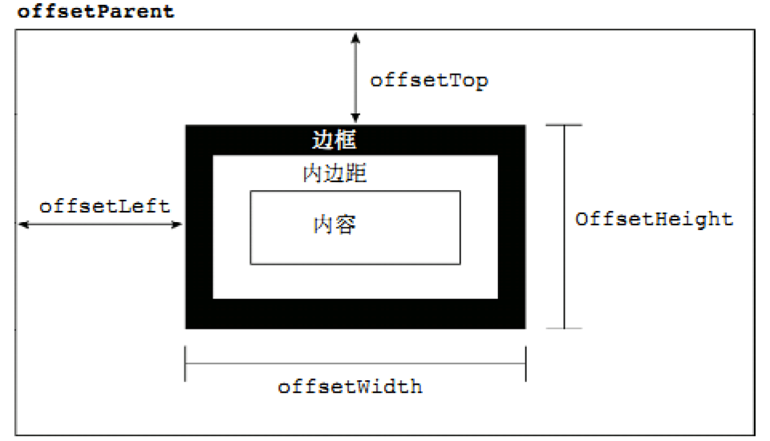
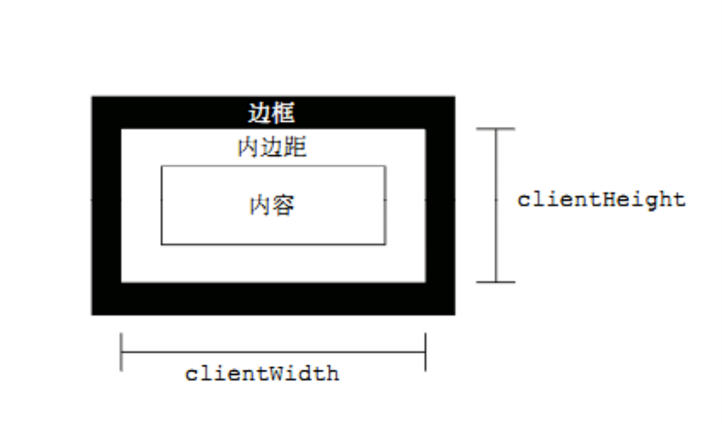

---
```学习目标:
  - 掌握API和Web API的概念
  - 掌握常见浏览器提供的API的调用方式
  - 能通过Web API开发常见的页面交互功能
  - 能够利用搜索引擎解决问题
typora-copy-images-to: media
---

# Web API

## Web API介绍

### API的概念

API（Application Programming Interface,应用程序编程接口）是一些预先定义的函数，目的是提供应用程序与开发人员基于某软件或硬件得以访问一组例程的能力，而又无需访问源码，或理解内部工作机制的细节。

- 任何开发语言都有自己的API
- API的特征输入和输出(I/O)
  - var max =  Math.max(1, 2, 3);
- API的使用方法(console.log('adf'))

### Web  API的概念

浏览器提供的一套操作浏览器功能和页面元素的API(BOM和DOM)

此处的Web API特指浏览器提供的API(一组方法)，Web API在后面的课程中有其它含义


### 掌握常见浏览器提供的API的调用方式
[MDN-Web API](https://developer.mozilla.org/zh-CN/docs/Web/API)

### JavaScript的组成


#### ECMAScript - JavaScript的核心 

定义了JavaScript 的语法规范

JavaScript的核心，描述了语言的基本语法和数据类型，ECMAScript是一套标准，定义了一种语言的标准与具体实现无关

#### BOM - 浏览器对象模型

一套操作浏览器功能的API

通过BOM可以操作浏览器窗口，比如：弹出框、控制浏览器跳转、获取分辨率等 

#### DOM - 文档对象模型

一套操作页面元素的API

DOM可以把HTML看做是文档树，通过DOM提供的API可以对树上的节点进行操作

## DOM

### DOM的概念 

文档对象模型（Document Object Model，简称DOM），是[W3C](https://baike.baidu.com/item/W3C)组织推荐的处理[可扩展标记语言](https://baike.baidu.com/item/%E5%8F%AF%E6%89%A9%E5%B1%95%E7%BD%AE%E6%A0%87%E8%AF%AD%E8%A8%80)的标准[编程接口](https://baike.baidu.com/item/%E7%BC%96%E7%A8%8B%E6%8E%A5%E5%8F%A3)。它是一种与平台和语言无关的[应用程序接口](https://baike.baidu.com/item/%E5%BA%94%E7%94%A8%E7%A8%8B%E5%BA%8F%E6%8E%A5%E5%8F%A3)(API),它可以动态地访问程序和脚本，更新其内容、结构和[www](https://baike.baidu.com/item/www/109924)文档的风格(目前，HTML和XML文档是通过说明部分定义的)。文档可以进一步被处理，处理的结果可以加入到当前的页面。[DOM](https://baike.baidu.com/item/DOM/50288)是一种基于树的[API](https://baike.baidu.com/item/API/10154)文档，它要求在处理过程中整个文档都表示在[存储器](https://baike.baidu.com/item/%E5%AD%98%E5%82%A8%E5%99%A8)中。

DOM又称为文档树模型


- 文档：一个网页可以称为文档
- 节点：网页中的所有内容都是节点（标签、属性、文本、注释等）
- 元素：网页中的标签
- 属性：标签的属性

### DOM经常进行的操作

- 获取元素
- 对元素进行操作(设置其属性或调用其方法)
- 动态创建元素
- 事件(什么时机做相应的操作)

## 获取页面元素

### 为什么要获取页面元素

例如：我们想要操作页面上的某部分(显示/隐藏，动画)，需要先获取到该部分对应的元素，才进行后续操作

### 根据id获取元素

```javascript
var div = document.getElementById('main');
console.log(div);

// 获取到的数据类型 HTMLDivElement，对象都是有类型的
```

注意：由于id名具有唯一性，部分浏览器支持直接使用id名访问元素，但不是标准方式，不推荐使用。

### 根据标签名获取元素

```javascript
var divs = document.getElementsByTagName('div');
for (var i = 0; i < divs.length; i++) {
  var div = divs[i];
  console.log(div);
} 
```

### 根据name获取元素*

```javascript
var inputs = document.getElementsByName('hobby');
for (var i = 0; i < inputs.length; i++) {
  var input = inputs[i];
  console.log(input);
}
```

### 根据类名获取元素*

```javascript
var mains = document.getElementsByClassName('main');
for (var i = 0; i < mains.length; i++) {
  var main = mains[i];
  console.log(main);
}
```

### 根据选择器获取元素*

```javascript
var text = document.querySelector('#text');
console.log(text);

var boxes = document.querySelectorAll('.box');
for (var i = 0; i < boxes.length; i++) {
  var box = boxes[i];
  console.log(box);
}
```

- 总结

```
掌握
	getElementById()
	getElementsByTagName()
了解
	getElementsByName()
	getElementsByClassName()
	querySelector()
	querySelectorAll()
```

## 事件

事件：触发-响应机制

### 事件三要素

- 事件源:触发(被)事件的元素
- 事件名称: click 点击事件
- 事件处理程序:事件触发后要执行的代码(函数形式)

### 事件的基本使用

```javascript
var box = document.getElementById('box');
box.onclick = function() {
  console.log('代码会在box被点击后执行');  
};
```

### 案例
- 点击按钮弹出提示框
- 点击按钮切换图片

## 属性操作

### 非表单元素的属性

href、title、id、src、className

```javascript
var link = document.getElementById('link');
console.log(link.href);
console.log(link.title);

var pic = document.getElementById('pic');
console.log(pic.src);
```

案例：

​	点击按钮显示隐藏div

​	美女相册

- innerHTML和innerText

```javascript
var box = document.getElementById('box');
box.innerHTML = '我是文本<p>我会生成为标签</p>';
console.log(box.innerHTML);
box.innerText = '我是文本<p>我不会生成为标签</p>';
console.log(box.innerText);
```
- HTML转义符

```
"		&quot;
'		&apos;
&		&amp;
<		&lt;   // less than  小于
>		&gt;   // greater than  大于
空格	   &nbsp;
©		&copy;
```

- innerHTML和innerText的区别
- innerText的兼容性处理

```html
<div id="box">
    hello
</div>
<script>
	var box = document.getElementById("box");
    // 当属性不存在的时候返回的是 undefined
    console.log(typeof box.a);
    // 当属性存在的时候返回的是 该属性的类型
    console.log(typeof box.id);
    
    // 处理innerText 的兼容性问题
    function getInnerText(element) {
        // 判断当前游览器 是否支持元素innerText属性, 支持innerText 使用element.innerText获取内容
        // 如果不支持innerText属性, 使用element.textContent 获取内容
        
        if (typeof element.innerText === 'string'){
            return element.innerText;
        } else {
            return element.innerContent;
        }     
    }   
</script>
```


### 表单元素属性

- value 用于大部分表单元素的内容获取(option除外)
- type 可以获取input标签的类型(输入框或复选框等)
- disabled 禁用属性
- checked 复选框选中属性
- selected 下拉菜单选中属性
> 当html中的标签的属性，只有一个值得时候
>
> DOM 中对应的元素的属性值是布尔类型
>
> 例如: disabled 禁用属性 、checked  复选框选中属性、selected 下来菜单选中属性 等这些属性值是布尔类型的

### 案例

* 点击按钮禁用文本框

```html
<input type="button" value="按钮" id="btn">
<input type="button" value="设置文本框的值" id="btn1">
<br>
<input type="text" id="text" value="123">
<script>
    // 获取元素
    var btn = document.getElementById('btn');
    // 注册事件
    btn.onclick = function () {
        var txt = document.getElementById('txt');
        console.log(txt.value);
        console.log(txt.type);
        // 当html中的标签的属性，只有一个值得时候
        // DOM 中对应的元素的属性值是布尔类型
        console.log(txt.disabled);
        txt.disabled = true;
    }
    var btn1 = document.getElementById("btn1");
    btn1.onclick = function () {
        var txt = document.getElementById("txt");
        // 设置文本框中的内容
        txt.value = "hello world!";
    }
</script>
```

* 给文本框赋值，获取文本框的值

```html
<input type="text"><br>
<input type="text"><br>
<input type="text"><br>
<input type="text"><br>
<input type="text"><br>
<input type="text"><br>
<input id="btn" type="button" value="获取文本框的值"><br>
<script>
	// 1. 当页面加载完毕，给所有的文本框赋值
    var inputs = document.getElementsByTagName('input');
    for (let i = 0; i < inputs.length; i++) {
        var input = inputs[i];
        // 根据type属性 判断是否是文本框
        if (input.type === "text") {
            input.value = i;
        }
    }
    // 2. 当点击按钮的时候，获取所有文本框的值,并使用 | 分割输出
    var btn = document.getElementById("btn");
    btn.onclick = function () {
        var array = [];
        for (let i = 0; i < inputs.length; i++) {
            var input = inputs[i];
            // 判断是否是文本框
            if (input.type === "text") {
                array.push(input.value);
            }
        }
        console.log(array.join("|"));
    }
</script>
```

* 检测用户名是否是3-6位，密码是否是6-8位，如果不满足要求高亮显示文本框

```html
<style>
    .bg {
        background-color: skyblue;
    }
</style>

<!-- input框 id 名一般为 type的类型缩写 + 作用名 -->
<input type="text" id="txtUserName"> <br> 
<input type="password" id="txtUserPassword"> <br>
<input type="button" value="登 录" id="btnLogin">
<script>
	// 检查用户名是否是3-6位， 密码是否是6-8位，如果不满足要求高亮显示文本框
    var btnLogin = document.getElementById("btnLogin");
    
    btnLogin.onclick = function () {
        var txtUserName = document.getElementById("txtUserName");
        var txtUserPassword = document.getElementById("txtUserPassword");
        // 检查用户名是否是 3-6 位
        if (txtUserName.value.length < 3 || txtUserNmae.value.length > 6) {
            txtUserName.className = 'bg';
            return;
        }else {
            txtUserName.className = "";
        }
        
        // 检查密码是否是 6-8 位
        if (txtUserPassword.value.length < 6 || txtUserPassword.value.length > 8) {
            txtUserName.className = 'bg';
            return;
        }else {
            txtUserName.className = "";
        }
        console.log("执行登录");
     }
</script>
```

* 设置下拉框中的选中项

```html
<input type="button" value="设置" id="btnSet">
<select id="selCities">
    <option value="1">北京</option>
    <option value="2">上海</option>
    <option value="3">杭州</option>
    <option value="4">郑州</option>
    <option value="5">武汉</option>
</select>

<script>
	// 1. 给按钮注册事件
    var btnSet = document.getElementById('btnSet');
    btnSet.onclick = function () {
        // 2. 获取下拉框中的option
        var selCities = document.getElementById('selCities');
        var options = selCities.getElemnetsByTagName('option');
        // 3. 随机生成索引
        var randomIndex = parseInt(Math.random() * options.length);
        // 4. 根据索引获取option, 并让option选中
        var option = options[randomIndex];
        option.selected = true;      
    }
</script>
```

- 搜索文本框

```html
<style>
    .gray {
        color: gray;
    }
    .black {
        color: black;
    }
</style>

<input typle="text" class="gray" value="请输入搜索关键字" id="txtSearch">
<input type="button" value="搜索" id="btnSearch">

<script>
	// 当文本框获得焦点，如果文本框里的内容 请输入搜索关键字 清空文本框，并且让字体变为黑色   
    var txtSearch = document.getElementById("txtSearch");
    // 获取焦点的事件 focus  
    txtSearch.onfocus = function () {
        if (this.value === '请输入搜索关键字') {
            this.value = "";
            this.className = "black";
        }
    }
   // 当文本框失去焦点，如果文本框里的内容为空 还原文本框里的文字，并且让字体变为灰色
   // 失去焦点的事件  blur
    txtSearch.onblur = function () {
        // 判断文本框中的内容为空
        if (this.value.length === 0 || this.value === '请输入搜索关键字'){
            this.value = "请输入搜索关键字";
            this.calssName = "gray";
        }
    }
</script>
```

- 全选反选

```html
<style>
    * {
        padding: 0;
        margin: 0;
    }
    .wrap {
        width: 300px;
        margin: 100px auto 0;
    }
    table {
        border-collapse: collapse;
        border-spacing: 0;
        border: 1px solid #c0c0c0;
        width: 300px;
    }
    th, td{
        border: 1px solid #d0d0d0;
        color: #404060;
        padding: 10px;
    }
    th {
        background-color: 09c;
        font: bold 16px "微软雅黑";
        color: #fff;
    }
    td {
        font: 14px "微软雅黑";
    }
    tbody tr {
        background-color: #f0f0f0;
    }
    tbody tr:hover {
        cursor: pointer;
        bacground-color: #fafafa;
    }
</style>
<div class="wrap">
    <table>
        <thead>
            <tr>
                <th>
                    <input type="checkbox" id="j_cbAll" />
                </th>
                <th>商品</th>
                <th>价钱</th>
            </tr>
        </thead>
        <tbody id="j_tb">
            <tr>
                <td>
                    <input type="checkbox" />
                </td>
                <td>iPhone8</td>
                <td>8000</td>
            </tr>
            <tr>
                <td>
                    <input type="checkbox" />
                </td>
                <td>iPad Pro</td>
                <td>5000</td>
            </tr>
            <tr>
                <td>
                    <input type="checkbox" />
                </td>
                <td>iPad Air</td>
                <td>2000</td>
            </tr>
            <tr>
                <td>
                    <input type="checkbox" />
                </td>
                <td>Apple Watch</td>
                <td>2000</td>
            </tr>

        </tbody>
    </table>
    <input type="button" value="  反 选  " id="btn">
</div>

<script>
	// 1. 全选
    // 获取父的checkbox, 注册事件
    var j_cbAll = document.getElementById('j_cbAll');
    var j_tb = document.getElementById('j_tb');
    var inputs = j_tb.getElementsByTagName('input');
    j_cbAll.onclick = function () {
        for (let i = 0; i < inputs.length; i++){
            var input = inputs[i];
            if (input.type === "checkbox") {
                // 让子的checkbox的选中状态，与父的checkbox 的选中状态保持一致
               input.checked = this.checked; 
            }
        }
    }
    // 2. 当点击子的checkbox, 如果所有的子的checkbox 都被选中了,让父的checkbox也选中
    // 如果有一个子的checkbox没有被选中,父的checkbox也不被选中
    for (let i = 0; i < inputs.length; i++){
        var input = inputs[i];
        // 判断是否是checkbox
        if (input.type !== 'checkbox'){
            continue;
        }
        input.onclick = function () {
            checkAllcheckBox();
        }
    }
    // 判断父的checkbox的状态
    function checkAllcheckBox() {
        // 判断所有的checkbox是否都被选中了
        var isAllChecked = true;
        for (let i = 0; i < inputs.length; i++) {
            var input = inputs[i];
            if (input.type !== 'checkbox'){
                // 判断当前所有的checkbox是否都被选中
                if (!input.checked){
                    isAllChecked = false;
                }
            }
            // 设置父的checkbox状态
            j_cbAll.checked = isAllChecked;
        }
    }  
    // 3. 反选
    // 给反选按钮注册点击事件
    var btn = document.getElementById('btn');
    btn.onclick = function () {
        for (let i = 0; i < inputs.length; i++)A{
            var input = inputs[i];
            if (input.type !== 'checkbox'){
                continue;
            }
            // 让子的checkbox反选
            input.checked = !input.checked;
            // 设置父的checkbox 状态
			checkAllCheckBox();
        }
    }
</script>
```

### 自定义属性操作

- getAttribute() 获取标签行内属性
- setAttribute() 设置标签行内属性
- removeAttribute() 移除标签行内属性
- 与element.属性的区别: 上述三个方法用于获取任意的行内属性。

### 样式操作

- 使用style方式设置的样式显示在标签行内
```javascript
var box = document.getElementById('box');
box.style.width = '100px';
box.style.height = '100px';
box.style.backgroundColor = 'red';
```

- 注意

  通过样式属性设置宽高、位置的属性类型是字符串，需要加上px

### 类名操作

- 修改标签的className属性相当于直接修改标签的类名
```javascript
var box = document.getElementById('box');
box.className = 'show';
```

### 案例

- 开关灯
- 点击按钮改变div的背景颜色
- 图片切换二维码案例

```html
<style>
    .nodeSmall {
        width: 50px;
        height: 50px;
        background: url(images/bgs.png) no-repeat -159px -51px;
        position: fixed;
        right: 10px;
        top: 40%;
    }
    .erweima {
        position: absolute;
        top: 0;
        left: -150px;
    }
    .nodeSmall a {
        display: block;
        width: 50px;
        height: 50px;
    }
    .hide {
        display: none;
    }
    .show {
        display: block;
    }
</style>

<div class="nodeSmall" id="node_small">
    <div class="erweima hide" id="er">
        
    </div>
</div>
<script>
    function my$(id) {
      return document.getElementById(id);
    }
</script>
<script>
    // 当鼠标移入  onmouseover
    // 当鼠标移出  onmouseout
    var nodeSmall = my$('node_small');
    nodeSmall.onmouseover = function () {
        // my$('er').className = 'erweima show';
        my$('er').className = my$('er').className.replace('hide', 'show'); 
    }
    nodeSmall.onmouseout = function () {
        // my$('er').className = 'erweima hide';
        my$('er').className = my$('er').className.replace('show', 'hide');
    }
</script>
```

- 当前输入的文本框高亮显示

```html
<input type="text"><br>
<input type="text"><br>
<input type="text"><br>
<input type="text"><br>
<input type="text"><br>
<input type="text"><br>
<input type="text"><br>
<input type="text"><br>
<input type="button" value=" 提交 ">
<script>
    var inputs = document.getElementsByTagName('input');
    for (var i = 0; i < inputs.length; i++) {
        var input = inputs[i];
        // 判断input是否是文本框
        if (input.type !== 'text') {
            continue;
        } 
        // 让当前正在输入的文本框 高亮显示
        input.onfocus = function () {
            // 让所有的文本框去掉高亮的效果
            for (var i = 0; i < inputs.length; i++) {
                var input = inputs[i];
                if (input.type !== 'text') {
                    continue;
                }
                // 去除所有文本框高亮显示
                input.style.backgroundColor = '';
            }
            // 当前文本框高亮显示
            this.style.backgroundColor = 'lightgray';

        }
    }
</script>
```

- 点击按钮改变div的大小和位置

```html
<style>
    #box {
        width: 100px;
        height: 100px;
        background-color: pink;
    }

    .cls {
        width: 200px;
        height: 200px;
        position: absolute;
        top: 100px;
        left: 100px;
        background-color: pink;
    }
</style>

<input type="button" value=" 点我 " id="btn">
<br>
<div id="box"></div>
<script>
    function my$(id) {
      return document.getElementById(id);
    }
</script>
<script>
    my$('btn').onclick = function () {
        var box = my$('box');
        // 改变box的大小和位置
        // 使用class
        // box.className = 'cls';
        // 
        // 使用style  设置大小和位置的时候 数字必须带单位
        box.style.width = '200px';
        box.style.height = '200px';

        box.style.position = 'absolute';
        box.style.left = '200px';
        box.style.top = '200px';

        console.log(box.style);
    }
</script>
```

- 列表隔行变色、高亮显示

```html
<ul id="mv">
    <li>西施</li>
    <li>貂蝉</li>
    <li>王昭君</li>
    <li>杨玉环</li>
    <li>芙蓉姐姐</li>
</ul>
<script>
    // 1 隔行变色
    // 获取到所有的li，判断奇数行和偶数行
    var mv = document.getElementById('mv');
    var lists = mv.getElementsByTagName('li');

    for (var i = 0; i < lists.length; i++) {
        var li = lists[i];
        // 判断当前的li 是奇数行 还是偶数行
        if (i % 2 === 0) {
            // i是偶数 ， 但是当前是奇数行
            // 设置奇数行的背景颜色
            li.style.backgroundColor = 'red';
        } else {
            // 设置偶数行的背景颜色
            li.style.backgroundColor = 'green';
        }
    }
    // 2 鼠标放上高亮显示
    // 
    // 2.0 给所有的li 注册事件  鼠标经过和鼠标离开的两个事件
    for (var i = 0; i < lists.length; i++) {
        var li = lists[i];
        // 2.1 鼠标放到li上，高亮显示当前的li
        var bg;
        li.onmouseover = function () {
            // 鼠标放到li上的时候，应该记录li当前的颜色
            bg = this.style.backgroundColor;

            this.style.backgroundColor = 'yellow';
        }
        // 2.2 鼠标离开li，还原原来的颜色
        li.onmouseout = function () {
            // 鼠标离开，还原原来的颜色
            this.style.backgroundColor = bg;
        }
    }
</script>
```

- tab选项卡切换

```html
<style>
    * {margin:0; padding: 0;}
    ul {
        list-style-type: none;
    }
    .box {
        width: 400px;
        height: 300px;
        border: 1px solid #ccc;
        margin: 100px auto;
        overflow: hidden;
    }
    .hd {
        height: 45px;
    }
    .hd span {
        display:inline-block;
        width: 90px;
        background-color: pink;
        line-height: 45px;
        text-align: center;
        cursor: pointer;
    }
    .hd span.current {
        background-color: purple;
    }
    .bd div {
        height: 255px;
        background-color: purple;
        display: none;
    }
    .bd div.current {
        display: block;
    }
</style>

<div class="box">
    <div class="hd" id="hd">
        <span class="current">体育</span>
        <span>娱乐</span>
        <span>新闻</span>
        <span>综合</span>
    </div>
    <div class="bd" id="bd">
        <div class="current">我是体育模块</div>
        <div>我是娱乐模块</div>
        <div>我是新闻模块</div>
        <div>我是综合模块</div>
    </div>
</div>
<script>
    function my$(id) {
      return document.getElementById(id);
    }
</script>
<script>
    // 1 鼠标放到tab栏高亮显示，其它tab栏取消高亮
    var hd = my$('hd');
    var spans = hd.getElementsByTagName('span');
    for (var i = 0; i < spans.length; i++) {
        var span = spans[i];
        // 通过自定义属性，记录当前span的索引
        span.setAttribute('index', i);
        // 注册事件
        span.onmouseover = fn
    }

    // 鼠标经过的事件处理函数
    function fn() {
        // 让所有的span取消高亮显示
        for (var i = 0; i < spans.length; i++) {
            var span = spans[i];
            span.className = '';
        }
        // 当前的span高亮显示
        this.className = 'current';

        // 2 tab栏对应的div 显示，其它div隐藏
        // 所有的div 隐藏
        var bd = my$('bd');
        var divs = bd.getElementsByTagName('div');
        for (var i = 0; i < divs.length; i++) {
            var div = divs[i];
            div.className = '';
        }
        // 当前span对应的div显示
        // 获取自定义属性的值
        var index = parseInt(this.getAttribute('index')) ;
        divs[index].className = 'current';
    }
    // var fn = function () {
    // }   
</script>
```

#### 总结

| DOM                | 文档对象模拟                                        |
| ------------------ | --------------------------------------------------- |
| **常见的DOM操作**  |                                                     |
| 获取元素           | getElementById()  getElementsByTagName()            |
| 给元素注册事件     | onclick   onmouseover  onmouseout  onfocus  onblur  |
| **操作元素的属性** |                                                     |
| 非表单元素         | href  title  src alt等                              |
| 表单元素           | type  value  checked  disabled  selected            |
| 公共属性           | id   className style                                |
| 样式操作           | className  style                                    |
| 自定义属性         | setAttribute()   getAttribute()   removeAttribute() |

## 创建元素的三种方式

### document.write()

```javascript
// 当点击按钮使用 document.write() 输出内容，会把之前的整个页面覆盖掉
document.write('新设置的内容<p>标签也可以生成</p>');
```

### innerHTML

```javascript
var box = document.getElementById('box');
box.innerHTML = '新内容<p>新标签</p>';
```

* 优化

```javascript
var datas = ["西施", "貂蝉", "凤姐", "芙蓉姐姐"];
var btn = document.getElementById('btn');
btn.onclick = function () {
    var box = document.getElementById("box");

    // 使用数组代替字符串拼接
    var array = [];
    array.push("<ul>");

    // 遍历数据
    for (var i = 0; i < datas.length; i++){
        var data = datas[i];
        array.push("<li>" + data + "</li>");
    }
    array.push("</ul>");
    
    box.innerHTML = array.join('');
    // 当 li 生成到页面之后，再从页面上查找 li  注册事件
}
```

### document.createElement()

```javascript
var div = document.createElement('div');
document.body.appendChild(div);
```

* 使用 document.createElement 创建元素并添加到页面上
```html
<div id="box">
    
</div>
<script>
	// 在内存中创建一个 DOM 对象
    var p = document.creagteElement('p');
    // 设置对象的属性
    p.innerText = "hello";
    p.style.color = "red";
    
    // 把 p 元素，放到 DOM 树上
    var box = document.getElementById('box');
    box.appendChild(p);
</script>
```


### 性能问题

- innerHTML方法由于会对字符串进行解析，需要避免在循环内多次使用。
- 可以借助字符串或数组的方式进行替换，再设置给innerHTML
- 优化后与document.createElement性能相近


### 案例

- 动态创建列表，高亮显示

```html
<input type="button" value="按钮" id="btn">
<div id="box"></div>
<script>
    var datas = ["西施", "貂蝉", "杨贵妃", "芙蓉姐姐"];
	var btn = document.getElementById("btn");
    btn.onclick = function () {
        // 动态创建ul,内存中创建对象
        var ul = document.createElement("ul");
        // 把 ul 放到页面上   把 ul 放到 DOM 树上, 并且会重新绘制
        var box = document.getElementById("box");
        box.appendChild(ul);
        
        for (let i = 0; i < datas.length; i++){
            var data = datas[i];
            // 在内存中动态创建 li 
            var li = document.createElement('li');
            // 把 li 添加到 DOM 树，并且会重新绘制 
            ul.appendChild(li);
            
            // 设置 li 中显示的内容
            // li.innerText = data;
            setInnerText(li, data);
            
            // 给 li 注册事件
            li.onmouseover = liMouseOver;
            li.onmouseout = liMouseOut;
        }
    }
   	// 当鼠标经过 li 的时候执行 
    function liMouseOver () {
        // 鼠标经过高亮显示
        this.style.backgroundColor = 'red';
    }
    
    function liMouseOut () {
        // 鼠标离开取消高亮显示
        this.style.backgroundColor = '';
    }
    
    
    // 设置标签之间的内容
    function setInnerText (element, content) {
        // 判断当前浏览器是否支持 innerText
        if (typeof element.innerText === "string"){
            element.innerText = content;
        } else {
            element.textContent = content;
        }
    }
</script>
```

- 根据数据动态创建表格 

```html
<style>
    #box table {
        border-collapse: collapse;
    }
</style>

<div id="box"></div>
<script>
    // 模拟数据
    var datas = [
        {name: "zs", subject: "语文", score: 90},
        {name: "ls", subject: "数学", score: 80},
        {name: "ww", subject: "英语", score: 99},
        {name: "zl", subject: "数学", score: 100},
        {name: "xs", subject: "数学", score: 60},
        {name: "dc", subject: "数学", score: 70},
    ];
    // 表头数据
    var headDatas = ["姓名", "科目", "成绩", "操作"];
    // 1 创建 table 元素
	var table = document.createElement('table');
    var box = document.getElementById('box');
    box.appendChild(table);
    table.border = "1px";
    table.width = "400px";
    // 2 创建表头
    var thead = document.createElement("thead");
    table.appendChild(thead);
    
    var tr = document.createElement("tr");
    thead.appendChild(tr);
    tr.style.height = "40px";
    tr.style.backgroundColor = "lightgray"
    
    // 遍历头部数据 创建 th
    for (let i = 0; i < headDatas.length; i++){
        var th = document.createElement('th');
        tr.appendChild(th);
        setInnerText(th, headDatas[i]);
    }
    
    // 3 创建数据行
    var tbody = document.createElement('tbody');
    table.appendChild(tbody);
    tbody.style.textAlign = "center";
    for (let i = 0; i < datas.length; i++) {
        // 一个学生的成绩
		var data = datas[i]
        tr = document.createElement('tr');
        tbody.appendChild(tr);
        
        // 遍历对象
        for (let key in data) {
            var td = document.createElement('td');
        tr.appendChild(td);
        setInnerText(td, data[key]);
        } 
        // 生成删除对应的列
        td = document.createElement('td');
        tr.appendChild(td);
        // 删除的超链接
        var link = document.createElement('a');
        td.appendChild(link);
        link.href = 'javascript:void(0)';
        setInnerText(link, "删除");
        
        link.onclick = linkDelete;
    }
    
     //
    function linkDelete() {
        // removeChild()
        // 获取元素
        
        // 获取要删除的行
        tr = this.parentNode.parentNode;
        tbody.removeChild(tr);
        return false
    }
     
    // innerText兼容性处理
    function setInnerText (element, content) {
        if (typeof element.innerText === "string") {
            element.innerText = content;
        } else {
            element.textContent = content;
        }
    }
</script>
```


## 节点操作

```javascript
var body = document.body;
var div = document.createElement('div');
body.appendChild(div);

var firstEle = body.children[0];
body.insertBefore(div, firstEle);

body.removeChild(firstEle);

var text = document.createElement('p');
body.replaceChild(text, div);
```

### 案例：

* 选择水果

```html
<style>
    select {
        width: 200px;
        height: 200px;
        background-color: #33cccc;
        font-size: 20px;
    }
</style>

<select id="all" multiple="multiple">   
    <option>苹果</option>
    <option>橘子</option>
    <option>梨</option>
	<option>西瓜</option>
    <option>水蜜桃</option>
</select>

<input type="button" value=">>" id="btn1">
<input type="button" value="<<" id="btn2">
<input type="button" value=">" id="btn3">
<input type="button" value="<" id="btn4">

<select id="select" multiple="multiple">
    
</select>

<script>
    function my$ (id){
        return document.getElementById(id);
    }
</script>
<script>
    var all = my$('all');
    var select = my$('select');
    my$('btn').onclick  = function () {
        // 错误的  因为 children 中的项移走之后， 索引会重新排列
        //for (var i = 0; i < all.children.length; i++){
        //    var option = all.children[i];
        //    select.appendChild(option);
        //}
        // 水果的顺序发送变化
        //for (var i = all.children.length - 1; i >= 0; i--) {
        //    var option = all.children[i];
    	//	select.appendChild(option);
        //}
        
        var len = all.children.length;
        for (var i = 0; i< len; i++) {
            var option = all.children[0];
            select.appendChild(option);
        }
    }
    
    // 3. 移动选中水果
    my$('btn3').onclick = function () {
        // 找到所有选中的option
        var  array = []; // 存储选中的option
        for (var i = 0; i < all.children.length; i++){
            var option = all.children[i]
            if (option.selected) {
                array.push(option);
                // 	去掉当前 option 的选中效果
                option.selected = false;
            }
        }
        // 把数组中的 option 移动到第二个 select 中
        for (var i = 0; i < array.length; i++) {
            var option = array[i];
            select.appendChild(option);
        }
    }
</script>
```


### 节点属性

- nodeType  节点的类型
  - 1 元素节点
  - 2 属性节点
  - 3 文本节点 
- nodeName  节点的名称(标签名称)
- nodeValue  节点值
  - 元素节点的nodeValue始终是null


### 模拟文档树结构


```javascript
function Node(option) {
  // 设置属性的默认值
  this.id = option.id || '';
  // 跟节点相关的属性
  // 节点的名称，如果是元素的节点的话，是标签的名称
  this.nodeName = option.nodeName || '';
  // 记录节点的值， 如果是元素节点，始终是null
  this.nodeValue = option.nodeValue || null;
  // 节点的类型 如果是元素节点 则为 1  属性节点  则为 2 文本节点 则为 3 （数值类型）  
  this.nodeType = option.nodeType || 1;
  // 记录子节点
  this.children = option.children || [];
}

// 创建 html 节点
var doc = new Node({
  nodeName: 'html'
});
// 创建 head 节点
var head = new Node({
  nodeName: 'head'
});
// 创建 body 节点
var body = new Node({
  nodeName: 'body'
})
// 设置 html 的子节点
doc.children.push(head);
doc.children.push(body);
// 创建 div 节点
var div = new Node({
  nodeName: 'div',
  nodeValue: 'haha',
});
// 创建 p 节点
var p = new Node({
  nodeName: 'p',
  nodeValue: '段落'
})
// 设置 body 的子节点
body.children.push(div);
body.children.push(p);

function getChildren(ele) {
  for(var i = 0; i < ele.children.length; i++) {
    var child = ele.children[i];
    console.log(child.nodeName);
    getChildren(child);
  }
}
getChildren(doc);
```

### 节点层级

 

```javascript
var box = document.getElementById('box');
// parentNode   父节点  只有一个
console.log(box.parentNode);
// childNodes   子节点   有很多个  hasChildNodes() 检查某个元素是否含有子节点
console.log(box.childNodes);
// children 子元素   chilElementCount 检查某个元素是否含有子元素  有兼容性问题
console.log(box.children);
// firstElementChild  获取第一个子元素  有兼容性问题
console.log(box.firstElementChild);
// nextSibling   下一个兄弟节点
console.log(box.nextSibling);
// nextElementSibling  下一个兄弟元素  有兼容性问题
console.log(box.nextElementSibling);
// previousSibling  上一个兄弟节点
console.log(box.previousSibling);
// previousElementSibling 上一个兄弟元素  有兼容性问题
console.log(box.previousElementSibling);
// 获取第一个子节点  获取不到则返回 Null
console.log(box.firstChild);
// 获取最后一个子节点
console.log(box.lastChild);
```

- 注意

  childNodes和children的区别，childNodes获取的是子节点，children获取的是子元素

  nextSibling和previousSibling获取的是节点，获取元素对应的属性是nextElementSibling和previousElementSibling获取的是元素

  ​	nextElementSibling和previousElementSibling有兼容性问题，IE9以后才支持

- 总结

```javascript
节点操作，方法
	// 把当前元素的标签添加到页面上
	appendChild()
	// 移除当前元素
	removeChild()
	// 把当前元素的标签进行替换
	replaceChild()
	// 把元素插入到页面的指定位置
	insertBefore()
节点层次，属性
	// 父节点  只有一个
	parentNode
    // 子节点
	childNodes
    // 子元素
	children
    // 兄弟节点
	nextSibling/previousSibling
	// 第一个子元素和最后一个子元素
	firstChild/lastChild
```

### 案例

* 隔行变色

```html
<ul id="mv">
    <li>西施</li>
    <li>貂蝉</li>
    <li>王昭君</li>
    <li>杨玉环</li>
    <li>芙蓉姐姐</li>
</ul>
<script>
	var mv = documnet.getElementById('mv');
    // mv.getElementsByTagName("li);
    
    // mv.childNodes   所有的子节点
    // mv.chidren    所有的子元素
    // 判断是否有子节点
    if (mv.hasChildNodes()) {
        for (let i = 0; i < mv.children.length; i++){
            var li = mv.children[i];
            if (i % 2 === 0){
                // 奇数行
                li.style.backgroundColor = "red";
            }else {
                // 偶数行
                li.style.backgroundColor = "green";
            }
        }
    }
</script>
```

* 菜单栏

```html
<style>
    #list li {
        list-style-type: none;
        width: 80px;
        height: 30px;
        line-height: 30px;
        background-color:beige;
        text-align: center;
        float: left;
        margin-left: 5px;
    }

    #list li.current {
        background-color: burlywood;
    }

    #list li a {
        text-decoration: none;
    }
</style>

<div id="menu">
    <ul id="list">
        <li class="current"><a href="javascript:void(0)">首页</a></li>
        <li><a href="javascript:void(0)">播客</a></li>
        <li><a href="javascript:void(0)">博客</a></li>
        <li><a href="javascript:void(0)">相册</a></li>
        <li><a href="javascript:void(0)">关于</a></li>
        <li><a href="javascript:void(0)">帮助</a></li>
    </ul>
</div>
<script>
	// 处理游览器兼容性问题
    // 获取第一个子元素
    function getFirstElementChild(element) {
        var node, nodes = element.childNodes, i = 0;
        while (node = nodes[i ++]){
            return node;
        }
        return null;
    }
</script>
<script>
	var menu = document.getElementById("menu");
    // 获取menu中的Ul
    var ul = getFirstElementChild(menu);
    for (let i = 0; i < ul.children.length; i++){
        var li = ul.children[i];
       	var link = getFirstElementChild(li);
        // 注意：此时是把函数赋给 onclick 而不是函数的调用
        link.onclick = linkClick;
    }
    function linkClick () {
        // 所有的li 取消高亮显示
        for (let i = 0; i < ul.children.length; i++){
            var li = ul.chidren[i];
            li.className = "";
        }
        // 让当前 a 标签所在的 li 高亮显示
        this.parentNode.className = "current";
        // 取消 a 标签后续内容的执行
        return false;
    }
    
</script>
```


## 事件详解

### 注册/移除事件的三种方式

```javascript
var box = document.getElementById('box');
box.onclick = function () {
  console.log('点击后执行');
};
box.onclick = null;
// 注册事件  addEventListener(type, listener[, useCapture])  游览器兼容器问题
box.addEventListener('click', eventCode, false);
// 如果想要移除事件，注册事件的时候不能使用匿名函数
// 移除事件  reomveEventListener(type, listener[, useCapture])
box.removeEventListener('click', eventCode, false);
// IE6-10 版本游览器特有的方法  其他游览器不支持 
// attachEvent 注册事件
box.attachEvent('onclick', eventCode);
box.detachEvent('onclick', eventCode);

function eventCode() {
  console.log('点击后执行');
}
```

#### addEventListener

**ventTarget.addEventListener()** 方法将指定的监听器注册到 [`EventTarget`](https://developer.mozilla.org/zh-CN/docs/Web/API/EventTarget) 上，当该对象触发指定的事件时，指定的回调函数就会被执行。 事件目标可以是一个文档上的元素 [`Element`](https://developer.mozilla.org/zh-CN/docs/Web/API/Element),[`Document`](https://developer.mozilla.org/zh-CN/docs/Web/API/Document)和[`Window`](https://developer.mozilla.org/zh-CN/docs/Web/API/Window)或者任何其他支持事件的对象 (比如 `XMLHttpRequest`)`。`

`addEventListener()`的工作原理是将实现[`EventListener`](https://developer.mozilla.org/zh-CN/docs/Web/API/EventListener)的函数或对象添加到调用它的[`EventTarget`](https://developer.mozilla.org/zh-CN/docs/Web/API/EventTarget)上的指定事件类型的事件侦听器列表中。

* 语法

```
target.addEventListener(type, listener[, options]);
target.addEventListener(type, listener[, useCapture]);
target.addEventListener(type, listener[, useCapture,wantsUntrusted]);  // Geko/Mozilla only
```

> 更多用法可以访问  <https://developer.mozilla.org/zh-CN/> 


### 兼容代码

```javascript
function addEventListener(element, type, fn) {
  if (element.addEventListener) {
    element.addEventListener(type, fn, false);
  } else if (element.attachEvent){
    element.attachEvent('on' + type,fn);
  } else {
    element['on' + type] = fn;
  } 
}

function removeEventListener(element, type, fn) {
  if (element.removeEventListener) {
    element.removeEventListener(type, fn, false);
  } else if (element.detachEvent) {
    element.detachEvent('on' + type, fn);
  } else {
    element['on'+type] = null;
  }
}
```

### 事件的三个阶段

1. 捕获阶段 


1. 当前目标阶段

2. 冒泡阶段


   事件对象.eventPhase属性可以查看事件触发时所处的阶段

```html
<style>
    #box1 {
        width: 100px;
        height: 100px;
        background-color: skyblue;
    }
    #box2 {
        width: 200px;
        height: 200px;
        background-color: red;
    }
    #box3 {
        width: 300px;
        height: 300px;
        background-color: blue;
    }
</style>

<div id="box1">
    <div id="box2">
        <div id="box3">
        </div>
    </div>
</div>
<script>
    // addEventListener 的第三个参数的作用
    var box1 = document.getElementById("box1");
    var box2 = document.getElementById("box2");
    var box3 = document.getElementById("box3");

    // addEventListener 的第三个参数为 false 的时候： 事件冒泡
    // addEventListener 的第三个参数为 true 的时候： 事件捕获
    var array = [box1, box2, box3];
    for (var i = 0; i < array.length; i++) {
        array[i].addEventListener("click", function () {
            console.log(this.id);
        }, false);
    } 
</script>
```

*  事件冒泡的作用

```html
<ul id="ul">
    <li>西施</li>
    <li>貂蝉</li>
    <li>昭君</li>
	<li>凤姐</li>
    <li>芙蓉姐姐</li>
</ul>

<script>
	// 事件委托: 原理事件冒泡
    var ul = document.getElementById('ul');
    ul.onclick = function (e) {
        // e 事件参数(事件对象) : 当事件发生的时候，可以获取一些和事件相关的数据
        // 获取到当前点击的 li 
        // e.target 是真正触发事件的对象
        console.log(e.target);
        // 让当前点击的 li 高亮显示
        e.target.style.backgroundColor = 'red';
    }    
</script>
```


### 事件对象的属性和方法

- event.type           获取事件类型
- clientX/clientY     所有浏览器都支持，窗口位置(鼠标在可视区域中的位置)
- pageX/pageY       IE8以前不支持，页面位置 (鼠标在页面中的位置)
- event.target || event.srcElement   用于获取触发事件的元素
- event.eventPhase   获取事件阶段
- event.currentTarget  获取事件处理函数所属的对象  和 this 一样
- event.preventDefault()   取消默认行为

#### 处理 pageX/pageY 兼容性

```js
// pageY = clientY + 页面滚动出去的距离

// 获取鼠标在页面的位置，处理游览器兼容性
function getPage (e) {
    var pageX = e.pageX || e.clientX + getScroll().scrollLeft;
    var pageY = e.pageY || e.clientY + getScroll().scrollTop;
    
    return {
        pageX: pageX,
       	pageY: pageY
    }
}


// 获取页面滚动距离的游览器兼容性问题
// 获取页面滚动出去的距离
function getScroll () {
    var scrollLeft = document.body.scrollLeft || document.documentElement.scrollLeft;
    var scorllTop = document.body.scrollTop || documentElement.scrollTop;
    
    return {
        scrollLeft: scrollLeft,
        scrollTop: scrollTop
    }
}
```


#### 事件对象

```html
<input type="button" value="按钮" id="btn">
<div id="box1">
    <div id="box2">
        <div id="box3">
        </div>
    </div>
</div>

<script>
	// 通过事件对象，可以获取到事件发生的时候和事件相关的一些数据
    
    var box1 = document.getElementById('box1');
    var box2 = document.getElementById('box2');
    var box3 = document.getElementById('box3');
    
    var array = [box1, box2, box3];
    for (i = 0; i < array.length; i++) {
        var box = array[i];
        box.onclick = function (e) {
            e = e || window.event;
            // 事件阶段
            console.log(e.eventPhase);
            // e.target  获取真正触发事件的对象
            var target = e.target || e.srcElement;
            console.log(target);
            // e.currentTartge  和 this 一样 获取事件处理函数所属的对象
            console.log(e.currentTarget);
            console.log(this);
        }
    }
    
    var btn = document.getElementById("btn");
    btn.onclick = function (e) {
        // DOM 标准中， 是给事件处理函数一个参数
        // e 就是事件对象
        // 在老版本的 IE 中获取事件对象的方式  window.event
        
        // 处理事件对象的游览器兼容性
        e = e || window.event;
        // 事件的阶段: 1 捕获阶段 2 目标阶段 3 冒泡阶段
        // console.log(e.eventPhase);
        
        // e.target  获取真正触发事件的对象  游览器兼容问题
        // 老版本的 IE srcElement
        // 处理兼容性问题
        var target = e.target || e.srcElement;
        console.log(e.target);
        
        // e.currentTarget 事件处理函数所属的对象
        console.log(e.currentTarget);
        
    }
</script>
```

#### `e.type`  意义

```html
<div id="box"></div>
<script>
    var box = document.getElementById('box');
    box.onclick = fn;
    box.onmouseover = fn;
    box.onmouseout = fn;

    function fn () {
        e = e || window.event;
        switch (e.type) {
            case 'click': 
                console.log("点击box");
                break;
            case 'mouseover':
                console.log("鼠标经过box");
                break;
            case 'mouseout':
                console.log("鼠标离开box")；
                break;
        }
    }
</script>
```

#### clientX/clientY 

```html
<style>
    body {
        margin: 0;
    }
    #box {
     	margin: 100px;
        width: 200px;
        height: 200px;
        background-color: red;
    }
</style>

<div id="box"></div>
<script>
	var box = document.getElementById("box");
    box.onclick = function (e) {
        e = e || window.event;
        
        console.log(e.clientX);
        console.log(e.clientY);
    }
</script>
```


#### 案例

- 跟着鼠标飞的天使

```html
<style>
	position: absolute;
</style>


<script>
	var ts = document.getElementById('ts');
    document.onmousemove = function (e) {
        e = e || window.event;
        ts.style.left = e.pageX - 10 + 'px';
        ts.style.top = e.pageX - 10 + 'px';
    }
</script>
```

* 获取鼠标在盒子中的位置

```html
<style>
    #box {
        width: 300px;
        height: 300px;
        border: 1px solid red;
        margin: 100px 10px 10px 100px;
    }
</style>

<div id="box"></div>

<script>
	var box = document.gegtElementById("box");
    box.onclick = function (e) {
        // 获取盒子上在页面上的位置
        // console.log(this.offsetLeft);  // offsetleft  获取盒子偏移量
        // console.log(this.offsetTop);
        e = e || window.event
        // 获取鼠标在盒子中的位置 = 鼠标的坐标 - 盒子的坐标
        var x = e.pageX - this.offsetLeft;
        var y = e.pageY - this.offsetTop;
    }
</script>
```

- 鼠标点哪图片飞到哪里

- 获取鼠标在div内的坐标

### 阻止事件传播的方式 

- 标准方式 event.stopPropagation();

- IE低版本 event.cancelBubble = true; 标准中已废弃

#### 取消默认行为的执行

```html
<a id="link" href="http://www.baidu.com">百度</a>
<script>
	var link = document.getElementById('link');
    link.onclick = function (e) {
        alert('hello');
        
        // 取消默认行为执行
        // return false
        
        // DOM 标准方法
        e.preventDefault();
    }
</script>
```

####  阻止事件冒泡

```html
<div id="box1">
    <div id="box2">
        <div id="box3">
        </div>
    </div>
</div>

<script>
	// 事件冒泡
    var box1 = document.getElementById('box1');
    var box2 = document.getElementById('box2');
    var box3 = document.getElementById('box3');
    
    var array = [box1, box2, box3];
    
    for (var i = 0; i < array.length; i++) {
        var box = array[i];
        box.onclick = function (e) {
            console.log(this.id); 
            
            // 停止事件传播  取消冒泡
            // 标准的 DOM 方法
            e.stopPropagation()
        }
    }
</script>
```


### 常用的鼠标和键盘事件

- onmouseup 鼠标按键放开时触发
- onmousedown 鼠标按键按下触发
- onmousemove 鼠标移动触发

* onmouseover  鼠标移入
* onmouseout    鼠标移出
* onmouseenter  鼠标移入
* onmouseleave   鼠标移出

> mouseenter、mouseleave 和 mouseover、mouseout 在不触发事件冒泡的时候是一样的
>
> mouseenter、mouseleave      不会触发事件冒泡
> mouseover、mouseout            会触发事件冒泡

- onkeyup 键盘按键按下触发
- onkeydown 键盘按键抬起触发


## BOM

### BOM的概念

BOM(Browser Object Model) 是指浏览器对象模型，浏览器对象模型提供了独立于内容的、可以与浏览器窗口进行互动的对象结构。BOM由多个对象组成，其中代表浏览器窗口的Window对象是BOM的顶层对象，其他对象都是该对象的子对象。

我们在浏览器中的一些操作都可以使用BOM的方式进行编程处理，

比如：刷新浏览器、后退、前进、在浏览器中输入URL等

### BOM的顶级对象window

window是浏览器的顶级对象，当调用window下的属性和方法时，可以省略window
注意：window下一个特殊的属性 window.name

### 对话框

- alert()
- prompt()
- confirm()

### 页面加载事件

- onload

```javascript
window.onload = function () {
  // 当页面加载完成执行
  // 当页面完全加载所有内容（包括图像、脚本文件、CSS 文件等）执行
}

onload = function () {
    var box = document.getElementById('box');
    console.dir(box);
}
```

- onunload

```javascript
window.onunload = function () {
  // 当用户退出页面时执行
}

onunload = function () {
    // 在onunload 中所有的对话框都无法使用  window 对象被冻结
    // Blocked alert("欢迎下次再来") during unload
    // alert("欢迎下次再来");
    console.log('bye bye');
}
```

### 定时器

#### setTimeout()和clearTimeout()

在指定的毫秒数到达之后执行指定的函数，只执行一次

```javascript
// 创建一个定时器，1000毫秒后执行，返回定时器的标示
var timerId = setTimeout(function () {
  console.log('Hello World');
}, 1000);

// 取消定时器的执行
clearTimeout(timerId);
```

#### setInterval()和clearInterval()

定时调用的函数，可以按照给定的时间(单位毫秒)周期调用函数

```javascript
// 创建一个定时器，每隔1秒调用一次
var timerId = setInterval(function () {
  var date = new Date();
  console.log(date.toLocaleTimeString());
}, 1000);

// 取消定时器的执行
clearInterval(timerId);
```

案例：

* 简单动画

```html
<style>
    body {
        margin: 0;
    }
    #box {
        position: relative;
        background-color: red;
        width: 100px;
        height: 100px;
    }
</style>

<input type="button" value="开始" id="btn">
<div id="box"></div>

<script>
    // 1. 点击按钮，让盒子能够向右移动
    var btn = document.getElementById('btn');
    var box = document.getElementById('box');
    btn.onclick = function () {
        // style.left 获取的标签中的style 属性设置的样式属性的值
        // 如果标签中的 style 没有设置该样式属性，我们获取到的是空字符串
        // box.style.left = box.style.left + 10 + "px";

        // 获取盒子当前的位置  offsetLeft offsetTop
        // box.style.left = box.offsetLeft + 10 + 'px';
        // 2. 让盒子不停的向右移动
        // 最终停止的像素
        var target = 600;
        // 步长
        var step = 6;
        var timerId = setInterval(function () {
            // 让盒子停在500px的位置
            // 判断盒子当前位置是否到达500
            if (box.offsetLeft >= target){
                // 停止定时器
                clearInterval(timeId);
                // 设置横坐标为 500px
                box.style.left = target + "px";
                // 退出函数
            }
            box.style.left = box.offsetLeft + step + 'px';
        }, 30)
        }
</script>
```


```
定时器

```

### location对象

location对象是window对象下的一个属性，使用的时候可以省略window对象

location可以获取或者设置浏览器地址栏的URL

#### location有哪些成员？

- 使用chrome的控制台查看

- 查MDN

  [MDN](https://developer.mozilla.org/zh-CN/)

- 成员

  - `assign()`  
    - 加载给定URL的内容资源到这个Location对象所关联的对象上。
  - `reload()`
    - 重新加载来自当前 URL的资源。他有一个特殊的可选参数，类型为 [`Boolean`](https://developer.mozilla.org/zh-CN/docs/Web/API/Boolean)，该参数为true时会导致该方法引发的刷新一定会从服务器上加载数据。如果是 `false`或没有制定这个参数，浏览器可能从缓存当中加载页面
  - `replace()`
    - 用给定的URL替换掉当前的资源。与 `assign()` 方法不同的是用 `replace()`替换的新页面不会被保存在会话的历史 [`History`](https://developer.mozilla.org/zh-CN/docs/Web/API/History)中，这意味着用户将不能用后退按钮转到该页面
  - hash/host/hostname/search/href……

#### URL

统一资源定位符 (Uniform Resource Locator, URL)

- URL的组成 

```
scheme://host:port/path?query#fragment
http://www.itheima.com:80/a/b/index.html?name=zs&age=18#bottom
scheme:通信协议
	常用的http,ftp,maito等
host:主机
	服务器(计算机)域名系统 (DNS) 主机名或 IP 地址。
port:端口号
	整数，可选，省略时使用方案的默认端口，如http的默认端口为80。
path:路径
	由零或多个'/'符号隔开的字符串，一般用来表示主机上的一个目录或文件地址。
query:查询
	可选，用于给动态网页传递参数，可有多个参数，用'&'符号隔开，每个参数的名和值用'='符号隔开。例如：name=zs
fragment:信息片断
	字符串，锚点.
```

#### 作业

解析URL中的query，并返回对象的形式

```javascript
function getQuery(queryStr) {
  var query = {};
  if (queryStr.indexOf('?') > -1) {
    var index = queryStr.indexOf('?');
    queryStr = queryStr.substr(index + 1);
    var array = queryStr.split('&');
    for (var i = 0; i < array.length; i++) {
      var tmpArr = array[i].split('=');
      if (tmpArr.length === 2) {
        query[tmpArr[0]] = tmpArr[1];
      }
    }
  }
  return query;
}
console.log(getQuery(location.search));
console.log(getQuery(location.href));
```

### history对象

- `back()`              加载 history 列表中的前一个 URL。
- `forward()`         加载 history 列表中的下一个 URL。
- `go()`                   加载 history 列表中的某个具体页面。

### navigator对象

- userAgent

## 特效

### 偏移量

- offsetParent                用于获取距离当前元素最近的定位的父级元素，如果没有定位父元素此时是body
- offsetParent和parentNode的区别

```javascript
var box = document.getElementById('box');
//  用于获取距离当前元素最近的定位的父级元素，如果没有定位父元素此时是body
console.log(box.offsetParent);
// 获取box坐标
console.log(box.offsetLeft);
console.log(box.offsetTop);
// 获取box大小                                
console.log(box.offsetWidth);
console.log(box.offsetHeight);
```



### 客户区大小

```javascript
var box = document.getElementById('box');
// clientLeft   是 border-left 的宽度
// clientTop    是 border-top 的宽度
console.log(box.clientLeft);
console.log(box.clientTop);
// 获取大小   包括 padding 但是不包括边框
console.log(box.clientWidth);
console.log(box.clientHeight);
```



### 滚动偏移

```javascript
var box = document.getElementById('box');
// box 滚动的距离
console.log(box.scrollLeft)
console.log(box.scrollTop)
// 内容的大小，包括 padding 和未显示的内容  不包括滚动条 
console.log(box.scrollWidth)
console.log(box.scrollHeight)
```


### 案例 

- 拖拽案例

- 弹出登录窗口
- 放大镜案例
- 模拟滚动条
- 匀速动画函数
- 变速动画函数
- 无缝轮播图
- 回到顶部  


## 附录

### 元素的类型

