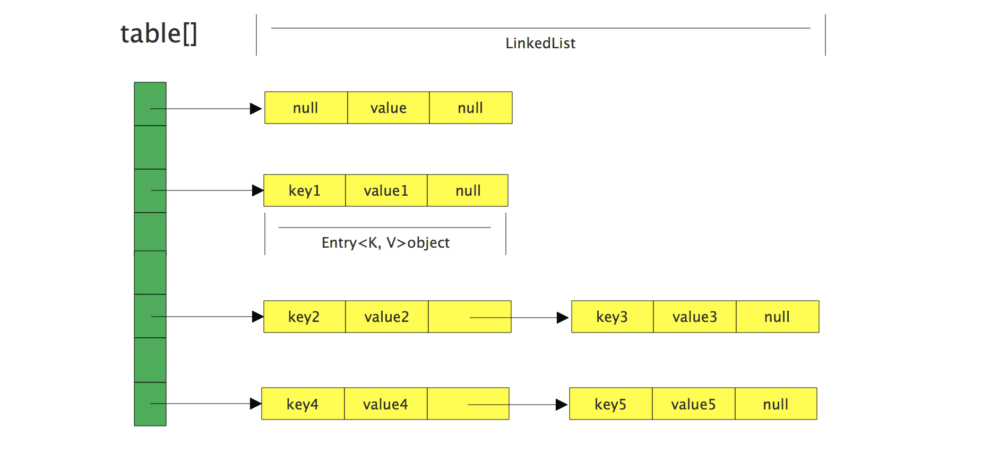
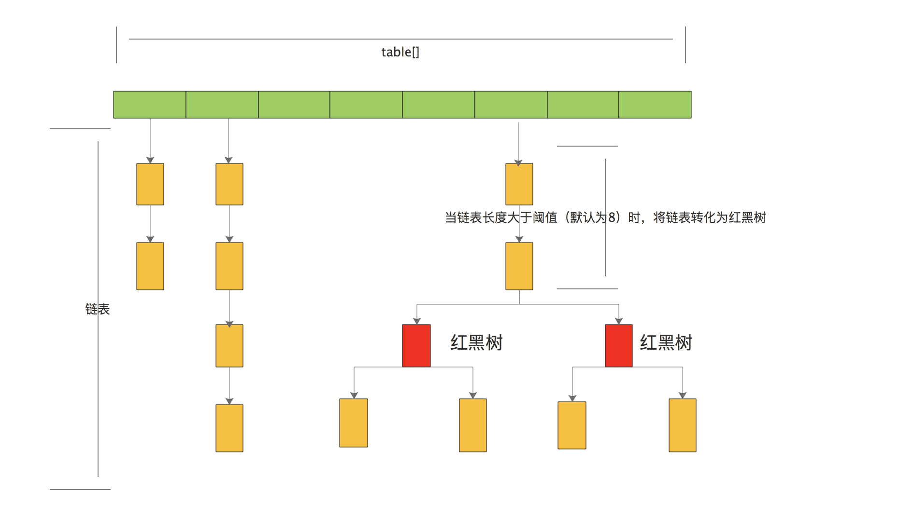
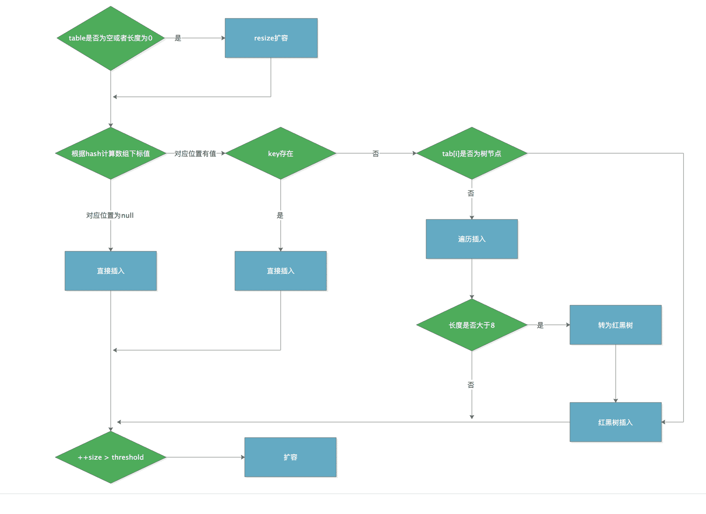
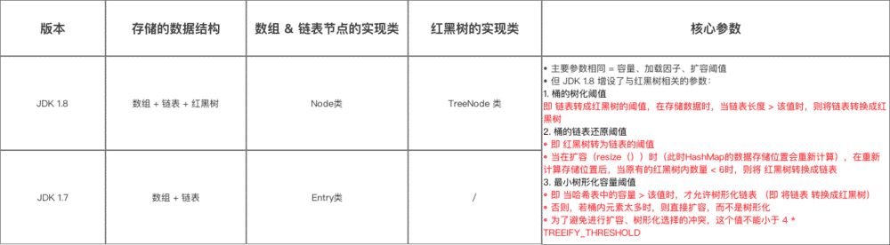
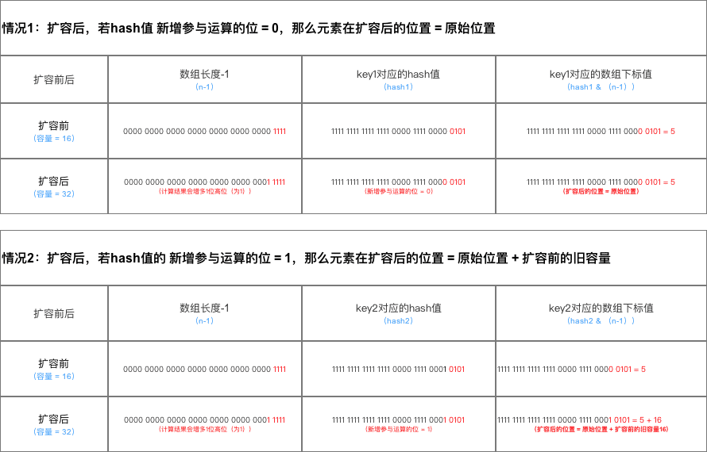
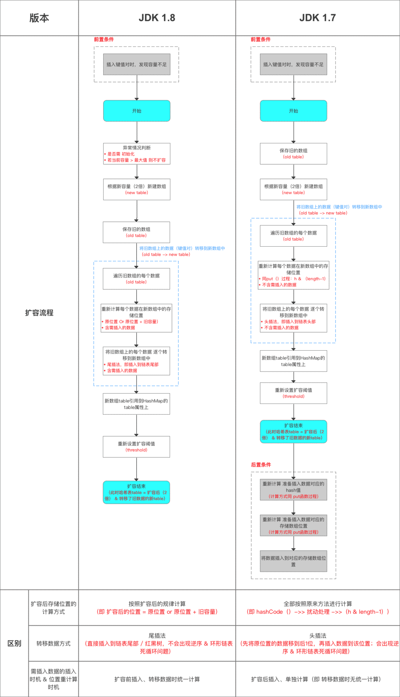
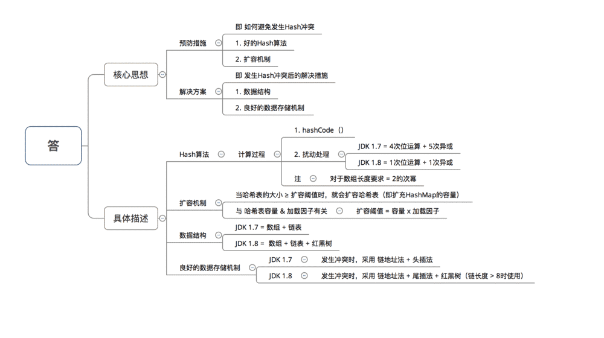
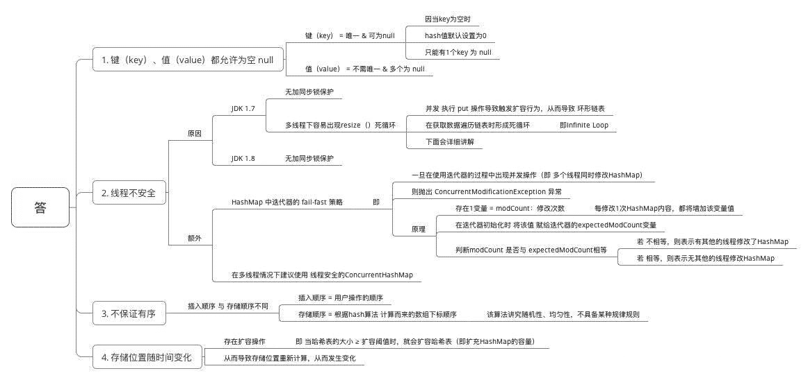
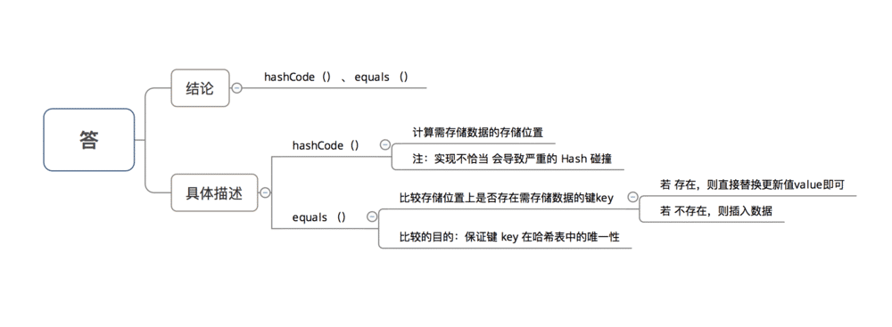
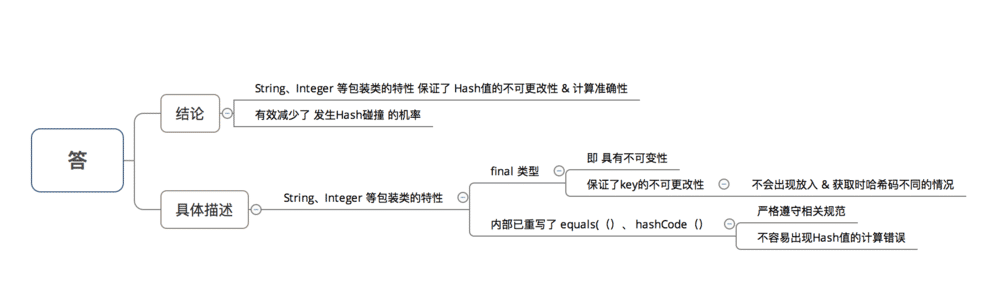

# HashMap 的实现原理

## 一、 Hash 表简介

数据结构中有**`数组`** 和 **`链表`** 这两个结构来存储数据。

* **`数组`**存储区间连续，占用内存比较严重，故空间复杂的很大，但数组的二分查找时间复杂度小，为 `O(1)`。数组的特点是：**寻址容易，插入和删除困难**；

* **`链表`**存储区间离散，占用内存比较宽松，故空间复杂度很小，但链表的时间复杂度很大，为 `O(N)`。链表的特点是：**寻址困难，插入和删除容易**。

综合这两者的优点，摒弃缺点，哈希表就诞生了，既满足了数据查找方面的特点，占用的空间也不大。

​		**`哈希表`**可以说就是数组链表，底层还是数组，但是这个数组每一项就是一个链表。特点是：**寻址容易，插入删除也容易，占用的空间也不大**。

​		在这个数组中，每个元素存储的其实是一个链表的头，元素的存储位置一般情况是通过 `hash(key)%len` 获得，也就是元素的 `key` 的哈希值对数组长度取模得到。比如上述哈希表中，12%16=12,28%16=12,108%16=12,140%16=12。所以12、28、108以及140都存储在数组下标为12的位置。

> 哈希表有多种不同的实现方法，`HashMap` 则使用的是`拉链法`，也叫作`链地址法`；


## 二、HashMap 简介

​		**`java.util.HashMap`** 实现了 **`java.util.Map`** 接口，继承了 **`java.util.AbstractMap`**。其中 **`Map`** 接口定义了键映射到值得规则，而 **`AbstractMap`** 类提供 **`Map`** 接口的骨干实现。

`HashMap` 提供了三个构造函数:

* `HashMap():` 构造一个具有默认初始容量(16) 和默认加载因子(0.75) 的空 HashMap。
* `HashMap(int initialCapacity):` 构造一个带指定初始容量和默认加载因子(0.75)的空 HashMap。
* `HashMap(int initialCapacity, float loadFactor):` 构造一个带指定初始容量和加载因子的空 HashMap。

>`HashMap` 是基于哈希表的 `Map` 接口的非同步实现。此实现提供所有可选的映射操作，并允许使用 `null` 值和 `null` 键。此类不保证映射的顺序，特别是它不保证该顺序恒久不变。


## 三、HashMap 的实现原理

​		`HashMap` 是开发中经常使用到的集合类，JDK 1.8 相对于 1.7 底层实现发生了一些改变。JDK 1.7 是**`数组+链表`**，1.8 则是**`数组+链表+红黑树结构(当链表长度大于8，转为红黑树)`**。 


### 1. JDK 1.7 的实现原理

#### 1.1 数据结构

​		在 JDK 1.7 及之前，`HaspMap` 由 **`数组 + 链表`** 组成，也就是 `链表散列`，**数组是 HashMap 的主体，链表实则是为了解决哈希冲突而存在的(拉链法解决哈希冲突)。** JDK 1.7 中 `HashMap` 的数据结构如下图所示:



​															**JDK1.7中HashMap的数据结构**

​		`HashMap` 通过 `key` 的 `hashCode` 经过扰动函数处理过后得到 `hash` 值，然后通过 `(n - 1) & hash` 判断当前元素存放的位置(这里的 n 指的是数组的长度)，如果当前位置存在元素的话，就判断该元素与要存入的元素的 `hash` 值以及 `key` 是否相同，如果相同的话，直接覆盖，不相同就通过拉链法解决冲突。

​		所谓扰动函数指的就是 `HashMap` 的 `hash()` 方法。使用 `hash()` 方法也就是扰动函数是为了防止一些实现较差的 `hashCode()` 方法，换句话说使用扰动函数之后可以减少碰撞。

​		**`拉链法`**是将链表和数组相结合。也就是说创建一个链表数组，数组中每一格就是一个链表。若遇到哈希冲突，则将冲突的值加到链表中即可。

#### 1.2 类中常量

```java
/** 默认初始容量(必须是2的n次幂)，HashMap 底层是数组，这个是数组默认的大小 */
static final int DEFAULT_INITIAL_CAPACITY = 1 << 4 // aka 16

/** 最大容量为2的30次方 */
static final int MAXIMUM_CAPACITY = 1 << 30;
    
/** 默认的加载因子(在构造函数中未指定时使用的加载因子) */
static final float DEFAULT_LOAD_FACTOR = 0.75f;

static final Entry<?,?>[] EMPTY_TABLE = {};

/** 存储元素的数组(长度总是2的n次幂) */
transient Entry<K,V>[] table = (Entry<K,V>[]) EMPTY_TABLE;

/** 存储元素的个数(注意的是这个值不等于数组的长度) */
transient int size;

/** 每次扩容或者更改map结构的计数器 */
transient int modCount;

/** 下次扩容的临界值(size >= threshold就会扩容， threshold = capacity * loadFactor) */
int threshold;

/** 哈希表的加载因子(可以在初始化的时候显示指定) */
final float loadFactor;
```

* **`threshold：`**哈希表的阈值，也叫临界值，`threshold = capacity * loadFactor`。当 `HashMap` 的 `size>=threshold` 的时候，那么就要考虑对数组的扩容了，也就是说，`threshold` 是衡量数组是否需要扩增的一个标准。
* **`loadFactor:`** 哈希表的加载因子，也可以叫`负载因子`，用来`控制数组存放数据的疏密程度`，`loadFactor` 越趋近于1，说明数组中存放的 `entry` 越多，链表的长度就越长。默认的 `HashMap` 的容量是 16, 加载因子是 0.75，当我们使用 `HashMap` 的时候，随着我们不断的 put 数据，当数量达到 `16 * 0.75 = 12` 的时候，就需要将当前的 16 进行扩容，而扩容就涉及到数据的复制，rehash 等，就消耗性能。所以，建议当我们知道 `HashMap` 的使用大小时，应该在初始化的时候指定大小，减少扩容带来的性能消耗。

#### 1.3 Entry 类

存储元素的数组 `table` 中存放的是 `Entry` 类型的数据。下面简单看看 `Entry` 的定义: 

```java
static class Entry<K, V> implements Map.Entry<K, V> { 
    final K key; 
    V value; 
    Entry<K, V> next; 
    int hash; 
    
    /** 
    * Creates new entry. 
    */ 
    Entry(int h, K k, V v, Entry<K, V> n) { 
        value = v; 
        next = n; 
        key = k; 
        hash = h; 
    } 
    
    public final K getKey() {
        return key; 
    } 
    
    public final V getValue() {
        return value; 
    } 
    
    public final V setValue(V newValue) {
        V oldValue = value;
        value = newValue; 
        return oldValue; 
    } 
    
    public final boolean equals(Object o) {
        if (!(o instanceof Map.Entry)) 
            return false; 
        Map.Entry e = (Map.Entry) o;
        Object k1 = getKey(); 
        Object k2 = e.getKey(); 
        if (k1 == k2 || (k1 != null && k1.equals(k2))) {
            Object v1 = getValue(); 
            Object v2 = e.getValue();
            if (v1 == v2 || (v1 != null && v1.equals(v2))) 
                return true;
        } 
        return false; 
    }
    
    public final int hashCode() {
        return (key == null ? 0 : key.hashCode()) ^ 
            (value == null ? 0 : value.hashCode()); 
    } 
    
    public final String toString() {
        return getKey() + "=" + getValue(); 
    } 
    
    /** 
    * 当向HashMap中添加元素的时候调用这个方法(这里没有实现是供子类回调用) 
    */ 
    void recordAccess(HashMap<K, V> m) { 
    } 
    
    /** 
    * 当从HashMap中删除元素的时候调动这个方法(这里没有实现是供子类回调用) 
    */ 
    void recordRemoval(HashMap<K, V> m) { 
    } 
}
```

**`Entry`**是一个内部类，其中的 `key` 就是写入的键，`value` 就是写入的值，由于 `HashMap`由**数组+链表**的形式，这里的 `next` 就是用于实现链表结构。`hash` 存放的事当前 `key` 的 `hashcode` 值。

#### 1.4 put() 方法

​	**`put()`** 方法的过程是先计算 `hash`，然后通过 `hash` 与 `table.length` 取模计算 `index` 值，然后将 `key` 放到 `table[index]` 位置，当 `table[index]` 已存在其它元素时，会在 `table[index]` 位置形成一个链表，将新添加的元素放在 `table[index]`，原来的元素通过 `Entry` 的 `next` 进行连接，这样 `以链表形式解决 hash 冲突问题`，当元素数量达到临界值(`capactiyfactor`)时，则进行扩容，使 `table` 数组长度变为 `table.length * 2`。下面分析 `put()` 方法源码:

```java
public V put(K key, V value) {
    // 如果key为null, 则处理null值
	if (key == null)
        return putForNullKey(value);
    // 根据key计算出hashCode值
	int hash = hash(key);
    // 根据计算的hashcode值和数组的长度定位在数组中存储位置
	int i = indexFor(hash, table.length);
    // 如果table[i]位置是一个链表，则需要遍历判断里面的 hashcod、key 是否和传入 key 相等
 	for (Entry<K, V> e = table[i]; e != null; e = e.next) {
        Object k;
	// 如果相等则进行覆盖，并返回原来的值
		if (e.hash == hash && ((k = e.key) == key || key.equals(k))) {
            V oldValue = e.value; 
            e.value = value; 
            e.recordAccess(this); 
            return oldValue; 
        } 
    }
    
    // 若没有在table[i]位置找到相同的key,则添加key到table[i]位置，新的元素总是在table[i]位置的第一个元素，原来的元素后移(头插法)
    modCount++;
    addEntry(hash, key, value, i);
    return null;
}

private V putForNullKey(V value) {
    // 取出数组第1个位置(下标等于0)的节点，如果存在则覆盖不存在则新增，和put方法的逻辑一样
	for (Entry<K, V> e = table[0]; e != null; e = e.next) {
        if (e.key == null) {
            V oldValue = e.value; 
            e.value = value; 
            e.recordAccess(this); 
            return oldValue; 
        } 
    } 
    modCount++;
    // 若果key等于null, 则hash值等于0
    addEntry(0, null, value, 0);
    return null;
}

void addEntry(int hash, K key, V value, int bucketIndex) {
	// 判断当前 HashMap 的 size 与临界值的大小，判断是否需要扩容操作
	if ((size >= threshold) && (null != table[bucketIndex])) {
        // 如果需要扩容，就进行2倍扩容
		resize(2 * table.length);
        // 将当前的 key 重新 hash 并定位
 		hash = (null != key) ? hash(key) : 0;
		bucketIndex = indexFor(hash, table.length);
    }
    
    // 创建一个Entry, 如果当前位置存在元素，就形成链表
    createEntry(hash, key, value, bucketIndex);
}

void createEntry(int hash, K key, V value, int bucketIndex) { 
    Entry<K, V> e = table[bucketIndex]; 
    table[bucketIndex] = new Entry<>(hash, key, value, e); 
    size++; 
}
```

`put()` 方法图解如下图所示:


​																	**JDK1.7中HashMap的put()方法图解**

> `put()` 方法会对 `key` 为 `null` 时进行特殊处理，`key` 为 `null` 的元素总是放到 `table[0]` 位置。

#### 1.5 get() 方法

`get()` 方法的过程是先计算 `hash`，然后通过 `hash` 与 `table.length` 取模计算 `index` 值，然后遍历 `table[index]` 上的链表，直到找到 `key`，然后返回。下面分析 `get()` 方法的源码: 

```java
public V get(Object key) {
	// 如果 key 为 null, 则处理 null
	if (key == null)
        return getForNullKey();
    // 根据 key 获取 Entry
 	Entry<K, V> entry = getEntry(key);
    
    // 如果 entry 为 null, 则返回 null; 否则返回 key 对应的 value
	return null == entry ? null : entry.getValue();
}

private V getForNullKey() {
    for (Entry<K, V> e = table[0];e != null;e = e.next) {
        if (e.key == null) 
            return e.value;
    }
    return null; 
}

final Entry<K, V> getEntry(Object key) {
    // 根据key计算hashcode值，然后定位到具体的位置
	int hash = (key == null) ? 0 : hash(key);
    // 判断是否为链表，为链表则需要遍历直到 key 及 hashcode 相等时候就返回值
 	for (Entry<K, V> e = table[indexFor(hash, table.length)];
         e != null;
         e = e.next) {
        Object k;
        // 根据 key、key 的 hashcode 是否相等来返回值
 		if (e.hash == hash &&
                ((k = e.key) == key || (key != null && key.equals(k))))
            return e;
    }
    // 没取到就直接返回 null
    return null;
}   
```

> `get()` 方法同样会对 `key` 为 `null` 时进行特殊处理，在 `table[0]` 的位置上查找 `key` 为 `null` 的元素

#### 1.6 resiz() 方法

​		`resize()` 方法的过程是先创建一个容量为 `table.length * 2` 的新的 `table`, 修改临界值，然后把 `table` 里面元素重新计算位置并全部转移到新的 `table` 里面。下面分析 `resize()` 方法的源码:

```java
void resize(int newCapacity) {
    // 保存当前 table
    Entry[] oldTable = table;
    // 保存 table 大小
    int oldCapacity = oldTable.length;
    // 判断之前的 table 长度是否大于等于默认最大容量 MAXIMUM_CAPACITY
	if (oldCapacity == MAXIMUM_CAPACITY) {
        // 将临界值改为 Integer.MAX_VALUE并返回
		threshold = Integer.MAX_VALUE;
        return;
    }
    
    // 使用新的容量创建一个新的链表数组
	Entry[] newTable = new Entry[newCapacity];
    boolean oldAltHashing = useAltHashing;
    useAltHashing |= sun.misc.VM.isBooted() &&
        (newCapacity >= Holder.ALTERNATIVE_HASHING_THRESHOLD);
    boolean rehash = oldAltHashing ^ useAltHashing;
    // 将当前数组中的元素都移动到新的数组中
	transfer(newTable, rehash);
    // 将当前数组指向新创建的数组
	table = newTable;
    // 重新计算临界值
 	threshold = (int) Math.min(newCapacity * loadFactor, MAXIMUM_CAPACITY + 1);
}

void transfer(Entry[] newTable, boolean rehash) {
    // 新数组长度
	int newCapacity = newTable.length;
    // 遍历当前数组的元素，重新计算每个元素所在数组位置
 	for (Entry<K, V> e : table) {
        // 循环链表，挨个将每个节点插入到新的数组位置中
		while (null != e) {
            Entry<K, V> next = e.next;
            if (rehash) {
                e.hash = null == e.key ? 0 : hash(e.key); 
            }
            // 重新计算该链表在数组中的索引位置
            int i = indexFor(e.hash, newCapacity);
            // 将下一个节点指向 newTable[i]
			e.next = newTable[i];
            // 将当前节点放置在 newTable[i]位置
            newTable[i] = e;
            // 下一次循环
            e = next;
        }
    }
}   
```


### 2. JDK 1.8 的实现原理

#### 2.1 数据结构

​	在 JDK 1.8 中，`HashMap` 由 `数组+链表+红黑树结构(当链表的长度大于8，转为红黑树)` 组成，不过本质并未变。如果按照链表的方式存储，随着节点的增加数据会越来越多，这会导致查询节点的时间复杂度会逐渐增加，平均时间复杂度 `O(n)`。为了提高查询效率，故在 JDK 1.8 中引入了改进方法红黑树。此数据结构的平均查询效率为 `O(log n)`。 JDK 1.8 中 `HashMap` 的数据结构如下图所示:



​																			**JDK1.8中HashMap的数据结构**

#### 2.2 类中常量

```java
/** 默认初始容量(必须是2的n次幂)，HashMap 底层是数组，这个是数组默认的大小 */
static final int DEFAULT_INITIAL_CAPACITY = 1 << 4; // aka 16

/** 最大容量为2的30次方 */
static final int MAXIMUM_CAPACITY = 1 << 30;

/** 默认的加载因子(在构造函数中未指定时使用的加载因子) */
static final float DEFAULT_LOAD_FACTOR = 0.75f;

/** 将链表转为红黑树的阈值 */
static final int TREEIFY_THRESHOLD = 8;

/** 将红黑树转为链表的阈值 */
static final int UNTREEIFY_THRESHOLD = 6;

/**  链表结构转为红黑树对应的最小数组大小为64 */
static final int MIN_TREEIFY_CAPACITY = 64;

/** 存储元素的数组(长度总是2的n次幂) */
transient Node<K, V>[] table;

/** 存放具体元素的集合 */
transient Set<Map.Entry<K, V>> entrySet;

/** 存放元素的个数(注意的是这个值不等于数组的长度) */
transient int size;

/** 每次扩容或者更改map结构的计数器 */
transient int modCount;

/** 下次扩容的临界值(size >= threshold 就会扩容，threshold = capacity * loadFactor) */
int threshold;

/** 哈希表的加载因子(可以在初始化的时候显示指定) */
final float loadFactor;
```

对比 JDK 1.7 中的常量，就会发现 JDK 1.8 中做了如下改变

* 增加了 `TREEIFY_THRESHOLD`，当链表的长度超过这个值得时候，就会将链表转换红黑树
* `Entry` 修改为 `Node`，虽然 `Node` 的核心也是 `key` 、`value` 、`next` 和 `hash`。

#### 2.3 Node 类

存储元素的数组 `table` 中存放的是 `Node` 类型的数据。下面简单看看 `Node` 的定义:

```java
static class Node<K,V> implements Map.Entry<K,V> {
        final int hash;
        final K key;
        V value;
        Node<K,V> next;

        Node(int hash, K key, V value, Node<K,V> next) {
            this.hash = hash;
            this.key = key;
            this.value = value;
            this.next = next;
        }

        public final K getKey()        {
            return key; 
        }
    
        public final V getValue()      { 
            return value; 
        }
    
        public final String toString() { 
            return key + "=" + value; 
        }

        public final int hashCode() {
            return Objects.hashCode(key) ^ Objects.hashCode(value);
        }

        public final V setValue(V newValue) {
            V oldValue = value;
            value = newValue;
            return oldValue;
        }

        public final boolean equals(Object o) {
            if (o == this)
                return true;

            return o instanceof Map.Entry<?, ?> e
                    && Objects.equals(key, e.getKey())
                    && Objects.equals(value, e.getValue());
        }
    }
```

#### 2.4 TreeNode 类

​		`TreeNode` 是 JDK 1.8 新增的，数据数据结构中的 `红黑树`，用作树节点类，继承自 `LinkedHashMap.Entry`，而 `LinkedHashMap.Entry` 继承自 `HashMap.Node`，因此可以用作常规节点或链表节点的扩展。下面简单看看 `TreeNode` 的定义: 

```java
static final class TreeNode<K,V> extends LinkedHashMap.Entry<K,V> {
        TreeNode<K,V> parent;  // red-black tree links
        TreeNode<K,V> left;
        TreeNode<K,V> right;
        TreeNode<K,V> prev;    // needed to unlink next upon deletion
        boolean red;
        TreeNode(int hash, K key, V val, Node<K,V> next) {
            super(hash, key, val, next);
        }

        /**
         * Returns root of tree containing this node.
         */
        final TreeNode<K,V> root() {
            for (TreeNode<K,V> r = this, p;;) {
                if ((p = r.parent) == null)
                    return r;
                r = p;
            }
        }

        /**
         * Finds the node starting at root p with the given hash and key.
         * The kc argument caches comparableClassFor(key) upon first use
         * comparing keys.
         */
        final TreeNode<K,V> find(int h, Object k, Class<?> kc) {
            TreeNode<K,V> p = this;
            do {
                int ph, dir; K pk;
                TreeNode<K,V> pl = p.left, pr = p.right, q;
                if ((ph = p.hash) > h)
                    p = pl;
                else if (ph < h)
                    p = pr;
                else if ((pk = p.key) == k || (k != null && k.equals(pk)))
                    return p;
                else if (pl == null)
                    p = pr;
                else if (pr == null)
                    p = pl;
                else if ((kc != null ||
                          (kc = comparableClassFor(k)) != null) &&
                         (dir = compareComparables(kc, k, pk)) != 0)
                    p = (dir < 0) ? pl : pr;
                else if ((q = pr.find(h, k, kc)) != null)
                    return q;
                else
                    p = pl;
            } while (p != null);
            return null;
        }

        /**
         * Calls find for root node.
         */
        final TreeNode<K,V> getTreeNode(int h, Object k) {
            return ((parent != null) ? root() : this).find(h, k, null);
        }

        /**
         * Tree version of putVal.
         */
        final TreeNode<K,V> putTreeVal(HashMap<K,V> map, Node<K,V>[] tab,
                                       int h, K k, V v) {
            Class<?> kc = null;
            boolean searched = false;
            TreeNode<K,V> root = (parent != null) ? root() : this;
            for (TreeNode<K,V> p = root;;) {
                int dir, ph; K pk;
                if ((ph = p.hash) > h)
                    dir = -1;
                else if (ph < h)
                    dir = 1;
                else if ((pk = p.key) == k || (k != null && k.equals(pk)))
                    return p;
                else if ((kc == null &&
                          (kc = comparableClassFor(k)) == null) ||
                         (dir = compareComparables(kc, k, pk)) == 0) {
                    if (!searched) {
                        TreeNode<K,V> q, ch;
                        searched = true;
                        if (((ch = p.left) != null &&
                             (q = ch.find(h, k, kc)) != null) ||
                            ((ch = p.right) != null &&
                             (q = ch.find(h, k, kc)) != null))
                            return q;
                    }
                    dir = tieBreakOrder(k, pk);
                }

                TreeNode<K,V> xp = p;
                if ((p = (dir <= 0) ? p.left : p.right) == null) {
                    Node<K,V> xpn = xp.next;
                    TreeNode<K,V> x = map.newTreeNode(h, k, v, xpn);
                    if (dir <= 0)
                        xp.left = x;
                    else
                        xp.right = x;
                    xp.next = x;
                    x.parent = x.prev = xp;
                    if (xpn != null)
                        ((TreeNode<K,V>)xpn).prev = x;
                    moveRootToFront(tab, balanceInsertion(root, x));
                    return null;
                }
            }
        }
        
        /* ------------------------------------------------------------ */
        // Red-black tree methods, all adapted from CLR

        static <K,V> TreeNode<K,V> rotateLeft(TreeNode<K,V> root,
                                              TreeNode<K,V> p) {
            TreeNode<K,V> r, pp, rl;
            if (p != null && (r = p.right) != null) {
                if ((rl = p.right = r.left) != null)
                    rl.parent = p;
                if ((pp = r.parent = p.parent) == null)
                    (root = r).red = false;
                else if (pp.left == p)
                    pp.left = r;
                else
                    pp.right = r;
                r.left = p;
                p.parent = r;
            }
            return root;
        }

        static <K,V> TreeNode<K,V> rotateRight(TreeNode<K,V> root,
                                               TreeNode<K,V> p) {
            TreeNode<K,V> l, pp, lr;
            if (p != null && (l = p.left) != null) {
                if ((lr = p.left = l.right) != null)
                    lr.parent = p;
                if ((pp = l.parent = p.parent) == null)
                    (root = l).red = false;
                else if (pp.right == p)
                    pp.right = l;
                else
                    pp.left = l;
                l.right = p;
                p.parent = l;
            }
            return root;
        }
    }
```

从上面的源码中可以看到此类就是个红黑树节点，父节点、左子树、右子树、前一个元素的节点，还有个颜色值。

#### 2.5 put() 方法

​		`put()` 方法的过程是先计算 `hash` 然后通过 `hash` 与 `table.length` 取模计算 `index` 值，然后将 `key` 放到 `table[index]` 位置，当 `table[index]` 已存放在其他元素时，会判断该节点是属于红黑树还是属于链表，如果该节点是红黑树则在红黑树中插入数据，是链表则在链表末尾插入元素，如果链表的长度达到将链表转化为红黑树的阈值则将链表转为红黑树的阈值，最后判断存储元素的实际大小大于阈值则进行扩容。下面分析 `put()` 方法的源码:

```java
public V put(K key, V value) {
    // 直接调用 putVal()方法插入元素
    return putVal(hash(key), key, value, false, true);
}

final V putVal(int hash, K key, V value, boolean onlyIfAbsent,
               boolean evict) {
    Node<K,V>[] tab; 
    Node<K,V> p; 
    int n, i;
    // table未初始化或长度为0，进行扩容(resize中会判断是否进行初始化)
    if ((tab = table) == null || (n = tab.length) == 0)
        n = (tab = resize()).length;
    // 根据当前key的hashcode定位到具体的桶中，并判断桶是否为空
    if ((p = tab[i = (n - 1) & hash]) == null)
        // 桶为空，新生成节点放入桶中(此时，这个节点是放在数组中)
        tab[i] = newNode(hash, key, value, null);
    else {
        Node<K,V> e; 
        K k;
        // 如果当前位置有值(hash冲突)，那么就比较当前桶中的key、key的hashcode与写入的key是否相等
        if (p.hash == hash &&
            ((k = p.key) == key || (key != null && key.equals(k))))
            // 如果相等就赋值给 e
            e = p;
        // 如果当前桶为红黑树，那么就按照红黑树的方式写入数据
        else if (p instanceof TreeNode)
            e = ((TreeNode<K,V>)p).putTreeVal(this, tab, hash, key, value);
        else {
            // 如果是个链表，就需要将当前的key、value封装成一个新的节点插入到链表的末尾
            for (int binCount = 0; ; ++binCount) {
                // 到达链表的尾部
                if ((e = p.next) == null) {
                    // 在尾部插入新节点
                    p.next = newNode(hash, key, value, null);
                    // 判断当前链表的节点数量是否到达阈值，达到的时候就要转换为红黑树
                    if (binCount >= TREEIFY_THRESHOLD - 1) // -1 for 1st
                        treeifyBin(tab, hash);
                    // 跳出循环
                    break;
                }
                // 判断链表中的节点的key值与插入的元素的key值是否相等
                if (e.hash == hash &&
                    ((k = e.key) == key || (key != null && key.equals(k))))
                    // 如果相等，则跳出循环
                    break;
                // 用于遍历桶中的链表，与前面的e=p.next结合，可以遍历链表
                p = e;
            }
        }
        // 表示在桶中找到key值、hash值与插入元素相等的节点
        if (e != null) { // existing mapping for key
            // 记录e的value
            V oldValue = e.value;
            // onlyIfAbsent为false或者旧值为null
            if (!onlyIfAbsent || oldValue == null)
                // 用新值替换旧值
                e.value = value;
            // 访问后回调
            afterNodeAccess(e);
            // 返回旧值
            return oldValue;
        }
    }
    // 结构性修改
    ++modCount;
    // 最后判断是否需要进行扩容(实际大小大于阈值则扩容)
    if (++size > threshold)
        resize();
    // 插入后回调
    afterNodeInsertion(evict);
    return null;
}
```

`put()` 方法图解如下所示:



​																			**JDK1.8中HashMap的put()方法图解**

> `put()` 方法没有对 `key` 为 `null` 时进行特殊处理，但是 `key` 为 `null` 时的 `hash` 值总为 0，所以 `key` 为 `null` 的元素还是放到 `table[0]` 位置。

#### 2.6 get() 方法

​		`get()` 方法的过程是先计算 `hash`，然后通过 `hash` 与 `table.length` 取模计算 `index` 值，然后判断 `table[index]` 是否为要查找的元素，若是则直接返回，若不是则查找下一个节点，会判断该节点是属于红黑树还是属于链表，如果该节点是红黑树则在红黑树中查找，是链表则在链表中遍历查找，直到找到 `key`，然后返回。下面分析 `get()` 方法的源码:

```java
public V get(Object key) {
    Node<K,V> e;
    // 直接调用 getNode() 方法获取元素
    return (e = getNode(key)) == null ? null : e.value;
}

final Node<K,V> getNode(Object key) {
    Node<K,V>[] tab;
    Node<K,V> first, e;
    int n, hash;
    K k;
    // table已经初始化，长度大于0，根据hash寻找talbe中指定位置的桶也不为空
    if ((tab = table) != null && (n = tab.length) > 0 &&
        (first = tab[(n - 1) & (hash = hash(key))]) != null) {
        // 判断桶的第一个位置(有可能是链表、红黑树)的key是否为查询的key,是就直接返回value
        if (first.hash == hash && // always check first node
            ((k = first.key) == key || (key != null && key.equals(k))))
            return first;
        // 如果第一个不匹配，则判断它的下一个是红黑树还是链表(桶中不止一个节点)
        if ((e = first.next) != null) {
            // 为红黑树节点
            if (first instanceof TreeNode)
                // 红黑树就按照树的查找方式在红黑树中查找
                return ((TreeNode<K,V>)first).getTreeNode(hash, key);
            // 否则，在链表中遍历查找
            do {
                if (e.hash == hash &&
                    ((k = e.key) == key || (key != null && key.equals(k))))
                    return e;
            } while ((e = e.next) != null);
        }
    }
    // 没取到就直接返回null
    return null;
}
```

> `get()` 方法同样没有对 `key` 为 `null` 时进行特殊处理，但是 `key` 为 `null` 时的 `hash` 值总为 0，所以还是在 `table[0]` 的位置上查找 `key` 为 `null` 的元素。

#### 2.7 resize() 方法

​		**`resize()`**方法的过程是若未初始化时先进行初始化，若已初始化则得到新的阈值和容量，然后根据新的容量创建一个新 `table`，然后把之前 `table` 里面元素重新计算位置并全部转移到新的 `table` 里面。下面分析 `resize()` 方法的源码：

```java
final Node<K,V>[] resize() {
    // 保存当前 table
    Node<K,V>[] oldTab = table;
    // 保存 table 大小
    int oldCap = (oldTab == null) ? 0 : oldTab.length;
    // 保存当前阈值
    int oldThr = threshold;
    int newCap, newThr = 0;
    // 判断之前table长度是否大于0
    if (oldCap > 0) {
        // 判断之前table长度是否大于等于默认最大容量MAXIMUM_CAPACITY
        if (oldCap >= MAXIMUM_CAPACITY) {
            // 将临界值改为Integer.MAX_VALUE
            threshold = Integer.MAX_VALUE;
            return oldTab;
        }
        // 容量翻倍
        else if ((newCap = oldCap << 1) < MAXIMUM_CAPACITY &&
                 oldCap >= DEFAULT_INITIAL_CAPACITY)
            // 阈值翻倍
            newThr = oldThr << 1; // double threshold
    }
    // 判断之前的阈值是否大于0
    else if (oldThr > 0) // initial capacity was placed in threshold
        newCap = oldThr;
    // 当第一次调用resize的时候会执行这个代码，初始化table容量以及阈值
    else {               // zero initial threshold signifies using defaults
        newCap = DEFAULT_INITIAL_CAPACITY;
        newThr = (int)(DEFAULT_LOAD_FACTOR * DEFAULT_INITIAL_CAPACITY);
    }
    // 判断新阈值是否为0
    if (newThr == 0) {
        float ft = (float)newCap * loadFactor;
        newThr = (newCap < MAXIMUM_CAPACITY && ft < (float)MAXIMUM_CAPACITY ?
                  (int)ft : Integer.MAX_VALUE);
    }
    // 保存新的阈值
    threshold = newThr;
    // 重新分配table的容量
    @SuppressWarnings({"rawtypes","unchecked"})
    Node<K,V>[] newTab = (Node<K,V>[])new Node[newCap];
    table = newTab;
    // 判断之前的table是否已经初始化过
    if (oldTab != null) {
        // 将以前table中的值copy到新的table中去
        for (int j = 0; j < oldCap; ++j) {
            Node<K,V> e;
            // 如果旧的hash桶数组在j节点处不为空，复制给e
            if ((e = oldTab[j]) != null) {
                // 将旧的hash桶数组在j节点处设置为空，方便gc
                oldTab[j] = null;
                // 如果e后面没有Node节点
                if (e.next == null)
                    // 直接对e的hash值对新的数组长度求模获得存储位置
                    newTab[e.hash & (newCap - 1)] = e;
                // 如果e是红黑树的类型，那么添加到红黑树中
                else if (e instanceof TreeNode)
                    ((TreeNode<K,V>)e).split(this, newTab, j, oldCap);
                else { // preserve order
                    Node<K,V> loHead = null, loTail = null;
                    Node<K,V> hiHead = null, hiTail = null;
                    Node<K,V> next;
                    do {
                        // 将Node节点的next赋值给next
                        next = e.next;
                        // 如果节点e的hash值与原hash桶数组的长度作与运算为0
                        if ((e.hash & oldCap) == 0) {
                            // 如果loTail为null
                            if (loTail == null)
                                // 将 e 节点赋值给loHead
                                loHead = e;
                            else
                                // 否则将e赋值给loTail.next
                                loTail.next = e;
                            loTail = e;
                        }
                        else {
                            if (hiTail == null)
                                hiHead = e;
                            else
                                hiTail.next = e;
                            hiTail = e;
                        }
                    } while ((e = next) != null);
                    // 如果loTail不为空
                    if (loTail != null) {
                        // 将loTail.next设置为空
                        loTail.next = null;
                        // 将loHead赋值给新的hash桶数组[j]处
                        newTab[j] = loHead;
                    }
                    // 如果hiTail不为空
                    if (hiTail != null) {
                        // 将hiTail.next赋值为空
                        hiTail.next = null;
                        // 将hiHead赋值给新的hash桶数组[j+旧hash桶数组长度]
                        newTab[j + oldCap] = hiHead;
                    }
                }
            }
        }
    }
    return newTab;
}
```

### 3. 区别

​		`HashMap` 是我们开发中经常使用到的集合，JDK 1.8 相对于 1.7 发生了一些改变。JDK 1.8 主要优化**减少了 hash 冲突，提高哈希表的存、取效率**。它们的实现方式上有以下区别：

#### 3.1 初始化

​		JDK 1.8 相对于 1.7 在`初始化`上发生了一些改变，JDK 1.7 是**resize() 方法负责扩容，inflateTable() 负责创建表**，1.8 则是**`集成在扩容函数 resize() 方法中，在表为空时创建表`**。

#### 3.2 数据结构

​		JDK 1.8 相对于 1.7 在`数据结构`上发生了一些改变，JDK 1.7 是**`数组+链表`**，1.8 则是**`数组+链表+红黑树结构(当链表的深度达到8的时候，也就是默认阈值，就会自动扩容把链表转成红黑树的数据结构来把时间复杂度从 O(n) 变成 O(logN) 提高了效率)`**。


​																				**HashMap数据结构的区别**

#### 3.3 数据存储

​		JDK 1.8 相对于 1.7 在`数据存储`上发生了一些改变，JDK 1.7 使用的是**`头插法`**，1.8 则使用的是**`尾插法`**。这样做的原因是因为 JDK 1.7 是用单链表进行的纵向延伸，当采用头插法时会容易出现逆序且环形链表死循环问题。但是在 JDK 1.8 之后是因为加入了红黑树使用尾插法，能够避免出现逆序且链表死循环的问题。

																		**HashMap数据存储的区别**

#### 3.4 扩容机制

​		JDK 1.8 相对于 1.7 在`扩容后数据存储位置的计算方式`上发生了一些改变，JDK 1.7 是**`直接用 hash 值和需要扩容的二进制数进行 & 运算`**，1.8 则是**`直接使用扩容前的原始位置或加上扩容的大小值`**。




​													**HashMap扩容后数据存储位置的计算方式的区别**

> 在计算 hash 值的时候，JDK 1.7 用了9次扰动处理(4次位运算 + 5次异或)，而 JDK 1.8 只用了2次扰动处理(1次位运算 + 1次异或)。

JDK 1.8 相对于 1.7 在`扩容流程`上也发生了一些改变：



#### 3.5 key 为 null 的处理

​		JDK 1.8 相对于 1.7 在 `key 为 null 的处理`上发生了一些改变，JDK 1.7 对 key 为 null 的情况单独处理，1.8 则没有单独处理。但是两个版本中如果 key 为null，那么调用 `hash()` 方法得到的都将是 0，所以 key 为 null 的元素都始终位于哈希表 `table[0]` 中。


## 四、额外补充

### 4.1 哈希表如何解决 hash 冲突



​																		**哈希表如何解决hash冲突**


### 4.2 HashMap 都具备哪些特点



​																		**HashMap具备的特点**


### 4.3 HashMap 中的 key 若为 Object 类型需实现哪些方法



​												**HashMap中的key若为Object类型需实现的方法**


### 4.4 HashMap 中 String、Integer 这样的包装类为什么适合作为 key



​										**HashMap中String、Integer这样的包装类适合作为key的原因**

