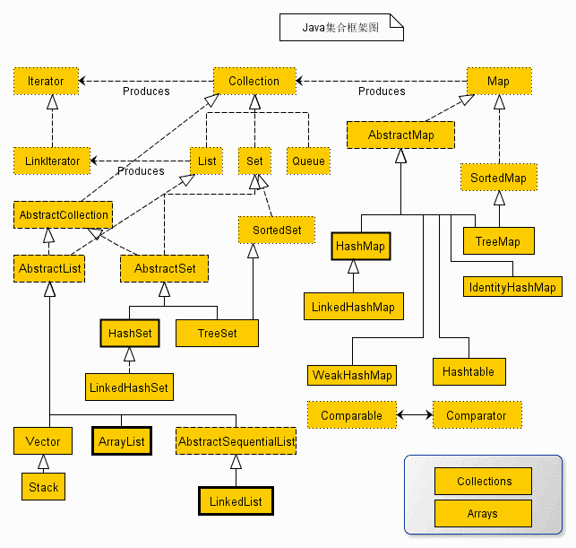
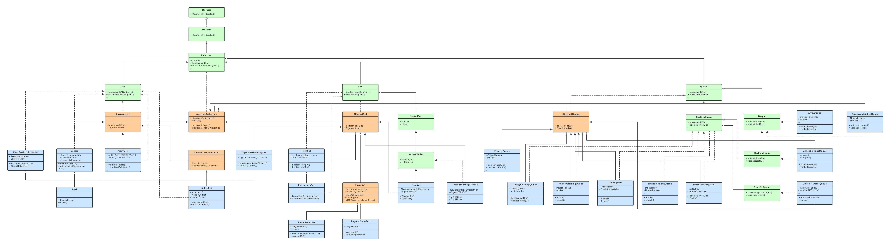
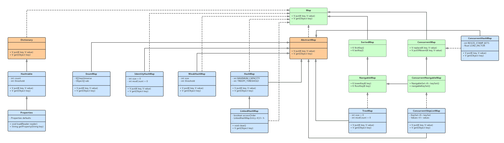
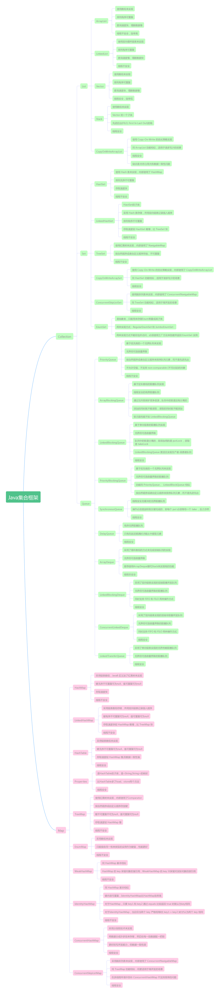

# 集合框架综述

## 一、集合简介

早在 Java 2 中之前，Java 就提供了特设类。比如：Dictionary、Vector、Stack 和 Properties 这些类用来存储和操作对象组。虽然这些类都非常有用，但是它们缺少一个核心的，统一的主题。由于这个原因，使用 Vector 类的方式和使用 Properties 类的方式有着很大不同。

集合框架被设计成要满足以下几个目标：

- 该框架必须是高性能的，基本集合（动态数组，链表，树，哈希表）的实现也必须是高效的。
- 该框架允许不同类型的集合，以类似的方式工作，具有高度的互操作性。
- 对一个集合的扩展和适应必须是简单的。

为此，整个集合框架就围绕一组标准接口而设计。

## 二、集合框架图

Java 集合框架图如下：

从上面的集合框架图可以看到，Java 集合框架主要包括两种类型的容器：

- **`集合(Collection)：`**存储一个`元素集合`。Collection 接口又有 3 种子类型，List、Set 和 Queue，再下面是一些抽象类，最后是具体实现类，常用的有 ArrayList、LinkedList、HashSet、LinkedHashSet、TreeSet 等。
- **`图(Map)：`**存储`键/值对`映射。Map 接口又有 3 种子类型，ConcurrentMap、ObservableMap、SortedMap，再下面是一些抽象类，最后是具体实现类，常用的有 HashMap、LinkedHashMap、TreeMap、Hashtable、Properties 等等。

集合框架是一个用来代表和操纵集合的统一架构。所有的集合框架都包含如下内容：

- **`接口：`**是代表集合的抽象数据类型。例如 Collection、List、Set、Map 等。之所以定义多个接口，是为了以不同的方式操作集合对象
- **`实现(类)：`**是集合接口的具体实现。从本质上讲，它们是可重复使用的数据结构，例如：ArrayList、LinkedList、HashSet、HashMap、LinkedHashMap。
- **`算法：`**是实现集合接口的对象里的方法执行的一些有用的计算，例如：搜索和排序。这些算法被称为多态，那是因为相同的方法可以在相似的接口上有着不同的实现。

除了集合，该框架也定义了几个 Map 接口和类。Map 里存储的是键/值对。尽管 Map 不是集合，但是它们完全整合在集合中。

## 三、集合关系图

Java Collection UML 类关系图如下：

Java Map UML 类关系图如下：

## 四、集合接口、类的关系

### 4.1 Collection

`Collection` 接口继承了 `Iterable` 接口，依赖了 `Predicate`、`Spliterator`、`Stream` 接口（这些均为 `Java8` 新增），`Iterable` 接口依赖了 `Iterator` 接口。

- `List` 接口继承自 `Collection` 接口，依赖了 `UnaryOperator` 接口(`Java8`新增)、`ListIterator`、`Comparator` 接口。
- `Set` 接口继承自 `Collection` 接口。
  - `AbstractSet` 抽象类继承了 `AbstractCollection` 抽象类，实现了 `Set` 接口。
    - `HashSet` 类继承了 `AbstractSet` 抽象类，实现了 `Set`、`Cloneable`、`Serializable` 接口，聚合了 `HashMap` 类。
      - `LinkedHashSet` 类继承了 `HashSet` 类，实现了 `Set`、`Cloneable`、`Serializable` 接口。
    - `TreeSet` 类继承了 `AbstractSet` 抽象类，实现了 `NavigableSet`、`Cloneable`、`Serializable` 接口，聚合了 `NavigableMap`，依赖了 `Comparator`、`SortedSet` 接口。
    - `EnumSet` 抽象类继承了 `AbstractSet` 抽象类，实现了 `Cloneable` 、`Serializable` 接口，依赖了 `Comparator` 、`SortedSet` 接口。
      - `RegularEnumSet`类继承了`EnumSet`抽象类。
      - `JumboEnumSet`类继承了`EnumSet`抽象类。
    - `CopyOnWriteArraySet` 类继承了 `AbstractSet` 抽象类，实现了 `Serializable` 接口，聚合了 `CopyOnWriteArrayList` 类，依赖了 `Predicate`、`Consumer` 接口。
    - `ConcurrentSkipListSet` 类继承了 `AbstractSet` 抽象类，实现了 `NavigableSet`、`Cloneable`、`Serializable` 接口。
  - `SortedSet` 接口继承自 `Set` 接口，依赖了 `Comparator` 接口。
    - `NavigableSet` 接口继承自 `SortedSet` 接口(`Java6`新增)。
- `Queue` 接口继承了 `Collection` 接口。
  - `Deque` 接口继承了 `Queue` 接口。
  - `BlockingQueue` 接口继承了 `Queue` 接口。
    - `BlockingDeque` 接口继承了 `BlockingQueue`、`Deque` 接口。
    - `TransferQueue` 接口继承了 `BlockingQueue` 接口。
- `AbstractCollection` 抽象类实现了 `Collection` 接口。
  - `AbstractList` 抽象类继承了 `AbstractCollection` 抽象类，实现了 `List` 接口，依赖了 `List`、`RandomAccess`、`Cloneable`、`Serializable` 接口。
    - `ArrayList` 类继承了 `AbstractList` 抽象类，实现了 `List`、`RandomAccess`、`Cloneable`、`Serializable` 接口。
    - `AbstractSequentialList` 抽象类继承了 `AbstractList` 抽象类。
    - `LinkedList` 类继承了 `AbstractSequentialList` 抽象类，实现了 `List`、`Deque`、`Cloneable`、`Serializable` 接口。
      - `CopyOnWriteArrayList` 实现了 `List`、`RandomAccess`、`Cloneable`、`Serializable` 接口。
      - `Vector` 类继承了 `AbstractList` 抽象类，实现了 `List`、`RandomAccess`、`Cloneable`、`Serializable` 接口。
    - `Stack` 类继承了 `Vector` 类。
  - `AbstractQueue` 抽象类继承了 `AbstractCollection` 接口，实现了 `Queue` 接口。
    - `SynchronousQueue` 类继承了 `AbstractQueue` 接口，实现了 `BlockingQueue`、`Serializable` 接口，依赖了 `Collection`、`Spliterator` 接口。
    - `ArrayBlockingQueue` 类继承了 `AbstractQueue` 接口，实现了 `BlockingQueue`、`Serializable` 接口。
    - `LinkedBlockingQueue` 类继承了 `AbstractQueue` 接口，实现了 `BlockingQueue`、`Serializable` 接口。
    - `PriorityBlockingQueue` 类继承了 `AbstractQueue` 接口，实现了 `BlockingQueue`、`Serializable` 接口，聚合了 `Comparator` 接口，依赖了 `Collection`、`Comparator`、`Comparable` 接口。
    - `DelayQueue`类继承了 `AbstractQueue` 接口，实现了 `BlockingQueue` 接口。
    - `LinkedBlockingDeque` 类继承了 `AbstractQueue` 接口，实现了 `BlockingDeque`、`Serializable` 接口。
    - `PriorityQueue` 类继承了`AbstractQueue`接口。
    - `LinkedTransferQueue` 类继承了 `AbstractQueue` 接口，实现了 `TransferQueue`、`Serializable` 接口(`Java7`新增)。
  - `ConcurrentLinkedDeque` 类继承了 `AbstractCollection` 抽象类，实现了 `Deque`、`Cloneable`、`Serializable` 接口。
  - `ArrayDeque` 类继承了 `AbstractCollection` 抽象类，实现了 `Deque`、`Serializable` 接口。

### 4.2 Map

`Map` 接口依赖了 `Set`、`Collection`、`BiConsumer`、`Function`、`BiFunction` 接口，`Map.Entry` 是 `Map` 中的内部接口。

- `AbstractMap` 抽象类实现了 `Map` 接口，聚合了 `Collection`、`Set` 接口。
  - `HashMap` 类继承了 `AbstractMap` 抽象类，实现了 `Map`、`Cloneable`、`Serializable` 接口，`Collection`、`Set` 接口。
    - `LinkedHashMap` 继承了 `HashMap` 类，实现了 `Map` 接口，依赖了 `Collection`、`Set`、`Consumer`、`BiConsumer` 接口。
  - `TreeMap` 类继承了 `AbstractMap` 抽象类，实现了 `NavigableMap`、`Cloneable`、`Serializable` 接口，依赖了 `Comparator`、`SortedMap`、`Collection`、`Set`、`BiConsumer`、`BiFunction` 接口。
  - `EnumMap` 类继承了 `AbstractMap` 抽象类，实现了 `Cloneable`、`Serializable` 接口，依赖了 `AbstractSet` 类，`Collection`、`Set` 接口。
  - `WeakHashMap` 类继承了`AbstractMap` 抽象类，实现了 `Map` 接口，依赖了 `Collection`、`Set`、`Consumer`、`BiConsumer`、`BiFunction` 接口。
  - `IdentityHashMap` 类继承了 `AbstractMap` 抽象类，实现了 `Map`、`Serializable`、`Cloneable` 接口，依赖了 `Collection`、`Set`、`Consumer`、`BiConsumer`、`BiFunction` 接口。
  - `ConcurrentHashMap` 类继承了 `AbstractMap` 抽象类，实现了 `ConcurrentMap`、`Serializable` 接口，依赖了 `Comparable`、`ParameterizedType`、`Collection`、`Set`、`Spliterator`、`Consumer`、`BiConsumer`、`Function`、`BiFunction`、`ToDoubleFunction`、`DoubleBinaryOperator` 等接口。
  - `ConcurrentSkipListMap` 类继承了 `AbstractMap` 抽象类，实现了 `ConcurrentNavigableMap`、`Cloneable`、`Serializable` 接口，聚合了 `Comparator` 接口，依赖了 `Collection`、`Set`、`Consumer`、`BiConsumer`、`BiFunction`、`NavigableSet` 接口。
- `SortedMap` 接口继承自 `Map` 接口，依赖了 `Set`、`Collection`、`Comparator` 接口。
  - `NavigableMap`接口继承了`SortedMap`接口，依赖了 `NavigableSet` 接口。
  - `ConcurrentNavigableMap` 接口继承了 `ConcurrentMap`、`NavigableMap` 接口，聚合了 `NavigableSet` 接口。
- `ConcurrentMap` 接口继承了 `Map` 接口，依赖了 `BiConsumer`、`BiFunction` 接口。
- `Hashtable` 类继承了 `Dictionary` 抽象类，实现了 `Map`、`Cloneable`、`Serializable` 接口，聚合了`Collection`、`Set` 接口，依赖了 `Enumeration`、`BiConsumer`、`BiFunction` 接口。
  - `Properties` 类继承了 `Hashtable` 类。

### 4.3 工具类

- `Collections` 是 `Collection` 的辅助工具类，依赖了上述大多数接口和类。
- `Arrays` 是数组的辅助工具类，依赖了上述一些接口和类

## 五、集合接口、类的功能

### 5.1 Collection

`Collection`：`Collection` 是最基本集合接口，它定义了一组允许重复的对象。`Collection` 接口派生了三个子接口 `List`、`Set`和`Queue`。`Collection` 所有实现类的遍历都可以使用 `Iterator` 接口或者是 `foreach` 来循环。

- `List` ：`List` 代表有序、可重复的集合。
  - `ArrayList`：底层使用数组的形式来实现，排列有序可重复，查询速度快、增删数据慢，线程不安全，效率高。`ArrayList` 创建时的大小为`0`；当加入第一个元素时，进行第一次扩容时，默认容量大小为`10`，每次扩容都以当前数组大小的1.5倍去扩容。
  - `Vector`：底层使用数组的形式来实现，排列有序可重复，查询速度快、增删数据慢，线程安全，效率低。`Vector` 创建时的默认大小为 `10`；`Vector` 每次扩容都以当前数组大小的 2 倍去扩容。当指定了`capacityIncrement` 之后，每次扩容仅在原先基础上增加 `capacityIncrement` 个单位空间。`ArrayList` 和 `Vector` 的 `add`、`get`、`size` 方法的复杂度都为 `O(1)`，`remove` 方法的复杂度为`O(n)`。
    - `Stack`：`Vector` 的一个子类，是标准的**先进后出**(FILO, First In Last Out)的栈。底层通过数组实现的，线程安全。
  - `LinkedList`：底层使用双向循环链表的数据结构来实现，排列有序可重复，查询速度慢、增删数据快，线程不安全。
  - `CopyOnWriteArrayList`：底层使用 `Copy-On-Write` 的优化策略实现，适用于**读多写少**的场景，同 `ArrayList` 功能相似，线程安全。`CopyOnWriteArrayList` 在某些情况下比 `Collections.synchronizedList(List list)` 有更好的性能。缺点是：内存占用大和数据一致性问题，只能保证最终一致性。
- `Set` ：`Set` 代表无序、不可重复的集合。
  - `HastSet`：底层使用 `Hash` 表来实现，内部使用了 `HashMap`，排列无序不可重复，存取速度快，线程不安全。
    - `LinkedHashSet`：底层采用`Hash`表存储，并用双向链表记录插入顺序，排列有序不可重复，存取速度较`HashSet`略慢，比`TreeSet`快，线程不安全。
  - `TreeSet`：底层使用红黑树来实现，内部使用了`NavigableMap`，按自然顺序或者自定义顺序存放、不可重复，线程不安全。
  - `CopyOnWriteArraySet`：底层使用`Copy-On-Write`的优化策略实现，适用于**读多写少**的场景，内部使用了`CopyOnWriteArrayList`，同`HastSet`功能相似，线程安全。
  - `ConcurrentSkipListSet`：底层使用**跳跃列表**来实现，适用于**高并发**的场景，内部使用了`ConcurrentNavigableMap`，同`TreeSet`功能相似，线程安全。
  - `EnumSet`：是抽象类，只能用来存储Enum常量或其子类，不能存储其它类型，`EnumSet`有两种实现方式，`RegularEnumSet`和`JumboEnumSet`，但是这两种实现方式是包**私有**的，不能在包外访问，因此必须使用工厂方法来创建并返回 `EnumSet` 实例，不能通过构造函数来创建。`EnumSet` 中提供了多种创建 `EnumSet` 实例的静态工厂方法，例如 `of` 方法（进行了函数重载），`copyOf`方法，`noneOf` 方法等。存储效率快，线程不安全。存储枚举常量时使用 `EnumSet` 而不要用 `HashSet`。
- `Queue`：`Queue` 是Java 5之后增加的集合体系，表示队列集合的相关实现，大多遵循先进先出(FIFO, First-In-First-Out)的模式。
  - `PriorityQueue`：即优先队列，底层基于**优先堆的一个无界队列**来实现，无界但可选容量界限。这个优先队列中的元素可以默认自然排序或者通过提供的`Comparator`（比较器）在队列实例化的时排序，而不是先进先出。不允许空值、不支持 `non-comparable`（不可比较）的对象，每次从队列中取出的是具有最高优先权的元素，线程不安全。
  - `ArrayBlockingQueue`：底层基于**定长数组**的阻塞队列实现，即是线程安全的有界阻塞队列。`ArrayBlockingQueue`内部通过**互斥锁**保护竞争资源，实现了多线程对竞争资源的互斥访问。队列中的锁是没有分离的，所以在添加的同时就不能读取，读取的同时就不能添加，所以锁方面性能不如 `LinkedBlockingQueue`。
  - `LinkedBlockingQueue`：即链接队列，底层基于**单向链表**的阻塞队列实现，无界但可选容量界限，线程安全。队列中的锁是分离的，即添加用的是 `putLock`，获取是 `takeLock`，所以在添加获取方面理论上性能会高于 `ArrayBlockingQueue`。所以 `LinkedBlockingQueue` 更适合实现生产者-消费者队列。
  - `PriorityBlockingQueue`：即优先阻塞队列，底层基于**优先堆的一个无界队列**来实现，无界但可选容量界限的阻塞队列，线程安全，功能同 `PriorityQueue`、`LinkedBlockQueue` 相似。其所含对象的排序不是先进先出，而是依据对象的自然排序顺序或者是构造函数的 `Comparator` 决定的顺序。
  - `SynchronousQueue`：即同步队列，是一种线程安全无缓冲的无界阻塞队列。其操作必须是放和取交替完成的，即每个 `put` 必须等待一个 `take`，反之亦然。
  - `DelayQueue`：即延迟队列，是一种有序无界阻塞队列，只有在延迟期满时才能从中提取元素，线程安全。
  - `ArrayDeque`：底层采用了循环数组的方式来完成双端队列的实现，无限扩展且可选容量。Java 已不推荐使用 `Stack`，而是推荐使用更高效的 `ArrayDeque` 来实现栈的功能，非线程安全。
  - `LinkedBlockingDeque`：底层采用了**双向链表**实现的**双端阻塞并发**队列，无限扩展且可选容量。该阻塞队列同时支持 `FIFO` 和 `FILO` 两种操作方式，即可以从队列的头和尾同时操作(插入/删除)，且线程安全。
  - `ConcurrentLinkedDeque`：底层采用了**双向链表**实现的**双端非阻塞并发**队列，无限扩展且可选容量。该队列同时支持 `FIFO` 和 `FILO` 两种操作方式，即可以从队列的头和尾同时操作(插入/删除)，且线程安全。
  - `LinkedTransferQueue`：底层采用了**单向链表**实现的**无界传输阻塞**队列，先进先出，无限扩展且可选容量线程安全。

### 5.2 Map

`Map`：`Map` 代表具有映射关系的集合。

- `HashMap`：底层是用链表数组，Java8后又加了红黑树来实现，键无序不可重复可为 null、值可重复可为 null，存取速度快，线程不安全。
  - `LinkedHashMap`：底层是用**链表数组**存储，并用双向链表记录插入顺序，键有序不可重复可为 null、值可重复可为 null，存取速度快较 `HashMap` 略慢，比 `TreeMap` 快，线程不安全。
- `HashTable`：底层是用链表数组，键无序不可重复可为 null、值可重复可为 null，存取速度较  `HashMap`慢，线程安全。
  - `Properties`：是 `HashTable` 的子类，是 <String,String> 的映射，比 `HashTable` 多了 `load`、`store` 两个方法，线程安全。
- `TreeMap`：底层使用红黑树来实现，内部使用了 `Comparator`，按自然顺序或自定义顺序存放键，键不可重复不可为 null、值可重复可为 null，存取速度较 `HashMap` 慢，线程不安全。
- `EnumMap`：底层使用数组来实现，是专门为枚举类型量身定做的 Map，性能更好。只能接收同一枚举类型的实例作为键值，并且由于枚举类型实例的数量相对固定并且有限，所以 `EnumMap` 使用数组来存放与枚举类型对应的值，线程不安全。
- `WeakHashMap`：同 `HashMap` 基本相似。区别在于，`HashMap` 的 `key` 保留对象的强引用，这意味着只要该 `HashMap` 对象不被销毁，该 `HashMap` 对象所有 key 所引用的对象不会被垃圾回收，`HashMap` 也不会自动删除这些 `key` 所对应的 `key-value` 对象；但 `WeakHashMap` 的 `key` 只保留对实际对象的弱引用，这意味着当垃圾回收了该 `key` 所对应的实际对象后，`WeakHashMap` 会自动删除该 `key` 对应的 `key-value` 对象。
- `IdentityHashMap`：同 `HashMap` 基本相似。区别在于，在处理两个 `key` 相等时，对于普通 `HashMap` 而言，只要 `key1` 和 `key2` 通过 `equals` 比较返回 `true` 时就认为 key 相同；在 `IdentityHashMap` 中，当且仅当两个 `key` 严格相等时(`key1 = key2`)时才认为两个 `key` 相同。
- `ConcurrentHashMap`：底层使用**锁分段**技术来实现线程安全，首先将数据分成一段一段的存储，然后给每一段数据配一把锁，当一个线程占用锁访问其中一个段数据的时候，其他段的数据也能被其他线程访问。`ConcurrentHashMap` 是由 `Segment` 数组结构和 `HashEntry` 数组结构组成。`Segment` 是一种可重入锁 `ReentrantLock`，在 `ConcurrentHashMap` 里扮演锁的角色，`HashEntry` 则用于存储键值对数据。一个 `ConcurrentHashMap` 里包含一个 `Segment` 数组，`Segment` 的结构和 `HashMap` 类似，是一种数组和链表结构， 一个 `Segment` 里包含一个 `HashEntry` 数组，每个 `HashEntry` 是一个链表结构的元素， 每个 `Segment` 守护者一个 `HashEntry` 数组里的元素，当对 `HashEntry` 数组的数据进行修改时，必须首先获得它对应的 `Segment` 锁。
- `ConcurrentSkipListMap`：底层使用**跳跃列表**来实现，适用于**高并发**的场景，内部使用了 `ConcurrentNavigableMap`，同 `TreeMap` 功能相似，是一个并发的、可排序的 Map，线程安全。因此它可以在多线程环境中弥补 `ConcurrentHashMap` 不支持排序的问题。

### 5.3 思维导图

Java 集合框架功能介绍思维导图如下：

## 六、集合接口、类的方法

### 6.1 Collection 接口中的抽象方法

| 方法                                                    | 描述                                                         |
| :------------------------------------------------------ | :----------------------------------------------------------- |
| `int size()`                                            | 返回集合的大小                                               |
| `boolean isEmpty()`                                     | 返回集合是否为空的布尔值                                     |
| `boolean contains(Object o)`                            | 返回集合是否包含元素 `o` 的布尔值                            |
| `Iterator<E> iterator()`                                | 返回该集合中元素的迭代器，继承自 `Iterable` 接口             |
| `Object[] toArray()`                                    | 返回一个包含此集合中所有元素的数组                           |
| `<T> T[] toArray(T[] a)`                                | 返回一个包含此集合中所有元素的数组，返回类型由传入数组参数的类型决定 |
| `boolean add(E e)`                                      | 返回向集合中插入元素 `e` 是否成功的布尔值                    |
| `boolean remove(Object o)`                              | 返回从集合中删除元素 `o` 是否成功的布尔值                    |
| `boolean containsAll(Collection<?> c)`                  | 返回本集合中是否完全包含集合 `c` 的布尔值，即判断集合 `c` 是否是本集合子集 |
| `boolean addAll(Collection<? extends E> c)`             | 将集合 `c` 中的所有元素添加到本集合中并返回                  |
| `boolean removeAll(Collection<?> c)`                    | 移除本集合中所有包含集合 `c` 的所有元素                      |
| `default boolean removeIf(Predicate<? super E> filter)` | Java8 新增的接口默认方法。将会批量删除符合 filter 条件的所有元素，该方法需要一个 Predicate 对象作为作为参数，Predicate 也是函数式接口，因此可使用 Lambda 表达式作为参数 |
| `boolean retainAll(Collection<?> c)`                    | 返回本集合和集合 `c` 中相同的元素并存到本集合中，集合 `c` 保持不变，返回值表示的是本集合是否发生过改变。即该方法是用来求两个集合的交集，交集的结果存到本集合中，如果本集合没发生变化则返回 `true` |
| `void clear()`                                          | 清空本集合中的所有元素                                       |
| `boolean equals(Object o)`                              | 返回本集合是否和对象 `o` 相等的布尔值                        |
| `int hashCode()`                                        | 返回此集合的 `Hash` 码值                                     |
| `default Spliterator<E> spliterator()`                  | 在集合中创建 `Spliterator` 对象                              |
| `default Stream<E> stream()`                            | 返回一个顺序的 `Stream` 对象。Java8 引入了 Stream 以实现对集合更方便地进行函数式编程。 |
| `default Stream<E> parallelStream()`                    | 返回一个可能并行的 `Stream` 对象。Java8 新增的方法。流可以是顺序的也可以是并行的。顺序流的操作是在单线程上执行的，而并行流的操作是在多线程上并发执行的。 |

### 6.2 List 接口中的额外抽象方法

| 方法                                                   | 描述                                                         |
| :----------------------------------------------------- | :----------------------------------------------------------- |
| `boolean addAll(int index, Collection<? extends E> c)` | 将指定集合 `c` 中的所有元素插入到指定索引位置处              |
| `default void replaceAll(UnaryOperator<E> operator)`   | Java8 新增的使用 `Lambda` 的方式，通过应用 `UnaryOperator` 获得的结果来替换列表中的每个元素 |
| `default void sort(Comparator<? super E> c)`           | 在比较器的基础上将本列表排序                                 |
| `E get(int index)`                                     | 获取本集合中指定索引位置处的元素                             |
| `E set(int index, E element)`                          | 设置或替换本集合中指定索引位置处的元素                       |
| `void add(int index, E element)`                       | 在本集合中的指定索引位置处插入指定的元素                     |
| `E remove(int index)`                                  | 移除本集合中指定索引位置处的元素                             |
| `int indexOf(Object o)`                                | 返回指定元素第一次出现的索引位置                             |
| `int lastIndexOf(Object o)`                            | 返回指定元素最后出现的索引位置                               |
| `ListIterator<E> listIterator()`                       | 返回本集合中的 `ListIterator` 迭代器                         |
| `ListIterator<E> listIterator(int index)`              | 返回本集合中从指定索引位置开始的 `ListIterator` 迭代器       |
| `List<E> subList(int fromIndex, int toIndex)`          | 返回指定开始和结束索引位置的子集合                           |

### 6.3 Set 接口中的额外抽象方法

Set 除了继承自 Collection 的方法之外，没有额外抽象方法。

### 6.4 Map 接口中的抽象方法

| 方法                                                         | 描述                                                         |
| :----------------------------------------------------------- | :----------------------------------------------------------- |
| `boolean containsKey`                                        | 判断本 Map 集合中是否包含指定的 key 键                       |
| `boolean containsValue`                                      | 判断本 Map 集合中是否包含指定的 value 值                     |
| `V get(Object key)`                                          | 根据 key 获取本 Map 集合中的 value 值                        |
| `V put(K key, V value)`                                      | 向本 Map 集合中存放 key 键和 value 值，返回 value 值         |
| `V remove(Object key)`                                       | 根据 key 删除本 Map 集合中的 key 和 value 值，并返回删除的 value值 |
| `void putAll(Map<? extends K, ? extends V> m)`               | 将指定的 Map 集合添加到本的 Map 集合当中                     |
| `Set<K> keySet()`                                            | 获取本 Map 集合中的所有 key 值，并以 Set 接口的结果作为返回  |
| `Collection<V> values()`                                     | 获取本 Map 集合中的所有 value 值，并以 Collection 接口的结果作为返回 |
| `Set<Map.Entry<K, V>> entrySet()`                            | 获取本 Map 集合中的所有 key 和 value 值，并以 `Set<Map.Entry<K, V>>` 的结果作为返回 |
| `default V getOrDefault(Object key, V defaultValue)`         | 根据 key 获取本 Map 集合中的 value 值，如果没找到对应的值或者 value 值是 null，则返回 `defaultValue` 的值 |
| `default void forEach(BiConsumer<? super K, ? super V> action)` | Java8 新增的使用 `Lambda` 的方式遍历操作 Map 中的元素的默认接口方法 |
| `default void replaceAll(BiFunction<? super K, ? super V, ? extends V> function)` | Java8 新增的使用 `Lambda`的方式遍历替换 Map 中的元素的默认接口方法 |
| `default V putIfAbsent(K key, V value)`                      | Java8 新增的不用写是否为 null 值的检测语句向 Map 中保存 key 和 value 的元素的默认接口方法，即如果通过 key 获取到的 value 是空的，则在调用 `put(key, value)` 方法并返回 value 值 |
| `default boolean remove(Object key, Object value)`           | Java8 新增的默认接口方法，删除给定 key 所对应的元素，如果 value 不存在、为 null 或者与参数中的 value 不等，则不能删除。即删除操作需要满足给定的值需要和 map 中的值相等的条件 |
| `default boolean replace(K key, V oldValue, V newValue)`     | Java8 新增的默认接口方法，替换给定 key 所对应的元素，如果 value 不存在、为 null 或者与参数中的 oldValue 不等，则不能替换。即替换操作需要满足给定的值需要和 map 中的值相等的条件 |
| `default V replace(K key, V value)`                          | Java8 新增的默认接口方法，替换给定 key 所对应的元素，如果 value 不为 null，则 value 值与参数中的 value 值做替换 |
| `default V computeIfAbsent(K key, Function<? super K, ? extends V> mappingFunction)` | Java8 新增的默认接口方法，根据key获取到的 value 如果不为 null，则直接返回 value 值，否则将 `Lambda` 表达式中的结果值存放到 Map 中 |
| `default V computeIfPresent(K key, BiFunction<? super K, ? super V, ? extends V> remappingFunction)` | Java8 新增的默认接口方法，根据 key获取到的 value 和新计算的值如果不为 null，则直接新计算的值，否则移除该 key，且返回 null |
| `default V compute(K key, BiFunction<? super K, ? super V, ? extends V> remappingFunction)` | Java8 新增的默认接口方法，将 `Lambda` 表达式中的结果值存放到Map中，如果计算的新值为 null 则返回 null，且移除以前有的 key 和 value 值 |
| `default V merge(K key, V value, BiFunction<? super V, ? super V, ? extends V> remappingFunction)` | Java8 新增的默认接口方法，将新计算的值覆盖 Map 中原 key 对应的 value 值 |

### 6.5 SortedSet接口中的额外抽象方法

| 方法                                              | 描述                                                     |
| :------------------------------------------------ | :------------------------------------------------------- |
| `Comparator<? super E> comparator()`              | 返回本 SortedSet 集合中的 `Comparator` 比较器            |
| `SortedSet<E> subSet(E fromElement, E toElement)` | 获取开始元素和结束元素之间的子 SortedSet 集合            |
| `SortedSet<E> headSet(E toElement)`               | 获取开始元素和 `toElement` 元素之间的子 SortedSet 集合   |
| `SortedSet<E> tailSet(E fromElement)`             | 获取 `fromElement` 元素和结束元素之间的子 SortedSet 集合 |
| `E first()`                                       | 获取本 SortedSet 集合中的第一个元素                      |
| `E last()`                                        | 获取本 SortedSet 集合中的最后一个元素                    |

### 6.6 SortedMap接口中的额外抽象方法

| 方法                                        | 描述                                                 |
| :------------------------------------------ | :--------------------------------------------------- |
| `Comparator<? super K> comparator()`        | 返回本 SortedMap 集合中的 `Comparator` 比较器        |
| `SortedMap<K,V> subMap(K fromKey, K toKey)` | 获取开始 key 和结束 key 之间的子 SortedMap 集合      |
| `SortedMap<K,V> headMap(K toKey)`           | 获取开始 key 和 `toKey` 元素之间的子 SortedMap 集合  |
| `SortedMap<K,V> tailMap(K fromKey)`         | 获取 `fromKey` 元素和结束key之间的子 SortedMap 集合  |
| `K firstKey()`                              | 获取本 SortedMap 集合中的第一个 key                  |
| `K lastKey()`                               | 获取本 SortedMap 集合中的最后一个 key                |
| `Set<K> keySet()`                           | 获取本 SortedMap 集合中所有 key 的 Set 集合          |
| `Collection<V> values()`                    | 获取本 SortedMap 集合中所有 value 的 Collection 集合 |
| `Set<Map.Entry<K, V>> entrySet()`           | 获取本 SortedMap 集合中所有 key 和 value 的 Map 集合 |

