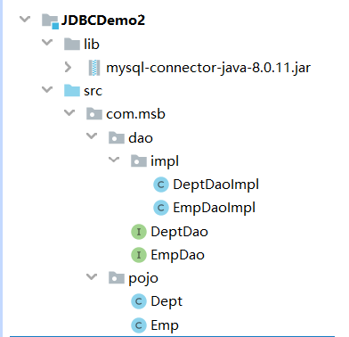
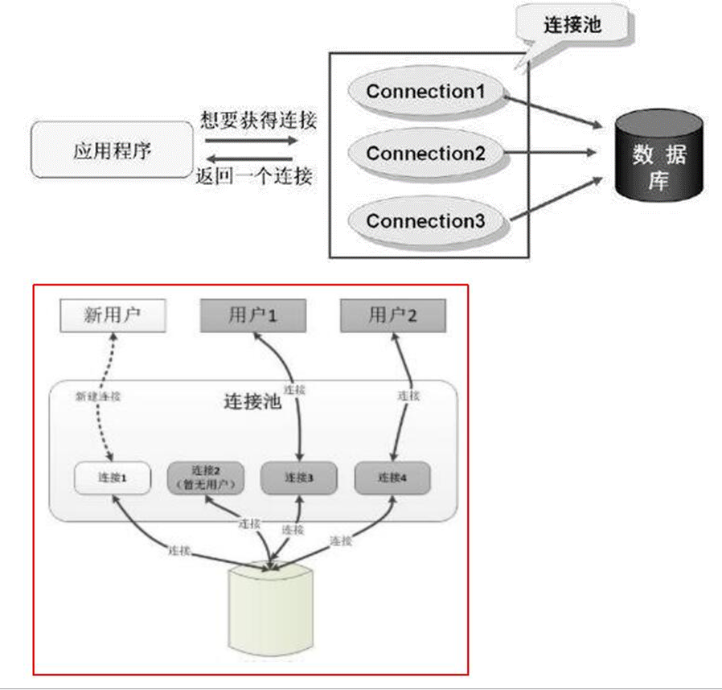
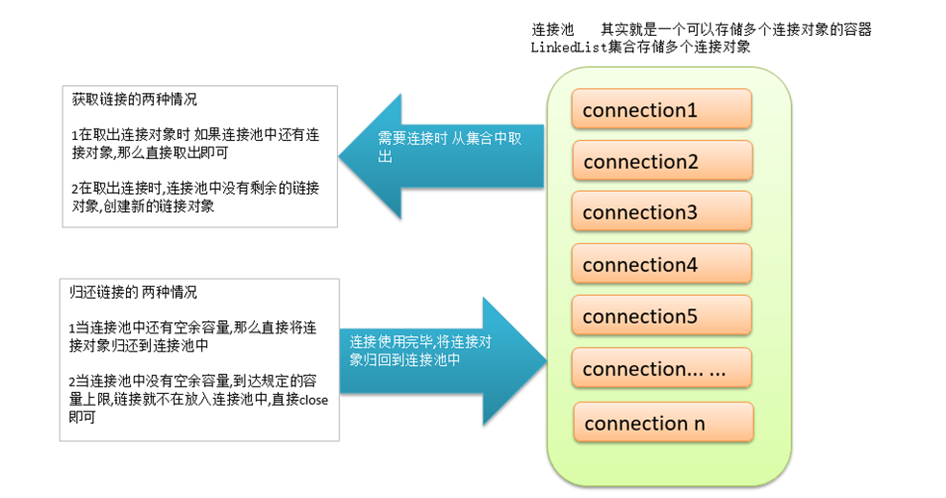

# DAO模式

## 1. 基本概念

DAO(Data Access Object)是一个数据访问接口，数据访问：顾名思义就是与数据库打交道。夹在业务逻辑与数据库资源中间。

在核心J2EE模式中是这样介绍DAO模式的：为了建立一个健壮的J2EE应用，应该将所有对数据源的访问操作抽象封装在一个公共API中。用程序设计的语言来说，就是建立一个接口，接口中定义了此应用程序中将会用到的所有事务方法。在这个应用程序中，当需要和数据源进行交互的时候则使用这个接口，并且编写一个单独的类来实现这个接口在逻辑上对应这个特定的数据存储.

简单来说,就是定义一个接口,规定一些增删改查的方法,然后交给实现类去实现, 它介于数据库和业务逻辑代码之间,这样当我们需要操作数据库是,根据接口定义的API去操作数据库就可以了,每个方法都是一个原子性的操作,例如：增加、修改、删除等

### 1.1 Dao模式要求

Dao模式要求项目必须具备这样几个结构

#### 1.1.1 实体类

和数据库表格一一对应的类,单独放入一个包中,包名往往是 `pojo/entity/bean` ,要操作的每个表格都应该有对应的实体类

`emp > class Emp`   

`dept > class Dept` 

`account > class Account` 

#### 1.1.2 DAO 层

定义了对数据要执行那些操作的接口和实现类,包名往往是` dao/mapper` ,要操作的每个表格都应该有对应的接口和实现类

`emp > interface EmpDao >EmpDaoImpl` 

`dept > interface DeptDao> DeptDaoImpl` 

> Mybatis/Spring JDBCTemplate 中,对DAO层代码进行了封装,代码编写方式会有其他变化

## 2. 项目搭建

1.创建项目

2.添加jar包

3.创建包

4.创建实体类Emp

5.创建后台的接口EmpDao和实现类EmpDaoImpl

导入各个层级的接口和页面之后的项目

### 2.1 项目结构截图如下



### 2.2 实体类代码

```java
/*
* 实体类:
* 和数据库表格名称和字段是一一对应的类
* 该类的对象主要用处是存储从数据库中查询出来的数据
* 除此之外,该类没有任何的其他功能
* 要求
* 1类名和表名保持一致  (见名知意)
* 2属性个数和数据库的表的列数保持一致
* 3属性的数据类型和列的数据类型保持一致
* 4属性名和数据库表格的列名要保持一致
* 5所有的属性必须都是私有的 (出于安全考虑)
* 6实体类的属性推荐写成包装类
* 7日期类型推荐写成java.util.Date
* 8所有的属性都要有get和set方法
* 9必须具备空参构造方法
* 10实体类应当实现序列化接口 (mybatis缓存  分布式需要 )
* 11实体类中其他构造方法可选
* */
public class Emp implements Serializable {
    private Integer empno;
    private String ename;
    private String job;
    private Integer mgr;
    private Date hiredate;
    private Double sal;
    private Double comm;
    private Integer deptno;
```


```java
public class Dept implements Serializable {
    private Integer deptno;
    private String dname;
    private String loc;
```

### 2.3 DAO接口代码

```java
public interface EmpDao {
    /**
     * 向数据库Emp表中增加一条数据的方法
     * @param emp 要增加的数据封装成的Emp类的对象
     * @return 增加成功返回大于0 的整数,增加失败返回0
     */
    int addEmp(Emp emp);
    /**
     * 根据员工编号删除员工信息的方法
     * @param empno 要删除的员工编号
     * @return 删除成功返回大于0的整数,失败返回0
     */
    int deleteByEmpno(int empno);
}
```

### 2.4 DAO实现类代码

```java
public class EmpDaoImpl implements EmpDao {
    private static String driver ="com.mysql.cj.jdbc.Driver";
    private static String url="jdbc:mysql://127.0.0.1:3306/mydb?useSSL=false&useUnicode=true&characterEncoding=UTF-8&serverTimezone=Asia/Shanghai&allowPublicKeyRetrieval=true";
    private static String user="root";
    private static String password="root";
    @Override
    public int addEmp(Emp emp) {
        // 向 Emp表中增加一条数据
        Connection connection = null;
        PreparedStatement preparedStatement=null;
        int rows=0;
        try{
            Class.forName(driver);
            connection = DriverManager.getConnection(url, user,password);
            String sql="insert into emp values(DEFAULT ,?,?,?,?,?,?,?)";
            preparedStatement = connection.prepareStatement(sql);//这里已经传入SQL语句
            //设置参数
            preparedStatement.setObject(1,emp.getEname());
            preparedStatement.setObject(2,emp.getJob() );
            preparedStatement.setObject(3,emp.getMgr());
            preparedStatement.setObject(4,emp.getHiredate());
            preparedStatement.setObject(5,emp.getSal());
            preparedStatement.setObject(6,emp.getComm());
            preparedStatement.setObject(7,emp.getDeptno());
            //执行CURD
            rows =preparedStatement.executeUpdate();// 这里不需要再传入SQL语句
        }catch (Exception e){
            e.printStackTrace();
        }finally {
            if(null != preparedStatement){
                try {
                    preparedStatement.close();
                } catch (SQLException e) {
                    e.printStackTrace();
                }
            }
            if(null != connection){
                try {
                    connection.close();
                } catch (SQLException e) {
                    e.printStackTrace();
                }
            }
        }
        return rows;
    }
    @Override
    public int deleteByEmpno(int empno) {
        // 向 Emp表中增加一条数据
        Connection connection = null;
        PreparedStatement preparedStatement=null;
        int rows=0;
        try{
            Class.forName(driver);
            connection = DriverManager.getConnection(url, user,password);
            String sql="delete from emp where empno =?";
            preparedStatement = connection.prepareStatement(sql);//这里已经传入SQL语句
            //设置参数
            preparedStatement.setObject(1,empno);
            //执行CURD
            rows =preparedStatement.executeUpdate();// 这里不需要再传入SQL语句
        }catch (Exception e){
            e.printStackTrace();
        }finally {
            if(null != preparedStatement){
                try {
                    preparedStatement.close();
                } catch (SQLException e) {
                    e.printStackTrace();
                }
            }
            if(null != connection){
                try {
                    connection.close();
                } catch (SQLException e) {
                    e.printStackTrace();
                }
            }
        }
        return rows;
    }
}
```

## 3. 案例

### 3.1 员工管理系统开发

### 3.1.1 DAO接口

```java
public interface EmpDao {
    /**
     * 向数据库Emp表中增加一条数据的方法
     * @param emp 要增加的数据封装成的Emp类的对象
     * @return 增加成功返回大于0 的整数,增加失败返回0
     */
    int addEmp(Emp emp);
    /**
     * 根据员工编号删除员工信息的方法
     * @param empno 要删除的员工编号
     * @return 删除成功返回大于0的整数,失败返回0
     */
    int deleteByEmpno(int empno);
    /**
     * 查看数据库表格中所有的员工信息
     * @return 所有员工信息封装的一个List<Emp>集合
     */
    List<Emp> findAll();
    /**
     * 根据员工编号修改员工其他所有字段的方法
     * @param emp 员工编号和其他7个字段封装的一个Emp类对象
     * @return 修改成功返回大于0的整数,失败返回0
     */
    int updateEmp(Emp emp);
}
```

```java
public interface DeptDao {
    /**
     * 查询全部门的方法
     * @return Dept对象封装的List集合
     */
    List<Dept> findAll();
    int addDept(Dept dept);
}
```


### 3.1.2 DAO实现类

```java
public class EmpDaoImpl implements EmpDao {
    private static String driver ="com.mysql.cj.jdbc.Driver";
    private static String url="jdbc:mysql://127.0.0.1:3306/mydb?useSSL=false&useUnicode=true&characterEncoding=UTF-8&serverTimezone=Asia/Shanghai&allowPublicKeyRetrieval=true";
    private static String user="root";
    private static String password="root";
    @Override
    public int addEmp(Emp emp) {
        // 向 Emp表中增加一条数据
        Connection connection = null;
        PreparedStatement preparedStatement=null;
        int rows=0;
        try{
            Class.forName(driver);
            connection = DriverManager.getConnection(url, user,password);
            String sql="insert into emp values(DEFAULT ,?,?,?,?,?,?,?)";
            preparedStatement = connection.prepareStatement(sql);//这里已经传入SQL语句
            //设置参数
            preparedStatement.setObject(1,emp.getEname());
            preparedStatement.setObject(2,emp.getJob() );
            preparedStatement.setObject(3,emp.getMgr());
            preparedStatement.setObject(4,emp.getHiredate());
            preparedStatement.setObject(5,emp.getSal());
            preparedStatement.setObject(6,emp.getComm());
            preparedStatement.setObject(7,emp.getDeptno());
            //执行CURD
            rows =preparedStatement.executeUpdate();// 这里不需要再传入SQL语句
        }catch (Exception e){
            e.printStackTrace();
        }finally {
            if(null != preparedStatement){
                try {
                    preparedStatement.close();
                } catch (SQLException e) {
                    e.printStackTrace();
                }
            }
            if(null != connection){
                try {
                    connection.close();
                } catch (SQLException e) {
                    e.printStackTrace();
                }
            }
        }
        return rows;
    }
    @Override
    public int deleteByEmpno(int empno) {
        // 向 Emp表中增加一条数据
        Connection connection = null;
        PreparedStatement preparedStatement=null;
        int rows=0;
        try{
            Class.forName(driver);
            connection = DriverManager.getConnection(url, user,password);
            String sql="delete from emp where empno =?";
            preparedStatement = connection.prepareStatement(sql);//这里已经传入SQL语句
            //设置参数
            preparedStatement.setObject(1,empno);
            //执行CURD
            rows =preparedStatement.executeUpdate();// 这里不需要再传入SQL语句
        }catch (Exception e){
            e.printStackTrace();
        }finally {
            if(null != preparedStatement){
                try {
                    preparedStatement.close();
                } catch (SQLException e) {
                    e.printStackTrace();
                }
            }
            if(null != connection){
                try {
                    connection.close();
                } catch (SQLException e) {
                    e.printStackTrace();
                }
            }
        }
        return rows;
    }
    @Override
    public List<Emp> findAll() {
        // 查询名字中包含字母A的员工信息
        Connection connection = null;
        PreparedStatement preparedStatement=null;
        ResultSet resultSet=null;
        List<Emp> list =null;
        try{
            Class.forName(driver);
            connection = DriverManager.getConnection(url, user,password);
            String sql="select * from emp";
            preparedStatement = connection.prepareStatement(sql);//这里已经传入SQL语句
            //执行CURD
            resultSet = preparedStatement.executeQuery();// 这里不需要再传入SQL语句
            list=new ArrayList<Emp>() ;
            while(resultSet.next()){
                int empno = resultSet.getInt("empno");
                String ename = resultSet.getString("ename");
                String job = resultSet.getString("job");
                int mgr = resultSet.getInt("mgr");
                Date hiredate = resultSet.getDate("hiredate");
                double sal= resultSet.getDouble("sal");
                double comm= resultSet.getDouble("comm");
                int deptno= resultSet.getInt("deptno");
                Emp emp =new Emp(empno, ename, job, mgr, hiredate, sal, comm, deptno);
                list.add(emp);
            }
        }catch (Exception e){
            e.printStackTrace();
        }finally {
            if(null != resultSet){
                try {
                    resultSet.close();
                } catch (SQLException e) {
                    e.printStackTrace();
                }
            }
            if(null != preparedStatement){
                try {
                    preparedStatement.close();
                } catch (SQLException e) {
                    e.printStackTrace();
                }
            }
            if(null != connection){
                try {
                    connection.close();
                } catch (SQLException e) {
                    e.printStackTrace();
                }
            }
        }
        return list;
    }
    @Override
    public int updateEmp(Emp emp) {
        // 向 Emp表中增加一条数据
        Connection connection = null;
        PreparedStatement preparedStatement=null;
        int rows=0;
        try{
            Class.forName(driver);
            connection = DriverManager.getConnection(url, user,password);
            String sql="update emp set ename =? ,job=?, mgr =?,hiredate =?,sal=?,comm=?,deptno=? where empno =?";
            preparedStatement = connection.prepareStatement(sql);//这里已经传入SQL语句
            //设置参数
            preparedStatement.setObject(1,emp.getEname());
            preparedStatement.setObject(2,emp.getJob() );
            preparedStatement.setObject(3,emp.getMgr());
            preparedStatement.setObject(4,emp.getHiredate());
            preparedStatement.setObject(5,emp.getSal());
            preparedStatement.setObject(6,emp.getComm());
            preparedStatement.setObject(7,emp.getDeptno());
            preparedStatement.setObject(8,emp.getEmpno());
            //执行CURD
            rows =preparedStatement.executeUpdate();// 这里不需要再传入SQL语句
        }catch (Exception e){
            e.printStackTrace();
        }finally {
            if(null != preparedStatement){
                try {
                    preparedStatement.close();
                } catch (SQLException e) {
                    e.printStackTrace();
                }
            }
            if(null != connection){
                try {
                    connection.close();
                } catch (SQLException e) {
                    e.printStackTrace();
                }
            }
        }
        return rows;
    }
}
```

```java
public class DeptDaoImpl implements DeptDao {
    private static String driver ="com.mysql.cj.jdbc.Driver";
    private static String url="jdbc:mysql://127.0.0.1:3306/mydb?useSSL=false&useUnicode=true&characterEncoding=UTF-8&serverTimezone=Asia/Shanghai&allowPublicKeyRetrieval=true";
    private static String user="root";
    private static String password="root";
    @Override
    public List<Dept> findAll() {
        // 查询名字中包含字母A的员工信息
        Connection connection = null;
        PreparedStatement preparedStatement=null;
        ResultSet resultSet=null;
        List<Dept> list =null;
        try{
            Class.forName(driver);
            connection = DriverManager.getConnection(url, user,password);
            String sql="select * from dept";
            preparedStatement = connection.prepareStatement(sql);//这里已经传入SQL语句
            //执行CURD
            resultSet = preparedStatement.executeQuery();// 这里不需要再传入SQL语句
            list=new ArrayList<Dept>() ;
            while(resultSet.next()){
                int deptno = resultSet.getInt("deptno");
                String dname = resultSet.getString("dname");
                String loc = resultSet.getString("loc");
                Dept dept =new Dept(deptno,dname,loc);
                list.add(dept);
            }
        }catch (Exception e){
            e.printStackTrace();
        }finally {
            if(null != resultSet){
                try {
                    resultSet.close();
                } catch (SQLException e) {
                    e.printStackTrace();
                }
            }
            if(null != preparedStatement){
                try {
                    preparedStatement.close();
                } catch (SQLException e) {
                    e.printStackTrace();
                }
            }
            if(null != connection){
                try {
                    connection.close();
                } catch (SQLException e) {
                    e.printStackTrace();
                }
            }
        }
        return list;
    }
    @Override
    public int addDept(Dept dept) {
        // 向 Emp表中增加一条数据
        Connection connection = null;
        PreparedStatement preparedStatement=null;
        int rows=0;
        try{
            Class.forName(driver);
            connection = DriverManager.getConnection(url, user,password);
            String sql="insert into dept values(?,?,?)";
            preparedStatement = connection.prepareStatement(sql);//这里已经传入SQL语句
            //设置参数
            preparedStatement.setObject(1,dept.getDeptno());
            preparedStatement.setObject(2,dept.getDname());
            preparedStatement.setObject(3,dept.getLoc() );
            //执行CURD
            rows =preparedStatement.executeUpdate();// 这里不需要再传入SQL语句
        }catch (Exception e){
            e.printStackTrace();
        }finally {
            if(null != preparedStatement){
                try {
                    preparedStatement.close();
                } catch (SQLException e) {
                    e.printStackTrace();
                }
            }
            if(null != connection){
                try {
                    connection.close();
                } catch (SQLException e) {
                    e.printStackTrace();
                }
            }
        }
        return rows;
    }
}
```


### 3.1.3 EmpManageSystem类

```java
public class EmpManageSystem {
    private static Scanner sc =new Scanner(System.in);
    private static EmpDao empDao =new EmpDaoImpl();
    private static DeptDao deptDao=new DeptDaoImpl();
    private static SimpleDateFormat simpleDateFormat=new SimpleDateFormat("yyyy-MM-dd");;
    public static void main(String[] args) {
        while(true){
            showMenu();
            System.out.println("请录入选项");
            int option  =sc.nextInt();
            switch (option){
                case 1:
                    case1();
                    break;
                case 2:
                    case2();
                    break;
                case 3:
                    case3();
                    break;
                case 4:
                    case4();
                    break;
                case 5:
                    case5();
                    break;
                case 6:
                    case6();
                    break;
                case 7: break;
                default:
                    System.out.println("请正确输入选项");
            }
        }
    }
    private static void case1(){
        List<Emp> emps = empDao.findAll();
        emps.forEach(System.out::println);
    }
    private static void case2(){
        List<Dept> depts = deptDao.findAll();
        depts.forEach(System.out::println);
    }
    private static void case3(){
        System.out.println("请输入要删除的员工编号");
        int empno=sc.nextInt();
        empDao.deleteByEmpno(empno);
    }
    private static void case4(){
        System.out.println("请输入员工编号");
        int empno =sc.nextInt();
        System.out.println("请输入员工姓名");
        String ename =sc.next();
        System.out.println("请输入员工职位");
        String job =sc.next();
        System.out.println("请输入员工上级");
        int mgr =sc.nextInt();
        System.out.println("请输入员工入职日期,格式为yyyy-MM-dd");
        Date hiredate =null;
        try {
            hiredate = simpleDateFormat.parse(sc.next());
        } catch (ParseException e) {
            e.printStackTrace();
        }
        System.out.println("请输入员工工资");
        double sal =sc.nextDouble();
        System.out.println("请输入员工补助");
        double comm=sc.nextDouble();
        System.out.println("请输入员工部门号");
        int deptno =sc.nextInt();
        Emp emp=new Emp(empno, ename, job, mgr, hiredate, sal, comm,deptno);
        empDao.updateEmp(emp);
    }
    private static void case5(){
        System.out.println("请输入员工姓名");
        String ename =sc.next();
        System.out.println("请输入员工职位");
        String job =sc.next();
        System.out.println("请输入员工上级");
        int mgr =sc.nextInt();
        System.out.println("请输入员工入职日期,格式为yyyy-MM-dd");
        Date hiredate =null;
        try {
            hiredate = simpleDateFormat.parse(sc.next());
        } catch (ParseException e) {
            e.printStackTrace();
        }
        System.out.println("请输入员工工资");
        double sal =sc.nextDouble();
        System.out.println("请输入员工补助");
        double comm=sc.nextDouble();
        System.out.println("请输入员工部门号");
        int deptno =sc.nextInt();
        Emp emp=new Emp(null, ename, job, mgr, hiredate, sal, comm,deptno);
        empDao.addEmp(emp);
    }
    private static void case6(){
        System.out.println("请录入部门号");
        int deptno =sc.nextInt();
        System.out.println("请录入部门名称");
        String dname =sc.next();
        System.out.println("请录入部门位置");
        String loc =sc.next();
        Dept dept =new Dept(deptno,dname,loc);
        deptDao.addDept(dept);
    }
    public static void showMenu(){
        System.out.println("************************************");
        System.out.println("* 1 查看所有员工信息");
        System.out.println("* 2 查看所有部门信息");
        System.out.println("* 3 根据工号删除员工信息");
        System.out.println("* 4 根据工号修改员工信息");
        System.out.println("* 5 增加员工信息");
        System.out.println("* 6 增加部门信息");
        System.out.println("* 7 退出");
        System.out.println("************************************");
    }
}
```


## 4. BaseDao抽取

### 4.1 BaseDAO代码

```java
public abstract class BaseDao {
    private static String driver ="com.mysql.cj.jdbc.Driver";
    private static String url="jdbc:mysql://127.0.0.1:3306/mydb?useSSL=false&useUnicode=true&characterEncoding=UTF-8&serverTimezone=Asia/Shanghai&allowPublicKeyRetrieval=true";
    private static String user="root";
    private static String password="root";
    public int baseUpdate(String sql,Object ... args){
        // 向 Emp表中增加一条数据
        Connection connection = null;
        PreparedStatement preparedStatement=null;
        int rows=0;
        try{
            Class.forName(driver);
            connection = DriverManager.getConnection(url, user,password);
            preparedStatement = connection.prepareStatement(sql);
            //设置参数
            for (int i = 0; i <args.length ; i++) {
                preparedStatement.setObject(i+1, args[i]);
            }
            //执行CURD
            rows =preparedStatement.executeUpdate();// 这里不需要再传入SQL语句
        }catch (Exception e){
            e.printStackTrace();
        }finally {
            if(null != preparedStatement){
                try {
                    preparedStatement.close();
                } catch (SQLException e) {
                    e.printStackTrace();
                }
            }
            if(null != connection){
                try {
                    connection.close();
                } catch (SQLException e) {
                    e.printStackTrace();
                }
            }
        }
        return rows;
    }
    public List baseQuery(Class clazz,String sql,Object ... args) {
        // 查询名字中包含字母A的员工信息
        Connection connection = null;
        PreparedStatement preparedStatement=null;
        ResultSet resultSet=null;
        List list =null;
        try{
            Class.forName(driver);
            connection = DriverManager.getConnection(url, user,password);
            preparedStatement = connection.prepareStatement(sql);//这里已经传入SQL语句
            //设置参数
            for (int i = 0; i <args.length ; i++) {
                preparedStatement.setObject(i+1, args[i]);
            }
            //执行CURD
            resultSet = preparedStatement.executeQuery();// 这里不需要再传入SQL语句
            list=new ArrayList() ;
            // 根据字节码获取所有 的属性
            Field[] fields = clazz.getDeclaredFields();
            for (Field field : fields) {
                field.setAccessible(true);// 设置属性可以 访问
            }
            while(resultSet.next()){
                // 通过反射创建对象
                Object obj = clazz.newInstance();//默认在通过反射调用对象的空参构造方法
                for (Field field : fields) {// 临时用Field设置属性
                    String fieldName = field.getName();// empno  ename job .... ...
                    Object data = resultSet.getObject(fieldName);
                    field.set(obj,data);
                }
                list.add(obj);
            }
        }catch (Exception e){
            e.printStackTrace();
        }finally {
            if(null != resultSet){
                try {
                    resultSet.close();
                } catch (SQLException e) {
                    e.printStackTrace();
                }
            }
            if(null != preparedStatement){
                try {
                    preparedStatement.close();
                } catch (SQLException e) {
                    e.printStackTrace();
                }
            }
            if(null != connection){
                try {
                    connection.close();
                } catch (SQLException e) {
                    e.printStackTrace();
                }
            }
        }
        return list;
    }
}
```


### 4.2 到实现类代码

```java
public class EmpDaoImpl extends BaseDao implements EmpDao {
    @Override
    public int addEmp(Emp emp) {
        String sql="insert into emp values(DEFAULT ,?,?,?,?,?,?,?)";
        return baseUpdate(sql, emp.getEname(),emp.getJob(),emp.getMgr(),emp.getHiredate(),emp.getSal(),emp.getComm(),emp.getDeptno());
    }
    @Override
    public int deleteByEmpno(int empno) {
        String sql="delete from emp where empno =?";
        return baseUpdate(sql, empno);
    }
    @Override
    public List<Emp> findAll() {
        String sql ="select * from emp";
        return baseQuery(Emp.class, sql );
    }
    @Override
    public int updateEmp(Emp emp) {
        String sql="update emp set ename =? ,job=?, mgr =?,hiredate =?,sal=?,comm=?,deptno=? where empno =?";
        return baseUpdate(sql, emp.getEname(),emp.getJob(),emp.getMgr(),emp.getHiredate(),emp.getSal(),emp.getComm(),emp.getDeptno(),emp.getEmpno());
    }
}
```

```java
public class DeptDaoImpl extends BaseDao implements DeptDao {
    @Override
    public List<Dept> findAll() {
        String sql="select * from dept";
        return  baseQuery(Dept.class, sql);
    }
    @Override
    public int addDept(Dept dept) {
        String sql="insert into dept values(?,?,?)";
        return baseUpdate(sql, dept.getDeptno(),dept.getDname(),dept.getLoc());
    }
}
```


## 5. 连接池使用

### 1. 基本概念 

建立数据库连接的两种方式:

* 传统连接方式：

   首先调用`Class.forName()` 方法加载数据库驱动，然后调用`DriverManager.getConnection()` 方法建立连接.

* 连接池方式:

  连接池解决方案是在应用程序启动时就预先建立多个数据库连接对象,然后将连接对象保存到连接池中。当客户请求到来时,从池中取出一个连接对象为客户服务。当请求完成时,客户程序调用close()方法,将连接对象放回池中.对于多于连接池中连接数的请求，排队等待。应用程序还可根据连接池中连接的使用率，动态增加或减少池中的连接数。

传统方式存在问题: 

* `Connection对象` 在每次执行DML和DQL的过程中都要创建一次,DML和DQL执行完毕后,`connection` 对象都会被销毁. `connection` 对象是可以反复使用的,没有必要每次都创建新的.该对象的创建和销毁都是比较消耗系统资源的,如何实现connection对象的反复使用呢?使用连接池技术实现.      

连接池的优势: 

* 预先准备一些链接对象,放入连接池中,当多个线程并发执行时,可以避免短时间内一次性大量创建链接对象,减少计算机单位时间内的运算压力,提高程序的响应速度

* 实现链接对象的反复使用,可以大大减少链接对象的创建次数,减少资源的消耗



具体实现如下



### 2.  定义连接池

```java
public class MyConnectionPool {
    private static String driver ="com.mysql.cj.jdbc.Driver";
    private static String url="jdbc:mysql://127.0.0.1:3306/mydb?useSSL=false&useUnicode=true&characterEncoding=UTF-8&serverTimezone=Asia/Shanghai&allowPublicKeyRetrieval=true";
    private static String user="root";
    private static String password="root";
    private static int initSize=1;
    private static int maxSize=1;
    private static LinkedList<Connection> pool;
    static{
        // 加载驱动
        try {
            Class.forName(driver);
        } catch (ClassNotFoundException e) {
            e.printStackTrace();
        }
        // 初始化pool
        pool=new LinkedList<Connection>();
        // 创建5个链接对象
        for (int i = 0; i <initSize ; i++) {
            Connection connection = initConnection();
            if(null != connection){
                pool.add(connection);
                System.out.println("初始化连接"+connection.hashCode()+"放入连接池");
            }
        }
    }
    // 私有的初始化一个链接对象的方法
    private static Connection initConnection(){
        try {
            return DriverManager.getConnection(url,user,password);
        } catch (SQLException e) {
            e.printStackTrace();
        }
        return null;
    }
    // 共有的向外界提供链接对象的
    public static Connection getConnection(){
        Connection connection =null;
        if(pool.size()>0){
            connection= pool.removeFirst();// 移除集合中的第一个元素
            System.out.println("连接池中还有连接:"+connection.hashCode());
        }else{
            connection = initConnection();
            System.out.println("连接池空,创建新连接:"+connection.hashCode());
        }
        return connection;
    }
    // 共有的向连接池归还连接对象的方法
    public static void returnConnection(Connection connection){
        if(null != connection){
            try {
                if(!connection.isClosed()){
                    if(pool.size()<maxSize){
                        try {
                            connection.setAutoCommit(true);// 调整事务状态
                            System.out.println("设置连接:"+connection.hashCode()+"自动提交为true");
                        } catch (SQLException e) {
                            e.printStackTrace();
                        }
                        pool.addLast(connection);
                        System.out.println("连接池未满,归还连接:"+connection.hashCode());
                    }else{
                        try {
                            connection.close();
                            System.out.println("连接池满了,关闭连接:"+connection.hashCode());
                        } catch (SQLException e) {
                            e.printStackTrace();
                        }
                    }
                }else{
                    System.out.println("连接:"+connection.hashCode()+"已经关闭,无需归还");
                }
            } catch (SQLException e) {
                e.printStackTrace();
            }
        }else{
            System.out.println("传入的连接为null,不可归还");
        }
    }
}
```

### 3.  修改BaseDao

```java
public abstract class BaseDao {
    public int baseUpdate(String sql,Object ... args){
        // 向 Emp表中增加一条数据
        Connection connection = null;
        PreparedStatement preparedStatement=null;
        int rows=0;
        try{
            connection = MyConnectionPool.getConnection();
            preparedStatement = connection.prepareStatement(sql);
            //设置参数
            for (int i = 0; i <args.length ; i++) {
                preparedStatement.setObject(i+1, args[i]);
            }
            //执行CURD
            rows =preparedStatement.executeUpdate();// 这里不需要再传入SQL语句
        }catch (Exception e){
            e.printStackTrace();
        }finally {
            if(null != preparedStatement){
                try {
                    preparedStatement.close();
                } catch (SQLException e) {
                    e.printStackTrace();
                }
            }
            MyConnectionPool.returnConnection(connection);
        }
        return rows;
    }
    public List baseQuery(Class clazz,String sql,Object ... args) {
        // 查询名字中包含字母A的员工信息
        Connection connection = null;
        PreparedStatement preparedStatement=null;
        ResultSet resultSet=null;
        List list =null;
        try{
            connection = MyConnectionPool.getConnection();
            preparedStatement = connection.prepareStatement(sql);//这里已经传入SQL语句
            //设置参数
            for (int i = 0; i <args.length ; i++) {
                preparedStatement.setObject(i+1, args[i]);
            }
            //执行CURD
            resultSet = preparedStatement.executeQuery();// 这里不需要再传入SQL语句
            list=new ArrayList() ;
            // 根据字节码获取所有 的属性
            Field[] fields = clazz.getDeclaredFields();
            for (Field field : fields) {
                field.setAccessible(true);// 设置属性可以 访问
            }
            while(resultSet.next()){
                // 通过反射创建对象
                Object obj = clazz.newInstance();//默认在通过反射调用对象的空参构造方法
                for (Field field : fields) {// 临时用Field设置属性
                    String fieldName = field.getName();// empno  ename job .... ...
                    Object data = resultSet.getObject(fieldName);
                    field.set(obj,data);
                }
                list.add(obj);
            }
        }catch (Exception e){
            e.printStackTrace();
        }finally {
            if(null != resultSet){
                try {
                    resultSet.close();
                } catch (SQLException e) {
                    e.printStackTrace();
                }
            }
            if(null != preparedStatement){
                try {
                    preparedStatement.close();
                } catch (SQLException e) {
                    e.printStackTrace();
                }
            }
            MyConnectionPool.returnConnection(connection);
        }
        return list;
    }
}
```

### 4.配置文件优化参数存储

准备 `jdbc.properties` 配置文件,放在src下

```jadbc.properties
## key=value
driver=com.mysql.cj.jdbc.Driver
url=jdbc:mysql://127.0.0.1:3306/mydb?useSSL=false&useUnicode=true&characterEncoding=UTF-8&serverTimezone=Asia/Shanghai&allowPublicKeyRetrieval=true
user=root
password=root
initSize=1
maxSize=1
```


准备PropertiesUtil工具类

```java
public class PropertiesUtil {
    private Properties properties;
    public PropertiesUtil(String path){
        properties=new Properties();
        InputStream inputStream = this.getClass().getResourceAsStream(path);  
        try {
            properties.load(inputStream);
        } catch (IOException e) {
            e.printStackTrace();
        }
    }
    public String getProperties(String key){
        return properties.getProperty(key);
    }
}
```


连接池中代码修改

```java
public class MyConnectionPool {
    private static String driver;
    private static String url;
    private static String user;
    private static String password;
    private static int initSize;
    private static int maxSize;
    private static LinkedList<Connection> pool;
    static{
        // 初始化参数
        PropertiesUtil propertiesUtil=new PropertiesUtil("/jdbc.properties");
        driver=propertiesUtil.getProperties("driver");
        url=propertiesUtil.getProperties("url");
        user=propertiesUtil.getProperties("user");
        password=propertiesUtil.getProperties("password");
        initSize=Integer.parseInt(propertiesUtil.getProperties("initSize"));
        maxSize=Integer.parseInt(propertiesUtil.getProperties("maxSize"));
        // 加载驱动
        try {
            Class.forName(driver);
        } catch (ClassNotFoundException e) {
            e.printStackTrace();
        }
        // 初始化pool
        pool=new LinkedList<Connection>();
        // 创建5个链接对象
        for (int i = 0; i <initSize ; i++) {
            Connection connection = initConnection();
            if(null != connection){
                pool.add(connection);
                System.out.println("初始化连接"+connection.hashCode()+"放入连接池");
            }
        }
    }
    // 私有的初始化一个链接对象的方法
    private static Connection initConnection(){
        try {
            return DriverManager.getConnection(url,user,password);
        } catch (SQLException e) {
            e.printStackTrace();
        }
        return null;
    }
    // 共有的向外界提供链接对象的
    public static Connection getConnection(){
        Connection connection =null;
        if(pool.size()>0){
            connection= pool.removeFirst();// 移除集合中的第一个元素
            System.out.println("连接池中还有连接:"+connection.hashCode());
        }else{
            connection = initConnection();
            System.out.println("连接池空,创建新连接:"+connection.hashCode());
        }
        return connection;
    }
    // 共有的向连接池归还连接对象的方法
    public static void returnConnection(Connection connection){
        if(null != connection){
            try {
                if(!connection.isClosed()){
                    if(pool.size()<maxSize){
                        try {
                            connection.setAutoCommit(true);// 调整事务状态
                            System.out.println("设置连接:"+connection.hashCode()+"自动提交为true");
                        } catch (SQLException e) {
                            e.printStackTrace();
                        }
                        pool.addLast(connection);
                        System.out.println("连接池未满,归还连接:"+connection.hashCode());
                    }else{
                        try {
                            connection.close();
                            System.out.println("连接池满了,关闭连接:"+connection.hashCode());
                        } catch (SQLException e) {
                            e.printStackTrace();
                        }
                    }
                }else{
                    System.out.println("连接:"+connection.hashCode()+"已经关闭,无需归还");
                }
            } catch (SQLException e) {
                e.printStackTrace();
            }
        }else{
            System.out.println("传入的连接为null,不可归还");
        }
    }
}
```

