# Mybatis

## 1  Mybatis概述

### 1.1 认识框架

* 框架就是一个半成品软件，是一套可重用的、通用的、软件基础代码模型
* 在框架的基础之上构建软件编写更加高效、规范、通用、可扩展

举例给大家简单的解释一下什么是半成品软件。大家小时候应该在公园见过给石膏娃娃涂鸦


如下图所示有一个石膏娃娃，这个就是一个半成品。你可以在这个半成品的基础上进行不同颜色的涂鸦


### 1.2 认识ORM

​		 JDBC的缺点：需要手动的完成面向对象的Java语言、面向关系的数据库之间数据的转换，代码繁琐无技术含量，影响了开发效率。

​		如图所示，查询是需要手动的将结果集的列数据转换为Java对象的属性；而添加操作时需要手动将Java对象的属性转换为数据库表的列字段。

​		关于面向对象的Java语言、面向关系的数据库之间数据的转换必须要做，问题在于这个转换是否可以不由开发者来做。可以的。ORM框架就是专门来做这个问题的，相当于在面向对象语言和关系数据库之间搭建一个桥梁。

ORM，Object-Relational Mapping，对象关系映射，它的作用是在关系型数据库和对象之间作一个映射，这样我们在具体的操作数据库的时候，只要像平时操作对象一样操作它就可以了，ORM框架会根据映射完成对数据库的操作，就不需要再去和复杂的SQL语句打交道了。

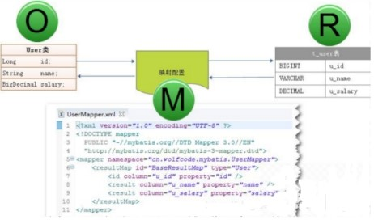

另外学习ORM必须知道两个概念：持久化、持久层

**什么是“持久化”** 

​		持久化（Persistence），即把数据（如内存中的对象）保存到可永久保存的存储设备中（如磁盘）。持久化的主要应用是将内存中的数据存储在关系型的数据库中，当然也可以存储在磁盘文件中、XML数据文件中等等。

**什么是 “持久层”** 

​		持久层（Persistence Layer），即专注于实现数据持久化应用领域的某个特定系统的一个逻辑层面，将数据使用者和数据实体相关联。之前使用JDBC访问数据库的DAO层，后面采用MyBatis访问数据库的mapper层，就是持久层。

* 负责将数据到保存到数据库的那一层代码。

  以后开发我们会将操作数据库的Java代码作为持久层。而Mybatis就是对jdbc代码进行了封装。

* JavaEE三层架构：表现层、业务层、持久层

  三层架构在后期会给大家进行讲解，今天先简单的了解下即可。

**Mybatis 是一持久层的款半自动的ORM映射框架** 


### 1.3  Mybatis概念

> * MyBatis 是一款优秀的==持久层框架==，用于简化 JDBC 开发
> * MyBatis 本是 Apache 的一个开源项目iBatis, 2010年这个项目由apache software foundation 迁移到了google code，并且改名为MyBatis 。2013年11月迁移到Github
> * MyBatis 是一款优秀的持久层框架，它支持定制化 SQL、存储过程以及高级映射。MyBatis 避免了几乎所有的 JDBC 代码和手动设置参数以及获取结果集。MyBatis 可以使用简单的 XML 或注解来配置和映射原生信息，将接口和 Java 的 POJOs(Plain Ordinary Java Object,普通的 Java对象)映射成数据库中的记录。
> * 官网：https://mybatis.org/mybatis-3/zh/index.html 

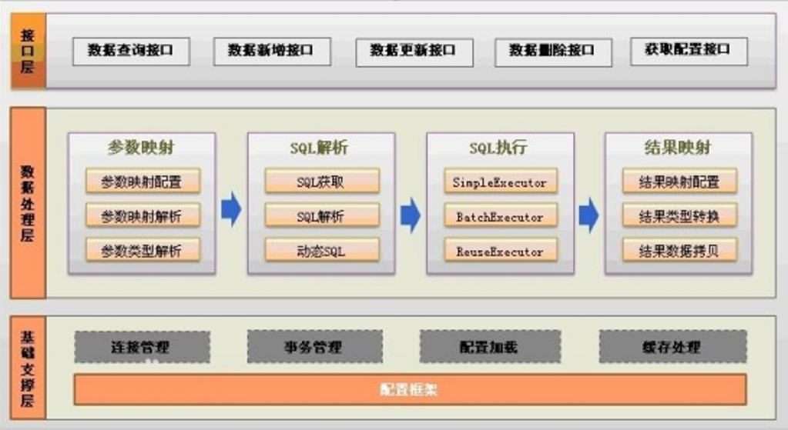

​		精简解释：MyBatis是一个半自动ORM框架，其本质是对JDBC的封装。使用MyBatis重点需要程序员编写SQL命令，不需要写一行JDBC代码。


### 1.3  Mybatis 优化

* 硬编码可以配置到==配置文件==
* 操作繁琐的地方mybatis都==自动完成==

如图所示


下图是持久层框架的使用占比。


## 2  Mybatis快速入门

**需求：查询user表中所有的数据**

* 创建user表，添加数据

  ```sql
  create database mybatis;
  use mybatis;
  
  drop table if exists tb_user;
  
  create table tb_user(
  	id int primary key auto_increment,
  	username varchar(20),
  	password varchar(20),
  	gender char(1),
  	addr varchar(30)
  );
  
  INSERT INTO tb_user VALUES (1, 'zhangsan', '123', '男', '北京');
  INSERT INTO tb_user VALUES (2, '李四', '234', '女', '天津');
  INSERT INTO tb_user VALUES (3, '王五', '11', '男', '西安');
  ```

* 创建模块，导入坐标

  在创建好的模块中的 pom.xml 配置文件中添加依赖的坐标

  ```xml
  <dependencies>
      <!--mysqlConnector-->
      <dependency>
          <groupId>mysql</groupId>
          <artifactId>mysql-connector-java</artifactId>
          <version>8.0.16</version>
      </dependency>
      <!--mybatis 核心jar包-->
      <dependency>
          <groupId>org.mybatis</groupId>
          <artifactId>mybatis</artifactId>
          <version>3.5.3</version>
      </dependency>
      <!--junit-->
      <dependency>
          <groupId>junit</groupId>
          <artifactId>junit</artifactId>
          <version>4.13.1</version>
          <scope>test</scope>
      </dependency>
      <!--lombok -->
      <dependency>
          <groupId>org.projectlombok</groupId>
          <artifactId>lombok</artifactId>
          <version>1.18.12</version>
          <scope>provided</scope>
      </dependency>
  </dependencies>
  ```

  > 注意：需要在项目的 resources 目录下创建log4j2.xml的配置文件

* 安装lombok插件后,重启idea

  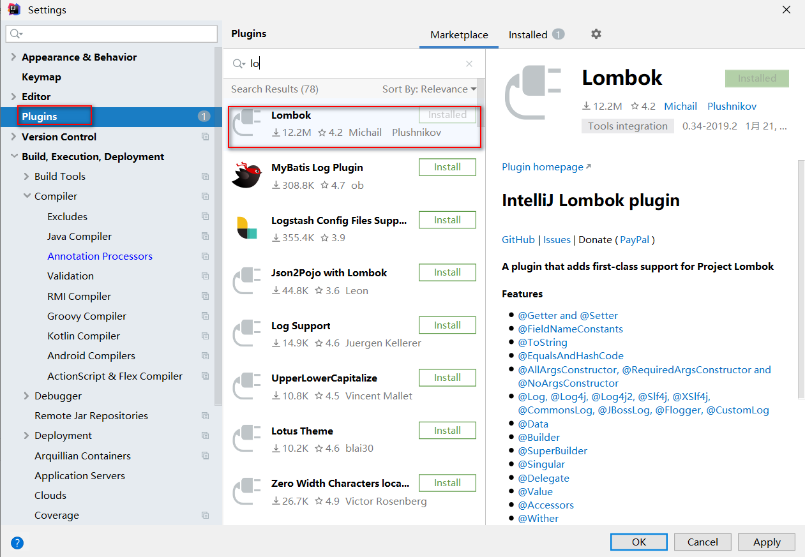

  导入lombok依赖后,单独设置启用注解处理

  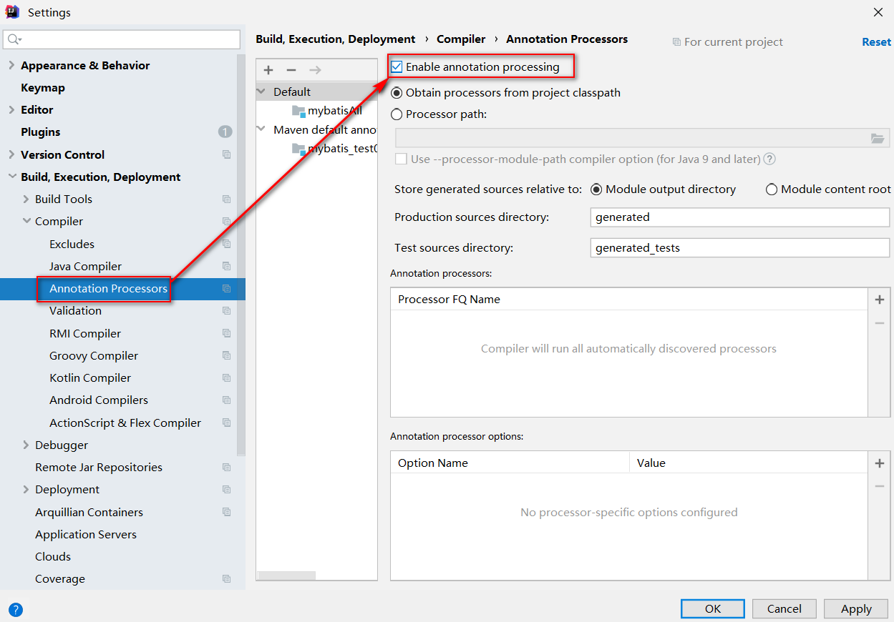

* 编写 MyBatis 核心配置文件 -- > 替换连接信息 解决硬编码问题

  在模块下的 resources 目录下创建mybatis的配置文件 `sqlMapConfig.xml`，内容如下：

  ```xml
  <?xml version="1.0" encoding="UTF-8" ?>
  <!DOCTYPE configuration
          PUBLIC "-//mybatis.org//DTD Config 3.0//EN"
          "http://mybatis.org/dtd/mybatis-3-config.dtd">
  <configuration>
      
      <typeAliases>
          <package name="com.itheima.pojo"/>
      </typeAliases> 
      
      <!--
      environments：配置数据库连接环境信息。可以配置多个environment，通过default属性切换不同的environment
      -->
      <environments default="development">
          <environment id="development">
              <transactionManager type="JDBC"/>
              <dataSource type="POOLED">
                  <!--数据库连接信息-->
                  <property name="driver" value="com.mysql.jc.jdbc.Driver"/>
                  <property name="url" value="jdbc:mysql://127.0.0.1:3306/mydb?useSSL=false&amp;useUnicode=true&amp;characterEncoding=UTF-8&amp;serverTimezone=Asia/Shanghai"/>
                  <property name="username" value="root"/>
                  <property name="password" value="1234"/>
              </dataSource>
          </environment>
  
          <environment id="test">
              <transactionManager type="JDBC"/>
              <dataSource type="POOLED">
                  <!--数据库连接信息-->
                  <property name="driver" value="com.mysql.jdbc.Driver"/>
                  <property name="url" value="jdbc:mysql:///mybatis?useSSL=false"/>
                  <property name="username" value="root"/>
                  <property name="password" value="1234"/>
              </dataSource>
          </environment>
      </environments>
      <mappers>
         <!--加载mapper映射文件-->
         <mapper resource="UserMapper.xml"/>
      </mappers>
  </configuration>
  ```

* 编写 SQL 映射文件 --> 统一管理sql语句，解决硬编码问题

  在模块的 `resources` 目录下创建`com/itheima/mapper` 目录,然后配置映射文件 `UserMapper.xml`，内容如下：

  ```xml
  <?xml version="1.0" encoding="UTF-8" ?>
  <!DOCTYPE mapper PUBLIC "-//mybatis.org//DTD Mapper 3.0//EN" "http://mybatis.org/dtd/mybatis-3-mapper.dtd">
  <mapper namespace="test">
      <select id="selectAll" resultType="com.itheima.pojo.User">
          select * from tb_user
      </select>
  </mapper>
  ```

* 编码

  * 在 `com.itheima.pojo` 包下创建 User类

    ```java
    // 使用 Lombok注解 配置 get/set方法  无参构造方法和全参构造方法
    @Data  // 配置 get/set方法
    @AllArgsConstructor  // 构造全参构造方法
    @NoArgsConstructor   // 构造无参构造方法
    public class User {
        private int id;
        private String username;
        private String password;
        private String gender;
        private String addr;
    }
    ```

  * 在 `com.itheima` 包下编写 MybatisDemo 测试类

    ```java
    public class Test1 {
        private SqlSession sqlSession;
        @Before
        public void init(){
             //1. 加载mybatis的核心配置文件，获取 SqlSessionFactory
            InputStream resourceAsStream = null;
            SqlSessionFactoryBuilder ssfb =new SqlSessionFactoryBuilder();  
            try {
                resourceAsStream = Resources.getResourceAsStream("sqlMapConfig.xml");
            } catch (IOException e) {
                e.printStackTrace();
            }
            SqlSessionFactory factory=ssfb.build(resourceAsStream) ;
            //2. 获取SqlSession对象，用它来执行sql
            sqlSession=factory.openSession();
        }
    
        @Test
        public void testFindAll(){
            //3. 执行sql
            List<User> users = sqlSession.selectList("test.selectAll"); //参数是一个字符串，该字符串必须是映射配置文件的namespace.id
            for (User users : user) {
                System.out.println(user);
            }
        }
        
        @After
        public void release(){
            //4. 释放资源
            sqlSession.close();
        }
    }
    ```

**解决SQL映射文件的警告提示：**

在入门案例映射配置文件中存在报红的情况。问题如下：


* 产生的原因：Idea和数据库没有建立连接，不识别表信息。但是大家一定要记住，它并不影响程序的执行。
* 解决方式：在Idea中配置MySQL数据库连接。

IDEA中配置MySQL数据库连接

* 点击IDEA右边框的 `Database` ，在展开的界面点击 `+` 选择 `Data Source` ，再选择 `MySQL`

  

* 在弹出的界面进行基本信息的填写

  

* 点击完成后就能看到如下界面

  

  而此界面就和 `navicat` 工具一样可以进行数据库的操作。也可以编写SQL语句


## 3.  MyBatis配置详解

### 3.1 log4j1 和log4j2的使用

项目中添加依赖

```xml
log4j2
<dependency>
    <groupId>org.apache.logging.log4j</groupId>
    <artifactId>log4j-core</artifactId>
    <version>2.12.1</version>
</dependency>
log4j1 
<dependency>
    <groupId>log4j</groupId>
    <artifactId>log4j</artifactId>
    <version>1.2.17</version>
</dependency>
```

在`mybatis.cfg.xml` 中配置MyBatis所使用的具体日志实现。如果不指定将自动搜索。可能会搜到log4j，但是如果优先搜到了其他的日志实现呢，所以还是设置为好。这一来log4j就跑不了了。

#### 3.1.1 log4j1

​		将`log4j.properties`文件负责到`resources` 目录下。另外在其中可以将全局的日志级别调高，避免大量debug信息的干扰。同时将对映射文件的操作调低，可以用来显示SQL语句的调试信息。开发阶段，建议启动控制的日志。

```properties
#定义全局日志级别调试阶段推荐debug
log4j.rootLogger=debug,stdout 

log4j.appender.stdout=org.apache.log4j.ConsoleAppender
log4j.appender.stdout.Target=System.err
log4j.appender.stdout.layout=org.apache.log4j.SimpleLayout

log4j.appender.logfile=org.apache.log4j.FileAppender
log4j.appender.logfile.File=d:/msb.log
log4j.appender.logfile.layout=org.apache.log4j.PatternLayout
log4j.appender.logfile.layout.ConversionPattern=%d{yyyy-MM-dd HH:mm:ss} %l %F %p %m%n
```

在核心配置文件中可以选择的其他日志处理方式

#### 3.1.2 log4j 2

将log4j2.xml文件负责到resources下。

```xml
<?xml version="1.0" encoding="UTF-8"?>
<Configuration status="DEBUG">
    <Appenders>
        <Console name="Console" target="SYSTEM_ERR">
            <PatternLayout pattern="%d{YYYY-MM-dd HH:mm:ss} [%t] %-5p %c{1}:%L - %msg%n" />
        </Console>

        <RollingFile name="RollingFile" filename="log/test.log"
                     filepattern="${logPath}/%d{YYYYMMddHHmmss}-fargo.log">
            <PatternLayout pattern="%d{YYYY-MM-dd HH:mm:ss} [%t] %-5p %c{1}:%L - %msg%n" />
            <Policies>
                <SizeBasedTriggeringPolicy size="10 MB" />
            </Policies>
            <DefaultRolloverStrategy max="20" />
        </RollingFile>

    </Appenders>
    <Loggers>
        <Root level="INFO">
            <AppenderRef ref="Console" />
        </Root>
    </Loggers>
</Configuration>
```

核心配置文件中可以指定日志打印方式

```xml
<configuration>
	<settings>
        <!-- 指定mybatis日志方式，如果不指定,自动查找处理 -->
        <setting name="logImpl" value="LOG4J2"/>
    </settings>
</configuration>
```


### 3.2 关于事务配置


在`mybatis`核心配置文件中 `envirment`中 通过`transactionManager`配置事务的处理策略

* `JDBC` – 这个配置直接简单使用了 JDBC 的提交和回滚设置。它依赖于从数据源得到的连接来管理事务范围。 

* `MANAGED` – 这个配置几乎没做什么。它从来不提交或回滚一个连接。而它会让容器来管理事务的整个生命周期(比如 Spring 或 JEE 应用服务器的上下文) 默认情况下它会关闭连接。然而一些容器并不希望这样, 因此如果你需要从连接中停止它,将 `closeConnection` 属性设置为 `false.mybatis`本身并不做事务的处理,交给其他框架去处理事务,如spring


### 3.3 关于映射文件的加载方式

1. `mapper`映射文件的文件路径导入 使用的`mapper`标签的`resource`属性

2. 网络资源路径 使用的`mapper`标签的`url`属性

3. 接口的全限定名导入 使用的是`mapper`标签的`class`属性 **(基于接口的代理模式开发)** 

4. 包扫描形式加载所有的`mapper`映射文件 使用的是 `package`标签

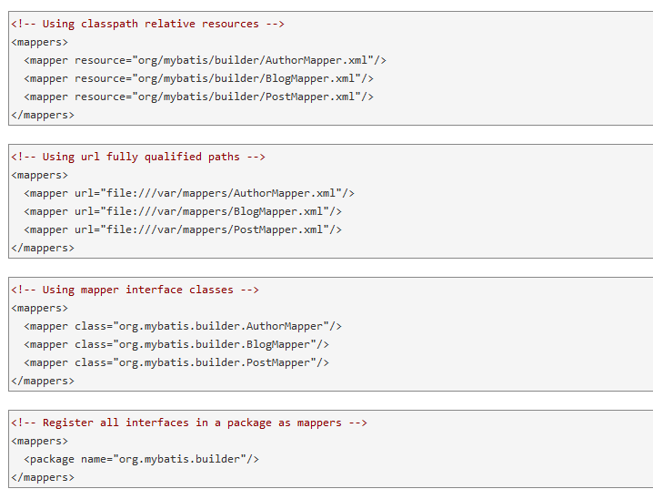


### 3.4 关于实体类别名处理

在mybatis核心配置文件中使用别名处理

```xml
<!--设置特定文件别名-->
<typeAlias alias="Author" type="domain.blog.Author"/>
```


```xml
<!--**设置实体类别名**-->
<typeAliases>
	<package name = "com.example.pojo" />
</typeAliases>
```

通过包扫描给所有的实体类起别名

* 给指定报名下的所有类起别名
* 默认每个实体类的别名是首字母小写的类名
     Dept  >>> dept
     Emp  >>> emp

在映射文件的resultType 返回值类型  和paramterType 上就可以使用别名了

```xml
<select id="selectByEmpno"  resultType="emp">
    select * from emp where empno = 7566
</select>
```


### 3.5 关于外部属性配置文件存储数据库链接信息

在`resources`下准备`jdbc.properties`属性配置文件

配置文件中的内容

```properties
jdbc_driver=com.mysql.cj.jdbc.Driver
jdbc_url=jdbc:mysql://127.0.0.1:3306/mydb?useSSL=false&useUnicode=true&characterEncoding=UTF-8&serverTimezone=Asia/Shanghai
jdbc_username=root
jdbc_password=root
```

在核心配置文件中引入`jdbc.properties`属性文件

```xml
<?xml version="1.0" encoding="UTF-8" ?>
<!DOCTYPE configuration
        PUBLIC "-//mybatis.org//DTD Config 3.0//EN"
        "http://mybatis.org/dtd/mybatis-3-config.dtd">
<configuration>

    <!--引入jdbc.properties配置文件-->
    <properties resource="jdbc.properties"></properties>

    <settings>
        <!--设置日志处理方式-->
        <setting name="logImpl" value="LOG4J"/>
    </settings>

    <!--设置实体类别名-->
    <typeAliases>
        <package name="com.msb.pojo"/>
    </typeAliases>

    <!--配置数据库链接信息-->
    <environments default="mysql">
        <!--数据源1-->
        <environment id="mysql">
            <transactionManager type="JDBC"/>
            <!--一个数据源-->
            <dataSource type="POOLED">
                <property name="driver" value="${jdbc_driver}"/>
                <property name="url" value="${jdbc_url}"/>
                <property name="username" value="${jdbc_username}"/>
                <property name="password" value="${jdbc_password}"/>
            </dataSource>
        </environment>
    </environments>
    <!--加载映射文件的-->
    <mappers>
        <mapper resource="com/msb/mapper/DeptMapper.xml"/>
    </mappers>
</configuration>
```


## 4、MyBatis普通模式开发

​		普通模式,也称为传统DAO模式,就是在传统DAO模式下,定义接口和实现类,如 `interface EmpDao` `class EmpDaoImpl implements EmpDao`. 在实现类中,用`SQLSession`对象调用 `select insert delete update` 等方法实现.目前极为少见.在传统模式下,我们需要知道`SqlSession`对象 实现CURD和 参数传递的处理


### 4.1mybatis查询的三种方式

`SqlSession` 对象本身的API中就有三个查询方法,分别能够实现如下查询方式

1. 返回单个对象 `selectOne` 

2. 返回对象List集合 `selectList` 

3. 返回对象Map集合 `selectMap` 

#### 4.1.1 编写实体类

```java
@AllArgsConstructor
@NoArgsConstructor
@Data
public class Emp implements Serializable {
    private Integer empno;
    private String ename;
    private String job;
    private Integer mgr;
    private Date hiredate;
    private Double sal;
    private Double comm;
    private Integer deptno;
}
```

#### 4.1.2  编写SQL语句

```xml
<?xml version="1.0" encoding="UTF-8" ?>
<!DOCTYPE mapper
        PUBLIC "-//mybatis.org//DTD Mapper 3.0//EN"
        "http://mybatis.org/dtd/mybatis-3-mapper.dtd">

<mapper namespace="EmpMapper">
    <!--返回单个对象-->
    <select id="findOne" resultType="emp" >
        select * from emp where empno = 7499
    </select>

    <!--返回多个对象List集合-->
    <select id="findAll" resultType="emp">
        select * from emp
    </select>

    <!--返回多个对象的Map集合
    把查询出来的数据中的某一列作为键,整条数据封装的对象作为值-->
    <select id="findEmpMap" resultType="map">
        select * from emp
    </select>
</mapper>
```

#### 4.1.3 编写映射文件

**`SQLMapConfig`中导入`EmpMapper`映射文件**

```xml
<!--加载mapper映射文件-->
<mappers>
    <mapper resource="com/msb/mapper/DeptMapper.xml"/>
    <mapper resource="com/msb/mapper/EmpMapper.xml"/>
</mappers>
```

#### 4.1.4 编写测试方法

```java
public class Test2 {
    private SqlSession sqlSession;
    @Before
    public void init(){
        SqlSessionFactoryBuilder ssfb =new SqlSessionFactoryBuilder();
        InputStream resourceAsStream = null;
        try {
            resourceAsStream = Resources.getResourceAsStream("sqlMapConfig.xml");
        } catch (IOException e) {
            e.printStackTrace();
        }
        SqlSessionFactory factory=ssfb.build(resourceAsStream) ;
        sqlSession=factory.openSession();
    }

    @Test
    public void testSelectOne(){
        // 查询单个对象
        System.out.println("sqlSession查询单个对象");
        Emp emp = sqlSession.selectOne("EmpMapper.findOne");
        System.out.println(emp);

    }

    @Test
    public void testSelectList(){
        // 查询多个对象的List集合
        System.out.println("sqlSession查询对象List集合");
        List<Emp> emps = sqlSession.selectList("EmpMapper.findAll");
        emps.forEach(System.out::println);
    }

    @Test
    public void testSelectMap(){
        // 查询多个对象的Map集合
        System.out.println("sqlSession查询对象Map集合");
        Map<Integer, Emp> empMap = sqlSession.selectMap("EmpMapper.findEmpMap", "EMPNO");
        Set<Integer> empnos = empMap.keySet();
        for (Integer empno : empnos) {
            System.out.println(empno+" :" +empMap.get(empno));
        }
    }

    @After
    public void release(){
        // 关闭SQLSession
        sqlSession.close();
    }
}
```

#### 4.1.5 `id` 使用

​	在命名空间中唯一的标识符，可以被用来引用这条语句。

#### 4.1.6 `resultType` 使用

​	期望从这条语句中返回结果的类全限定名或别名。 注意，如果返回的是集合，那应该设置为集合包含的类型，而不是集合本身的类型。 `resultType` 和 `resultMap` 之间只能同时使用一个。


### 4.2 mybatis参数传递的三种方式

1. 单个基础数据类型作为参数

2. 多个基础数据类型的map 集合作为参数

3. 引用类型作为参数

#### 4.2.1 编写SQL语句

```xml
<?xml version="1.0" encoding="UTF-8" ?>
<!DOCTYPE mapper
        PUBLIC "-//mybatis.org//DTD Mapper 3.0//EN"
        "http://mybatis.org/dtd/mybatis-3-mapper.dtd">

<mapper namespace="EmpMapper2">
    <!--
    参数为一个基本数据类型
    根据员工工号查询员工的全部信息,返回单个员工对象
    -->
    <select id="findByEmpno" resultType="emp" parameterType="int">
        select  * from emp where empno = #{empno}
    </select>

    <!--
    参数为map集合
    查询指定部门号和指定最低薪资的员工信息
    20 号部门 且工资在1500以上的员工信息
    #{}中写的是map集合中参数的键
    -->
    <select id="findEmpByDeptnoAndSal" resultType="emp" parameterType="map">
        select * from emp where deptno = #{deptno} and sal &gt;= #{sal}
    </select>

    <!--
   参数为对象
   emp >>>  deptno   sal
   参数是我们自定义的类型,那么 #{}中写的是参数的属性名
   -->
    <select id="findEmpByDeptnoAndSal2" resultType="emp" parameterType="emp">
        select * from emp where deptno = #{deptno} and sal &gt;= #{sal}
    </select>
</mapper>
```

#### 4.2.2 编写测试方法

```java
public class Test3 {

    private SqlSession sqlSession;
    @Before
    public void init(){
        SqlSessionFactoryBuilder ssfb =new SqlSessionFactoryBuilder();
        InputStream resourceAsStream = null;
        try {
            resourceAsStream = Resources.getResourceAsStream("sqlMapConfig.xml");
        } catch (IOException e) {
            e.printStackTrace();
        }
        SqlSessionFactory factory=ssfb.build(resourceAsStream) ;
        sqlSession=factory.openSession();
    }

    @Test
    public void testSingleArg(){
        // 测试单个基本数据类型作为参数
        Emp emp = sqlSession.selectOne("findByEmpno", 7499);
        System.out.println(emp);
    }

    @Test
    public void testMapArg(){
        // 测试Map集合作为参数
        Map<String,Object> args=new HashMap<>();
        args.put("deptno", 20);
        args.put("sal", 3000.0);
        List<Emp> emps = sqlSession.selectList("findEmpByDeptnoAndSal", args);
        emps.forEach(System.out::println);
    }

    @Test
    public void testEmpArg(){
        // 测试引用类型作为参数
        Emp arg =new Emp();
        arg.setDeptno(10);
        arg.setSal(2000.0);
        List<Emp> emps = sqlSession.selectList("findEmpByDeptnoAndSal2", arg);
        emps.forEach(System.out::println);
    }

    @After
    public void release(){
        // 关闭SQLSession
        sqlSession.close();
    }

}
```

#### 4.2.3 `parameterType` 使用

​		将会传入这条语句的参数的类全限定名或别名。这个属性是可选的，因为 MyBatis 可以通过类型处理器（TypeHandler）推断出具体传入语句的参数，默认值为未设置（unset）。

#### 4.2.4 参数占位符

如果参数是单个基本数据类型, {}中名字可以随便写,见名知意

mybatis提供了两种参数占位符：

* #{} ：代表mybatis底层使用的`preparedStatment`语句对象, 参数使用 ?作为占位符处理
* ${} ：代表mybatis底层使用`Statment`语句对象,参数是以字符串拼接的形式设置


### 4.3 mybatis完成DML全部操作

#### 4.3.1 编写SQL语句

```xml
<?xml version="1.0" encoding="UTF-8" ?>
<!DOCTYPE mapper
        PUBLIC "-//mybatis.org//DTD Mapper 3.0//EN"
        "http://mybatis.org/dtd/mybatis-3-mapper.dtd">

<mapper namespace="EmpMapper3">
    <!--
    增删方法的返回值类型都是int
    resultType就无需指定了
    insert update delete 标签中没有resultType
    但是仍然可以有paramaterType
    -->

    <!-- 增加方法
    -->
    <insert id="addEmp" parameterType="emp">
        insert into emp values(#{empno},#{ename},#{job},#{mgr},#{hiredate},#{sal},#{comm},#{deptno})
    </insert>

    <!--修改
    根据工号修改员工姓名
    -->
    <update id="updateEmp" parameterType="emp">
        update emp set ename = #{ename} where empno=#{empno}
    </update>

    <!-- 删除
    删除大于给定工号的员工信息
    -->
    <delete id="deleteEmp" parameterType="int">
        delete from emp where empno >= #{empno}
    </delete>
</mapper>
```

#### 4.3.2 编写测试方法

```java
public class Test4 {
    private SqlSession sqlSession;
    @Before
    public void init(){
        SqlSessionFactoryBuilder ssfb =new SqlSessionFactoryBuilder();
        InputStream resourceAsStream = null;
        try {
            resourceAsStream = Resources.getResourceAsStream("sqlMapConfig.xml");
        } catch (IOException e) {
            e.printStackTrace();
        }
        SqlSessionFactory factory=ssfb.build(resourceAsStream) ;
        sqlSession=factory.openSession(true);
    }

    @Test
    public void testInsert(){
        Emp emp =new Emp(null,"按住啦Baby","SALESMAN",7839,new Date(),3100.0, 200.0,10 );
        int rows = sqlSession.insert("addEmp", emp);
        System.out.println(rows);
        // 手动提交事务
        //sqlSession.commit();
        /*增删改 要提交事务
        * sqlSession.commit();手动提交事务
        * sqlSession=factory.openSession(true); 设置事务自动提交
        * */
    }

    @Test
    public void testUpdate(){
        Emp emp =new Emp( );
        emp.setEname("晓明");
        emp.setEmpno(7937);
        int rows = sqlSession.update("updateEmp", emp);
        System.out.println(rows);
    }

    @Test
    public void testDelete(){
        int rows = sqlSession.delete("deleteEmp", 7936);
        System.out.println(rows);
    }
    
    @After
    public void release(){
        // 关闭SQLSession
        sqlSession.close();
    }
}
```

#### 4.3.3 提交事务

mybatis完成`DML` 操作需要提交事务

* 手动提交事务:  `sqlSession.commit();` 
* 设置事务自动提交: `sqlSession=factory.openSession(true);` 


## 5. MyBatis代理模式开发

​	前面已经使用MyBatis完成了对Emp表的CRUD操作，都是由`SqlSession`调用自身方法发送SQL命令并得到结果的，实现了MyBatis的入门。但是却存在如下优缺点:

* 缺点：
  1. 不管是`selectList()`、`selectOne()`、`selectMap()`，都是通过`SQLSession`对象的API完成增删改查,都只能提供一个查询参数。如果要多个参数，需要封装到JavaBean或者Map中，并不一定永远是一个好办法。
  2. 返回值类型较固定。
  3. 只提供了映射文件，没有提供数据库操作的接口，不利于后期的维护扩展。

在MyBatis中提供了另外一种成为**Mapper代理（或称为接口绑定）**的操作方式。在实际开发中也使用该方式。下面我们就是要Mapper代理的方式来实现对Emp表的CRUD操作吧，还有完成多个参数传递、模糊查询、自增主键回填等更多的技能实现。搭建好的项目框架如图所示，相比而言，增加了接口EmployeeMapper。但是却会引起映射文件和测试类的变化。

* 优点:
  1. 有接口模块之间有规范了
  2. 参数的处理多样了,接口中的方法参数列表由我们自己决定
  3. 通过代理模式由mybatis提供接口的实现类对象 我们不用写实现类了

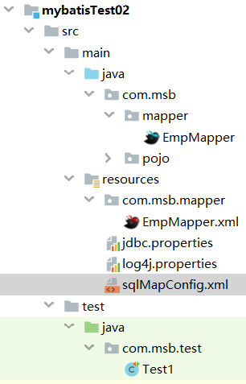


### 5.1 使用Mapper代理方式实现查询

#### 5.1.2 编写 EmpMapper接口

```java
public interface EmpMapper {
    /**
     * 该方法用于查询全部的员工信息
     * @return 全部员工信息封装的Emp对象的List集合
     */
    List<Emp> findAll();
}
```

#### 5.1.3 编写 SQL 语句

```xml
<?xml version="1.0" encoding="UTF-8" ?>
<!DOCTYPE mapper
        PUBLIC "-//mybatis.org//DTD Mapper 3.0//EN"
        "http://mybatis.org/dtd/mybatis-3-mapper.dtd">

<mapper namespace="com.msb.mapper.EmpMapper">
    <!--
    1 接口的名字和Mapper映射为文件名字必须保持一致(不包含拓展名)
    2 Mapper映射文件的namespace必须是接口的全路径名
    3 sql语句的id必须是对应方法的名
    4 DeptMapper映射文件应该和接口编译之后放在同一个目录下
    -->
    <select id="findAll" resultType="emp" >
        select * from emp
    </select>
</mapper>
```

#### 5.1.4 编写映射文件

```xml
<!--加载mapper映射文件-->
<mappers>
    <!--通过类的全路径去找mapper映射文件-->
    <mapper class="com.msb.mapper.EmpMapper"/>
</mappers>
```

#### 5.1.5 编写测试方法

```java
public class Test1 {
    private SqlSession sqlSession;
    @Before
    public void init(){
        SqlSessionFactoryBuilder ssfb =new SqlSessionFactoryBuilder();
        InputStream resourceAsStream = null;
        try {
            resourceAsStream = Resources.getResourceAsStream("sqlMapConfig.xml");
        } catch (IOException e) {
            e.printStackTrace();
        }
        SqlSessionFactory factory=ssfb.build(resourceAsStream) ;
        sqlSession=factory.openSession();
    }

    @Test
    public void testFindAll(){
        EmpMapper empMapper=sqlSession.getMapper(EmpMapper.class);
        List<Emp> emps = empMapper.findAll();
        emps.forEach(System.out::println);
    }

    @After
    public void release(){
        // 关闭SQLSession
        sqlSession.close();
    }
}
```


### 5.2 代理模式浅析

mybatis是如何通过代理模式实现查询的

这条语句的底层使用了动态代理模式，动态创建一个EmployeeMapper的一个代理对象并赋给接口引用。所以在MyBatis中不需要显式提供Mapper接口的实现类，这也是简单的地方。


## 6. 代理模式下的参数传递问题

### 6.1 多参数传递

1. 单个基本数据类型

2. 多个基本数据类型

3. 单个引用数据类型

4. map集合数据类型

5. 多个引用数据类型

#### 6.1.1 编写接口方法

```java
public interface EmpMapper {
    /**
     * 根据员工编号查询单个员工信息的方法
     * @param empno 员工编号
     * @return 如果找到了返回Emp对象,找不到返回null
     */
    Emp findByEmpno(int empno);
    /**
     * 根据员工编号和薪资下限去查询员工信息
     * @param deptno 部门编号
     * @param sal 薪资下限
     * @return 多个Emp对象的List集合
     */
    List<Emp> findByDeptnoAndSal(@Param("deptno") int deptno,@Param("sal") double sal);
   /**
     * 根据员工编号和薪资下限去查询员工信息
     * @param map Map集合数据类型
     * @return 多个Emp对象的List集合
     */
    List<Emp> findByDeptnoAndSal2(Map<String,Object> map);
   /**
     * 根据员工编号和薪资下限去查询员工信息
     * @param emp Emp引用数据类型
     * @return 多个Emp对象的List集合
     */
    List<Emp> findByDeptnoAndSal3(Emp emp);
   /**
     * 根据员工编号和薪资下限去查询员工信息
     * @param empa Emp引用数据类型
     * @param empb Emp引用数据类型
     * @return 多个Emp对象的List集合
     */
    List<Emp> findByDeptnoAndSal4(@Param("empa") Emp empa,@Param("empb") Emp empb);
}
```

#### 6.1.2 编写 SQL 语句

```xml
<?xml version="1.0" encoding="UTF-8" ?>
<!DOCTYPE mapper
        PUBLIC "-//mybatis.org//DTD Mapper 3.0//EN"
        "http://mybatis.org/dtd/mybatis-3-mapper.dtd">

<mapper namespace="com.msb.mapper.EmpMapper">
    <!--
    单个基本数据类型作为方法参数
    -->
    <select id="findByEmpno" resultType="emp" >
        select * from emp where empno =#{empno}
    </select>

    <!--
     多个基本数据类型作为方法参数
     List<Emp> findByDeptnoAndSal(@Param("detpno") int deptno,@Param("sal") double sal);
     方式1 arg*     arg0 arg1 arg2 数字是索引,从0开始
     方式2 param*   param1 param2 param3 数字是编号,从1开始
     使用别名
     通过@Param注解使用别名之后,就不能再使用arg* 但是可以继续使用param*
    -->
    <select id="findByDeptnoAndSal" resultType="emp">
        select * from emp where deptno =#{arg0} and sal >= #{arg1}
        <!-- select * from emp where deptno =#{param1} and sal >= #{param2}-->
        <!-- select * from emp where deptno =#{deptno} and sal >= #{sal}-->
    </select>

    <!--单个引用类型,{}中写的使用对象的属性名-->
    <select id="findByDeptnoAndSal2" resultType="emp" parameterType="emp" >
        select * from emp where deptno =#{deptno} and sal >= #{sal}
    </select>

    <!--
    多个引用类型作为方法参数
     List<Emp> findByDeptnoAndSal4(@Param("empa") Emp empa,@Param("empb") Emp empb);
     如果用@Param定义了别名,那么就不能使用arg*.属性名,但是可以使用param*.属性名和别名.属性名
    -->
    <select id="findByDeptnoAndSal3" resultType="emp"  >
         select * from emp where deptno =#{param1.deptno} and sal >= #{param2.sal}
         <!-- select * from emp where deptno =#{empa.deptno} and sal >= #{empb.sal}-->
    </select>
    
    <!--
    参数是map,{}写键的名字
    -->
    <select id="findByDeptnoAndSal4" resultType="emp" parameterType="map" >
        <!--select * from emp where deptno =#{arg0} and sal >= #{arg1}-->
        <!-- select * from emp where deptno =#{param1} and sal >= #{param2}-->
         select * from emp where deptno =#{deptno} and sal >= #{sal}
    </select>
</mapper>
```

#### 6.1.3 编写测试方法

```java
public class Test1 {
    public static void main(String[] args) {
        SqlSession sqlSession = SqlSessionUtil.getSqlSession(true);
        /*
        * 帮助我们生成一个接口下的实现类对象的
        *
        * */
        EmpMapper mapper = sqlSession.getMapper(EmpMapper.class);
        // 1 单个基本数据类型作为方法参数
        Emp emp = mapper.getByEmpno(7902);
        System.out.println(emp);
        // 2 多个基本数据类型作为方法参数
        List<Emp> emps2 = mapper.getByDeptnoAndSal(10, 1500);
        for(Emp em:emps2) {
            System.out.println(em);
        }
        // 3 单个引用类型作为方法参数
        Emp condition=new Emp();
        condition.setDeptno(10);
        condition.setSal(1500.0);
        List<Emp> emps3 = mapper.getByDeptnoAndSal2(condition);
        for(Emp em:emps3) {
            System.out.println(em);
        }
        // 4 多个引用类型作为方法参数
        Emp condition1=new Emp();
        condition1.setDeptno(10);
        Emp condition2=new Emp();
        condition2.setSal(1500.0);
        List<Emp> emps4 = mapper.getByDeptnoAndSal3(condition1,condition2);
        for(Emp em:emps4) {
            System.out.println(em);
        }
        // 5 Map数据类型作为方法参数
        Map<String, Object> = new HashMap<>();
        map.put("deptno", 20);
        map.put("sal", 3000.0);
        List<Emp> emps = empMapper1.findByDeptnoAndSal2(map);
        emps.forEach(System.out::println);
        sqlSession.close();
    }
}
```


### 6.2 模糊查询

在进行模糊查询时，在映射文件中可以使用concat()函数来连接参数和通配符。另外注意对于特殊字符，比如<，不能直接书写，应该使用字符实体替换。

#### 6.2.1 编写接口

```java
/**
 * 根据名字做模糊查询
 * @param name 模糊查询的文字
 * @return  Emp对象List集合
 */
List<Emp> findByEname( String name);
```

#### 6.2.2 编写 SQL 语句

```xml
<!--List<Emp> getByName(String name);-->
<select id="findByEname"  resultType="emp" >
    select * from emp where ename like concat('%',#{name},'%')
</select>
```

#### 6.2.3 编写测试方法

```java
public class Test1 {
    public static void main(String[] args) {
        SqlSession sqlSession = SqlSessionUtil.getSqlSession(true);
        EmpMapper mapper = sqlSession.getMapper(EmpMapper.class);
        List<Emp> emps = mapper.findByEname("A");
        emps.foreach(System.out::println);
    }
}
```


### 6.3 自增主键回填

​	MySQL支持主键自增。有时候完成添加后需要立刻获取刚刚自增的主键，由下一个操作来使用。比如结算构造车后，主订单的主键确定后，需要作为后续订单明细项的外键存在。如何拿到主键呢，MyBatis提供了支持，可以非常简单的获取。

#### 6.3.1 编写接口

```java
public interface DeptMapper {
    /**
 	 * 添加部门信息
	 * @param dept 部门信息对象
 	 * @return 返回自增主键
 	 */
    int addDept(Dept dept);
    int addDept2(Dept dept);
}
```

#### 6.3.2 编写 SQL 语句

```xml
<mapper namespace="com.msb.mapper.DeptMapper">
   <!-- int addDept(Dept dept);
   useGeneratedKeys="true" 返回数据库帮我们生成的主键
   keyProperty="deptno" 生成的主键值用我们dept对象那个属性存储
   -->
    <insert id="addDept" parameterType="dept" useGeneratedKeys="true" keyProperty="deptno">
        insert into dept values(null,#{dname},#{loc})
    </insert>

    <insert id="addDept2" parameterType="dept">
        <selectKey order="AFTER" keyProperty="deptno"  resultType="int">
            select @@identity
        </selectKey>
        insert into dept values(null,#{dname},#{loc})
    </insert>
</mapper>
```

#### 6.3.3 编写测试方法

```java
public class Test1 {
    public static void main(String[] args) {
        SqlSession sqlSession = SqlSessionUtil.getSqlSession(true);
        /*
        * 帮助我们生成一个接口下的实现类对象的
        *
        * */
        EmpMapper mapper = sqlSession.getMapper(EmpMapper.class);
		Dept dept =new Dept(null,"AI学院","北京");
		int i = mapper.addDept2(dept);
		System.out.println(i);
		System.out.println(dept.getDeptno());
		sqlSession.close();
    }
}
```

#### 6.3.4 方式1

在 insert 标签上添加如下属性：

* `useGeneratedKeys` ：（仅适用于 insert 和 update）表示要使用自增的主键

* `keyProperty` ：（仅适用于 insert 和 update）表示把自增的主键赋给JavaBean的哪个成员变量。如果生成列不止一个，可以用逗号分隔多个属性名称。

以添加Dept对象为例，添加前Dept对象的deptno是空的，添加完毕后可以通过getDeptno() 获取自增的主键。

#### 6.3.5 方式2

* `order`：取值`AFTER`|`BEFORE`，表示在 **新增之后|之前** 执行`<selectKey>`中的SQL命令

* `keyProperty`：执行`select @@identity` 后结果填充到哪个属性中

* `resultType`：结果类型。

> **技术扩展** 
>
> 在很多应用场景中需要新增数据后获取到新增数据的主键值，针对这样的需求一般由三种解决方式：
>
> * 主键自定义，用户通过UUID或时间戳等方式生成唯一主键，把这个值当做主键值。在分布式场景中应用较多。
>
> * 查询后通过select max(主键) from 表获取主键最大值。这种方式在多线程访问情况下可能出现问题。
>
> * 查询后通过select @@identity获取最新生成主键。要求这条SQL必须在insert操作之后，且数据库连接没有关闭。


### 6.4 实现DML操作

#### 6.4.1 编写EmpMapper接口

```java
/**
 * 增加员工信息
 * @param emp 存储新增员工信息的Emp对象
 * @return 对数据库数据产生影响的行数
 */
int addEmp(Emp emp);

/**
 * 根据员工编号修改员工姓名的方法
 * @param empno 要修改的员工编号
 * @param ename 修改之后的新的员工名字
 * @return 对数据库数据产生影响的行数
 */
int updateEnameByEmpno(@Param("empno") int empno,@Param("ename") String ename);

/**
 * 根据员工编号删除员工信息
 * @param empno 要删除的员工编号
 * @return 对数据库数据产生影响的行数
 */
int deleteByEmpno(int empno);
```

#### 6.4.2 编写 SQL 语句

```xml
<!--int addEmp(Emp emp);-->
<insert id="addEmp" >
    insert into emp values(DEFAULT ,#{ename},#{job},#{mgr},#{hiredate},#{sal},#{comm},#{deptno})
</insert>
<!--int updateEnameByEmpno(@Param("empno") int empno,@Param("ename") String ename);-->
<update id="updateEnameByEmpno" >
    update emp set ename =#{ename} where empno =#{empno}
</update>
<!--int deleteByEmpno(int empno);-->
<update id="deleteByEmpno" >
    delete from emp where empno =#{empno}
</update>
```

#### 6.4.3 编写测试方法

```java
public class Test3 {
    private SqlSession sqlSession;
    @Before
    public void init(){
        SqlSessionFactoryBuilder ssfb =new SqlSessionFactoryBuilder();
        InputStream resourceAsStream = null;
        try {
            resourceAsStream = Resources.getResourceAsStream("sqlMapConfig.xml");
        } catch (IOException e) {
            e.printStackTrace();
        }
        SqlSessionFactory factory=ssfb.build(resourceAsStream) ;
        sqlSession=factory.openSession();
    }

    @Test
    public void testAddEmp(){
        EmpMapper mapper = sqlSession.getMapper(EmpMapper.class);
        mapper.addEmp(new Emp(null, "TOM", "SALESMAN", 7521, new Date(), 2314.0, 100.0, 10));
        sqlSession.commit();
    }

    @Test
    public void testUpdateEnameByEmpno(){
        EmpMapper mapper = sqlSession.getMapper(EmpMapper.class);
        mapper.updateEnameByEmpno(7938, "TOM");
        sqlSession.commit();
    }

    @Test
    public void testDeletByEmpno(){
        EmpMapper mapper = sqlSession.getMapper(EmpMapper.class);
        mapper.deleteByEmpno(7938);
        sqlSession.commit();
    }

    @After
    public void release(){
        // 关闭SQLSession
        sqlSession.close();
    }
}
```

## 7. 动态SQL

​		经常遇到很多按照很多查询条件进行查询的情况，比如京东根据不同的条件筛选商品。其中经常出现很多条件不取值的情况，在后台应该如何完成最终的SQL语句呢？

​		如果采用JDBC进行处理，需要根据条件是否取值进行SQL语句的拼接，一般情况下是使用StringBuilder类及其append方法实现，还是有些繁琐的。如果你有使用 JDBC 或其它类似框架的经验，你就能体会到根据不同条件拼接 SQL语句的痛苦。例如拼接时要确保不能忘记添加必要的空格，还要注意去掉列表最后一个列名的逗号。利用动态 SQL 这一特性可以彻底摆脱这种痛苦。

​		MyBatis在简化操作方法提出了动态SQL功能，将使用Java代码拼接SQL语句，改变为在XML映射文件中截止标签拼接SQL语句。相比而言，大大减少了代码量，更灵活、高度可配置、利于后期维护。

MyBatis中动态SQL是编写在mapper.xml中的，其语法和JSTL类似，但是却是基于强大的OGNL表达式实现的。

MyBatis也可以在注解中配置SQL，但是由于注解功能受限，尤其是对于复杂的SQL语句，可读性很差，所以较少使用。

### 7.1 If标签

if 标签：条件判断

* test 属性：逻辑表达式

#### 7.1.1 编写接口

```java
public interface EmpMapper2 {
   List<Emp> findByCondition(Emp emp);
}
```

#### 7.1.2 编写 SQL 语句

```xml
<?xml version="1.0" encoding="UTF-8" ?>
<!DOCTYPE mapper
        PUBLIC "-//mybatis.org//DTD Mapper 3.0//EN"
        "http://mybatis.org/dtd/mybatis-3-mapper.dtd">

<mapper namespace="com.msb.mapper.EmpMapper2">
	<!--List<Emp> findByCondition(Emp emp);-->
    <select id="findByCondition" resultType="emp">
        select * from emp where 1=1
        <if test="empno != null">
            and empno = #{empno}
        </if>
        <if test="ename != null and ename != ''">
            and ename like concat('%', #{ename}, '%')
        </if>
        <if test="job != null and job != ''">
            and job = #{job}
        </if>
        <if test="mgr != null">
            and mgr = #{mgr}
        </if>
        <if test="hiredate != null">
            and hiredate =#{hiredate}
        </if>
        <if test="sal != null">
            and sal = #{sal}
        </if>
        <if test="comm != null">
            and comm = #{comm}
        </if>
        <if test="deptno != null">
            and deptno = #{deptno}
        </if>
    </select>
</mapper>
```

#### 7.1.3 编写测试方法

```java
public static void main(String[] args) {
    SqlSession sqlSession = MyBatisUtil.getSqlSession(false);
    EmpMapper2 mapper = sqlSession.getMapper(EmpMapper2.class);
    Emp condition =new Emp();
   /* condition.setDeptno(20);*/
   /* condition.setSal(3000.0);*/
   /* condition.setHiredate(new java.sql.Date(81,1,22));*/
   condition.setComm(0.0);
   condition.setDeptno(20);
    List<Emp> emps = mapper.findByCondition(condition);
    for (Emp e:emps) {
        System.out.println(e);
    }
}
```


### 7.2 Where标签

作用：

* 替换where关键字
* 会动态的去掉第一个条件前的 and 
* 如果所有的参数没有值则不加where关键字

#### 7.2.1 编写 SQL 语句

```xml
<select id="findEmpByCondition" resultType="emp">
    select * from emp
    <where>
        <if test="empno != null">
            and empno= #{empno}
        </if>
        <if test="ename != null and ename != ''">
            and ename= #{ename}
        </if>
        <if test="job != null and job != ''">
            and job= #{job}
        </if>
        <if test="mgr != null ">
            and mgr= #{mgr}
        </if>
        <if test="hiredate != null ">
            and hiredate= #{hiredate}
        </if>
        <if test="sal != null">
            and sal= #{sal}
        </if>
        <if test="comm != null ">
             and comm =#{comm}
        </if>
        <if test="deptno != null ">
            and deptno= #{deptno}
        </if>
    </where>
</select>
```

> 注意：需要给每个条件前都加上 and 关键字。

### 7.3 Choose 标签

`choose（when，otherwise）`标签: 前面的when条件成立  后面的  when就不再判断了

`choose` 标签类似于Java 中的switch语句。

#### 7.3.1 编写 SQL 语句

```xml
<select id="findEmpByCondition2" resultType="emp">
    select * from emp
    <where>
        <choose>
            <when test="empno != null">
                and empno = #{empno}
            </when>
            <when test="ename != null and ename != ''">
                and ename = #{ename}
            </when>
            <when test="job != null and job != ''">
                and job = #{job}
            </when>
            <when test="mgr != null ">
                and mgr = #{mgr}
            </when>
            <when test="hiredate != null ">
                and hiredate= #{hiredate}
            </when>
            <when test="sal != null">
                and sal = #{sal}
            </when>
            <when test="comm != null ">
                and comm = #{comm}
            </when>
            <when test="deptno != null ">
                and deptno = #{deptno}
            </when>
        </choose>
    </where>
</select>
```


### 7.4 set标签

*set* 标签可以用于动态包含需要更新的列，忽略其它不更新的列。

#### 7.4.1 编写接口

```java
int updateEmpByCondtion(Emp emp);
```

#### 7.4.2 编写  SQL 语句

```xml
<!--int updateEmpByCondtion(Emp emp);-->
<update id="updateEmpByCondtion" >
    update emp
    <set>
        <if test="ename != null and ename != '' ">
            , ename = #{ename}
        </if>
        <if test="job != null and ename != '' ">
            , job = #{job}
        </if>
        <if test="mgr != null ">
            , mgr = #{mgr}
        </if>
        <if test="hiredate != null ">
            , hiredate = #{hiredate}
        </if>
        <if test="sal != null ">
            , sal = #{sal}
        </if>
        <if test="comm != null ">
            , comm = #{comm}
        </if>
        <if test="deptno != null ">
            , deptno = #{deptno}
        </if>
    </set>
    where empno = #{empno}
</update>
```


### 7.5 Trim标签

`Trim`  (`set` , `where`)  

* prefix:  要增加什么前缀
* prefixOverrides:  要去除什么前缀
* suffix:  要增加什么后缀
* suffixOverrides:  要去除什么后缀

#### 7.5.1 编写 SQL 语句

**Trim 标签处理 set** 

```xml
<update id="updateEmpByCondition2" >
    update emp
    <!--
    set 是trim的一种特殊情况
    -->
    <trim prefix="set"  suffixOverrides="," >
        <if test="ename != null and ename != ''">
            ename = #{ename},
        </if>
        <if test="job != null and job != ''">
            job = #{job},
        </if>
        <if test="mgr != null ">
            mgr = #{mgr},
        </if>
        <if test="hiredate != null ">
            hiredate = #{hiredate},
        </if>
        <if test="sal != null">
            sal = #{sal},
        </if>
        <if test="comm != null ">
            comm = #{comm},
        </if>
        <if test="deptno != null ">
            deptno = #{deptno},
        </if>
    </trim>
    where  empno = #{empno}
</update>
```

**Trim标签 处理where** 

```xml
<select id="findEmpByCondition" resultType="emp">
    select * from emp
        <trim prefix="where" prefixOverrides="and">
            <if test="empno != null">
                and empno= #{empno}
            </if>
            <if test="ename != null and ename != ''">
                and ename= #{ename}
            </if>
            <if test="job != null and job != ''">
                and job= #{job}
            </if>
            <if test="mgr != null ">
                and mgr= #{mgr}
            </if>
            <if test="hiredate != null ">
                and hiredate= #{hiredate}
            </if>
            <if test="sal != null">
                and sal= #{sal}
            </if>
            <if test="comm != null ">
                and comm =#{comm}
             </if>
            <if test="deptno != null ">
                and deptno= #{deptno}
            </if>
        </trim>
</select>
```


### 7.6 Bind标签

一般用于处理模糊查询的模板

#### 7.6.1 编写接口

```java
List<Emp> findEmpByEname(@Param("a") String name)
```

#### 7.6.2 编写 SQL 语句

```xml
<select id="findEmpByEname" resultType="emp">
    <bind name="likePattern" value="'%' + param1 + '%'"></bind>
    select * from emp where ename like #{likePattern}
</select>
```


### 7.7 Sql标签

​		这个元素可以用来定义可重用的 SQL 代码片段，以便在其它语句中使用。 参数可以静态地（在加载的时候）确定下来，并且可以在不同的 `include`元素中定义不同的参数值。

#### 7.7.1 编写 SQL 语句

```xml
<sql id="empColumn">empno,ename,job,mgr,hiredate,sal,comm,deptno</sql>
<sql id="baseSelect">select <include refid="empColumn"></include> from emp</sql>

<!--List<Emp> findByCondition(Emp emp);-->
<select id="findByCondition" resultType="emp">
   	<include refid="baseSelect"></include>  <!--引用sql标签-->
    <trim prefix="where" prefixOverrides="and">
        <if test="empno != null">
            and empno = #{empno}
        </if>
        <if test="ename != null and ename != ''">
            <bind name="likePattern" value="'%'+ename+'%'"/>
            and ename like #{likePattern}
        </if>
        <if test="job != null and job != ''">
            and job = #{job}
        </if>
        <if test="mgr != null">
            and mgr = #{mgr}
        </if>
        <if test="hiredate != null">
            and hiredate = #{hiredate}
        </if>
        <if test="sal != null">
            and sal = #{sal}
        </if>
        <if test="comm != null">
            and comm = #{comm}
        </if>
        <if test="deptno != null">
            and deptno = #{deptno}
        </if>
    </trim>
</select>
```

#### 7.7.2 小结

* 将需要复用的SQL片段抽取到 `sql` 标签中

```xml
<sql id="empColumn">
    empno,ename,job,mgr,hiredate,sal,comm,deptno
</sql>
```

id属性值是唯一标识，引用时也是通过该值进行引用。

* 在原sql语句中进行引用

  使用 `include` 标签引用上述的 SQL 片段，而 `refid` 指定上述 SQL 片段的id值。

```xml
<select id="selectAll" resultType="brand">
    select 
    <include refid="empColumn"></include>
    from emp
</select>
```


### 7.8 Foreach标签

用来迭代任何可迭代的对象（如数组，集合）。

* `collection` 属性：
  * mybatis会将数组参数，封装为一个Map集合。
    * 默认：array = 数组
    * 使用`@Param`注解改变map集合的默认key的名称
* `item` 属性：本次迭代获取到的元素。
* `separator` 属性：集合项迭代之间的分隔符。`foreach` 标签不会错误地添加多余的分隔符。也就是最后一次迭代不会加分隔符。
* `open` 属性：该属性值是在拼接SQL语句之前拼接的语句，只会拼接一次
* `close` 属性：该属性值是在拼接SQL语句拼接后拼接的语句，只会拼接一次

> 当使用可迭代对象或者数组时，index 是当前迭代的序号，item 的值是本次迭代获取到的元素。当使用 Map 对象（或者 Map.Entry 对象的集合）时，index 是键，item 是值。

#### 7.8.1 编写 SQL 语句

```xml
<!--List<Emp> findByEmpnos1(int[] empnos);
 collection=""  遍历的集合或者是数组
                参数是数组,collection中名字指定为array
                参数是List集合,collection中名字指定为list
 -->
 <select id="findByEmpnos1" resultType="emp">
     select * from emp  where empno in
     <foreach collection="array" separator="," open="(" close=")" item="empno">
         #{empno}
     </foreach>
 </select>

<!-- List<Emp> findByEmpnos2(List<Integer> empnos);-->
 <select id="findByEmpnos2" resultType="emp">
     select * from emp  where empno in
     <foreach collection="list" separator="," open="(" close=")" item="empno">
         #{empno}
     </foreach>
 </select>
```

> 假如数组中的empno数据是{1,2,3}，那么拼接后的sql语句就是：
>
> ```sql
> select * from emp where empno in (1, 2, 3)
> ```


## 8. MyBatis实现多表查询

​		前面已经使用MyBatis完成了对Emp表的CRUD操作，不管是使用SqlSession直接操作，还是使用Mapper代理方式，都只是完成了对单个数据库表的操作。这肯定是远远不够的。

在实际开发中，经常会将来自多张表的数据在一个位置显示。比如查询并显示的员工信息中会有来自部门表、岗位表的数据，而后台一般是定义一个方法：


### 8.1 关联查询

#### 8.1.1 手动处理映射关系resultMap

**实体类** 

```java
public class Emp  implements Serializable {
    private Integer empno;
    private String name;   
    private String job;
    private Integer mgr;
    private Date hiredate;
    private Double sal;
    private Double comm;
    private Integer deptno;

```

**映射文件** 

```xml
<mapper namespace="com.msb.mapper.EmpMapper">
    <!--手动处理数据库查询字段和封装实体类属性之间的映射关系
    1 主键一般使用id属性
    2 当属性名和查询出的数据表字段名相同 可以不写映射关系
    -->
    <!--
     id：完成主键字段的映射
     column：表的列名
     property：实体类的属性名
     result：完成一般字段的映射
     column：表的列名
     property：实体类的属性名
	-->
    <resultMap id="empMap" type="emp">
        <id property="empno" column="empno"></id>
        <result property="name" column="ename"></result>
        <!--<result property="job" column="job"></result>
        <result property="sal" column="sal"></result>
        <result property="hiredate" column="hiredate"></result>
        <result property="mgr" column="mgr"></result>
        <result property="comm" column="comm"></result>
        <result property="deptno" column="deptno"></result>-->
    </resultMap>
    <select id="findByEmpno" resultMap="empMap" >
        select * from emp where empno =#{empno}
    </select>
</mapper>
```

##### 8.1.1.1小结

**实体类属性名** 和 **数据库表列名** 不一致，不能自动封装数据

* ==起别名：==在SQL语句中，对不一样的列名起别名，别名和实体类属性名一样
  * 可以定义 <sql>片段，提升复用性 
* ==resultMap：==定义<resultMap> 完成不一致的属性名和列名的映射

#### 8.1.2 数据准备 

创建项目表和项目记录表

```sql
CREATE TABLE `projects`  (
  `pid` int(2) NOT NULL AUTO_INCREMENT,
  `pname` varchar(20) CHARACTER SET utf8mb4 COLLATE utf8mb4_0900_ai_ci NOT NULL,
  `money` int(11) NULL DEFAULT NULL,
  PRIMARY KEY (`pid`) USING BTREE
) ENGINE = InnoDB CHARACTER SET = utf8mb4 COLLATE = utf8mb4_0900_ai_ci ROW_FORMAT = Dynamic;

INSERT INTO `projects` VALUES (1, ' ***大学OA', 500000);
INSERT INTO `projects` VALUES (2, '学生选课系统', 100000);
INSERT INTO `projects` VALUES (3, '讲师测评系统', 20000);
INSERT INTO `projects` VALUES (4, '线上问答系统 ', 20000);

CREATE TABLE `projectrecord`  (
  `empno` int(4) NOT NULL,
  `pid` int(2) NOT NULL,
  PRIMARY KEY (`empno`, `pid`) USING BTREE,
  INDEX `fk_project_pro`(`pid`) USING BTREE,
  CONSTRAINT `fk_emp_pro` FOREIGN KEY (`empno`) REFERENCES `emp` (`EMPNO`) ON DELETE CASCADE ON UPDATE CASCADE,
  CONSTRAINT `fk_project_pro` FOREIGN KEY (`pid`) REFERENCES `projects` (`pid`) ON DELETE CASCADE ON UPDATE CASCADE
) ENGINE = InnoDB CHARACTER SET = utf8mb4 COLLATE = utf8mb4_0900_ai_ci ROW_FORMAT = Dynamic;


INSERT INTO `projectrecord` VALUES (7369, 1);
INSERT INTO `projectrecord` VALUES (7521, 1);
INSERT INTO `projectrecord` VALUES (7369, 2);
INSERT INTO `projectrecord` VALUES (7499, 2);
INSERT INTO `projectrecord` VALUES (7521, 2);
INSERT INTO `projectrecord` VALUES (7369, 3);
INSERT INTO `projectrecord` VALUES (7499, 3);
INSERT INTO `projectrecord` VALUES (7521, 3);
INSERT INTO `projectrecord` VALUES (7369, 4);
INSERT INTO `projectrecord` VALUES (7499, 4);
```

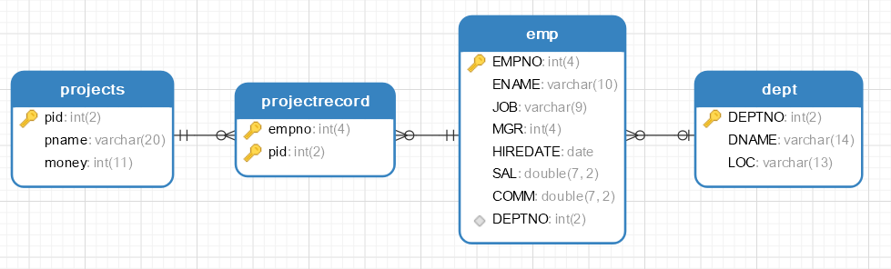

#### 8.1.3 一对一关联查询

需求:根据编号查询员工信息及所在的部门信息

##### 8.1.3.1 编写实体类

实体类添加一个部门作为属性

```java
@AllArgsConstructor
@NoArgsConstructor
@Data
public class Emp implements Serializable {
    private Integer empno;
    private String ename;
    private String job;
    private Integer mgr;
    private Date hiredate;
    private Double sal;
    private Double comm;
    private Integer deptno;
    // 组合一个Dept对象作为自己的属性
    private Dept dept;
}
```

##### 8.1.3.2 编写接口

```java
public interface EmpMapper {

    /**
     * 根据员工编号查询员工的所有信息并携带所在的部门信息
     * @param empno 要查询的员工编号
     * @return Emp对象,组合了Dept对象作为属性,对部门信息进行存储
     */
    Emp findEmpJoinDeptByEmpno(int empno);
}
```

##### 8.1.3.3 编写SQL语句

```xml
<?xml version="1.0" encoding="UTF-8" ?>
<!DOCTYPE mapper
        PUBLIC "-//mybatis.org//DTD Mapper 3.0//EN"
        "http://mybatis.org/dtd/mybatis-3-mapper.dtd">

<mapper namespace="com.msb.mapper.EmpMapper">
    <!--Emp findEmpJoinDeptByEmpno(int empno);-->
    <resultMap id="empJoinDept" type="emp">
        <!--设置emp本身的八个属性的映射关系-->
        <id property="empno" column="empno"></id>
        <result property="ename" column="ename"></result>
        <result property="job" column="job"></result>
        <result property="sal" column="sal"></result>
        <result property="hiredate" column="hiredate"></result>
        <result property="mgr" column="mgr"></result>
        <result property="comm" column="comm"></result>
        <result property="deptno" column="deptno"></result>
        <!--
        association 处理一对一
        封装一对一信息关系的标签
        property  emp类的属性名
        javaType  用哪个类的对象给属性赋值
        -->
        <association property="dept" javaType="dept">
            <id column="deptno" property="deptno"></id>
            <result column="dname" property="dname"></result>
            <result column="loc" property="loc"></result>
        </association>
    </resultMap>

    <select id="findEmpJoinDeptByEmpno" resultMap="empJoinDept" >
        select * from
        emp e
        left join dept  d
        on e.deptno =d.deptno
        where empno = #{empno}
    </select>
</mapper>
```

##### 8.1.3.4 编写测试方法

```java
@Test
public void testOneToOne() throws ParseException {
    EmpMapper mapper = sqlSession.getMapper(EmpMapper.class);
    Emp emp = mapper.findEmpJoinDeptByEmpno(7499);
    System.out.println(emp);
}
```

##### 8.1.3.4 小结

* `association`  处理一对一

  封装一对一信息关系的标签

  * `property`  emp类的属性名
  *  `javaType`  用哪个类的对象给属性赋值

#### 8.1.4 一对多关联查询

根据部门号查询部门信息及该部门的所有员工信息

##### 8.1.4.1 编写实体类

```java
@Data
@AllArgsConstructor
@NoArgsConstructor
public class Dept implements Serializable {
    private Integer deptno;
    private String dname;
    private String loc;

    // 组合一个Emp的List集合作为属性
    private List<Emp> empList;
}
```

##### 8.1.4.2 编写接口

```java
package com.msb.mapper;

import com.msb.pojo.Dept;

public interface DeptMapper {
    /**
     * 根据部门编号查询部门信息及该部分的所有员工信息
     * @param deptno 要查询的部门编号
     * @return Dept对象,内部组合了一个Emp的List属性用于封装部门的所有员工信息
     */
    Dept findDeptJoinEmpsByDeptno(int deptno);
}
```

##### 8.1.4.3 编写SQL语句

```xml
<?xml version="1.0" encoding="UTF-8" ?>
<!DOCTYPE mapper
        PUBLIC "-//mybatis.org//DTD Mapper 3.0//EN"
        "http://mybatis.org/dtd/mybatis-3-mapper.dtd">

<mapper namespace="com.msb.mapper.DeptMapper">
    <!--Dept findDeptJoinEmpsByDeptno(int deptno);-->
    <resultMap id="deptJoinEmps" type="dept">
        <id column="deptno" property="deptno"></id>
        <result column="dname" property="dname"></result>
        <result column="loc" property="loc"></result>
        <!--处理一对多关系的标签-->
        <collection property="empList" ofType="emp" >
            <!--设置emp本身的八个属性的映射关系-->
            <id property="empno" column="empno"></id>
            <result property="ename" column="ename"></result>
            <result property="job" column="job"></result>
            <result property="sal" column="sal"></result>
            <result property="hiredate" column="hiredate"></result>
            <result property="mgr" column="mgr"></result>
            <result property="comm" column="comm"></result>
            <result property="deptno" column="deptno"></result>
        </collection>
    </resultMap>

    <select id="findDeptJoinEmpsByDeptno" resultMap="deptJoinEmps">
        select * from dept d left join emp e on d.deptno =e.deptno where d.deptno =#{deptno}
    </select>
</mapper>
```

##### 8.1.4.4 编写测试方法

```java
@Test
public void testOneToMany() throws ParseException {
    DeptMapper mapper = sqlSession.getMapper(DeptMapper.class);
    Dept dept = mapper.findDeptJoinEmpsByDeptno(20);
    System.out.println(dept);
    System.out.println("---------");
    List<Emp> empList = dept.getEmpList();
    empList.forEach(System.out::println);
}
```

##### 8.1.4.5 小结

`collection` 处理一对多

封装一对多信息关系的标签

* `property`  Dept类的属性名
*  `ofType` 用哪个类的对象给属性赋值

#### 8.1.5 多对多关联查询

根据项目编号查询项目信息,以及参与到该项目之中的所有的员工信息

##### 8.1.5.1 编写实体类

```java
@NoArgsConstructor
@AllArgsConstructor
@Data
public class Project  implements Serializable {
    private Integer pid;
    private String pname;
    private Integer money;

    // 组合一个ProjectRecord对象集合作为属性
    private List<ProjectRecord> projectRecords;

}


@Data
@AllArgsConstructor
@NoArgsConstructor
public class ProjectRecord implements Serializable {
    private Integer empno;
    private Integer pid;

    // 组合一个Emp对象作为属性
    private Emp emp;
}
```

##### 8.1.5.2 编写接口

```java
public interface ProjectMapper {
    /**
     * 根据项目编号查询一个项目信息及参与该项目的所有员工信息
     * @param pid 项目编号
     * @return 所有信息封装的Project对象
     */
    Project findProjectJoinEmpsByPid(int pid);
}
```

##### 8.1.5.3 编写SQL语句

```xml
<?xml version="1.0" encoding="UTF-8" ?>
<!DOCTYPE mapper
        PUBLIC "-//mybatis.org//DTD Mapper 3.0//EN"
        "http://mybatis.org/dtd/mybatis-3-mapper.dtd">

<mapper namespace="com.msb.mapper.ProjectMapper">

    <!--Project findProjectJoinEmpsByPid(int pid);-->
    <resultMap id="projectJoinEmps" type="project">
        <id column="pid" property="pid"></id>
        <result column="pname" property="pname"></result>
        <result column="money" property="money"></result>
        <!--一对多 集合属性 collection-->
        <collection property="projectRecords" ofType="projectRecord">
            <id column="empno" property="empno"></id>
            <id column="pid" property="pid"></id>
            <!--一对一 -->
            <association property="emp" javaType="emp">
                <id property="empno" column="empno"></id>
                <result property="ename" column="ename"></result>
                <result property="job" column="job"></result>
                <result property="sal" column="sal"></result>
                <result property="hiredate" column="hiredate"></result>
                <result property="mgr" column="mgr"></result>
                <result property="comm" column="comm"></result>
                <result property="deptno" column="deptno"></result>
            </association>
        </collection>

    </resultMap>

    <select id="findProjectJoinEmpsByPid"  resultMap="projectJoinEmps">
        select * from
        project p
        left join projectrecord pr
        on p.pid = pr.pid
        left join emp e
        on e.empno = pr.empno
        where p.pid= #{pid}
    </select>
</mapper>
```

##### 8.1.5.4 编写测试方法

```java
@Test
public void testManyToMany() throws ParseException {
    ProjectMapper mapper = sqlSession.getMapper(ProjectMapper.class);
    Project project = mapper.findProjectJoinEmpsByPid(2);
    System.out.println(project.getPid());
    System.out.println(project.getPname());
    System.out.println(project.getMoney());

    List<ProjectRecord> projectRecords = project.getProjectRecords();
    for (ProjectRecord projectRecord : projectRecords) {
        Emp emp = projectRecord.getEmp();
        System.out.println(emp);
    }
}
```


### 8.2 级联查询

​		级联查询，顾名思义，就是利于数据库表间的外键关联关系进行自动的级联查询操作。使用MyBatis实现级联查询，除了实体类增加关联属性外，还需要在映射文件中进行配置。

#### 8.2.1 立即加载

* 功能1：查询所有员工的信息（多对一关联）

  经过对比，发现经过在映射文件中配置，测试类的代码大大简化了，无序手动进行关联查询和组装数据了。

* 功能2：查询10号部门及其该部门员工信息。

##### 8.2.1.1 编写实体类

```java
@Data
@AllArgsConstructor
@NoArgsConstructor
public class Dept implements Serializable {
    private Integer deptno;
    private String dname;
    private String loc;
    // 当前部门下的所有员工对象的List集合
    private List<Emp> empList;
}


@Data
@AllArgsConstructor
@NoArgsConstructor
public class Emp implements Serializable {
    private Integer empno;
    private String ename;
    private String job;
    private Integer mgr;
    private Date hiredate;
    private Double sal;
    private Double comm;
    private Integer deptno;
}
```

##### 8.2.1.2 编写接口

```java
package com.msb.mapper;

import com.msb.pojo.Dept;
public interface DeptMapper {
    Dept findDeptByDeptno(int deptno);
}


package com.msb.mapper;
import com.msb.pojo.Emp;
import java.util.List;
public interface EmpMapper {
    List<Emp> findEmpsByDeptno(int deptno);
}
```

##### 8.2.1.3 编写SQL语句

```xml
<?xml version="1.0" encoding="UTF-8" ?>
<!DOCTYPE mapper
        PUBLIC "-//mybatis.org//DTD Mapper 3.0//EN"
        "http://mybatis.org/dtd/mybatis-3-mapper.dtd">
<mapper namespace="com.msb.mapper.DeptMapper">
    <!--Dept findDeptByDeptno(int deptno);
    select="com.msb.mapper.EmpMapper.findEmpsByDeptno" 调用的另一个SQL语句
    javaType="list"  实体类的属性数据类型
    column="deptno"  给另一个SQL语句传入的参数列
    jdbcType="INTEGER" 参数对应JDBC的数据类型
    fetchType="eager"  加载方式 eager 积极加载  lazy延迟加载-->
    <resultMap id="deptJoinEmps" type="dept">
        <id property="deptno" column="deptno"></id>
        <result property="dname" column="dname"></result>
        <result property="loc" column="loc"></result>

        <collection property="empList"
                    select="com.msb.mapper.EmpMapper.findEmpsByDeptno"
                    javaType="list"
                    column="deptno"
                    jdbcType="INTEGER"
                    fetchType="eager"
        >
        </collection>
    </resultMap>
    <select id="findDeptByDeptno" resultMap="deptJoinEmps">
        select * from dept where deptno =#{deptno}
    </select>
</mapper>


<?xml version="1.0" encoding="UTF-8" ?>
<!DOCTYPE mapper
        PUBLIC "-//mybatis.org//DTD Mapper 3.0//EN"
        "http://mybatis.org/dtd/mybatis-3-mapper.dtd">

<mapper namespace="com.msb.mapper.EmpMapper">
    <!--List<Emp> findEmpsByDeptno(int deptno);-->
    <select id="findEmpsByDeptno" resultType="emp">
        select * from emp where deptno =#{deptno}
    </select>
</mapper>
```

##### 8.2.1.4 编写测试方法

```java
@Test
public void testFindByDetpno()   {
    DeptMapper deptMapper = sqlSession.getMapper(DeptMapper.class);
    Dept dept = deptMapper.findDeptByDeptno(20);
    System.out.println(dept.getDname());
    System.out.println(dept.getDeptno());
    System.out.println(dept.getLoc());
    List<Emp> empList = dept.getEmpList();
    empList.forEach(System.out::println);
}
```

##### 8.2.1.5 小结

`collection` 处理级联查询

*  `select="com.msb.mapper.EmpMapper.findEmpsByDeptno"` 调用的另一个SQL语句
* `javaType="list"`   实体类的属性数据类型
* `column="deptno"`   给另一个SQL语句传入的参数列
* `jdbcType="INTEGER"`  参数对应JDBC的数据类型
* `fetchType="eager"` 加载方式 eager 积极加载  lazy延迟加载

#### 8.2.2 延迟加载

**延迟加载，又称按需加载。**延迟加载的内容等到真正使用时才去进行加载（查询）。多用在关联对象或集合中。

延迟加载的好处：先从单表查询、需要时再从关联表去关联查询，大大降低数据库在单位时间内的查询工作量,将工作在时间上的分配更加均匀，而且单表要比关联查询多张表速度要快。

**延迟加载的设置** 

* 第一步：

  全局开关：在`sqlMapConfig.xml` 中打开延迟加载的开关。配置完成后所有的`association`和`collection`元素都生效

  ```xml
  <settings>
      <setting name="lazyLoadingEnabled" value="true"/>
      <setting name="aggressiveLazyLoading" value="true"/>
  </settings>
  ```
  * **lazyLoadingEnabled**:  是否开启延迟加载。是Mybatis是否启用懒加载的全局开关。当开启时，所有关联对象都会延迟加载。特定关联关系中可通过设置`fetchType` 属性来覆盖该项的开关状态
  * **aggressiveLazyLoading**：当开启时，任何方法的调用都会懒加载对象的所有属性。否则，每个属性会按需加载

* 第二步：

  分开关：指定的`association`和`collection` 元素中配置**`fetchType`**属性。

  * eager：表示立刻加载
  * lazy：表示延迟加载。**将覆盖全局延迟设置**。

#### 8.2.3 多表查询总结与扩展

**resultMap中的常见属性** 

| **属性**        | **描述**                                                     |
| --------------- | ------------------------------------------------------------ |
| **property**    | 需要映射到JavaBean 的属性名称。                              |
| **javaType**    | property的类型，一个完整的类名，或者是一个类型别名。如果你匹配的是一个JavaBean，那MyBatis 通常会自行检测到。 |
| **column**      | 数据表的列名或者列别名。                                     |
| **jdbcType**    | column在数据库表中的类型。这个属性只在insert,update  或delete 的时候针对允许空的列有用。JDBC 需要这项，但MyBatis 不需要。 |
| **typeHandler** | 使用这个属性可以覆写类型处理器，实现javaType、jdbcType之间的相互转换。一般可以省略，会探测到使用的什么类型的typeHandler进行处理 |
| **fetchType**   | 自动延迟加载                                                 |
| **select**      | association、collection的属性，使用哪个查询查询属性的值，要求指定namespace+id的全名称 |
| **ofType**      | collection的属性，指明集合中元素的类型（即泛型类型）         |


**级联查询和多表查询的比较及其选择** 

|                 | **级联查询**       | **多表查询** |
| --------------- | ------------------ | ------------ |
| **SQL语句数量** | 多条               | 一条         |
| **性能**        | 性能低             | 性能高       |
| **延迟加载**    | 立即加载、延迟加载 | 只有立即加载 |
| **灵活性**      | 更灵活             | 不灵活       |
| **SQL难易度**   | 简单               | 复杂         |
| **选择依据**    | 简单、灵活         | 高性能       |


**ResultType和ResultMap使用场景** 

1) 如果你做的是单表的查询并且封装的实体和数据库的字段一一对应  `resultType` 

2) 如果实体封装的属性和数据库的字段不一致 `resultMap` 

3) 使用N+1级联查询的时候 `resultMap ` 

4) 使用的是多表的连接查询 `resultMap` 


**一对一关联映射的实现**

1) 实例：学生和学生证、雇员和工牌

2) 数据库层次：主键关联或者外键关联（参看之前内容）

3) MyBatis层次：在映射文件的设置双方均使用`association` 即可，用法相同

 

**多对多映射的实现**

1) 实例：学生和课程、用户和角色

2) 数据库层次：引入一个中间表将一个多对多转为两个一对多

3) MyBatis层次

   方法1：在映射文件的设置双方均使用`collection`即可，不用引入中间类

   方法2：引入中间类和中间类的映射文件，按照两个一对多处理


**自关联映射**

1) 实例：Emp表中的员工和上级。一般是一对多关联

2) 数据库层次：外键参考当前表的主键（比如mgr参考empno）

3) MyBatis层次：按照一对多处理，但是增加的属性都写到一个实体类中，增加的映射也都写到一个映射文件中


## 9. MyBatis注解开发

​		MyBatis编写SQL除了使用Mapper.xml还可以使用注解完成。当可以使用Auto Mapping时使用注解非常简单，不需要频繁的在接口和mapper.xml两个文件之间进行切换。但是必须配置resultMap时使用注解将会变得很麻烦，这种情况下推荐使用mapper.xml进行配置。

​		MyBatis支持纯注解方式，支持纯mapper.xml方式，也支持注解和mapper.xml混合形式。当只有接口没有mapper.xml时在mybatis.cfg.xml中可以通过`<mapper class=""></mapper>`加载接口类。如果是混合使用时，使用`<package name=""/>`。此方式一直是官方推荐方式。

如果某个功能同时使用两种方式进行配置，XML方式将覆盖注解方式


### 9.1 使用注解完成对Dept的CRUD操作

```java
public interface DeptMapper {
    Dept findDeptByDeptno(int deptno);
    
    @Select("select * from dept where deptno =#{deptno}")
    Dept findByDeptno(int deptno);

    @Update("update dept set dname =#{dname}, loc =#{loc} where deptno =#{deptno}")
    int updateDept(Dept dept);

    @Insert("insert into dept values(DEFAULT,#{dname},#{loc})")
    int addDept(Dept dept);

    @Delete("delete from dept where deptno =#{deptno}")
    int removeDept(int deptno);
}
```

> 1. 使用注解没有实现Java代码和SQL语句的解耦
>
> 2. 无法实现SQL语句的动态拼接
>
> 3. 进行多表的查询时定制ResultMap比较麻烦


**注解和XML的优缺点** 

|          | **XML**                                                      | **注解**                                                     |
| -------- | ------------------------------------------------------------ | ------------------------------------------------------------ |
| **优点** | 1.类和类之间的解耦  2.利于修改。直接修改XML文件，无需到源代码中修改。  3.配置集中在XML中，对象间关系一目了然，利于快速了解项目和维护  4.容易和其他系统进行数据交交换 | 1.简化配置  2.使用起来直观且容易，提升开发效率  3.类型安全，编译器进行校验，不用等到运行期才会发现错误。  4.注解的解析可以不依赖于第三方库，可以直接使用Java自带的反射 |


## 10. 缓存

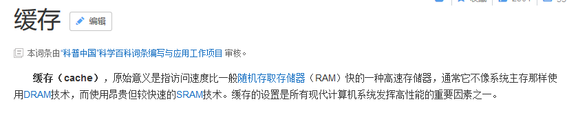

​		是一种临时存储少量数据至内存或者是磁盘的一种技术.减少数据的加载次数,可以降低工作量,提高程序响应速度

缓存的重要性是不言而喻的。mybatis的缓存将相同查询条件的SQL语句执行一遍后所得到的结果存在内存或者某种缓存介质当中，当下次遇到一模一样的查询SQL时候不在执行SQL与数据库交互，而是直接从缓存中获取结果，减少服务器的压力；尤其是在查询越多、缓存命中率越高的情况下，使用缓存对性能的提高更明显。

​		MyBatis允许使用缓存，缓存一般放置在高速读/写的存储器上，比如服务器的内存，能够有效的提供系统性能。		MyBatis分为一级缓存和二级缓存，同时也可配置关于缓存设置。

​		一级存储是`SqlSession`上的缓存，二级缓存是在`SqlSessionFactory(namespace)`上的缓存。默认情况下，MyBatis开启一级缓存，没有开启二级缓存。当数据量大的时候可以借助一些第三方缓存框架或Redis缓存来协助保存Mybatis的二级缓存数据。

 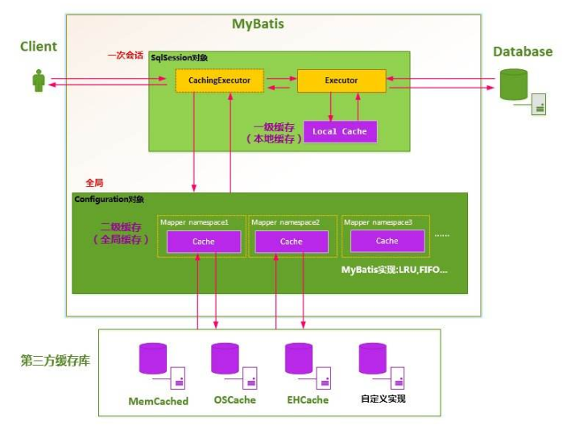


### 10.1  一级缓存

​		一级存储是SqlSession上的缓存，默认开启，是一种内存型缓存,不要求实体类对象实现Serializable接口。

缓存中的数据使用键值对形式存储数据

`namespace+sqlid+args+offset>>> hash` 值作为键,查询出的结果作为值

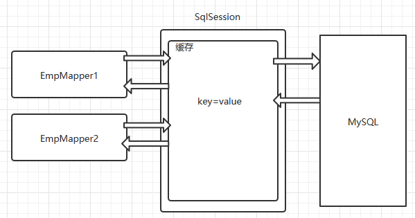

#### 10.1.1 编写测试方法

```java
@Test
public void testFindDeptByDetpno()   {
    EmpMapper mapper = sqlSession.getMapper(EmpMapper.class);
    Emp emp = mapper.findByEmpno(7521);
    System.out.println(emp);

    // 中间发生了增删改或者是调用了SqlSession调用了commit,会自动清空缓存
    sqlSession.commit();// 增删改的时候调用
    
    EmpMapper mapper2 = sqlSession.getMapper(EmpMapper.class);
    Emp emp2 = mapper2.findByEmpno(7521);
    System.out.println(emp2);

    System.out.println(emp==emp2);
    System.out.println(mapper==mapper2);
}
```


### 10.2  二级缓存

​		二级缓存是以`namespace`为标记的缓存，可以是由一个`SqlSessionFactory`创建的`SqlSession`之间共享缓存数据。默认并不开启。下面的代码中创建了两个SqlSession，执行相同的SQL语句，尝试让第二个SqlSession使用第一个SqlSession查询后缓存的数据。要求实体类必须实现序列化接口

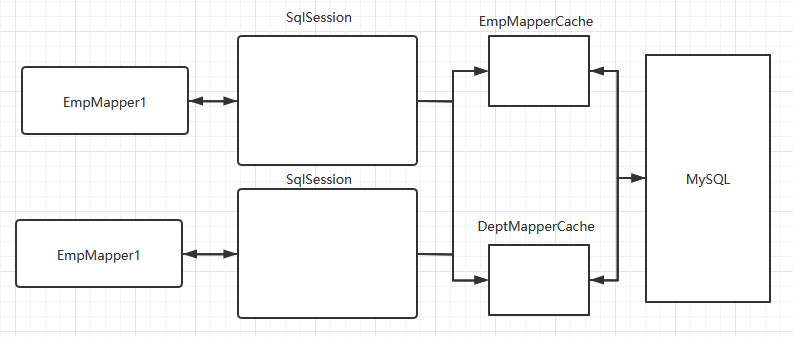

#### 10.2.1 编写接口

```java
public interface EmpMapper {
    Emp findByEmpno(int empno);
}
```

#### 10.2.2 编写SQL语句

```xml
<mapper namespace="com.msb.mapper.EmpMapper">
    <cache/>  <!--开启二级缓存-->

    <select id="findByEmpno" resultType="emp" useCache="true" flushCache="false">
        select * from emp where empno =#{empno}
    </select>

</mapper>
```

#### 10.2.3 编写测试方法

```java
public class Test3 {

    private SqlSession sqlSession;
    private SqlSession sqlSession2;
    @Before
    public void init(){
        SqlSessionFactoryBuilder ssfb =new SqlSessionFactoryBuilder();
        InputStream resourceAsStream = null;
        try {
            resourceAsStream = Resources.getResourceAsStream("sqlMapConfig.xml");
        } catch (IOException e) {
            e.printStackTrace();
        }
        SqlSessionFactory factory=ssfb.build(resourceAsStream) ;
        sqlSession=factory.openSession();
        sqlSession2=factory.openSession();
    }

    @Test
    public void testFindDeptByDetpno()   {
        EmpMapper mapper = sqlSession.getMapper(EmpMapper.class);
        Emp emp = mapper.findByEmpno(7521);
        System.out.println(emp);
        // SqlSession提交之后,才会将查询的结果放入二级缓存
        sqlSession.commit();

        EmpMapper mapper2 = sqlSession2.getMapper(EmpMapper.class);
        Emp emp2 = mapper2.findByEmpno(7521);
        System.out.println(emp2);
    }

    @After
    public void release(){
        // 关闭SQLSession
        sqlSession.close();
        sqlSession2.close();
    }
}
```

​		注意其中的`commit()` ，执行该命令后才会将该`SqlSession` 的查询结果从一级缓存中放入二级缓存，供其他`SqlSession`使用。另外执行`SqlSession`的`close()`也会将该`SqlSession`的查询结果从一级缓存中放入二级缓存。两种方式区别在当前`SqlSession`是否关闭了。

 

执行结果显示进行了两次对数据库的SQL查询，说明二级缓存并没有开启。需要进行如下步骤完成开启。

1. 全局开关：在`sqlMapConfig.xml`文件中的`<settings>`标签配置开启二级缓存

   ```xml
   <settings>
       <setting name="cacheEnabled" value="true"/>
   </settings>
   ```

   cacheEnabled的默认值就是true，所以这步的设置可以省略。

2. 分开关：在要开启二级缓存的`mapper`文件中开启缓存：

   ```xml
   <mapper namespace="com.msb.mapper.EmployeeMapper">
       <cache/>
   </mapper>
   ```

3. 二级缓存未必完全使用内存,有可能占用硬盘存储,缓存中存储的JavaBean对象必须实现序列化接口

   ```java
   public class Emp implements  Serializable {  }
   ```

​          经过设置后，查询结果如图所示。发现第一个`SqlSession`会首先去二级缓存中查找，如果不存在，就查询数据库，**在commit()或者close()的时候将数据放入到二级缓存**。第二个`SqlSession`执行相同SQL语句查询时就直接从二级缓存中获取了。

> 注意：
>
> 1) MyBatis的二级缓存的缓存介质有多种多样，而并不一定是在内存中，所以需要对JavaBean对象实现序列化接口。
>
> 2) 二级缓存是以 namespace 为单位的，不同 namespace 下的操作互不影响
>
> 3) 加入Cache元素后，会对相应命名空间所有的select元素查询结果进行缓存，而其中的insert、update、delete在操作是会清空整个namespace的缓存。
>
> 4) cache 有一些可选的属性 type, eviction, flushInterval, size, readOnly, blocking。
> 5) 如果在加入Cache元素的前提下让个别select 元素不使用缓存，可以使用useCache属性，设置为false。**useCache控制当前sql语句是否启用缓存  flushCache控制当前sql执行一次后是否刷新缓存** 

```xml
<cache type="" readOnly="" eviction=""flushInterval=""size=""blocking=""/>
```

| **属性**      | 含义                                                         | 默认值 |
| ------------- | ------------------------------------------------------------ | ------ |
| type          | 自定义缓存类，要求实现org.apache.ibatis.cache.Cache接口      | null   |
| readOnly      | 是否只读  true:给所有调用者返回缓存对象的相同实例。因此这些对象不能被修改。这提供了很重要的性能优势。  false:会返回缓存对象的拷贝(通过序列化) 。这会慢一些,但是安全 | false  |
| eviction      | 缓存策略  LRU（默认） – 最近最少使用：移除最长时间不被使用的对象。  FIFO – 先进先出：按对象进入缓存的顺序来移除它们。  SOFT – 软引用：基于垃圾回收器状态和软引用规则移除对象。  WEAK – 弱引用：更积极地基于垃圾收集器状态和弱引用规则移除对象。 | LRU    |
| flushInterval | 刷新间隔，毫秒为单位。默认为null，也就是没有刷新间隔，只有执行update、insert、delete语句才会刷新 | null   |
| size          | 缓存对象个数                                                 | 1024   |
| blocking      | 是否使用阻塞性缓存BlockingCache  true：在查询缓存时锁住对应的Key，如果缓存命中了则会释放对应的锁，否则会在查询数据库以后再释放锁，保证只有一个线程到数据库中查找指定key对应的数据  false：不使用阻塞性缓存，性能更好 | false  |

```xml
<select id="findByEmpno" resultType="emp" useCache="true" flushCache="false">
```


### 10.3  三方缓存

​		分布式缓存框架：我们系统为了提高系统并发 和性能，一般对系统进行分布式部署（集群部署方式）不适用分布缓存， 缓存的数据在各个服务单独存储，不方便系统开发。所以要使用分布式缓存对缓存数据进行集中管理.ehcache,redis ,memcache缓存框架。


## 11. 逆向工程

​		MyBatis的一个主要的特点就是需要程序员自己编写SQL，那么如果表太多的话，难免会很麻烦，所以MyBatis官方提供了一个逆向工程，可以针对单表自动生成MyBatis执行所需要的代码（包括mapper.xml，mapper.java，pojo）。一般在开发中，常用的逆向工程方式是通过数据库的表生成代码。


**创建maven项目导入逆向工程依赖** 

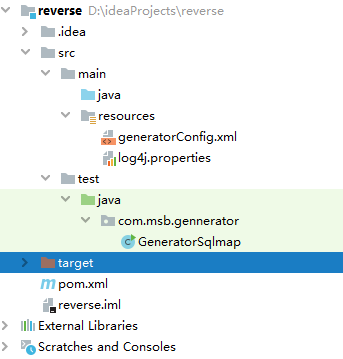

导入依赖

```xml
<dependencies>
    <!-- mysql驱动包 -->
    <dependency>
        <groupId>mysql</groupId>
        <artifactId>mysql-connector-java</artifactId>
        <version>8.0.16</version>
    </dependency>

    <!-- 日志包，方便查看执行信息-->
    <dependency>
        <groupId>org.slf4j</groupId>
        <artifactId>slf4j-log4j12</artifactId>
        <version>1.6.1</version>
    </dependency>

    <!-- 代码生成工具jar -->
    <dependency>
        <groupId>org.mybatis.generator</groupId>
        <artifactId>mybatis-generator-core</artifactId>
        <version>1.3.2</version>
    </dependency>
</dependencies>
```

配置逆向工程配置文件 在resources目录下放置一个名为generatorConfig.xml的配置文件,文件内容如下:

```xml
<?xml version="1.0" encoding="UTF-8"?>
<!DOCTYPE generatorConfiguration
  PUBLIC "-//mybatis.org//DTD MyBatis Generator Configuration 1.0//EN"
  "http://mybatis.org/dtd/mybatis-generator-config_1_0.dtd">

<generatorConfiguration>
   <context id="testTables" targetRuntime="MyBatis3">
      <commentGenerator>
         <!-- 是否去除自动生成的注释 true：是 ： false:否 -->
         <property name="suppressAllComments" value="true" />
      </commentGenerator>
      <!--数据库连接的信息：驱动类、连接地址、用户名、密码 -->
      <!-- <jdbcConnection driverClass="com.mysql.jdbc.Driver"
         connectionURL="jdbc:mysql://localhost:3306/mybatis" userId="root"
         password="123">
      </jdbcConnection> -->
       <jdbcConnection driverClass="com.mysql.cj.jdbc.Driver"
         connectionURL="jdbc:mysql://127.0.0.1:3306/mydb?useSSL=false&amp;useUnicode=true&amp;characterEncoding=UTF-8&amp;serverTimezone=Asia/Shanghai&amp;allowPublicKeyRetrieval=true"
         userId="root"
         password="root">
      </jdbcConnection> 

      <!-- 默认false，把JDBC DECIMAL 和 NUMERIC 类型解析为 Integer，为 true时把JDBC DECIMAL 和 
         NUMERIC 类型解析为java.math.BigDecimal -->
      <javaTypeResolver>
         <property name="forceBigDecimals" value="false" />
      </javaTypeResolver>

      <!-- targetProject:生成PO类的位置 -->
      <javaModelGenerator targetPackage="com.msb.pojo"
         targetProject=".\src">
         <!-- enableSubPackages:是否让schema作为包的后缀 -->
         <property name="enableSubPackages" value="false" />
         <!-- 从数据库返回的值被清理前后的空格 -->
         <property name="trimStrings" value="true" />
      </javaModelGenerator>
        <!-- targetProject:mapper映射文件生成的位置 -->
      <sqlMapGenerator targetPackage="com.msb.mapper"
         targetProject=".\src">
         <!-- enableSubPackages:是否让schema作为包的后缀 -->
         <property name="enableSubPackages" value="false" />
      </sqlMapGenerator>
      <!-- targetPackage：mapper接口生成的位置 -->
      <javaClientGenerator type="XMLMAPPER"
         targetPackage="com.msb.mapper"
         targetProject=".\src">
         <!-- enableSubPackages:是否让schema作为包的后缀 -->
         <property name="enableSubPackages" value="false" />
      </javaClientGenerator>
      <!-- 指定数据库表 -->
      
      <table tableName="dept" domainObjectName="Dept"
       enableCountByExample="false" enableUpdateByExample="false" enableDeleteByExample="false"    
               enableSelectByExample="false" selectByExampleQueryId="false" >
               <columnOverride column="id" javaType="Integer" />
         </table> 
   </context>
</generatorConfiguration>
```

在resources目录下放置一个名为log4j.properties的配置文件,文件内容如下

```properties
log4j.rootLogger=debug,stdout

log4j.appender.stdout=org.apache.log4j.ConsoleAppender
log4j.appender.stdout.Target=System.err
log4j.appender.stdout.layout=org.apache.log4j.SimpleLayout

log4j.appender.logfile=org.apache.log4j.FileAppender
log4j.appender.logfile.File=d:/msb.log
log4j.appender.logfile.layout=org.apache.log4j.PatternLayout
log4j.appender.logfile.layout.ConversionPattern=%d{yyyy-MM-dd HH:mm:ss} %l %F %p %m%n
```

运行逆向工程代码

```java
package com.msb.gennerator;

import org.mybatis.generator.api.MyBatisGenerator;
import org.mybatis.generator.config.Configuration;
import org.mybatis.generator.config.xml.ConfigurationParser;
import org.mybatis.generator.internal.DefaultShellCallback;

import java.io.File;
import java.util.ArrayList;
import java.util.List;

/**
 *
 */
public class GeneratorSqlmap {
    public void generator() throws Exception{
        List<String> warnings = new ArrayList<String>();
        boolean overwrite = true;

        File configFile = new File("D:\\ideaProjects\\reverse\\target\\classes\\generatorConfig.xml");
        ConfigurationParser cp = new ConfigurationParser(warnings);
        Configuration config = cp.parseConfiguration(configFile);
        DefaultShellCallback callback = new DefaultShellCallback(overwrite);
        MyBatisGenerator myBatisGenerator = new MyBatisGenerator(config,
                callback, warnings);
        myBatisGenerator.generate(null);

    }
    public static void main(String[] args) throws Exception {
        try {
            GeneratorSqlmap generatorSqlmap = new GeneratorSqlmap();
            generatorSqlmap.generator();
        } catch (Exception e) {
            e.printStackTrace();
        }
    }
}
```

生成的实体类和Mapper接口和Mapper映射文件,包含了基本的CURD功能,哪里需要文件就放哪里

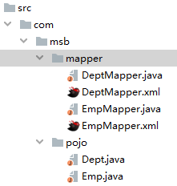

## 12. main目录下XML文件编译问题

```xml
<build>
    <!--告诉maven将项目源码中的xml文件也进行编译，并放到编译目录中-->
    <resources>
        <resource>
            <directory>src/main/java</directory>
            <includes>
                <include>**/*.xml</include>
            </includes>
            <filtering>true</filtering>
        </resource>
        <resource>
            <directory>src/main/resources</directory>
            <filtering>true</filtering>
        </resource>
    </resources>
</build>
```

