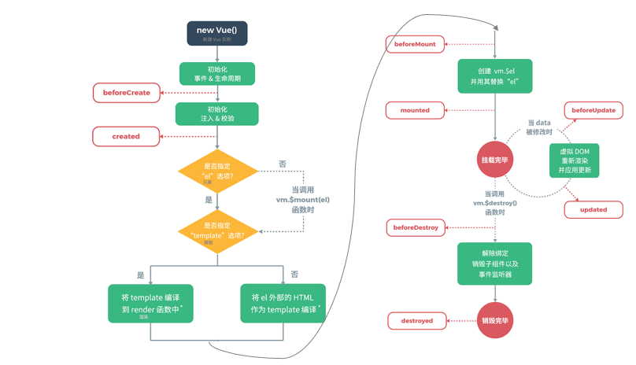

# Vue框架


## 一、Vue框架基本使用

​		注意：Vue它是属于前端当中的一个JavaScript框架，源码都封装到了一个尾缀为JS这样一样的文件里面。

因此我们需要获取到源码.

```Vue
<!DOCTYPE html>
<html lang="en">

<head>
    <meta charset="UTF-8">
    <meta name="viewport" content="width=device-width, initial-scale=1.0">
    <meta http-equiv="X-UA-Compatible" content="ie=edge">
    <title>Document</title>
    <!-- 引入Vue源码（引包） -->
    <script src="./js/vue.min.js"></script>
</head>

<body>
    <!-- 页面标签布局 -->
    <div id="app">
        <h1>我是Vue,我今年{{age}}岁了</h1>
    </div>
</body>

</html>
<script>
    //Vue框架对外暴露了一个Vue构造函数
    //通过这个Vue构造函数，创建实例
    var vm = new Vue({
        //el:挂载点设置（将Vue实例）和结构层中标签进行挂在
        el: "#app",
        //实例数据来源
        data: {
            age: 100
        }
    });
    //修改实例age属性值
    vm.age = 23;
    vm.age = 99999;
</script>
```


## 二、Vue框架中常用指令

​		概述：Vue框架给我们提供了很多指令，都是以v-xxx开头（为什么是以V开头，因为是由Vue提供的），Vue提供这些指令其实都是作为标签属性直接使用；

​		指令：指令是由Vue提供的，主要的作用是可以操作标签（文本、样式、事件等等）

```html
<div id=’box’ class=’cur’>我是div</div>
```


### 2.1 常用指令

| **指令**    | **作用**                                            |
| ----------- | :-------------------------------------------------- |
| `v-text`    | 更新标签文本内容                                    |
| ` v-bind`   | 为HTML标签绑定属性值，如设置  href  , css样式等     |
| `v-model`   | 在表单元素上创建双向数据绑定                        |
| ` v-on`     | 为HTML标签绑定事件                                  |
| `v-if `     | 条件性的渲染某元素，判定为true时渲染,否则不渲染     |
| `v-else `   | 条件性的渲染某元素，判定为true时渲染,否则不渲       |
| `v-else-if` | 条件性的渲染某元素，判定为true时渲染,否则不渲染     |
| `v-show`    | 根据条件展示某元素，区别在于切换的是display属性的值 |
| `v-for`     | 列表渲染，遍历容器的元素或者对象的属性              |

#### 2.1.1 v-text

更新标签文本内容

```html
<div id="app">
    <p v-text="msg"></p>
    <p>{{msg}}</p>
    <p v-html="msg"></p>
</div>
```

```javascript
<script>
    //创建Vue实例
    var vm = new Vue({
        el: "#app",
        data: {
            msg: "<a href='http://www/baidu.com'>百度</a>"
        }
    })
</script>
```

* `v-text:` 它可以更新标签文本内容【简写的方式是双大括号】
* `v-html:` 它也可以更新标签文本内筒【如果渲染数据为标签形式字符串，会真的渲染为标签】

#### 2.1.2 v-bind

为HTML标签绑定属性值，如设置  href  , css样式等  

```html
<!-- 绑定 attribute -->


<!-- 动态 attribute 名 -->
<button v-bind:[key]="value"></button>
```

```html
<!-- 缩写 -->


<!-- 动态 attribute 名缩写 -->
<button :[key]="value"></button>
```

#### 2.1.3 v-model

在表单元素上创建双向数据绑定

```html
<input v-model="message" placeholder="edit me" />
<p>Message is: {{ message }}</p>
```

#### 2.1.4 v-on

为HTML标签绑定事件

```html
<input type="button" value="一个按钮" v-on:click="show()">
```

```html
<input type="button" value="一个按钮" @click="show()">
```

```vue
<script>
    var vm = new Vue({
        el: "#app",
        methods: {
            show(){
                alert("我被点了");
            }
        }
    });
</script>
```

#### 2.1.5 v-if、v-else、v-else-if

条件性的渲染某元素，判定为true时渲染,否则不渲染

```html
<div v-if="count == 3">div1</div>
<div v-else-if="count == 2">div2</div>
<div v-else>div3</div>
```

> 注：它和v-show区别：显示与隐藏的标签（在节点树上始终是有的）
>
> ​    v-if控制标签在节点树上上树、下树操作。

#### 2.1.6 v-show

根据条件展示某元素，区别在于切换的是display属性的值

```html
<div v-show="count == 3">div4</div>
```

#### 2.1.7 v-for

列表渲染，遍历容器的元素或者对象的属性

```html
<div v-for="addr in addrs">
    {{addr}}<br>
</div>
```

* **加索引**

```html
<div v-for="(addr,i) in addrs">
    <!--i 表示索引，从0开始-->
    {{i + 1}} : {{addr}}<br>
</div>
```


## 三、生命周期

​		概述：在Vue实例和模板DOM标签进行关联的时候，其实这个阶段经历很多种状态，可以通过Vue框架提供生命周期函数，可以在不同的状态下，书写自己业务代码即可。

> 注意：在特定的条件下执行函数而已。（面试常问道：八个）


生命周期的八个阶段：每触发一个生命周期事件，会自动执行一个生命周期方法(钩子)

| 状态            | 阶段周期 |
| --------------- | -------- |
| `beforeCreate`  | 创建前   |
| `created`       | 创建后   |
| `beforeMount`   | 载入前   |
| `mounted`       | 挂载完成 |
| `beforeUpdate`  | 更新前   |
| `updated`       | 更新后   |
| `beforeDestroy` | 销毁前   |
| `destroyed`     | 销毁后   |




## 四、Vue当中AJAX技术实现

​	概述：AJAX：它是前端当中一门技术，客户端可以悄悄的想服务器端发起上行请求，服务器端接收到请求做出响应的响应，在页面没有重新加载的情况下实现页面局部更新。

​		Vue2.0版本以后，当时Vue当中AJAX技术，经常使用axios第三放实现AJAX技术（底层使用promise进行封装）。

​		`axios`: 它是Vue当中经常使用第三方JavaScript函数库，它主要作用是可以向服务器端发起请求。

下载axios源码方式：

CDN：百度静态资源库（百度公司给提供网站：各种常用前端源码文件都有）

https://www.bootcdn.cn/


