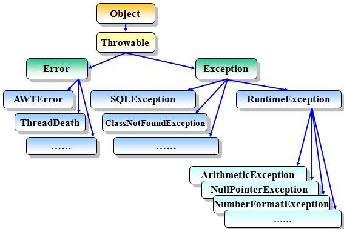

# 深入理解Java异常

## 一、异常框架

异常时什么？就是指阻止当前方法或作用域继续执行的问题,当程序运行时出现异常时,系统就会自动生成一个Exception对象来通知程序进行相应的处理。Java异常的类型有很多种，下面我们就使用一张图来看一下Java异常的继承层次结构：



### 1.1 Throwable

**`Throwable`**  是 Java 语言种所有的错误 (**`Error`**) 和异常 (**`Exception`**) 的超类。

在 Java 中只有 **`Throwable`** 类型的实例才能可以被抛出 (**`throw`** ) 或者捕捉 (**`catch`**) , 它是异常处理机制的基本组成类型。

**`Throwable`** 包含了其线程创建时线程执行堆栈的快照，它提供了 **`printStackTrace()`** 等接口用于获取堆栈跟踪数据等信息。

**主要方法: ** 

* `fillInStackTrace` - 用当前的调用栈层次填充 `Throwable` 对象栈层次，添加到栈层次任何先前信息中。
* `getMessage` - 返回关于发生的异常的详细信息。这个消息在 `Throwable` 类的构造函数种初始化了。
* `getCause` - 返回一个 `Throwable` 对象代表异常原因
* `printStackTrace` - 打印 `toString()` 结果和栈层次到 `System.err`, 即错误输出流。
* `toString` - 使用 `getMessage` 的结果返回代表 `Throwable` 对象的字符串。


### 1.2 Error

`Error` 是 `Throwable` 一个子类。 **`Error` 表示正常情况下，不大可能出现的严重问题。编译器不会检查 `Error`** 。 绝大部分的 Error 都会导致程序 (比如 JVM 自身) 处于非正常的、不可恢复状态。既然是非正常情况，所以不便于也不需要捕获，常见的比如 OutOfMemoryError 之类，都是 Error 的子类。

**常见 `Error` :** 

* `AssertionError` - 断言错误。
* `VirtualMachineError` - 虚拟机错误
* `UnsupportedClassVersionError` - Java 类版本错误
* `StackOverflowError` - 栈溢出错误
* `OutOfMemoryError` - 内存溢出错误


### 1.3 Exception

`Exception` 是 `Throwable` 的一个子类。 `Exception` 表示合理的应用程序可能想要捕获的条件。`Exception` 是程序正常运行中，可以预料的意外情况，可能并且应该被捕获，进行相应处理。

`Exception` 又分为可检查 (**checked**) 异常和不检查 (**unchecked**) 异常，可检查异常在源代码里必须显示地进行捕获处理，这是编译期检查的一部分。

**编译器会检查 `Exception` 异常。** 此类异常，要么通过 `throws` 进行声明抛出，要么通过 `try catch` 进行捕获处理，否则不能通过编译。

**常见 `Exception` :** 

* `ClassNotFoundException` - 应用程序试图加载类时，找不到相应的类，抛出异常。
* `CloneNotSupportedException` - 当调用 Object 类中的 clone 方法克隆对象，但该对象的类无法实现 Cloneable 接口时，抛出该异常。
* `IllegalAccessException` - 拒绝访问一个类的时候，抛出该异常。
* `InstantiationException` - 当试图使用 Class 类种的 newInstance 方法创建一个类的实例，而指定的类对象因为是一个接口或是一个抽象类而无法实例化时，抛出该异常。
* `InterrupteException` - 一个线程被另一个线程中断，抛出该异常。
* `NoSuchFieldException` - 请求的变量不存在。
* `NoSuchMethodException` - 请求的方法不存在。

示例: 

```java
public class ExceptionDemo {
    public static void main(String[] args) {
        Method method = String.class.getMethod("toString", int.class);
    }
}
```

试图运行时会报错:

```java
Error:(7, 47) java: 未报告的异常错误java.lang.NoSuchMethodException; 必须对其进行捕获或声明以便抛出
```


### 1.4 RuntimeException

`RuntimeException` 是 `Exception` 的一个子类。`RuntimeException` 是那些可能在 Java 虚拟机正常运行期间抛出的异常的超类。

**编译器不会检查 `RuntimeException` 异常。** 当程序中可能出现这类异常，倘若既没有通过 `throws` 声明抛出它，也没有用 `try catch` 语句捕获它，程序还是会编译通过。

示例:

```java
public class RuntimeExceptionDemo {
    public static void main(String[] args) {
        // 此数产生了异常
        int result = 10 / 0;
        System.out.println("两个数字相除的结果: " + result);
        System.out.println("---------------------------------------------");
    }
}
```

运行时输出:

```
Exception in thread "main" java.lang.ArithmeticException: / by zero
	at io.github.dunwu.javacore.exception.RumtimeExceptionDemo01.main(RumtimeExceptionDemo01.java:6)
```

**常见 `RuntimeException`** 

* `ArrayIndexOutOfBoundsException` - 用非法索引访问数组时抛出的异常。如果索引为负或大于等于数组大小，则该索引为非法缩影。
* `ArrayStoreException` - 试图将错误类型的对象存储到一个对象数组时抛出的异常。
* `ClassCastException` - 当试图将对象强制转换为不是实例的子类时，抛出该异常。
* `IllegalArgumentException` - 抛出的异常表明向方法传递了一个不合法或不正确的参数
* `IllegalMonitorStateException` - 抛出的异常表明某一线程已经试图等待对象的监视器，或者试图通知其他正在等待对象的监视器而本身没有指定监视器的线程。
* `IllegalStateException` - 在非法或不适当的时间调用方法的产生的信号。换句话说，即 Java 环境或 Java 应用程序没有处于请求操作所要求的适当状态下。
* `IllegalThreadStateException` - 线程没有处于请求操作所要求的适当状态时抛出的异常。
* `IndexOutOfBoundsException` - 指示某排序索引（例如对数组、字符串或向量的排序）超出范围时抛出。
* `NegativeArraySizeException` - 如果应用程序试图创建大小为负的数组，则抛出该异常。
* `NullPointerException` - 当应用程序试图在需要对象的地方使用 null 时，抛出该异常
* `NumberFormatException` - 当应用程序试图将字符串转换成一种数值类型，但该字符串不能转换为适当格式时，抛出该异常。
* `SecurityException` - 由安全管理器抛出的异常，指示存在安全侵犯。
* `StringIndexOutOfBoundsException` - 此异常由 String 方法抛出，指示索引或者为负，或者超出字符串的大小。
* `UnsupportedOperationException` - 当不支持请求的操作时，抛出该异常。


## 二、自定义异常

**自定义一个异常类，只需要继承 `Exception` 或 `RuntimeException` 即可** 

示例: 

```java
public class MyExceptionDemo {
    public static void main(String[] args) {
        throw new MyException("自定义异常");
    }
    
    static class MyException extends RuntimeException {
        public MyException( String message) {
            super (message);
        }
    }
}
```

输出

```java
Exception in thread "main" io.github.dunwu.javacore.exception.MyExceptionDemo$MyException: 自定义异常
	at io.github.dunwu.javacore.exception.MyExceptionDemo.main(MyExceptionDemo.java:9)
```


## 三、抛出异常

如果想在程序中明确地抛出异常，需要用到 `throw` 和 `throws`。 

如果一个方法没有捕获一个检查性异常，那么该方法必须使用 `throws` 关键字类声明。 `throws` 关键字放在方法签名的尾部。

### 3.1 throws 关键字

如果在当前方法不知道该如何处理该异常时，则可以使用throws对异常进行抛出给调用者处理或者交给JVM。JVM对异常的处理方式是：打印异常的跟踪栈信息并终止程序运行。 throws在使用时应处于方法签名之后使用，可以抛出多种异常并用英文字符逗号’,’隔开。下面是一个例子：

```java
public void f() throws ClassNotFoundException,IOException{}
```

这样我们调用f()方法的时候必须要catch-ClassNotFoundException和IOException这两个异常或者catch-Exception基类。

> 注意：
>  throws的这种使用方式只是Java编译期要求我们这样做的，我们完全可以只在方法声明中throws相关异常，但是在方法里面却不抛出任何异常，这样也能通过编译，我们通过这种方式间接的绕过了Java编译期的检查。这种方式有一个好处：为异常先占一个位置，以后就可以抛出这种异常而不需要修改已有的代码。在定义抽象类和接口的时候这种设计很重要，这样派生类或者接口实现就可以抛出这些预先声明的异常。


`throw` 示例：

```java
public class ThrowDemo {
    public static void f () {
        try {
            thow new RuntimeException("抛出一个异常");
        } catch (Exception e) {
            System.out.println (e);
        }
    }
    public static void main(String[] args) {
        f();
    }
}
```

输出:

```java
java.lang.RuntimeException: 抛出一个异常
```

也可以使用 `throw` 关键字抛出一个异常，无论它是新实例化的还是刚捕获的。

`throws` 示例: 

```java
public class ThrowsDemo {
    public static void f1 () throws NosuchMethodException, NosuchFieldException {
        Field field = Integer.class.getDeclearField("digits");
        if (field ！= null) {
            System.out.println("反射获取 digits 方法成功");
        }
        Method method  =  String.class.getMethod("toString", int.class);
        if (method != null) {
            System.out.println ("反射获取 toString 方法成功");
        }
    }
    public static void f2() {
        try {
            // 调用 f1 处，如果不用 try catch, 编译时会报错
            f1();
        } catch (NoSuchMethodException e) {
            e.printStackTrace();
        } catch (NosuchFieldException e) {
            e.printStackTrace();
        }
    }
    public static void main(String[] args){
        f2();
    }
}
```

输出:

```java
反射获取 digits 方法成功
java.lang.NoSuchMethodException: java.lang.String.toString(int)
	at java.lang.Class.getMethod(Class.java:1786)
	at io.github.dunwu.javacore.exception.ThrowsDemo.f1(ThrowsDemo.java:12)
	at io.github.dunwu.javacore.exception.ThrowsDemo.f2(ThrowsDemo.java:21)
	at io.github.dunwu.javacore.exception.ThrowsDemo.main(ThrowsDemo.java:30)
```

> throw 和 throws 的区别
>
> * throws 使用在函数上，throw 使用在函数内。
> * throws 后面跟异常类，可以跟多个，用逗号区别；throw 后面跟的是异常对象。


## 四、捕获异常

**使用 try 和 catch 关键字可以捕获异常。** try catch 代码块放在异常可能发生的地方。

它的语法形式如下：

```java
try {
    // 可能会发生异常的代码块
} catch (Exception e1) {
    // 捕获并处理try抛出的异常类型Exception
} catch (Exception2 e2) {
    // 捕获并处理try抛出的异常类型Exception2
} finally {
    // 无论是否发生异常，都将执行的代码块
}
```

此外，JDK7 以后，`catch` 多种异常时，也可以像下面这样简化代码：

```java
try {
    // 可能会发生异常的代码块
} catch (Exception | Exception2 e) {
    // 捕获并处理try抛出的异常类型
} finally {
    // 无论是否发生异常，都将执行的代码块
}
```

- `try` - **`try` 语句用于监听。将要被监听的代码(可能抛出异常的代码)放在 `try` 语句块之内，当 `try` 语句块内发生异常时，异常就被抛出。**
- `catch` - `catch` 语句包含要捕获异常类型的声明。当保护代码块中发生一个异常时，`try` 后面的 `catch` 块就会被检查。
- `finally` - **`finally` 语句块总是会被执行，无论是否出现异常。**`try catch` 语句后不一定非要`finally` 语句。`finally` 常用于这样的场景：由于`finally` 语句块总是会被执行，所以那些在 `try` 代码块中打开的，并且必须回收的物理资源(如数据库连接、网络连接和文件)，一般会放在`finally` 语句块中释放资源。
- `try`、`catch`、`finally` 三个代码块中的局部变量不可共享使用。
- `catch` 块尝试捕获异常时，是按照 `catch` 块的声明顺序从上往下寻找的，一旦匹配，就不会再向下执行。因此，如果同一个 `try` 块下的多个 `catch` 异常类型有父子关系，应该将子类异常放在前面，父类异常放在后面。

示例：

```java
public class TryCatchFinallyDemo {
    public static void main(String[] args) {
        try {
            // 此处产生了异常
            int temp = 10 / 0;
            System.out.println("两个数字相除的结果：" + temp);
            System.out.println("----------------------------");
        } catch (ArithmeticException e) {
            System.out.println("出现异常了：" + e);
        } finally {
            System.out.println("不管是否出现异常，都执行此代码");
        }
    }
};
```

运行时输出：

```java
出现异常了：java.lang.ArithmeticException: / by zero
不管是否出现异常，都执行此代码
```


## 五、异常链

异常链是以一个异常对象为参数构造新的异常对象，新的异常对象将包含先前异常的信息。

通过使用异常链，我们可以提高代码的可理解性、系统的可维护性和友好性。

我们有两种方式处理异常，一是 `throws` 抛出交给上级处理，二是 `try…catch` 做具体处理。`try…catch` 的 `catch` 块我们可以不需要做任何处理，仅仅只用 throw 这个关键字将我们封装异常信息主动抛出来。然后在通过关键字 `throws` 继续抛出该方法异常。它的上层也可以做这样的处理，以此类推就会产生一条由异常构成的异常链。

【示例】

```java
public class ExceptionChainDemo {
    static class MyException1 extends Exception {
        public MyException1(String message) {
            super(message);
        }
    }
    
    static class MyException2 extends Exception {
        public MyException2(String message, Throwable cause) {
            super(message, cause);
        }
    }
    
    public static void f1() throws MyException1 {
        throw new MyException1("出现 MyException1");
    }
    
    public static void f2() throws MyException2 {
        try {
            f1();
        } catch (MyException1 e) {
            throw new MyException2("出现 MyException2", e);
        }
    }
    
   public static void main(String[] args) throws MyException2{
       f2();
   }
}
```

输出：

```java
Exception in thread "main" io.github.dunwu.javacore.exception.ExceptionChainDemo$MyException2: 出现 MyException2
	at io.github.dunwu.javacore.exception.ExceptionChainDemo.f2(ExceptionChainDemo.java:29)
	at io.github.dunwu.javacore.exception.ExceptionChainDemo.main(ExceptionChainDemo.java:34)
Caused by: io.github.dunwu.javacore.exception.ExceptionChainDemo$MyException1: 出现 MyException1
	at io.github.dunwu.javacore.exception.ExceptionChainDemo.f1(ExceptionChainDemo.java:22)
	at io.github.dunwu.javacore.exception.ExceptionChainDemo.f2(ExceptionChainDemo.java:27)
	... 1 more
```


## 六、异常注意事项

### 6.1 finally 覆盖异常

Java 异常处理中 `finally` 中的 `return` 会覆盖 `catch` 代码块中的 `return` 语句和 `throw` 语句，所以 Java **不建议在 `finally` 中使用 `return` 语句**。

此外 `finally` 中的 `throw` 语句也会覆盖 `catch` 代码块中的 `return` 语句和 `throw` 语句。

示例：

```java
public class FinallyOverrideExceptionDemo {
    static void f() throws Exception {
        try {
            throw new Exception("A");
        } catch (Exception e) {
            throw new Exception("B");
        } finally {
            throw new Exception("C");
        }
    }

    public static void main(String[] args) {
        try {
            f();
        } catch (Exception e) {
            System.out.println(e.getMessage());
        }
    }
}
```

输出:   C


### 6.2 覆盖抛出异常的方法

当Java异常遇到继承或者接口的时候是存在限制的，下面我们来看看有哪些限制。

* 规则一：子类在重写父类抛出异常的方法时，要么不抛出异常，要么抛出与父类方法相同的异常或该异常的子类。如果被重写的父类方法只抛出受检异常，则子类重写的方法可以抛出非受检异常。例如，父类方法抛出了一个受检异常IOException，重写该方法时不能抛出Exception，对于受检异常而言，只能抛出IOException及其子类异常，也可以抛出非受检异常。 我们通过例子来看下：

  ```java
  class A {  
      public void fun() throws Exception {}  
  }  
  class B extends A {  
      public void fun() throws IOException, RuntimeException {}  
  }
  ```

  父类抛出的异常包含所有异常，上面的写法正确。

  ```java
  class A {  
      public void fun() throws RuntimeException {}  
  }  
  class B extends A {  
      public void fun() throws IOException, RuntimeException {}  
  }
  ```

  子类IOException超出了父类的异常范畴，上面的写法错误。

  ```java
  class A {  
      public void fun() throws IOException {}  
  }  
  class B extends A {  
      public void fun() throws IOException, RuntimeException, ArithmeticException{}
  }
  ```

  RuntimeException不属于IO的范畴，并且超出了父类的异常范畴。但是RuntimeException和ArithmeticException属于运行时异常，子类重写的方法可以抛出任何运行时异常。所以上面的写法正确。

* 规则二：子类在重写父类抛出异常的方法时，如果实现了有相同方法签名的接口且接口中的该方法也有异常声明，则子类重写的方法要么不抛出异常，要么抛出父类中被重写方法声明异常与接口中被实现方法声明异常的交集。

  ```java
  class Test {
      public Test() throws IOException {}
      void test() throws IOException {}
  }
  
  interface I1{
      void test() throw Exception;
  }
  
  class SubTest extends Test implements I1 {
      public SubTest() throws Exception,NullPointerException, NoSuchMethodException {}
      void test() throws IOException {}
  }
  ```

  在SubTest类中，test方法要么不抛出异常，要么抛出IOException或其子类（例如，InterruptedIOException）。

  

###  6.3 异常和线程

如果 Java 程序只有一个线程，那么没有被任何代码处理的异常会导致程序终止。如果 Java 程序是多线程的，那么没有被任何代码处理的异常仅仅会导致异常所在的线程结束。

##  

## 七、最佳实践

- 对可恢复的情况使用检查性异常（Exception），对编程错误使用运行时异常（RuntimeException）。
- 优先使用 Java 标准的异常。
- 抛出与抽象相对应的异常。
- 在细节消息中包含能捕获失败的信息。
- 尽可能减少 try 代码块的大小。
- 尽量缩小异常范围。例如，如果明知尝试捕获的是一个 `ArithmeticException`，就应该 `catch` `ArithmeticException`，而不是 `catch` 范围较大的 `RuntimeException`，甚至是 `Exception`。
- 尽量不要在 `finally` 块抛出异常或者返回值。
- 不要忽略异常，一旦捕获异常，就应该处理，而非丢弃。
- 异常处理效率很低，所以不要用异常进行业务逻辑处理。
- 各类异常必须要有单独的日志记录，将异常分级，分类管理，因为有的时候仅仅想给第三方运维看到逻辑异常，而不是更细节的信息。
- 如何对异常进行分类：
  - 逻辑异常，这类异常用于描述业务无法按照预期的情况处理下去，属于用户制造的意外。
  - 代码错误，这类异常用于描述开发的代码错误，例如 NPE，ILLARG，都属于程序员制造的 BUG。
  - 专有异常，多用于特定业务场景，用于描述指定作业出现意外情况无法预先处理。


