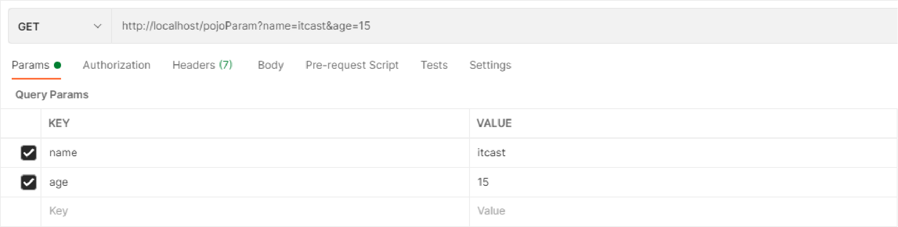
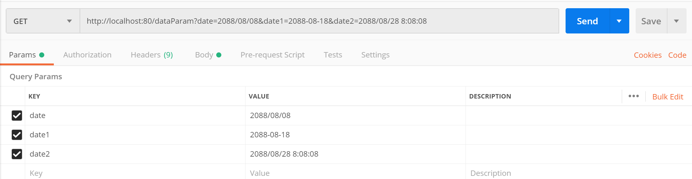
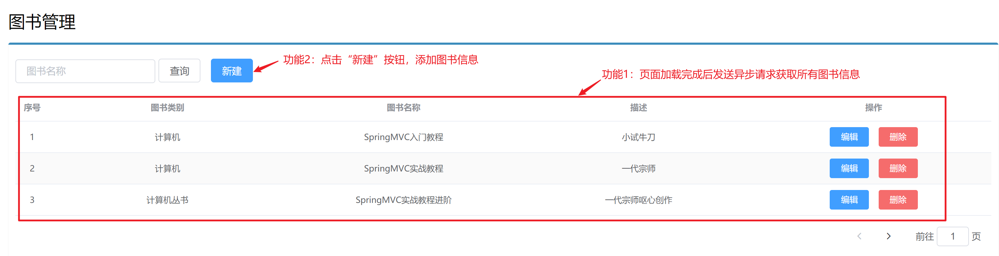
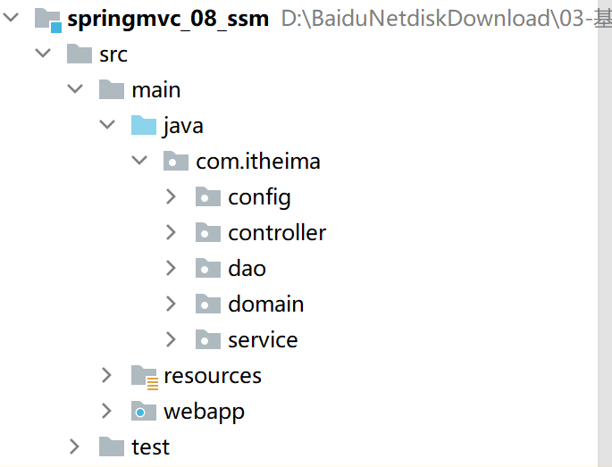
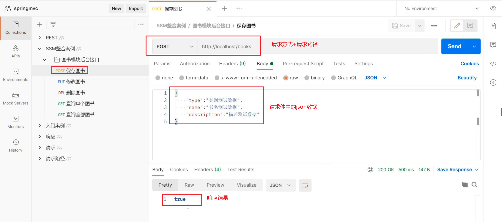
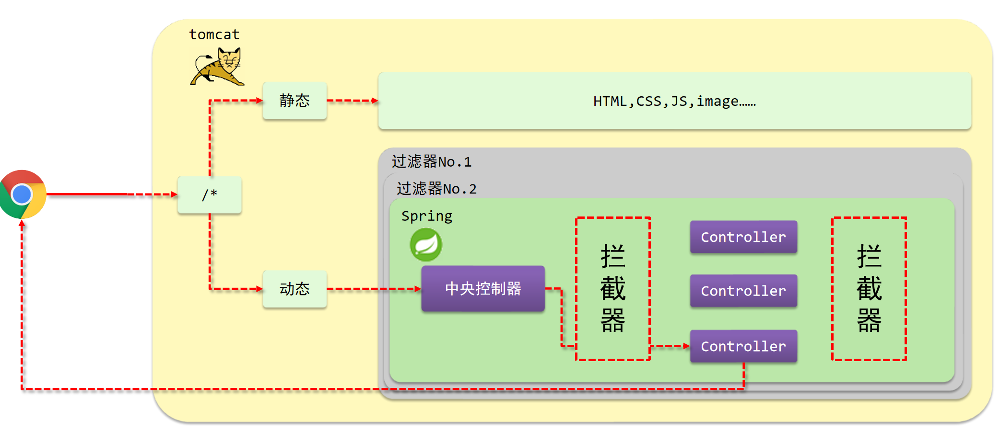

# Spring MVC


## 一、SpringMVC简介

### 1. SpringMVC概述

#### 问题导入

SpringMVC框架有什么优点？

#### 1.1 SpringMVC概述

1. SpringMVC是一种基于Java实现MVC模型的轻量级Web框架
2. 优点
   1. 使用简单，开发便捷（相比于Servlet）
   2. 灵活性强


### 2. 入门案例【重点】

#### 问题导入

在Controller中如何定义访问路径，如何响应数据？

#### 2.1 实现步骤

```
1 创建web工程（Maven结构）
2 设置tomcat服务器，加载web工程(tomcat插件）
3 导入坐标（SpringMVC+Servlet）
4 定义处理请求的功能类（UserController）
5 编写SpringMVC配置类，加载处理请求的Bean。
6 加载SpringMVC配置，并设置SpringMVC请求拦截的路径
```

#### 2.2 代码实现

##### 【第一步】创建web工程（Maven结构）

##### 【第二步】导入坐标（SpringMVC+Servlet）

```xml
<!-- servlet-api -->
<dependency>
    <groupId>javax.servlet</groupId>
    <artifactId>javax.servlet-api</artifactId>
    <version>4.0.1</version>
    <scope>provided</scope>
</dependency>
<!-- Spring context -->
<dependency>
    <groupId>org.springframework</groupId>
    <artifactId>spring-context</artifactId>
    <version>5.3.10</version>
</dependency>
<!-- Spring MVC -->
<dependency>
    <groupId>org.springframework</groupId>
    <artifactId>spring-webmvc</artifactId>
    <version>5.3.10</version>
</dependency>
<!-- lombok -->
<dependency>
    <groupId>org.projectlombok</groupId>
    <artifactId>lombok</artifactId>
    <version>1.18.20</version>
    <scope>provided</scope>
</dependency>
```

##### 【第三步】定义处理请求的功能类（UserController）

```java
//定义表现层控制器bean
@Controller
public class UserController {
    //设置映射路径为/save，即外部访问路径
    @RequestMapping("/save")
    //设置当前操作返回结果为指定json数据（本质上是一个字符串信息）
    @ResponseBody
    public String save(){
        System.out.println("user save ...");
        return "{'info':'springmvc'}";
    }
}
```

**==注意事项：==**

对于SpringMVC而言，Controller方法返回值默认表示要跳转的页面，没有对应的页面就会报错。如果不想跳转页面而是响应数据，那么就需要在方法上使用@ResponseBody注解。

##### 【第四步】编写SpringMVC配置类，加载处理请求的Bean。

```java
//web容器配置类
public class ServletContainersInitConfig extends AbstractDispatcherServletInitializer {
    //加载springmvc配置类，产生springmvc容器（本质还是spring容器）
    protected WebApplicationContext createServletApplicationContext() {
        //初始化WebApplicationContext对象
        AnnotationConfigWebApplicationContext ctx = new AnnotationConfigWebApplicationContext();
        //加载指定配置类
        ctx.register(SpringMvcConfig.class);
        return ctx;
    }

    //设置由springmvc控制器处理的请求映射路径
    protected String[] getServletMappings() {
        return new String[]{"/"};
    }

    //加载spring配置类
    protected WebApplicationContext createRootApplicationContext() {
        return null;
    }
}
```

#### 2.3 运行结果


#### 2.4 案例注解和类解析

##### 2.4.1 @Controller注解

- 名称：@Controller
- 类型：类注解
- 位置：SpringMVC控制器类定义上方
- 作用：设定SpringMVC的核心控制器bean
- 范例

```java
@Controller
public class UserController {
}
```

##### 2.4.2 @RequestMapping注解

- 名称：@RequestMapping
- 类型：方法注解
- 位置：SpringMVC控制器方法定义上方
- 作用：设置当前控制器方法请求访问路径
- 范例

```java
@RequestMapping("/save")
public void save(){
    System.out.println("user save ...");
}
```

> 注意：其实@RequestMapping注解还可以写到类上面，笔记后面会介绍到。

##### 2.4.3 @ResponseBody注解

- 名称：@ResponseBody
- 类型：方法注解
- 位置：SpringMVC控制器方法定义上方
- 作用：设置当前控制器方法响应内容为当前返回值，无需解析
- 范例

```java
@RequestMapping("/save")
@ResponseBody
public String save(){
    System.out.println("user save ...");
    return "{'info':'springmvc'}";
}
```

##### 2.4.4 AbstractDispatcherServletInitializer类

- `AbstractDispatcherServletInitializer`类是SpringMVC提供的快速初始化Web3.0容器的抽象类

- `AbstractDispatcherServletInitializer`提供三个接口方法供用户实现

  - `createServletApplicationContext()`方法，创建Servlet容器时，加载SpringMVC对应的bean并放入WebApplicationContext对象范围中，而WebApplicationContext的作用范围为ServletContext范围，即整个web容器范围。

  ```java
  //加载springmvc配置类，产生springmvc容器（本质还是spring容器）
  protected WebApplicationContext createServletApplicationContext() {
      AnnotationConfigWebApplicationContext ctx = new AnnotationConfigWebApplicationContext();
      ctx.register(SpringMvcConfig.class);
      return ctx;
  }
  ```

  * `getServletMappings()`方法，设定SpringMVC对应的请求映射路径，设置为`/`表示拦截所有请求(除了jsp文件)，任意请求都将转入到SpringMVC进行处理。

  ```java
  //设置由springmvc控制器处理的请求映射路径
  protected String[] getServletMappings() {
      return new String[]{"/"};
  }
  ```

  - `createRootApplicationContext()`方法，如果创建Servlet容器时需要加载非SpringMVC对应的bean，使用当前方法进行，使用方式同`createServletApplicationContext()` 

  ```java
  //加载spring配置类
  protected WebApplicationContext createRootApplicationContext() {
      return null;
  }
  ```

#### 2.5 入门程序开发总结(1+N)

- 一次性工作
  - 创建工程，设置服务器，加载工程
  - 导入坐标
  - 创建web容器启动类，加载SpringMVC配置，并设置SpringMVC请求拦截路径
  - SpringMVC核心配置类（设置配置类，扫描controller包，加载Controller控制器bean）
- 多次工作
  - 定义处理请求的控制器类
  - 定义处理请求的控制器方法，并配置映射路径（@RequestMapping）与返回json数据（@ResponseBody）

### 3. 入门案例工作流程分析【理解】

#### 3.1 启动服务器初始化过程

1. 服务器启动，执行`ServletContainersInitConfig`类，初始化web容器
2. 执行`createServletApplicationContext`方法，创建了`WebApplicationContext`对象
3. 加载`SpringMvcConfig`配置类
4. 执行`@ComponentScan`加载对应的`bean` 
5. 加载`UserController`，每个`@RequestMapping`的名称对应一个具体的方法
6. 执行`getServletMappings`方法，定义所有的请求都通过`SpringMVC` 


#### 3.2 单次请求过程

1. 发送请求localhost/save
2. web容器发现所有请求都经过SpringMVC，将请求交给SpringMVC处理
3. 解析请求路径/save
4. 由/save匹配执行对应的方法save(）
5. 执行save()
6. 检测到有@ResponseBody直接将save()方法的返回值作为响应求体返回给请求方


### 4. Spring MVC 执行流程


#### 4.1 `DispatcherServlet`：前端控制器

​		用户请求到达前端控制器，它就相当于 mvc 模式中的 c，dispatcherServlet 是整个流程控制的中心，由 它调用其它组件处理用户的请求，dispatcherServlet 的存在降低了组件之间的耦合性。

#### 4.2 `HandlerMapping`：处理器映射器【重点】

​		`HandlerMapping` 负责根据用户请求找到 Handler 即处理器，SpringMVC 提供了不同的映射器实现不同的映射方式，例如：配置文件方式、实现接口方式、注解方式等。

#### 4.3 `Handler`：处理器 (自己定义的Controller处理单元)

​		它就是我们开发中要编写的具体业务控制器。由 DispatcherServlet 把用户请求转发到 Handler。由 Handler 对具体的用户请求进行处理。

#### 4.4 `HandlAdapter`：处理器适配器【重点】

​		通过 HandlerAdapter 对处理器进行执行，这是适配器模式的应用，通过扩展适配器可以对更多类型的处理器进行执行

#### 4.5 View Resolver：视图解析器【重点】

​		`View Resolver` 负责将处理结果生成 View 视图，View Resolver 首先根据逻辑视图名解析成物理视图名即具体的页面地址，再生成 View 视图对象，最后对 View 进行渲染将处理结果通过页面展示给用户。

#### 4.6  View：视图

​		SpringMVC 框架提供了很多的 View 视图类型的支持，包括：jstlView、freemarkerView、pdfView等。我们最常用的视图就是 jsp。 一般情况下需要通过页面标签或页面模版技术将模型数据通过页面展示给用户，需要由程序员根据业务需求开 发具体的页面。

#### 4.7 `<mvc:annotation-driven>`说明

​		在 SpringMVC 的各个组件中，**处理器映射器、处理器适配器、视图解析器称为 SpringMVC 的三大组件**。使用     `<mvc:annotation-driven>` 自动加载 `RequestMappingHandlerMapping` （处理映射器） 和 `RequestMappingHandlerAdapter` （ 处 理 适 配 器 ），可用在 SpringMVC.xml 配置文件中使用 `<mvc:annotation-driven>`替代注解处理器和适配器的配置。


* `HandlerMapping` 的实现类的作用
  		实现类`RequestMappingHandlerMapping`，它会处理`@RequestMapping` 注解，并将其注册到请求映射表中。

* `HandlerAdapter`的实现类的作用
  		实现类`RequestMappingHandlerAdapter`，则是处理请求的适配器，确定调用哪个类的哪个方法，并且构造方法参数，返回值。

> 当配置了`<mvc:annotation-driven/>`后，Spring就知道了我们启用注解驱动。然后Spring通过context:component-scan/标签的配置，会自动为我们将扫描到的@Component，@Controller，@Service，@Repository等注解标记的组件注册到工厂中，来处理我们的请求,这个时候接收返回json数据、参数验证、统一异常等功能。


### 5. Controller加载控制

#### 问题导入

因为功能不同，如何避免Spring错误的加载到SpringMVC的bean？

#### 5.1 Controller加载控制与业务bean加载控制

- SpringMVC相关bean（表现层bean）

- Spring控制的bean

  1. 业务bean（Service）

  2. 功能bean（DataSource等）

- SpringMVC相关bean加载控制
  1. SpringMVC加载的bean对应的包均在com.itheima.controller包内
- Spring相关bean加载控制
  1. 方式一：Spring加载的bean设定扫描范围为com.itheima，排除掉controller包内的bean
  2. 方式二：Spring加载的bean设定扫描范围为精准范围，例如service包、dao包等
  3. 方式三：不区分Spring与SpringMVC的环境，加载到同一个环境中

#### 5.2 方式一代码实现

- 名称：@ComponentScan
- 类型：类注解
- 范例

```java
@Configuration
@ComponentScan(value = "com.itheima",
               excludeFilters = @ComponentScan.Filter(
                   type = FilterType.ANNOTATION,
                   classes = Controller.class
               )
              )
public class SpringConfig {
}
```

* 属性: 
  1. `excludeFilters`：排除扫描路径中加载的bean，需要指定类别（type）与具体项（classes）
  2. `includeFilters`：加载指定的bean，需要指定类别（type）与具体项（classes）

#### 5.3 Bean的加载格式

```java
public class ServletContainersInitConfig extends AbstractDispatcherServletInitializer { 
    protected WebApplicationContext createServletApplicationContext() { 
        AnnotationConfigWebApplicationContext ctx = new AnnotationConfigWebApplicationContext();
        ctx.register(SpringMvcConfig.class);
        return ctx;  
    }   
    protected WebApplicationContext createRootApplicationContext() {  
        AnnotationConfigWebApplicationContext ctx = new AnnotationConfigWebApplicationContext();      
        ctx.register(SpringConfig.class);        
        return ctx;  
    }   
    protected String[] getServletMappings() { 
        return new String[]{"/"}; 
    }
}
```

**简化格式** 

```java
public class ServletContainersInitConfig extends AbstractAnnotationConfigDispatcherServletInitializer{
    protected Class<?>[] getServletConfigClasses() {
        return new Class[]{SpringMvcConfig.class}
    };
    protected String[] getServletMappings() {
        return new String[]{"/"};
    }
    protected Class<?>[] getRootConfigClasses() {
        return new Class[]{SpringConfig.class};
    }
}
```


### 6. PostMan【掌握】

#### 6.1 PostMan介绍

- Postman是一款功能强大的网页调试与发送网页HTTP请求的Chrome插件。


- 作用：常用于进行接口测试
- 特征
  - 简单
  - 实用
  - 美观
  - 大方

#### 6.2 PostMan安装

> 双击资料中的“Postman-win64-8.3.1-Setup.exe”即可自动按照，打开之后需要注册，如果底部有如下链接，可以点击跳过注册


#### 6.3 PostMan的使用

##### 6.3.1 创建WorkSpace工作空间


##### 6.3.2 发送请求获取json数据


##### 6.3.3 保存当前请求


> 注意：第一次请求需要创建一个新的目录，后面就不需要创建新目录，直接保存到已经创建好的目录即可。


## 二、请求与响应

### 1 请求映射路径【重点】

#### 问题导入

@RequestMapping注解注解可以写在哪？有什么作用？

#### 1.1 @RequestMapping注解

- 名称：`@RequestMapping` 
- 类型：==方法注解  类注解==
- 位置：SpringMVC控制器方法定义上方
- 作用：设置当前控制器方法请求访问路径，如果设置在类上统一设置当前控制器方法请求访问路径前缀
- 参数：
  - `method` ：控制请求的方式,值为RequestMethod的枚举值
  - `params` ：表示请求中必须包含名为param的参数
  - `headers` ：表示请求中必须包含名为headers的参数
- 范例

```java
@Controller
//类上方配置的请求映射与方法上面配置的请求映射连接在一起，形成完整的请求映射路径
@RequestMapping("/user")
public class UserController {
    //请求路径映射
    @RequestMapping("/save") //此时save方法的访问路径是：/user/save
    @ResponseBody
    public String save(){
        System.out.println("user save ...");
        return "{'module':'user save'}";
    }
}
```

```java
// 表示username不可以为root, 且必须传入password属性
@RequestMapping( value = "/***" ,params = {"username!=root","password"})  
```

```java
// 与params 用法一致
@RequestMapping( value = "/***",headers = {"Accept-Encoding=gzip, deflate"})
```

> param:  表示请求中必须包含名为param的参数
> !param:  表示请求中不能包含名为param的参数
> param  = value 表示请求中包含名为param的参数,但是值必须是value
> param != value 表示请求中包含名为param的参数,但是值不能是value
> {"param1","param2=value"},可以将对于多个参数的要求写入数组


### 2. 请求参数

#### 2.1 发送普通类型参数【重点】

##### 问题导入

如何解决POST请求中文乱码问题？

##### 2.1.1 请求方式

- GET请求
- POST请求

##### 2.1.2 GET请求传递普通参数

- 普通参数：url地址传参，地址参数名与形参变量名相同，定义形参即可接收参数


```java
//普通参数：请求参数与形参名称对应即可完成参数传递
@RequestMapping("/commonParam")
@ResponseBody
public String commonParam(String name ,int age){
    System.out.println("普通参数传递 name ==> "+name);
    System.out.println("普通参数传递 age ==> "+age);
    return "{'module':'common param'}";
}
```

* tomcat 8.5版本之后GET请求就不再出现中文乱码问题

##### 2.1.3 POST请求传递普通参数

- 普通参数：form表单post请求传参，表单参数名与形参变量名相同，定义形参即可接收参数


```java
//普通参数：请求参数与形参名称对应即可完成参数传递
@RequestMapping("/commonParam")
@ResponseBody
public String commonParam(String name ,int age){
    System.out.println("普通参数传递 name ==> "+name);
    System.out.println("普通参数传递 age ==> "+age);
    return "{'module':'common param'}";
}
```

##### 2.1.4 POST请求中文乱码处理

> 在加载SpringMVC配置的配置类中指定字符过滤器。

```java
public class ServletContainersInitConfig extends AbstractAnnotationConfigDispatcherServletInitializer {
    protected Class<?>[] getRootConfigClasses() {
        return new Class[0];
    }

    protected Class<?>[] getServletConfigClasses() {
        return new Class[]{SpringMvcConfig.class};
    }

    protected String[] getServletMappings() {
        return new String[]{"/"};
    }

    //乱码处理
    @Override
    protected Filter[] getServletFilters() {
        CharacterEncodingFilter filter = new CharacterEncodingFilter();
        filter.setEncoding("UTF-8");
        return new Filter[]{filter};
    }
}
```

#### 2.2 五种类型参数传递

##### 问题导入

当请求参数名与形参变量名不同，该如何接收请求参数？

##### 2.2.1 五种类型参数介绍

- 普通参数
- POJO类型参数
- 嵌套POJO类型参数
- 数组类型参数
- 集合类型参数

##### 2.2.2 普通参数【重点】

- 普通参数：当请求参数名与形参变量名不同，使用@RequestParam绑定参数关系


```java
//普通参数：请求参数名与形参名不同时，使用@RequestParam注解关联请求参数名称与形参名称之间的关系
@RequestMapping("/commonParamDifferentName")
@ResponseBody
public String commonParamDifferentName(@RequestParam("name") String userName , int age){
    System.out.println("普通参数传递 userName ==> "+userName);
    System.out.println("普通参数传递 age ==> "+age);
    return "{'module':'common param different name'}";
}
```

- 名称：@RequestParam
- 类型：形参注解
- 位置：SpringMVC控制器方法形参定义前面
- 作用：绑定请求参数与处理器方法形参间的关系
- 参数：
  - required：是否为必传参数
  - defaultValue：参数默认值

##### 2.2.3 POJO类型参数【重点】

- POJO参数：请求参数名与形参对象属性名相同，定义POJO类型形参即可接收参数



```java
public class User {
    private String name;
    private int age;
    //自己添加getter/setter/toString()方法
}
```

```java
//POJO参数：请求参数与形参对象中的属性对应即可完成参数传递
@RequestMapping("/pojoParam")
@ResponseBody
public String pojoParam(User user){
    System.out.println("pojo参数传递 user ==> "+user);
    return "{'module':'pojo param'}";
}
```

> **注意事项：请求参数key的名称要和POJO中属性的名称一致，否则无法封装。** 

##### 2.2.4 嵌套POJO类型参数

- POJO对象中包含POJO对象

```java
public class User {
    private String name;
    private int age;
    private Address address;
    // 省略getter/setter/toString()方法
}
public class Address {
    private String province;
    private String city;
    private Address address;
}
```

* 嵌套POJO参数：请求参数名与形参对象属性名相同，按照对象层次结构关系即可接收嵌套POJO属性参数


```java
//嵌套POJO参数：嵌套属性按照层次结构设定名称即可完成参数传递
@RequestMapping("/pojoContainPojoParam")
@ResponseBody
public String pojoContainPojoParam(User user){
    System.out.println("pojo嵌套pojo参数传递 user ==> "+user);
    return "{'module':'pojo contain pojo param'}";
}
```

> **注意事项：请求参数key的名称要和POJO中属性的名称一致，否则无法封装。** 

##### 2.2.5 数组类型参数

- 数组参数：请求参数名与形参对象属性名相同且请求参数为多个，定义数组类型即可接收参数


```java
//数组参数：同名请求参数可以直接映射到对应名称的形参数组对象中
@RequestMapping("/arrayParam")
@ResponseBody
public String arrayParam(String[] likes){
    System.out.println("数组参数传递 likes ==> "+ Arrays.toString(likes));
    return "{'module':'array param'}";
}
```

##### 2.2.6 集合类型参数

- 集合保存普通参数：请求参数名与形参集合对象名相同且请求参数为多个，@RequestParam绑定参数关系


```java
//集合参数：同名请求参数可以使用@RequestParam注解映射到对应名称的集合对象中作为数据
@RequestMapping("/listParam")
@ResponseBody
public String listParam(@RequestParam List<String> likes){
    System.out.println("集合参数传递 likes ==> "+ likes);
    return "{'module':'list param'}";
}
```

#### 2.3 json数据参数传递

##### 问题导入

问题：@EnableWebMvc注解和@ResponseBody注解有什么用？

##### 2.3.1 json数据参数介绍

- json普通数组（["","","",...]）
- json对象（{key:value,key:value,...}）
- json对象数组（[{key:value,...},{key:value,...}]）

##### 2.3.2 传递json普通数组

###### 2.3.2.1 代码演示

1. 添加json数据转换相关坐标

```java
<dependency>
    <groupId>com.fasterxml.jackson.core</groupId>
    <artifactId>jackson-databind</artifactId>
    <version>2.12.3</version>
</dependency>
```

2. 设置发送json数据（请求body中添加json数据）


3. 开启自动转换json数据的支持

```java
@Configuration
@ComponentScan("com.itheima.controller")
//开启json数据类型自动转换
@EnableWebMvc
public class SpringMvcConfig {
}
```

> **注意事项：**
>
> ​	`@EnableWebMvc`注解功能强大，该注解整合了多个功能，此处仅使用其中一部分功能，即json数据进行自动类型转换

4. 在Controller中编写方法接收json参数

```java
//集合参数：json格式
//1.开启json数据格式的自动转换，在配置类中开启@EnableWebMvc
//2.使用@RequestBody注解将外部传递的json数组数据映射到形参的集合对象中作为数据
@RequestMapping("/listParamForJson")
@ResponseBody
public String listParamForJson(@RequestBody List<String> likes){
    System.out.println("list common(json)参数传递 list ==> "+likes);
    return "{'module':'list common for json param'}";
}
```

###### 2.3.2.2 @EnableWebMvc注解介绍

- 名称：@EnableWebMvc
- 类型：==配置类注解==
- 位置：SpringMVC配置类定义上方
- 作用：开启SpringMVC多项辅助功能
- 范例：

```java
@Configuration
@ComponentScan("com.itheima.controller")
@EnableWebMvc
public class SpringMvcConfig {
}
```

###### 2.3.2.3 @RequestBody注解介绍

- 名称：@RequestBody
- 类型：==形参注解==
- 位置：SpringMVC控制器方法形参定义前面
- 作用：将请求中请求体所包含的数据传递给请求参数，此注解一个处理器方法只能使用一次
- 范例：

```java
@RequestMapping("/listParamForJson")
@ResponseBody
public String listParamForJson(@RequestBody List<String> likes){
    System.out.println("list common(json)参数传递 list ==> "+likes);
    return "{'module':'list common for json param'}";
} 
```

##### 2.3.3 传递json对象

- POJO参数：json数据与形参对象属性名相同，定义POJO类型形参即可接收参数


```java
//POJO参数：json格式
//1.开启json数据格式的自动转换，在配置类中开启@EnableWebMvc
//2.使用@RequestBody注解将外部传递的json数据映射到形参的实体类对象中，要求属性名称一一对应
@RequestMapping("/pojoParamForJson")
@ResponseBody
public String pojoParamForJson(@RequestBody User user){
    System.out.println("pojo(json)参数传递 user ==> "+user);
    return "{'module':'pojo for json param'}";
}
```

##### 2.3.4 传递json对象数组

- POJO集合参数：json数组数据与集合泛型属性名相同，定义List类型形参即可接收参数


```java
//集合参数：json格式
//1.开启json数据格式的自动转换，在配置类中开启@EnableWebMvc
//2.使用@RequestBody注解将外部传递的json数组数据映射到形参的保存实体类对象的集合对象中，要求属性名称一一对应
@RequestMapping("/listPojoParamForJson")
@ResponseBody
public String listPojoParamForJson(@RequestBody List<User> list){
    System.out.println("list pojo(json)参数传递 list ==> "+list);
    return "{'module':'list pojo for json param'}";
}
```

##### 2.3.5 @RequestBody与@RequestParam区别

- 区别
  @RequestParam用于接收url地址传参，表单传参【application/x-www-form-urlencoded】
  @RequestBody用于接收json数据【application/json】
- 应用
  后期开发中，发送json格式数据为主，@RequestBody应用较广
  如果发送非json格式数据，选用@RequestParam接收请求参数


### 3. 日期类型参数传递【重点】

#### 问题导入

@DateTimeFormat注解的作用是什么？

#### 3.1 代码演示

- 日期类型数据基于系统不同格式也不尽相同
  2088-08-18
  2088/08/18
  08/18/2088
- 接收形参时，根据不同的日期格式设置不同的接收方式



```java
//日期参数 http://localhost:80/dataParam?date=2088/08/08&date1=2088-08-18&date2=2088/08/28 8:08:08
//使用@DateTimeFormat注解设置日期类型数据格式，默认格式yyyy/MM/dd
@RequestMapping("/dataParam")
@ResponseBody
public String dataParam(Date date,
                  @DateTimeFormat(pattern="yyyy-MM-dd") Date date1,
                  @DateTimeFormat(pattern="yyyy/MM/dd HH:mm:ss") Date date2){
    System.out.println("参数传递 date ==> "+date);
    System.out.println("参数传递 date1(yyyy-MM-dd) ==> "+date1);
    System.out.println("参数传递 date2(yyyy/MM/dd HH:mm:ss) ==> "+date2);
    return "{'module':'data param'}";
}
```

#### 3.2 @DateTimeFormat注解介绍

- 名称：@DateTimeFormat
- 类型：==形参注解==
- 位置：SpringMVC控制器方法形参前面
- 作用：设定日期时间型数据格式

- 属性：pattern：指定日期时间格式字符串

#### 3.3 工作原理

- 其内部依赖Converter接口

```java
public interface Converter<S, T> {
    @Nullable
    T convert(S var1);
}
```

- 请求参数年龄数据（String→Integer）
- json数据转对象（json → POJO）
- 日期格式转换（String → Date）

#### 3.4 注意事项

传递日期类型参数必须在配置类上使用@EnableWebMvc注解。其功能之一：根据类型匹配对应的类型转换器。


### 4. 响应


#### 问题导入

如何响应json数据？

#### 4.1 单元方法返回值为void

```java
@RequestMapping("/testReturnVoid") 
public void testReturnVoid() throws Exception { 
    System.out.println("AccountController 的 testForward 方法执行了。。。。");
}
```


在SpringMVC中如果对于当前的控制单元，没有写对应的返回值，这个时候SpringMVC就会找和自己控制单元名称一致的页面展示，如果没有配置视图解析器的前缀和后缀是没有产生404,需要注意控制单元仍然可以进。

#### 4.2 转发和重定向ServletAPI 实现

```java
@RequestMapping("demo1")
public void testDemo1(HttpServletRequest request, HttpServletResponse response) throws Exception {
    // 请求转发
    //request.getRequestDispatcher("/forward.jsp").forward(request,response);
    // 响应重定向
    response.sendRedirect(request.getContextPath()+"/redirect.jsp");
}
```

单元方法的返回值类型设置void。因为使用response对象在单元方法中直接对此次请求进行了响应，不再通过DispatcherServlet了，既然已经响应了，就不需要再给DispatcherServlet返回值了。在单元方法上声明HttpServletResponse形参，来接收此次请求的response对象。

#### 4.3 使用forward关键字完成响应

```java
/*
    * 返回字符串告诉DispatcherServlet跳转的路径
    * 在路径之前放上一个forward: 关键字,就是请求转发
    * 如果路径前的关键字是forward,那么可以省略不写
    * */
@RequestMapping("demo2")
public String testDemo2() {
    //return "forward:/forwardPage.jsp";
    return "/forwardPage.jsp";
}

```

使用通过单元方法的返回值来告诉DispatcherServlet请求转发指定的资源,如果是请求转发，forward关键字可以省略不写的

#### 4.4 使用redirect关键字完成响应

```java
    /*
     * 返回字符串告诉DispatcherServlet跳转的路径
     * 在路径之前放上一个redirect: 关键字,就是重定向
     * 如果路径前的关键字是redirect,那么不可以省略
     * /表示当前项目下.这里不需要项目的上下文路径
     * */
    @RequestMapping("demo3")
    public String testDemo3() {
        return "redirect:/redirectPage.jsp";
    }
```

使用通过单元方法的返回值来告诉DispatcherServlet重定向指定的资源，注意这个redirect关键字不可以省去

#### 4.5 使用View视图转发和重定向

```java
@RequestMapping("demo4")
public View testDemo4()   {
    View  view =null;
    // 请求转发
    //view =new InternalResourceView("/forwardPage.jsp");
    // 重定向
    view=new RedirectView(req.getContextPath()+"/redirectPage.jsp");
    return view;
}
```

RedirectView中所做的操作，最终的实现是在renderMergedOutputModel中完成实现的，简单来说RedirectView实现了链接的重定向，并且将数据保存到FlashMap中，这样在跳转后的链接中可以获取一些数据.

#### 4.6 使用ModelAndView转发重定向

```java
@RequestMapping("demo5")
public ModelAndView testDemo5(HttpServletRequest req)   {
    ModelAndView mv=new ModelAndView();
    // 请求转发
    //mv.setViewName("forward:/forwardPage.jsp");
    //mv.setView(new InternalResourceView("/forwardPage.jsp"));
    // 重定向
    //mv.setViewName("redirect:/redirectPage.jsp");
    mv.setView(new RedirectView(req.getContextPath()+"/redirectPage.jsp"));
    return mv;
}
```

ModelAndView中的Model代表模型，View代表视图，这个名字就很好地解释了该类的作用。业务处理器调用模型层处理完用户请求后，把结果数据存储在该类的model属性中，把要返回的视图信息存储在该类的view属性中，然后让该ModelAndView返回该Spring MVC框架。

#### 4.7 响应页面【了解】

```java
@Controller
public class UserController {

    //响应页面/跳转页面
    //返回值为String类型，设置返回值为页面名称，即可实现页面跳转
    @RequestMapping("/toJumpPage")
    public String toJumpPage(){
        System.out.println("跳转页面");
        return "page.jsp";
    }
}
```


```jsp
<%@ page contentType="text/html;charset=UTF-8" language="java" %>
<html>
    <head>
        <title>Title</title>
    </head>
    <body>
        <h2>Hello Spring MVC!</h2>
    </body>
</html>
```

#### 4.8 文本数据【了解】

```java
//响应文本数据
//返回值为String类型，设置返回值为任意字符串信息，即可实现返回指定字符串信息，需要依赖@ResponseBody注解
@RequestMapping("/toText")
@ResponseBody
public String toText(){
    System.out.println("返回纯文本数据");
    return "response text";
}
```

#### 4.9 json数据【重点】

```java
//响应POJO对象
//返回值为实体类对象，设置返回值为实体类类型，即可实现返回对应对象的json数据，需要依赖@ResponseBody注解和@EnableWebMvc注解
@RequestMapping("/toJsonPOJO")
@ResponseBody
public User toJsonPOJO(){
    System.out.println("返回json对象数据");
    User user = new User();
    user.setName("itcast");
    user.setAge(15);
    return user;
}
```


```java
//响应POJO集合对象
//返回值为集合对象，设置返回值为集合类型，即可实现返回对应集合的json数组数据，需要依赖@ResponseBody注解和@EnableWebMvc注解
@RequestMapping("/toJsonList")
@ResponseBody
public List<User> toJsonList(){
    System.out.println("返回json集合数据");
    User user1 = new User();
    user1.setName("传智播客");
    user1.setAge(15);

    User user2 = new User();
    user2.setName("黑马程序员");
    user2.setAge(12);

    List<User> userList = new ArrayList<User>();
    userList.add(user1);
    userList.add(user2);

    return userList;
}
```

**==注意：需要添加jackson-databind依赖以及在SpringMvcConfig配置类上添加@EnableWebMvc注解==**


## 三、REST风格

### 1. REST简介

#### 问题导入

Rest风格使用了几种请求方式定义访问行为？

#### 1.1 REST介绍

- REST（Representational State Transfer），表现形式状态转换
  - 传统风格资源描述形式
    	http://localhost/user/getById?id=1
    	http://localhost/user/saveUser
  - REST风格描述形式
    	http://localhost/user/1
    	http://localhost/user
- 优点：
  - 隐藏资源的访问行为，无法通过地址得知对资源是何种操作
  - 书写简化

#### 1.2 RESTful介绍

- 按照REST风格访问资源时使用==行为动作==区分对资源进行了何种操作
  http://localhost/users		查询全部用户信息	（查询）
  http://localhost/users/1		查询指定用户信息（查询）
  http://localhost/users		添加用户信息（新增/保存）
  http://localhost/users		修改用户信息（修改/更新）
  http://localhost/users/1		删除用户信息（删除）
- 根据REST风格对资源进行访问称为RESTful

#### 1.3 注意事项

- 上述行为是约定方式，约定不是规范，可以打破，所以称REST风格，而不是REST规范
- 描述模块的名称通常使用复数，也就是加s的格式描述，表示此类资源，而非单个资源，例如：users、books、accounts……

### 2 RESTful入门案例

#### 问题导入

Rest风格如何通过路径传递参数？

#### 2.1 快速入门

> 做法：在Controller中定义方法时设定"http请求动作(请求方式)"和"设定请求参数（路径变量）"

```java
@Controller
public class UserController {

    //设置当前请求方法为POST，表示REST风格中的添加操作
    @RequestMapping(value = "/users",method = RequestMethod.POST)
    @ResponseBody
    public String save(){
        System.out.println("user save...");
        return "{'module':'user save'}";
    }

    //设置当前请求方法为DELETE，表示REST风格中的删除操作
    //@PathVariable注解用于设置路径变量（路径参数），要求路径上设置对应的占位符，并且占位符名称与方法形参名称相同
    @RequestMapping(value = "/users/{id}",method = RequestMethod.DELETE)
    @ResponseBody
    public String delete(@PathVariable Integer id){
        System.out.println("user delete..." + id);
        return "{'module':'user delete'}";
    }

    //设置当前请求方法为PUT，表示REST风格中的修改操作
    @RequestMapping(value = "/users",method = RequestMethod.PUT)
    @ResponseBody
    public String update(@RequestBody User user){
        System.out.println("user update..."+user);
        return "{'module':'user update'}";
    }

    //设置当前请求方法为GET，表示REST风格中的查询操作
    //@PathVariable注解用于设置路径变量（路径参数），要求路径上设置对应的占位符，并且占位符名称与方法形参名称相同
    @RequestMapping(value = "/users/{id}" ,method = RequestMethod.GET)
    @ResponseBody
    public String getById(@PathVariable Integer id){
        System.out.println("user getById..."+id);
        return "{'module':'user getById'}";
    }

    //设置当前请求方法为GET，表示REST风格中的查询操作
    @RequestMapping(value = "/users",method = RequestMethod.GET)
    @ResponseBody
    public String getAll(){
        System.out.println("user getAll...");
        return "{'module':'user getAll'}";
    }
}
```

#### 2.2 @PathVariable介绍

- 名称：@PathVariable
- 类型：形参注解
- 位置：SpringMVC控制器方法形参定义前面
- 作用：绑定路径参数与处理器方法形参间的关系，要求路径参数名与形参名一一对应


#### 2.3 @RequestBody、@RequestParam、@PathVariable区别和应用

- 区别
  `@RequestParam`用于接收url地址传参或表单传参
  `@RequestBody`用于接收json数据
  `@PathVariable`用于接收路径参数，使用{参数名称}描述路径参数
- 应用
  后期开发中，发送请求参数超过1个时，以json格式为主，@RequestBody应用较广
  如果发送非json格式数据，选用@RequestParam接收请求参数
  采用RESTful进行开发，当参数数量较少时，例如1个，可以采用@PathVariable接收请求路径变量，通常用于传递id值


### 3 REST快速开发【重点】

#### 3.1 代码中的问题


> 以上截图中的代码和我们之前写的UserController中的方法类似，其中图中两个方法都有三处是有问题的，可以进行优化。存在的问题如下：

问题1：每个方法的@RequestMapping注解中都定义了访问路径/books，重复性太高。

问题2：每个方法的@RequestMapping注解中都要使用method属性定义请求方式，重复性太高。

问题3：每个方法响应json都需要加上@ResponseBody注解，重复性太高。

#### 3.2 Rest快速开发

> 解决以上三个问题

解决问题1：在Controller类上使用@RequestMapping定义共同的访问路径。

```java
@Controller
@RequestMapping("/books")
public class BookController {
    
    @RequestMapping(method = RequestMethod.POST)
    public String save(@RequestBody Book book){
        System.out.println("book save..." + book);
        return "{'module':'book save'}";
    }
    @RequestMapping(value = "/{id}" ,method = RequestMethod.DELETE)
    public String delete(@PathVariable Integer id){
        System.out.println("book delete..." + id);
        return "{'module':'book delete'}";
    }
    @RequestMapping(method = RequestMethod.PUT)
    public String update(@RequestBody Book book){
        System.out.println("book update..."+book);
        return "{'module':'book update'}";
    }
    @RequestMapping(value = "/{id}" ,method = RequestMethod.GET)
    public String getById(@PathVariable Integer id){
        System.out.println("book getById..."+id);
        return "{'module':'book getById'}";
    }

    @RequestMapping(method = RequestMethod.GET)
    public String getAll(){
        System.out.println("book getAll...");
        return "{'module':'book getAll'}";
    }
}
```

解决问题2：使用 `@GetMapping`、`@PostMapping`、`@PutMapping`、`@DeleteMapping` 代替`@RequestMapping(method=RequestMethod.XXXX)` 

```java
@Controller   
@RequestMapping("/books")
public class BookController {

//    @RequestMapping( method = RequestMethod.POST)
    @PostMapping//使用@PostMapping简化Post请求方法对应的映射配置
    public String save(@RequestBody Book book){
        System.out.println("book save..." + book);
        return "{'module':'book save'}";
    }

//    @RequestMapping(value = "/{id}" ,method = RequestMethod.DELETE)
    @DeleteMapping("/{id}")  //使用@DeleteMapping简化DELETE请求方法对应的映射配置
    public String delete(@PathVariable Integer id){
        System.out.println("book delete..." + id);
        return "{'module':'book delete'}";
    }

//    @RequestMapping(method = RequestMethod.PUT)
    @PutMapping   //使用@PutMapping简化Put请求方法对应的映射配置
    public String update(@RequestBody Book book){
        System.out.println("book update..."+book);
        return "{'module':'book update'}";
    }

//    @RequestMapping(value = "/{id}" ,method = RequestMethod.GET)
    @GetMapping("/{id}")    //使用@GetMapping简化GET请求方法对应的映射配置
    public String getById(@PathVariable Integer id){
        System.out.println("book getById..."+id);
        return "{'module':'book getById'}";
    }

//    @RequestMapping(method = RequestMethod.GET)
    @GetMapping      //使用@GetMapping简化GET请求方法对应的映射配置
    public String getAll(){
        System.out.println("book getAll...");
        return "{'module':'book getAll'}";
    }
}
```

- 名称：@GetMapping  @PostMapping  @PutMapping  @DeleteMapping
- 类型：方法注解
- 位置：基于SpringMVC的RESTful开发控制器方法定义上方
- 作用：设置当前控制器方法请求访问路径与请求动作，每种对应一个请求动作，例如@GetMapping对应GET请求
- 属性：
  value（默认）：请求访问路径


解决问题3：在Controller类上使用@RestController注解，等同于@Controller与@ResponseBody两个注解组合功能

```java
@RestController     //使用@RestController注解替换@Controller与@ResponseBody注解，简化书写
@RequestMapping("/books")
public class BookController {
    //方法省略了没写
}
```

- 名称：@RestController
- 类型：类注解
- 位置：基于SpringMVC的RESTful开发控制器类定义上方
- 作用：设置当前控制器类为RESTful风格，等同于@Controller与@ResponseBody两个注解组合功能

### 4. 案例：基于RESTful页面数据交互

#### 4.1 案例效果和环境准备

##### 4.1.1 案例效果



##### 4.1.2 环境准备

```java
//POJO实体类
public class Book {
    private Integer id;
    private String type;
    private String name;
    private String description;
    //省略了getter、setter、toString()方法...
}

//SpringMVC容器初始化类
public class ServletContainersInitConfig extends AbstractAnnotationConfigDispatcherServletInitializer {
    protected Class<?>[] getRootConfigClasses() {
        return new Class[0];
    }

    protected Class<?>[] getServletConfigClasses() {
        return new Class[]{SpringMvcConfig.class};
    }

    protected String[] getServletMappings() {
        return new String[]{"/"};
    }
    //乱码处理
    @Override
    protected Filter[] getServletFilters() {
        CharacterEncodingFilter filter = new CharacterEncodingFilter();
        filter.setEncoding("UTF-8");
        return new Filter[]{filter};
    }
}

//SpringMVC配置类
@Configuration
@ComponentScan({"com.itheima.controller","com.itheima.config"})
@EnableWebMvc
public class SpringMvcConfig {
}
```

#### 4.2 代码实现

##### 4.2.1 制作SpringMVC控制器，并通过PostMan测试接口功能

```java
@RestController
@RequestMapping("/books")
public class BookController {

    @PostMapping
    public String save(@RequestBody Book book){
        System.out.println("book save ==> "+ book);
        return "{'module':'book save success'}";
    }

    @GetMapping
    public List<Book> getAll(){
        System.out.println("book getAll is running ...");
        List<Book> bookList = new ArrayList<Book>();

        Book book1 = new Book();
        book1.setType("计算机");
        book1.setName("SpringMVC入门教程");
        book1.setDescription("小试牛刀");
        bookList.add(book1);

        Book book2 = new Book();
        book2.setType("计算机");
        book2.setName("SpringMVC实战教程");
        book2.setDescription("一代宗师");
        bookList.add(book2);

        Book book3 = new Book();
        book3.setType("计算机丛书");
        book3.setName("SpringMVC实战教程进阶");
        book3.setDescription("一代宗师呕心创作");
        bookList.add(book3);

        return bookList;
    }
}
```


##### 4.2.2 设置对静态资源的访问放行

```java
@Configuration
public class SpringMvcSupport implements WebMvcConfigurer{
    //设置静态资源访问过滤，当前类需要设置为配置类，并被扫描加载
    @Override
    protected void addResourceHandlers(ResourceHandlerRegistry registry) {
        //当访问/pages/????时候，从/pages目录下查找内容
        registry.addResourceHandler("/pages/**")
            .addResourceLocations("/pages/");
        registry.addResourceHandler("/js/**")
            .addResourceLocations("/js/");        		
        registry.addResourceHandler("/css/**")
            .addResourceLocations("/css/");       
        registry.addResourceHandler("/plugins/**")
            .addResourceLocations("/plugins/");
    }
}
```

##### 4.2.3 前端页面通过异步提交访问后台控制器

```java
//添加
saveBook () {
    axios.post("/books",this.formData).then((res)=>{

    });
},
//主页列表查询
getAll() {
    axios.get("/books").then((res)=>{
        this.dataList = res.data;
    });
},
```


## 四、SSM整合【重点】

### 1. SSM整合配置

#### 问题导入

请描述“SSM整合流程”中各个配置类的作用？

#### 1.1 SSM整合流程

1. 创建工程
2. SSM整合
   - Spring
     - SpringConfig
   - MyBatis
     - MybatisConfig
     - JdbcConfig
     - jdbc.properties
   - SpringMVC
     - ServletConfig
     - SpringMvcConfig
3. 功能模块
   - 表与实体类
   - dao（接口+自动代理）
   - service（接口+实现类）
     - 业务层接口测试（整合JUnit）
   - controller
     - 表现层接口测试（PostMan）

#### 1.2 SSM整合配置

##### 1.2.1 创建工程，添加依赖和插件



```xml
<dependencies>
    <!--spring核心容器包-->
    <dependency>
      <groupId>org.springframework</groupId>
      <artifactId>spring-context</artifactId>
      <version>5.3.10</version>
    </dependency>
    <!--spring切面包-->
    <dependency>
      <groupId>org.springframework</groupId>
      <artifactId>spring-aspects</artifactId>
      <version>5.3.10</version>
    </dependency>
    <!--aop联盟包-->
    <dependency>
      <groupId>aopalliance</groupId>
      <artifactId>aopalliance</artifactId>
      <version>1.0</version>
    </dependency>
    <!--德鲁伊连接池-->
    <dependency>
      <groupId>com.alibaba</groupId>
      <artifactId>druid</artifactId>
      <version>1.1.10</version>
    </dependency>
    <!--mysql驱动-->
    <dependency>
      <groupId>mysql</groupId>
      <artifactId>mysql-connector-java</artifactId>
      <version>8.0.22</version>
    </dependency>
    <!--springJDBC包-->
    <dependency>
      <groupId>org.springframework</groupId>
      <artifactId>spring-jdbc</artifactId>
      <version>5.3.10</version>
    </dependency>
    <!--spring事务控制包-->
    <dependency>
      <groupId>org.springframework</groupId>
      <artifactId>spring-tx</artifactId>
      <version>5.3.10</version>
    </dependency>
    <!--spring orm 映射依赖-->
    <dependency>
      <groupId>org.springframework</groupId>
      <artifactId>spring-orm</artifactId>
      <version>5.3.10</version>
    </dependency>
    <!--Apache Commons日志包-->
    <dependency>
      <groupId>commons-logging</groupId>
      <artifactId>commons-logging</artifactId>
      <version>1.2</version>
    </dependency>
    <!--log4j2 日志-->
    <dependency>
      <groupId>org.apache.logging.log4j</groupId>
      <artifactId>log4j-slf4j-impl</artifactId>
      <version>2.14.0</version>
      <scope>test</scope>
    </dependency>
    <!--lombok -->
    <dependency>
      <groupId>org.projectlombok</groupId>
      <artifactId>lombok</artifactId>
      <version>1.18.12</version>
      <scope>provided</scope>
    </dependency>
    <!--spring test测试支持包-->
    <dependency>
      <groupId>org.springframework</groupId>
      <artifactId>spring-test</artifactId>
      <version>5.3.10</version>
      <scope>test</scope>
    </dependency>
    <!--junit5单元测试-->
    <dependency>
      <groupId>org.junit.jupiter</groupId>
      <artifactId>junit-jupiter-api</artifactId>
      <version>5.7.0</version>
      <scope>test</scope>
    </dependency>
    <!--springMVC支持包-->
    <dependency>
      <groupId>org.springframework</groupId>
      <artifactId>spring-web</artifactId>
      <version>5.3.10</version>
    </dependency>
    <dependency>
      <groupId>org.springframework</groupId>
      <artifactId>spring-webmvc</artifactId>
      <version>5.3.10</version>
    </dependency>
    <!--jsp 和Servlet  可选-->
    <dependency>
      <groupId>javax.servlet</groupId>
      <artifactId>javax.servlet-api</artifactId>
      <version>4.0.1</version>
      <scope>provided</scope>
    </dependency>
    <dependency>
      <groupId>javax.servlet.jsp</groupId>
      <artifactId>javax.servlet.jsp-api</artifactId>
      <version>2.3.3</version>
      <scope>provided</scope>
    </dependency>
    <!--json依赖-->
    <dependency>
      <groupId>com.fasterxml.jackson.core</groupId>
      <artifactId>jackson-databind</artifactId>
      <version>2.12.1</version>
    </dependency>
    <!--mybatis 核心jar包-->
    <dependency>
      <groupId>org.mybatis</groupId>
      <artifactId>mybatis</artifactId>
      <version>3.5.3</version>
    </dependency>
    <!--spring mybatis整合包-->
    <dependency>
      <groupId>org.mybatis</groupId>
      <artifactId>mybatis-spring</artifactId>
      <version>2.0.3</version>
    </dependency>
  </dependencies>
```

##### 1.2.2 Spring整合Mybatis

- 创建数据库和表

```sql
-- 创建ssm_db数据库
CREATE DATABASE IF NOT EXISTS ssm_db CHARACTER SET utf8;

-- 使用ssm_db数据库
USE ssm_db;

-- 创建tbl_book表
CREATE TABLE tbl_book(
    id INT PRIMARY KEY AUTO_INCREMENT, -- 图书编号
    TYPE VARCHAR(100), -- 图书类型
    NAME VARCHAR(100), -- 图书名称
    description VARCHAR(100) -- 图书描述
);
-- 添加初始化数据
INSERT INTO tbl_book VALUES(NULL,'计算机理论','Spring实战 第5版','Spring入门经典教材，深入理解Spring原理技术内幕');
INSERT INTO tbl_book VALUES(NULL,'计算机理论','Spring 5核心原理与30个类手写实战','十年沉淀之作,手写Spring精华思想');
INSERT INTO tbl_book VALUES(NULL,'计算机理论','Spring 5设计模式','深入Spring源码剖析,Spring源码蕴含的10大设计模式');
INSERT INTO tbl_book VALUES(NULL,'市场营销','直播就该这么做:主播高效沟通实战指南','李子柒、李佳琦、薇娅成长为网红的秘密都在书中');
INSERT INTO tbl_book VALUES(NULL,'市场营销','直播销讲实战一本通','和秋叶一起学系列网络营销书籍');
INSERT INTO tbl_book VALUES(NULL,'市场营销','直播带货:淘宝、天猫直播从新手到高手','一本教你如何玩转直播的书,10堂课轻松实现带货月入3W+');
```

* jdbc.properties属性文件

```properties
jdbc_driver=com.mysql.cj.jdbc.Driver
jdbc_url=jdbc:mysql://127.0.0.1:3306/mydb?useSSL=false&useUnicode=true&characterEncoding=UTF-8&serverTimezone=Asia/Shanghai
jdbc_username=root
jdbc_password=root
```

* JdbcConfig配置类

```java
public class JdbcConfig {
    @Value("${jdbc_driver}")
    private String driver;
    @Value("${jdbc_url}")
    private String url;
    @Value("${jdbc_username}")
    private String username;
    @Value("${jdbc_passwd}")
    private String passwd;

    // 配置连接池
    @Bean
    public DataSource dataSource() {
        DruidDataSource dataSource = new DruidDataSource();
        dataSource.setDriverClassName(driver);
        dataSource.setUrl(url);
        dataSource.setUsername(username);
        dataSource.setPassword(passwd);

        return dataSource;
    }

    // Spring事务管理需要的平台事务管理器对象
    @Bean
    public PlatformTransactionManager transactionManager(DataSource dataSource) {
        DataSourceTransactionManager transactionManager = new DataSourceTransactionManager();
        transactionManager.setDataSource(dataSource);

        return transactionManager;
    }
}
```

* MybatisConfig配置类

```java
public class MybatisConfig {
    @Bean
    public SqlSessionFactoryBean getFactoryBean(DataSource dataSource) {
        SqlSessionFactoryBean factoryBean = new SqlSessionFactoryBean();
        factoryBean.setDataSource(dataSource);
        factoryBean.setTypeAliasesPackage("com.example.pojo");
        return factoryBean;
    }

    @Bean
    public MapperScannerConfigurer getScannerConfigurer() {
        MapperScannerConfigurer scannerConfigurer = new MapperScannerConfigurer();
        scannerConfigurer.setBasePackage("com.example.mapper");
        return scannerConfigurer;
    }
}
```

* SpringConfig配置类

```java
@Configuration
@ComponentScan(basePackages = {"com.example.service"})
@PropertySource(value = {"classpath:jdbc.properties"})
@Import({JdbcConfig.class, MybatisConfig.class})
@EnableTransactionManagement
public class ApplicationContextConfig {
}
```

##### 1.2.3 Spring整合SpringMVC

- SpringMvcConfig配置类

```java
@Configuration
@ComponentScan(basePackages = {"com.example.controller"})
@EnableWebMvc
public class SpringMvcConfig {
}
```

* ServletConfig配置类，加载SpringMvcConfig和SpringConfig配置类

```java
public class ServletConfig extends AbstractAnnotationConfigDispatcherServletInitializer {
    @Override
    protected Class<?>[] getRootConfigClasses() {
        return new Class[]{ApplicationContextConfig.class};
    }

    @Override
    protected Class<?>[] getServletConfigClasses() {
        return new Class[]{SpringMvcConfig.class};
    }

    @Override
    protected String[] getServletMappings() {
        return new String[]{"/"};
    }
}
```

### 2. 功能模块开发

#### 2.1 数据层开发(BookDao)

* Book实体类

```java
public class Book {
    private Integer id;
    private String type;
    private String name;
    private String description;
    //同学们自己添加getter、setter、toString()、构造方法
}
```

* BookDao接口

```java
public interface BookDao {

    //@Insert("insert into tbl_book values(null,#{type},#{name},#{description})")
    @Insert("insert into tbl_book (type,name,description) values(#{type},#{name},#{description})")
    public int save(Book book);  //返回值表示影响的行数

    @Update("update tbl_book set type = #{type}, name = #{name}, description = #{description} where id = #{id}")
    public int update(Book book);

    @Delete("delete from tbl_book where id = #{id}")
    public int delete(Integer id);

    @Select("select * from tbl_book where id = #{id}")
    public Book getById(Integer id);

    @Select("select * from tbl_book")
    public List<Book> getAll();
}
```

#### 2.2 业务层开发(BookService/BookServiceImpl)

- BookService接口

```java
@Transactional //表示所有方法进行事务管理
public interface BookService {

    /**
     * 保存
     * @param book
     * @return
     */
    public boolean save(Book book);

    /**
     * 修改
     * @param book
     * @return
     */
    public boolean update(Book book);

    /**
     * 按id删除
     * @param id
     * @return
     */
    public boolean delete(Integer id);

    /**
     * 按id查询
     * @param id
     * @return
     */
    public Book getById(Integer id);

    /**
     * 查询全部
     * @return
     */
    public List<Book> getAll();
}
```

* BookServiceImpl实现类

```java
@Service
public class BookServiceImpl implements BookService {
    @Autowired
    private BookMapper bookMapper;
    
    public boolean save(Book book) {
        bookMapper.save(book);
        return true;
    }

    public boolean update(Book book) {
        bookMapper.update(book);
        return true;
    }

    public boolean delete(Integer id) {
        bookMapper.delete(id);
        return true;
    }

    public Book getById(Integer id) {
        return bookMapper.getById(id);
    }

    public List<Book> getAll() {
        return bookMapper.getAll();
    }
}
```

#### 2.3 表现层开发(BookController)

```java
@RestController
@RequestMapping("/books")
public class BookController {

    @Autowired
    private BookService bookService;

    @PostMapping
    public boolean save(@RequestBody Book book) {
        return bookService.save(book);
    }

    @PutMapping
    public boolean update(@RequestBody Book book) {
        return bookService.update(book);
    }

    @DeleteMapping("/{id}")
    public boolean delete(@PathVariable Integer id) {
        return bookService.delete(id);
    }

    @GetMapping("/{id}")
    public Book getById(@PathVariable Integer id) {
        return bookService.getById(id);
    }

    @GetMapping
    public List<Book> getAll() {
        return bookService.getAll();
    }
}
```

### 3. 接口测试

#### 3.1 Spring整合Junit测试业务层方法

```java
@SpringJUnitConfig(ApplicationContextConfig.class)
public class BookServiceTest {

    @Autowired
    private BookService bookService;

    @Test
    public void testGetById(){
        Book book = bookService.getById(1);
        System.out.println(book);
    }

    @Test
    public void testGetAll(){
        List<Book> all = bookService.getAll();
        System.out.println(all);
    }
}
```

#### 3.2 postman测试表现层接口

- 测试保存图书



> 这里就以保存图书为例，其他接口同学们自己测试


## 五、表现层数据封装【重点】

### 问题导入

目前我们表现层响应给客户端的数据有哪几种？

### 1. 表现层响应数据的问题

问题：我们表现层增删改方法返回true或者false表示是否成功，getById()方法返回一个json对象，getAll()方法返回一个json对象数组，这里就出现了三种格式的响应结果，极其不利于前端解析。


解决：我们需要统一响应结果的格式


### 2. 定义Result类封装响应结果

#### 2.1 Result类封装响应结果

```java
public class Result {
    //描述统一格式中的数据
    private Object data;
    //描述统一格式中的编码，用于区分操作，可以简化配置0或1表示成功失败
    private Integer code;
    //描述统一格式中的消息，可选属性
    private String msg;

    public Result() {
    }
    public Result(Integer code,Object data) {
        this.data = data;
        this.code = code;
    }
    public Result(Integer code, Object data, String msg) {
        this.data = data;
        this.code = code;
        this.msg = msg;
    }
     //同学们自己添加getter、setter、toString()方法
}
```

> **注意事项：**
>
> Result类中的字段并不是固定的，可以根据需要自行增减

#### 2.2 Code类封装响应码

```java
//状态码
public class Code {
    public static final Integer SAVE_OK = 20011;
    public static final Integer DELETE_OK = 20021;
    public static final Integer UPDATE_OK = 20031;
    public static final Integer GET_OK = 20041;

    public static final Integer SAVE_ERR = 20010;
    public static final Integer DELETE_ERR = 20020;
    public static final Integer UPDATE_ERR = 20030;
    public static final Integer GET_ERR = 20040;
}
```

> **注意事项：**
>
> Code类的常量设计也不是固定的，可以根据需要自行增减，例如将查询再进行细分为GET_OK，GET_ALL_OK，GET_PAGE_OK


### 3. 表现层数据封装返回Result对象

```java
@RestController
@RequestMapping("/books")
public class BookController {

    @Autowired
    private BookService bookService;

    @PostMapping
    public Result save(@RequestBody Book book) {
        boolean flag = bookService.save(book);
        return new Result(flag ? Code.SAVE_OK:Code.SAVE_ERR,flag);
    }

    @PutMapping
    public Result update(@RequestBody Book book) {
        boolean flag = bookService.update(book);
        return new Result(flag ? Code.UPDATE_OK:Code.UPDATE_ERR,flag);
    }

    @DeleteMapping("/{id}")
    public Result delete(@PathVariable Integer id) {
        boolean flag = bookService.delete(id);
        return new Result(flag ? Code.DELETE_OK:Code.DELETE_ERR,flag);
    }

    @GetMapping("/{id}")
    public Result getById(@PathVariable Integer id) {
        Book book = bookService.getById(id);
        Integer code = book != null ? Code.GET_OK : Code.GET_ERR;
        String msg = book != null ? "" : "数据查询失败，请重试！";
        return new Result(code,book,msg);
    }

    @GetMapping
    public Result getAll() {
        List<Book> bookList = bookService.getAll();
        Integer code = bookList != null ? Code.GET_OK : Code.GET_ERR;
        String msg = bookList != null ? "" : "数据查询失败，请重试！";
        return new Result(code,bookList,msg);
    }
}
```


## 六、异常处理器【理解】

### 问题导入

问题1：项目各个个层级均可能出现异常，异常处理代码书写在哪一层？

### 1. 异常介绍

- 程序开发过程中不可避免的会遇到异常现象，我们不能让用户看到这样的页面数据


* 出现异常现象的常见位置与常见诱因如下：
  * 框架内部抛出的异常：因使用不合规导致
  * 数据层抛出的异常：因外部服务器故障导致（例如：服务器访问超时）
  * 业务层抛出的异常：因业务逻辑书写错误导致（例如：遍历业务书写操作，导致索引异常等）
  * 表现层抛出的异常：因数据收集、校验等规则导致（例如：不匹配的数据类型间导致异常）
  * 工具类抛出的异常：因工具类书写不严谨不够健壮导致（例如：必要释放的连接长期未释放等）


### 2. 异常处理器

#### 2.2.1 编写异常处理器

```java
@RestControllerAdvice  //用于标识当前类为REST风格对应的异常处理器
public class ProjectExceptionAdvice {

    //统一处理所有的Exception异常
    @ExceptionHandler(Exception.class)
    public Result doOtherException(Exception ex){
        return new Result(666,null);
    }
}
```

**使用异常处理器之后的效果** 


#### 2.2.2 @RestControllerAdvice注解介绍

- 名称：`@RestControllerAdvice` 
- 类型：**==类注解==** 

- 位置：Rest风格开发的控制器增强类定义上方
- 作用：为Rest风格开发的控制器类做增强
- 说明：此注解自带@ResponseBody注解与@Component注解，具备对应的功能

#### 2.2.3 @ExceptionHandler注解介绍

- 名称：`@ExceptionHandler` 
- 类型：**==方法注解== ** 
- 位置：专用于异常处理的控制器方法上方
- 作用：设置指定异常的处理方案，功能等同于控制器方法，出现异常后终止原始控制器执行，并转入当前方法执行
- 说明：此类方法可以根据处理的异常不同，制作多个方法分别处理对应的异常

## 七、项目异常处理方案【理解】

### 问题导入

请说出项目当前异常的分类以及对应类型异常该如何处理？

### 1. 项目异常分类

- 业务异常（BusinessException）
  - 规范的用户行为产生的异常
  - 不规范的用户行为操作产生的异常
- 系统异常（SystemException）
  - 项目运行过程中可预计且无法避免的异常
- 其他异常（Exception）
  - 编程人员未预期到的异常

### 2. 项目异常处理方案

- 业务异常（BusinessException）
  - ==发送对应消息传递给用户，提醒规范操作==
- 系统异常（SystemException）
  - ==发送固定消息传递给用户，安抚用户==
  - 发送特定消息给运维人员，提醒维护
  - 记录日志
- 其他异常（Exception）
  - ==发送固定消息传递给用户，安抚用户==
  - 发送特定消息给编程人员，提醒维护（纳入预期范围内）
  - 记录日志

### 3. 项目异常处理代码实现

#### 3.1 根据异常分类自定义异常类

##### 3.1.1 自定义项目系统级异常

```java
//自定义异常处理器，用于封装异常信息，对异常进行分类
public class SystemException extends RuntimeException{
    private Integer code;

    public Integer getCode() {
        return code;
    }

    public void setCode(Integer code) {
        this.code = code;
    }

    public SystemException(Integer code, String message) {
        super(message);
        this.code = code;
    }

    public SystemException(Integer code, String message, Throwable cause) {
        super(message, cause);
        this.code = code;
    }
}
```

##### 3.1.2 自定义项目业务级异常

```java
//自定义异常处理器，用于封装异常信息，对异常进行分类
public class BusinessException extends RuntimeException{
    private Integer code;

    public Integer getCode() {
        return code;
    }

    public void setCode(Integer code) {
        this.code = code;
    }

    public BusinessException(Integer code, String message) {
        super(message);
        this.code = code;
    }

    public BusinessException(Integer code,String message,Throwable cause) {
        super(message, cause);
        this.code = code;
    }
}
```

#### 3.2 自定义异常编码（持续补充）

```java
public class Code {

	//之前其他状态码省略没写，以下是新补充的状态码，可以根据需要自己补充
    
    public static final Integer SYSTEM_ERR = 50001;
    public static final Integer SYSTEM_TIMEOUT_ERR = 50002;
    public static final Integer SYSTEM_UNKNOW_ERR = 59999;
    public static final Integer BUSINESS_ERR = 60002;
    
}
```

#### 3.3 触发自定义异常

```java
@Service
public class BookServiceImpl implements BookService {
    @Autowired
    private BookDao bookDao;

	//在getById演示触发异常，其他方法省略没有写进来
    public Book getById(Integer id) {
        //模拟业务异常，包装成自定义异常
        if(id <0){
            throw new BusinessException(Code.BUSINESS_ERR,"请不要使用你的技术挑战我的耐性!");
        }
    }
}
```

#### 3.4 在异常通知类中拦截并处理异常

```java
@RestControllerAdvice //用于标识当前类为REST风格对应的异常处理器
public class ProjectExceptionAdvice {
    //@ExceptionHandler用于设置当前处理器类对应的异常类型
    @ExceptionHandler(SystemException.class)
    public Result doSystemException(SystemException ex){
        //记录日志
        //发送消息给运维
        //发送邮件给开发人员,ex对象发送给开发人员
        return new Result(ex.getCode(),null,ex.getMessage());
    }

    @ExceptionHandler(BusinessException.class)
    public Result doBusinessException(BusinessException ex){
        return new Result(ex.getCode(),null,ex.getMessage());
    }

    //除了自定义的异常处理器，保留对Exception类型的异常处理，用于处理非预期的异常
    @ExceptionHandler(Exception.class)
    public Result doOtherException(Exception ex){
        //记录日志
        //发送消息给运维
        //发送邮件给开发人员,ex对象发送给开发人员
        return new Result(Code.SYSTEM_UNKNOW_ERR,null,"系统繁忙，请稍后再试！");
    }
}
```

测试：在postman中发送请求访问getById方法，传递参数-1，得到以下结果：


## 八、SSM整合页面开发【重点】

### 1. 准备工作

为了确保静态资源能够被访问到，需要设置静态资源过滤

```java
@Configuration
public class SpringMvcSupport extends WebMvcConfigurationSupport {
    @Override
    protected void addResourceHandlers(ResourceHandlerRegistry registry) {
        registry.addResourceHandler("/pages/**")
            .addResourceLocations("/pages/");
        registry.addResourceHandler("/css/**")
            .addResourceLocations("/css/");
        registry.addResourceHandler("/js/**")
            .addResourceLocations("/js/");
        registry.addResourceHandler("/plugins/**")
            .addResourceLocations("/plugins/");
    }
}
```

### 2. 列表查询功能

- 前端代码

```js
//列表
getAll() {
    //发送ajax请求
    axios.get("/books").then((res)=>{
        this.dataList = res.data.data;
    });
}
```

### 3. 添加功能

- 前端代码

```js
//弹出添加窗口
handleCreate() {
    this.dialogFormVisible = true;
    this.resetForm();
},
//重置表单
resetForm() {
    this.formData = {};
},
//添加
handleAdd () {
    //发送ajax请求
    axios.post("/books",this.formData).then((res)=>{
        console.log(res.data);
        //如果操作成功，关闭弹层，显示数据
        if(res.data.code == 20011){
            this.dialogFormVisible = false;
            this.$message.success("添加成功");
        }else if(res.data.code == 20010){
            this.$message.error("添加失败");
        }else{
            this.$message.error(res.data.msg);
        }
    }).finally(()=>{
        this.getAll();
    });
},
```

* 后台代码改进

```java
@Service
public class BookServiceImpl implements BookService {
    @Autowired
    private BookDao bookDao;
	//增删改的方法判断了影响的行数是否大于0，而不是固定返回true
    public boolean save(Book book) {
        return bookDao.save(book) > 0;
    }
	//增删改的方法判断了影响的行数是否大于0，而不是固定返回true
    public boolean update(Book book) {
        return bookDao.update(book) > 0;
    }
	//增删改的方法判断了影响的行数是否大于0，而不是固定返回true
    public boolean delete(Integer id) {
        return bookDao.delete(id) > 0;
    }

    public Book getById(Integer id) {
        if(id < 0){
            throw new BusinessException(Code.BUSINESS_ERR,"请不要使用你的技术挑战我的耐性!");
            return bookDao.getById(id);
        }
    }
    public List<Book> getAll() {
        return bookDao.getAll();
    }
}
```

### 4. 修改功能

- 显示弹出框查询图书信息

```java
//弹出编辑窗口
handleUpdate(row) {
    // console.log(row);   //row.id 查询条件
    //查询数据，根据id查询
    axios.get("/books/"+row.id).then((res)=>{
        // console.log(res.data.data);
        if(res.data.code == 20041){
            //展示弹层，加载数据
            this.formData = res.data.data;
            this.dialogFormVisible4Edit = true;
        }else{
            this.$message.error(res.data.msg);
        }
    });
}
```

* 保存修改后的图书信息

```js
//编辑
handleEdit() {
    //发送ajax请求
    axios.put("/books",this.formData).then((res)=>{
        //如果操作成功，关闭弹层，显示数据
        if(res.data.code == 20031){
            this.dialogFormVisible4Edit = false;
            this.$message.success("修改成功");
        }else if(res.data.code == 20030){
            this.$message.error("修改失败");
        }else{
            this.$message.error(res.data.msg);
        }
    }).finally(()=>{
        this.getAll();
    });
}
```

### 5. 删除功能

```js
// 删除
handleDelete(row) {
    //1.弹出提示框
    this.$confirm("此操作永久删除当前数据，是否继续？","提示",{
        type:'info'
    }).then(()=>{
        //2.做删除业务
        axios.delete("/books/"+row.id).then((res)=>{
            if(res.data.code == 20021){
                this.$message.success("删除成功");
            }else{
                this.$message.error("删除失败");
            }
        }).finally(()=>{
            this.getAll();
        });
    }).catch(()=>{
        //3.取消删除
        this.$message.info("取消删除操作");
    });
}
```


## 九、拦截器【理解】

### 1. 拦截器简介

#### 问题导入

问题1：拦截器拦截的对象是谁？

问题2：拦截器和过滤器有什么区别？

#### 1.1 拦截器概念和作用



- 拦截器（Interceptor）是一种动态拦截方法调用的机制，在SpringMVC中动态拦截控制器方法的执行
- 作用：
  1. 在指定的方法调用前后执行预先设定的代码
  2. 阻止原始方法的执行
  3. 总结：增强
- 核心原理：AOP思想

#### 1.2 拦截器和过滤器的区别

- 归属不同：Filter属于Servlet技术，Interceptor属于SpringMVC技术
- 拦截内容不同：Filter对所有访问进行增强，Interceptor仅针对SpringMVC的访问进行增强


### 2. 入门案例

#### 问题导入

定义拦截器需要实现什么接口？

#### 2.1 拦截器代码实现

##### 【第一步】定义拦截器

> 做法：定义一个类，实现HandlerInterceptor接口即可

```java
@Component //注意当前类必须受Spring容器控制
//定义拦截器类，实现HandlerInterceptor接口
public class ProjectInterceptor implements HandlerInterceptor {
    @Override
    //原始方法调用前执行的内容
    //返回值类型可以拦截控制的执行，true放行，false终止
    public boolean preHandle(HttpServletRequest request, HttpServletResponse response, Object handler) throws Exception {
        System.out.println("preHandle..."+contentType);
        return true;
    }

    @Override
    //原始方法调用后执行的内容
    public void postHandle(HttpServletRequest request, HttpServletResponse response, Object handler, ModelAndView modelAndView) throws Exception {
        System.out.println("postHandle...");
    }

    @Override
    //原始方法调用完成后执行的内容
    public void afterCompletion(HttpServletRequest request, HttpServletResponse response, Object handler, Exception ex) throws Exception {
        System.out.println("afterCompletion...");
    }
}
```

##### 【第二步】配置加载拦截器

```java
@Configuration
public class SpringMvcSupport extends WebMvcConfigurationSupport {
    @Autowired
    private ProjectInterceptor projectInterceptor;

    @Override
    protected void addInterceptors(InterceptorRegistry registry) {
        //配置拦截器
        registry.addInterceptor(projectInterceptor)
            .addPathPatterns("/books","/books/*");
    }
}
```

使用标准接口WebMvcConfigurer简化开发（注意：侵入式较强）

```java
@Configuration
@ComponentScan({"com.itheima.controller"})
@EnableWebMvc
//实现WebMvcConfigurer接口可以简化开发，但具有一定的侵入性
public class SpringMvcConfig implements WebMvcConfigurer {
    @Autowired
    private ProjectInterceptor projectInterceptor;

    @Override
    public void addInterceptors(InterceptorRegistry registry) {
        //配置多拦截器
        registry.addInterceptor(projectInterceptor)
            .addPathPatterns("/books","/books/*");
    }
}
```

#### 2.2 拦截器流程分析


###  3. 拦截器参数

#### 问题导入

`postHandle()`和`afterCompletion()`方法都是处理器方法执行之后执行，有什么区别？

#### 3.1 前置处理

```java
//原始方法调用前执行的内容
//返回值类型可以拦截控制的执行，true放行，false终止
public boolean preHandle(HttpServletRequest request, HttpServletResponse response, Object handler) throws Exception {
    System.out.println("preHandle..."+contentType);
    return true;
}
```

- 参数
  1. request: 请求对象
  2. response: 响应对象
  3. handler: 被调用的处理器对象，本质上是一个方法对象，对反射技术中的Method对象进行了再包装

- 返回值
  返回值为false，被拦截的处理器将不执行。

#### 3.2 后置处理

```java
//原始方法调用后执行的内容
public void postHandle(HttpServletRequest request, HttpServletResponse response, Object handler, ModelAndView modelAndView) throws Exception {
    System.out.println("postHandle...");
}
```

- 参数
  `modelAndView`：如果处理器执行完成具有返回结果，可以读取到对应数据与页面信息，并进行跳转

> 注意：如果处理器方法出现异常了，该方法不会执行

#### 3.3 完成后处理

```java
//原始方法调用完成后执行的内容
public void afterCompletion(HttpServletRequest request, HttpServletResponse response, Object handler, Exception ex) throws Exception {
    System.out.println("afterCompletion...");
}
```

- 参数
  ex:如果处理器执行过程中出现异常对象，可以针对异常情况进行单独处理

> 注意：无论处理器方法内部是否出现异常，该方法都会执行。

### 4. 拦截器链配置

#### 问题导入

什么是拦截器链？

#### 4.1 多个拦截器配置

- 定义第二个拦截器

```java
@Component
public class ProjectInterceptor2 implements HandlerInterceptor {
    @Override
    public boolean preHandle(HttpServletRequest request, HttpServletResponse response, Object handler) throws Exception {
        System.out.println("preHandle...222");
        return false;
    }

    @Override
    public void postHandle(HttpServletRequest request, HttpServletResponse response, Object handler, ModelAndView modelAndView) throws Exception {
        System.out.println("postHandle...222");
    }

    @Override
    public void afterCompletion(HttpServletRequest request, HttpServletResponse response, Object handler, Exception ex) throws Exception {
        System.out.println("afterCompletion...222");
    }
}
```

* 配置第二个拦截器

```java
@Configuration
@ComponentScan({"com.itheima.controller"})
@EnableWebMvc
//实现WebMvcConfigurer接口可以简化开发，但具有一定的侵入性
public class SpringMvcConfig implements WebMvcConfigurer {
    @Autowired
    private ProjectInterceptor projectInterceptor;
    @Autowired
    private ProjectInterceptor2 projectInterceptor2;

    @Override
    public void addInterceptors(InterceptorRegistry registry) {
        //配置多拦截器
        registry.addInterceptor(projectInterceptor)
            .addPathPatterns("/books","/books/*");
        registry.addInterceptor(projectInterceptor2)
            .addPathPatterns("/books","/books/*");
    }
}
```

#### 4.2 多个连接器工作流程分析

- 当配置多个拦截器时，形成拦截器链
- 拦截器链的运行顺序参照拦截器添加顺序为准
- 当拦截器中出现对原始处理器的拦截，后面的拦截器均终止运行
- 当拦截器运行中断，仅运行配置在前面的拦截器的afterCompletion操作


## 十、文件上传


1. 如何在页面中显示一个按钮 

   用户可以点击该按钮后选择本地要上传的文件在页面中使用input标签，type值设置为”file”即可

2. 确定上传请求的发送方式 

   上传成功后的响应结果在当前页面显示，使用ajax请求来完成资源的发送

3. 上传请求的请求数据及其数据格式 

   请求数据: 

   * 上传的文件本身普通数据:

     ​		用户名，Id，密码等，建议上传功能中不携带除上传资源以外的数据 

   * 数据格式: 

     ​		传统的请求中，请求数据是以键值对的格式来发送给后台服务器的，但是在上传请求中，没有任何一个键可以描述上次的数据，因为数据本身是非常大的键就相当于一个变量，我们使用一个变量存储一个10g的电影显然是不可能的。在上传请求中，将请求数据以二进制流的方式发送给服务器。

4. 在ajax中如何发送二进制流数据给服务器 

   ① 创建`FormData`的对象，将请求数据存储到该对象中发送 

   ② 将`processData`属性的值设置为`false`，告诉浏览器发送对象请求数据 

   ③ 将`contentType`属性的值设置为`false`，设置请求数据的类型为二进制类型。 

   ④ 正常发送ajax即可

5. 上传成功后后台服务器应该响应什么结果给浏览器
   并且浏览器如何处理后台服务器处理完成后，响应一个json对象给浏览器，示例格式如下:
   {   state:true,msg:“服务器繁忙”,url:”上传成功的资源的请求地址”}

### 1. 准备工作

* 添加文件上传依赖

````xml
<!--文件上传依赖-->
<dependency>
    <groupId>commons-fileupload</groupId>
    <artifactId>commons-fileupload</artifactId>
    <version>1.4</version>
</dependency>
<dependency>
    <groupId>commons-io</groupId>
    <artifactId>commons-io</artifactId>
    <version>2.8.0</version>
</dependency>
````

*  配置文件上传组件

```java
@Bean
public CommonsMultipartResolver multipartResolver() {
    return new CommonsMultipartResolver(); 
}
```

* 准备用户表

```sql
-- 创建ssm_db数据库
CREATE DATABASE IF NOT EXISTS ssm_db CHARACTER SET utf8;

-- 使用ssm_db数据库
USE player;

-- 创建player表
CREATE TABLE player(
    id INT PRIMARY KEY AUTO_INCREMENT, -- 用户编号
    name VARCHAR(20), -- 用户名
    password VARCHAR(30), -- 用户密码
    nickname VARCHAR(30), -- 昵称
    photo VARCHAR(100),  -- 图片名称
    fileType VARCHAR(100) -- 文件类型
);
```


### 2. 功能开发

* 前端代码

```jsp
<%@ page contentType="text/html;charset=UTF-8" language="java" %>
<html>
    <head>
        <title>Title</title>
        <script type="text/javascript" src="js/jquery.min.js"></script>
        <script type="text/javascript" src="js/uploadFile.js"></script>
    </head>
    <body>
        <form action="addPlayer" method="get">
            <p>账号<input type="text" name="name"></p>
            <p>密码<input type="text" name="password"></p>
            <p>昵称<input type="text" name="nickname"></p>
            <p>头像:
                <br/>
                <input id="photo" type="file">
                <a id="uploadFile" href="javascript:void(0)">立即上传</a>
            </p>
            <p><input type="submit" value="注册"></p>
        </form>
    </body>
</html>
```

```js
$(function(){
    $("#uploadFile").click(function(){
        // 获取要上传的文件
        var photoFile =$("#photo")[0].files[0]
        if(photoFile==undefined){
            alert("您还未选中文件")
            return;
        }
        // 将文件装入FormData对象
        var formData =new FormData();
        formData.append("headPhoto",photoFile)
        // ajax向后台发送文件
        $.ajax({
            type:"post",
            data:formData,
            url:"fileUpload.do",
            processData:false,
            contentType:false,
            success:function(result){
                // 接收后台响应的信息
                console.log(result)
                // 图片回显
            }
        })
    })
})
```

* 后端代码

```java
@Controller
public class FileUploadController {
    @ResponseBody
    @RequestMapping("fileUpload.do")
    public String fileUpload(MultipartFile headPhoto) throws IOException {
        // 指定文件存储目录
        File dir = new File("d:/imgs");
        // 获取文件名
        String originalFilename = headPhoto.getOriginalFilename();
        // 文件存储位置
        File file =new File(dir,originalFilename);
        //  文件保存
        headPhoto.transferTo(file);
        return "OK";
    }
}
```


### 3. 完善功能

#### 3.1 文件位置存储问题

放在当前项目下,作为静态资源,这样可以通过URL访问

```java
@Controller
public class FileUploadController {
    @ResponseBody
    @RequestMapping("fileUpload.do")
    public String fileUpload(MultipartFile headPhoto, HttpServletRequest req) throws IOException {
        // 指定文件存储目录为我们项目部署环境下的upload目录
        String realPath = req.getServletContext().getRealPath("/upload");
        File dir = new File(realPath);
        // 如果不存在则创建目录
        if(!dir.exists()){
            dir.mkdirs();
        }
    }
}
```

静态资源放行

```java
@Configuration
public class SpringMvcConfig extends WebMvcConfigurationSupport {

    @Override
    protected void addResourceHandlers(ResourceHandlerRegistry registry) {
        registry.addResourceHandler("/upload/**")
                .addResourceLocations("/upload/");
    }
}
```

#### 3.2 文件名冲突问题

使用UUID对文件名进行重命名

```java
@Controller
public class FileUploadController {
    @ResponseBody
    @RequestMapping("fileUpload.do")
    public String fileUpload(MultipartFile headPhoto, HttpServletRequest req) throws IOException {
        // 获取文件名
        String originalFilename = headPhoto.getOriginalFilename();
        // 避免文件名冲突,使用UUID替换文件名
        String uuid = UUID.randomUUID().toString();
        // 获取拓展名
        String extendsName = originalFilename.substring(originalFilename.lastIndexOf("."));
        // 新的文件名
        String newFileName=uuid.concat(extendsName);
    }
}
```

#### 3.3 控制文件类型

```java
// 控制文件大小
if(headPhoto.getSize()>1024*1024*5){
    map.put("message", "文件大小不能超过5M");
    return map;
}
```

#### 3.4 控制文件大小

```java
//  控制文件类型
if(!extendsName.equals(".jpg")){
    map.put("message", "文件类型必须是.jpg");
    return map;
}
```

通过文件上传解析组件控制
但是会出现异常,可以配置一个异常解析器解决

```java
@Bean
public CommonsMultipartResolver getMultipartResolver() {
    CommonsMultipartResolver multipartResolver = new CommonsMultipartResolver(); 
    multipartResolver.setMaxUploadSizePerFile(10)
    return multipartResolver
}
```

#### 3.5 上传图片回显问题

```js
$(function(){
    $("#uploadFile").click(function(){
        // 获取要上传的文件
        var photoFile =$("#photo")[0].files[0]
        if(photoFile==undefined){
            alert("您还未选中文件")
            return;
        }
        // 将文件装入FormData对象
        var formData =new FormData();
        formData.append("headPhoto",photoFile)
        // ajax向后台发送文件
        $.ajax({
            type:"post",
            data:formData,
            url:"fileUpload.do",
            processData:false,
            contentType:false,
            success:function(result){
                // 接收后台响应的信息
                alert(result.message)
                // 图片回显
                $("#headImg").attr("src","upload/"+result.newFileName);
            }
        })
    })
})
```

#### 3.6 单独准备文件存储服务器

* 分服务器上传作用: 
  * 数据库服务器：运行我们的数据库
  * 缓存和消息服务器：负责处理大并发访问的缓存和消息
  * 文件服务器：负责存储用户上传文件的服务器。
  * 应用服务器：负责部署我们的应用

在实际开发中，我们会有很多处理不同功能的服务器。(注意：此处说的不是服务器集群）

总结：分服务器处理的目的是让服务器各司其职，从而提高我们项目的运行效率。

* 分服务器工作示意图


##### 3.6.1 项目中导入依赖

```xml
<dependency>
  <groupId>com.sun.jersey</groupId>
  <artifactId>jersey-client</artifactId>
  <version>1.19</version>
</dependency>
```

##### 3.6.2 controller代码

```java
@Controller
public class FileUploadController {
    // 文件存储位置
    private final static String FILESERVER="http://192.168.8.109:8090/upload/";
    @ResponseBody
    @RequestMapping("fileUpload.do")
    public Map<String,String> fileUpload(MultipartFile headPhoto, HttpServletRequest req) throws IOException {
        Map<String,String> map=new HashMap<>();
        // 获取文件名
        String originalFilename = headPhoto.getOriginalFilename();
        // 避免文件名冲突,使用UUID替换文件名
        String uuid = UUID.randomUUID().toString();
        // 获取拓展名
        String extendsName = originalFilename.substring(originalFilename.lastIndexOf("."));
        // 新的文件名
        String newFileName=uuid.concat(extendsName);
        // 创建 sun公司提供的jersey包中的client对象
        Client client=Client.create();
        WebResource resource = client.resource(FILESERVER + newFileName);
        //  文件保存到另一个服务器上去了
        resource.put(String.class, headPhoto.getBytes());
        // 上传成功之后,把文件的名字和文件的类型返回给浏览器
        map.put("message", "上传成功");
        map.put("newFileName",newFileName);
        map.put("filetype", headPhoto.getContentType());
        return map;
    }
}
```

##### 3.6.3 前端代码

```jsp
<%@ page contentType="text/html;charset=UTF-8" language="java" %>
<html>
<head>
    <title>Title</title>
    <script type="text/javascript" src="js/jquery.min.js"></script>
    <script type="text/javascript" src="js/uploadFile.js"></script>
</head>
<body>
    <form action="addPlayer" method="get">
        <p>账号<input type="text" name="name"></p>
        <p>密码<input type="text" name="password"></p>
        <p>昵称<input type="text" name="nickname"></p>
        <p>头像:
            <br/>
            <input id="photo" type="file">
            <%--图片回显--%>
            <br/>
            
            <br/>
            <a id="uploadFile" href="javascript:void(0)">立即上传</a> 
        </p>
        <p><input type="submit" value="注册"></p>
    </form>
</body>
</html>
```

```js
$(function(){
    $("#uploadFile").click(function(){
        // 获取要上传的文件
        var photoFile =$("#photo")[0].files[0]
        if(photoFile==undefined){
            alert("您还未选中文件")
            return;
        }
        // 将文件装入FormData对象
        var formData =new FormData();
        formData.append("headPhoto",photoFile)
        // ajax向后台发送文件
        $.ajax({
            type:"post",
            data:formData,
            url:"fileUpload.do",
            processData:false,
            contentType:false,
            success:function(result){
                // 接收后台响应的信息
                alert(result.message)
                // 图片回显
                $("#headImg").attr("src","http://192.168.8.109:8090/upload/"+result.newFileName);

            }
        })
    })
})
```

#### 3.7 保存完整player信息进入数据库

* html

在上述js文件success函数中添加代码

```js
// 将文件类型和文件名放入form表单
$("#photoInput").val(result.newFileName)
$("#filetypeInput").val(result.filetype)
```

使用隐藏域上传文件名称和文件类型

```html
<%--使用隐藏的输入框存储文件名称和文件类型--%>
    <input id="photoInput"  type="hidden" name="photo" >
    <input id="filetypeInput"  type="hidden" name="filetype">
```

* FileUploadController 层(见上述代码)
* playerController 层

```java
@Controller
public class PlayerController  {
    @Autowired
    private PlayerService playerService;
    @RequestMapping("addPlayer")
    public String addPlayer(Player player){
        // 调用服务层方法,将数据保存进入数据库
        playerService.addPlayer(player);
        // 页面跳转至player信息展示页
        return "redirect:/showPlayer.jsp";
    }
}
```

* Service层

```java
@Service
public class PlayerServiceImpl implements PlayerService {
    @Autowired
    private PlayerMapper playerMapper;
    @Override
    public boolean addPlayer(Player player) {
        return playerMapper.addPlayer(player)>0;
    }
}
```

* mapper层

```xml
<?xml version="1.0" encoding="UTF-8" ?>
<!DOCTYPE mapper
        PUBLIC "-//mybatis.org//DTD Mapper 3.0//EN"
        "http://mybatis.org/dtd/mybatis-3-mapper.dtd">
<mapper namespace="com.msb.mapper.PlayerMapper">
    <insert id="addPlayer">
        insert into player values(DEFAULT ,#{name},#{password},#{nickname},#{photo},#{filetype})
    </insert>
</mapper>
```


## 十一、文件下载

1. 下载的基本流程

   ​		文件的上传是将用户本地的资源发送到服务器，让服务器存储到其硬盘中的过程。而下载和上传正好是相反的过程。下载是用户发起请求，请求要下载的资源。服务器根据请求，将其硬盘中的文件资源发送给浏览器的过程。

2. 下载的请求数据

   ​		用户通过浏览器发起下载请求，服务器在接收到请求后，根据当前请求的用户信息，去数据库中获取当前用户要下载的资源的文件路径，然后服务器再去其硬盘中读取对应的文件，将文件响应给浏览器，基于此过程，下载请求的请求数据为:简单的下载:文件的路径直接作为一个字段存储在用户信息表中用户的ID。

3. 下载的后台实现

   创建单元方法处理下载请求
   根据请求获取要下载的资源的流对象

   读取文件并将资源响应给浏览器


下载的示例代码

### 1. 前端页面

  ```jsp
  <%@ page contentType="text/html;charset=UTF-8" language="java" %>
  <html>
      <head>
          <title>Title</title>
          <style>
              #playerTable{
                  width: 50%;
                  border: 3px solid cadetblue;
                  margin: 0px auto;
                  text-align: center;
              }
              #playerTable th,td{
                  border: 1px solid gray;
              }
              #playerTable img{
                  width: 100px;
                  height: 100px;
              }
          </style>
          <script type="text/javascript" src="js/jquery.min.js"></script>
          <script type="text/javascript" src="js/showPage.js"></script>
      </head>
      <body>
          <table id="playerTable" cellspacing="0xp" cellpadding="0px">
              <tr>
                  <th>编号</th>
                  <th>用户名</th>
                  <th>密码</th>
                  <th>昵称</th>
                  <th>头像</th>
                  <th>操作</th>
              </tr>
          </table>
      </body>
  </html>
  ```

```js
$(function(){
    $.ajax({
        type:"get",
        url:"getAllPlayer",
        success:function(players){
            $.each(players,function(i,e){
                $("#playerTable").append('<tr>\n' +
                                         '        <td>'+e.id+'</td>\n' +
                                         '        <td>'+e.name+'</td>\n' +
                                         '        <td>'+e.password+'</td>\n' +
                                         '        <td>'+e.nickname+'</td>\n' +
                                         '        <td>\n' +
                                         '            \n' +
                                         '        </td>\n' +
                                         '        <td>\n' +
                                         '            <a href="fileDownload.do?photo='+e.photo+'&filetype='+e.filetype+'">下载</a>\n' +
                                         '        </td>\n' +
                                         '    </tr>')
            })
        }
    })
})
```

### 2. PlayerController 层

```java
@Controller
public class PlayerController  {
    @Autowired
    private PlayerService playerService;
    @RequestMapping("addPlayer")
    public String addPlayer(Player player){
        // 调用服务层方法,将数据保存进入数据库
        playerService.addPlayer(player);
        // 页面跳转至player信息展示页
        return "redirect:/showPlayer.jsp";
    }
    @RequestMapping("getAllPlayer")
    @ResponseBody
    public List<Player> getAllPlayer(){
        return playerService.getAllPlayer();
    }
}
```

service和Mapper 略

### 3. controller 层

```java
@RequestMapping("fileDownload.do")
public void fileDownLoad(String photo, String filetype, HttpServletResponse response) throws IOException {
    // 设置响应头
    // 告诉浏览器要将数据保存到磁盘上,不在浏览器上直接解析
    response.setHeader("Content-Disposition", "attachment;filename="+photo);
    // 告诉浏览下载的文件类型
    response.setContentType(filetype);
    // 获取一个文件的输入流
    InputStream inputStream = new URL(FILESERVER + photo).openStream();
    // 获取一个指向浏览器的输出流
    ServletOutputStream outputStream = response.getOutputStream();
    // 向浏览器响应文件即可
    IOUtils.copy(inputStream, outputStream);
}
```


