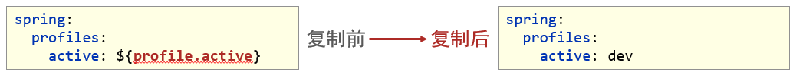

# Spring Boot

## 一、SpringBoot简介

### 1. 入门案例

#### 问题导入

SpringMVC的HelloWord程序大家还记得吗？

- SpringBoot是由Pivotal团队提供的全新框架，其设计目的是用来简化Spring应用的初始搭建以及开发过程

- 原生开发SpringMVC程序过程


#### 1.1 入门案例开发步骤

①：创建新模块，选择Spring初始化，并配置模块相关基础信息


 ②：选择当前模块需要使用的技术集


 ③：开发控制器类

```java
@RestController
@RequestMapping("/books")
public class BookController {
    @GetMapping("/{id}")
    public String getById(@PathVariable Integer id) {
        System.out.println("id ==> " + id);
        return "hello , spring boot! ";
    }
}
```

④：运行自动生成的Application类


* 最简SpringBoot程序所包含的基础文件

```xml
<?xml version="1.0" encoding="UTF-8"?>
<project xmlns="http://maven.apache.org/POM/4.0.0" xmlns:xsi="http://www.w3.org/2001/XMLSchema-instance"
         xsi:schemaLocation="http://maven.apache.org/POM/4.0.0 https://maven.apache.org/xsd/maven-4.0.0.xsd">
    <modelVersion>4.0.0</modelVersion>
    <parent>
        <groupId>org.springframework.boot</groupId>
        <artifactId>spring-boot-starter-parent</artifactId>
        <version>2.5.0</version>
    </parent>
    <groupId>com.itheima</groupId>
    <artifactId>springboot-01-quickstart</artifactId>
    <version>0.0.1-SNAPSHOT</version>
    <dependencies>
        <dependency>
            <groupId>org.springframework.boot</groupId>
            <artifactId>spring-boot-starter-web</artifactId>
        </dependency>
    </dependencies>
</project>
```

```java
@SpringBootApplication
public class Application {
    public static void main(String[] args) {
        SpringApplication.run(Application.class, args);
    }
}
```

* Spring程序与SpringBoot程序对比


**注意事项：**

**基于idea开发SpringBoot程序需要确保联网且能够加载到程序框架结构** 

#### 1.2 基于SpringBoot官网创建项目


#### 1.3 SpringBoot项目快速启动

① 对SpringBoot项目打包（执行Maven构建指令package）

② 执行启动指令

```java
java -jar springboot_01_quickstart.jar	# 项目的名称根据实际情况修改
```

**注意事项：**

**jar支持命令行启动需要依赖maven插件支持，请确认打包时是否具有SpringBoot对应的maven插件。** 

```xml
<build>
    <plugins>
        <plugin>
            <groupId>org.springframework.boot</groupId>
            <artifactId>spring-boot-maven-plugin</artifactId>
        </plugin>
    </plugins>
</build>
```


### 2. SpringBoot创建项目方式

#### 2.1 导入依赖方式1 

```xml
<?xml version="1.0" encoding="UTF-8"?>
<project xmlns="http://maven.apache.org/POM/4.0.0"
         xmlns:xsi="http://www.w3.org/2001/XMLSchema-instance"
         xsi:schemaLocation="http://maven.apache.org/POM/4.0.0 http://maven.apache.org/xsd/maven-4.0.0.xsd">
    <modelVersion>4.0.0</modelVersion>
    <!--继承父项目方式-->
    <parent>
        <groupId>org.springframework.boot</groupId>
        <artifactId>spring-boot-starter-parent</artifactId>
        <version>2.5.5</version>
    </parent>
    <groupId>com.msb</groupId>
    <artifactId>springboot01</artifactId>
    <version>1.0-SNAPSHOT</version>
    <dependencies>
        <dependency>
            <groupId>org.springframework.boot</groupId>
            <artifactId>spring-boot-starter-web</artifactId>
            <version>2.5.5</version>
        </dependency>
    </dependencies>
</project>
```

#### 2.2 导入依赖方式2

```xml
<?xml version="1.0" encoding="UTF-8"?>
<project xmlns="http://maven.apache.org/POM/4.0.0"
         xmlns:xsi="http://www.w3.org/2001/XMLSchema-instance"
         xsi:schemaLocation="http://maven.apache.org/POM/4.0.0 http://maven.apache.org/xsd/maven-4.0.0.xsd">
    <modelVersion>4.0.0</modelVersion>

    <groupId>com.msb</groupId>
    <artifactId>springboot01</artifactId>
    <version>1.0-SNAPSHOT</version>
    
    <dependencyManagement>
        <dependencies>
            <dependency>
                <groupId>org.springframework.boot</groupId>
                <artifactId>spring-boot-dependencies</artifactId>
                <version>2.4.5</version>
                <type>pom</type>
                <scope>import</scope>
            </dependency>
        </dependencies>
    </dependencyManagement>
    <dependencies>
        <dependency>
            <groupId>org.springframework.boot</groupId>
            <artifactId>spring-boot-starter-web</artifactId>
            <version>2.4.5</version>
        </dependency>
    </dependencies>
</project>
```


### 3. SpringBoot概述

#### 问题导入

学习了SpringBoot入门案例之后，感觉对比SpringMVC哪一个更加方便简洁？

- SpringBoot是由Pivotal团队提供的全新框架，其设计目的是用来**简化**Spring应用的**初始搭建**以及**开发过程**
- Spring程序缺点
  - 配置繁琐
  - 依赖设置繁琐
- SpringBoot程序优点
  - 自动配置
  - 起步依赖（简化依赖配置）
  - 辅助功能（内置服务器，……）

#### 3.1 起步依赖

- starter
  - SpringBoot中常见项目名称，定义了当前项目使用的所有项目坐标，以达到减少依赖配置的目的

```xml
<?xml version="1.0" encoding="UTF-8"?>
<project xmlns="http://maven.apache.org/POM/4.0.0" xmlns:xsi="http://www.w3.org/2001/XMLSchema-instance"
         xsi:schemaLocation="http://maven.apache.org/POM/4.0.0 https://maven.apache.org/xsd/maven-4.0.0.xsd">
    <modelVersion>4.0.0</modelVersion>
    <parent>
        <groupId>org.springframework.boot</groupId>
        <artifactId>spring-boot-starter-parent</artifactId>
        <version>2.5.5</version>
    </parent>
    <groupId>com.itheima</groupId>
    <artifactId>springboot-01-quickstart</artifactId>
    <version>0.0.1-SNAPSHOT</version>
    <dependencies>
        <dependency>
            <groupId>org.springframework.boot</groupId>
            <artifactId>spring-boot-starter-web</artifactId>
        </dependency>
    </dependencies>
</project>
```

```xml
<project xmlns="http://maven.apache.org/POM/4.0.0"
         xsi:schemaLocation="http://maven.apache.org/POM/4.0.0 http://maven.apache.org/xsd/maven-4.0.0.xsd"
         xmlns:xsi="http://www.w3.org/2001/XMLSchema-instance">
    <modelVersion>4.0.0</modelVersion>
    <groupId>org.springframework.boot</groupId>
    <artifactId>spring-boot-dependencies</artifactId>
    <version>2.5.5</version>
    <packaging>pom</packaging>
    <properties>
        <servlet-api.version>4.0.1</servlet-api.version>        
        ...
    </properties>
</project>
```

* parent
  * 所有SpringBoot项目要继承的项目，定义了若干个坐标版本号（依赖管理，而非依赖），以达到减少依赖冲突的目的
  * spring-boot-starter-parent（2.5.0）与 spring-boot-starter-parent（2.4.6）共计57处坐标版本不同

```xml
<?xml version="1.0" encoding="UTF-8"?>
<project xmlns="http://maven.apache.org/POM/4.0.0"
         xsi:schemaLocation="http://maven.apache.org/POM/4.0.0 http://maven.apache.org/xsd/maven-4.0.0.xsd"
         xmlns:xsi="http://www.w3.org/2001/XMLSchema-instance">
    <modelVersion>4.0.0</modelVersion>
    <parent>
        <groupId>org.springframework.boot</groupId>
        <artifactId>spring-boot-dependencies</artifactId>
        <version>2.5.0</version>
    </parent>
    <artifactId>spring-boot-starter-parent</artifactId>
    <packaging>pom</packaging>    
    ...
</project>
```

* 实际开发
  * 使用任意坐标时，仅书写GAV中的G和A，V由SpringBoot提供
  * 如发生坐标错误，再指定version（要小心版本冲突）

```xml
<dependency>
    <groupId>junit</groupId>
    <artifactId>junit</artifactId>
    <version>${junit.version}</version>
</dependency>
<dependency>
    <groupId>javax.servlet</groupId>
    <artifactId>javax.servlet-api</artifactId>
    <version>${servlet-api.version}</version>
</dependency>
```

```xml
<?xml version="1.0" encoding="UTF-8"?>
<project xmlns="http://maven.apache.org/POM/4.0.0" xmlns:xsi="http://www.w3.org/2001/XMLSchema-instance"
         xsi:schemaLocation="http://maven.apache.org/POM/4.0.0 https://maven.apache.org/xsd/maven-4.0.0.xsd">
    <parent>
        <groupId>org.springframework.boot</groupId>
        <artifactId>spring-boot-starter-parent</artifactId>
        <version>2.5.0</version>
    </parent>
    <dependencies>
        <dependency>
            <groupId>org.springframework.boot</groupId>
            <artifactId>spring-boot-starter-web</artifactId>
        </dependency>
        <dependency>
            <groupId>org.springframework.boot</groupId>
            <artifactId>spring-boot-starter-test</artifactId>
            <scope>test</scope>
        </dependency>
    </dependencies>
</project>
```

#### 3.2 辅助功能

- SpringBoot程序启动

```java
@SpringBootApplication
public class Springboot01QuickstartApplication {
    public static void main(String[] args) {
        SpringApplication.run(Springboot01QuickstartApplication.class, args);
    }
}
```

- SpringBoot在创建项目时，采用jar的打包方式
- SpringBoot的引导类是项目的入口，运行main方法就可以启动项目
- 使用maven依赖管理变更起步依赖项
- Jetty比Tomcat更轻量级，可扩展性更强（相较于Tomcat），谷歌应用引擎（GAE）已经全面切换为Jetty

```xml
<dependencies>
    <dependency>
        <groupId>org.springframework.boot</groupId>
        <artifactId>spring-boot-starter-web</artifactId>
        <!--web起步依赖环境中，排除Tomcat起步依赖-->
        <exclusions>
            <exclusion>
                <groupId>org.springframework.boot</groupId>
                <artifactId>spring-boot-starter-tomcat</artifactId>
            </exclusion>
        </exclusions>
    </dependency>
    <!--添加Jetty起步依赖，版本由SpringBoot的starter控制-->
    <dependency>
        <groupId>org.springframework.boot</groupId>
        <artifactId>spring-boot-starter-jetty</artifactId>
    </dependency>
</dependencies>
```

#### 3.3 启动原理分析

##### 3.3.1 依赖导入原理


##### 3.3.2 springboot 包扫描原理

* 点击进入`@SpringBootApplication`注解 

```java
@Target(ElementType.TYPE)
@Retention(RetentionPolicy.RUNTIME)
@Documented
@Inherited
@SpringBootConfiguration   // springBootConfiguration 配置
@EnableAutoConfiguration
@ComponentScan(excludeFilters = { @Filter(type = FilterType.CUSTOM, classes = TypeExcludeFilter.class),
                @Filter(type = FilterType.CUSTOM, classes = AutoConfigurationExcludeFilter.class) })
public @interface SpringBootApplication {
```

* `@SpringBootConfiguration`上面有一个`@Configuration表`示这是一个配置类

```java
@Target(ElementType.TYPE)
@Retention(RetentionPolicy.RUNTIME)
@Documented
@Configuration
public @interface SpringBootConfiguration {
```

* 配置类上面有`@Component`说明也是容器中的一个组件

```java
@Target({ElementType.TYPE})
@Retention(RetentionPolicy.RUNTIME)
@Documented
@Component
public @interface Configuration {
    @AliasFor(
        annotation = Component.class
    )
    String value() default "";
    boolean proxyBeanMethods() default true;
}
```

* `@EnableAutoConfiguration `启用自动配置功能
  springboot中没有做任何配置,springboot自动帮助我们配置,但是要通过该注解才能生效

```java
@Target(ElementType.TYPE)
@Retention(RetentionPolicy.RUNTIME)
@Documented
@Inherited
@AutoConfigurationPackage // 自动扫描配置类包的注解
@Import(AutoConfigurationImportSelector.class)// 给容器导入一些组件的选择器,导入一些默认配置
public @interface EnableAutoConfiguration {
```

* `@AutoConfigurationPackage` ,自动配置包

```java
@Target(ElementType.TYPE)
@Retention(RetentionPolicy.RUNTIME)
@Documented
@Inherited
@Import(AutoConfigurationPackages.Registrar.class)
public @interface AutoConfigurationPackage {
```

* `@Import(AutoConfigurationPackages.Registrar.class)` 导入`AutoConfigurationPackages.Registrar`类
  @Import是spring的 底层注解,给容器导入一个组件

```java
static class Registrar implements ImportBeanDefinitionRegistrar, DeterminableImports {
    @Override
    public void registerBeanDefinitions(AnnotationMetadata metadata, BeanDefinitionRegistry registry) {
        register(registry, new PackageImports(metadata).getPackageNames().toArray(new String[0]));
    }
    @Override
    public Set<Object> determineImports(AnnotationMetadata metadata) {
        return Collections.singleton(new PackageImports(metadata));
    }
}
```

`new PackageImports(metadata).getPackageNames()` 将获取配置类`@SpringBootApplication`标注的类的名称

将配置类@SpringBootApplication标注的类所在包及下面所有子包里的所有组件扫描到spring容器

##### 3.3.3 springboot自动配置原理

```java
@Import(AutoConfigurationImportSelector.class)
public @interface EnableAutoConfiguration {
```

给容器中导入一些组件的选择器


这些自动配置类给我们当前项目的场景提供了一些组件和配置,有了自动配置就免除类手动编写配置文件,注入等等功能


该jar包提供一系列的配置类,替换掉了我们的XML配置信息


默认加载如下配置文件


## 二、基础配置

### 1. 配置文件格式

#### 问题导入

框架常见的配置文件有哪几种形式？

#### 1.1 修改服务器端口

http://localhost:8080/books/1		>>>		http://localhost/books/1

SpringBoot提供了多种属性配置方式

* application.properties

```properties
server.port=80
```

* application.yml

```yml
server:
  port: 81
```

* application.yaml

```yaml
server:
  port: 82
```

#### 1.2 SpringBoot配置文件加载顺序（了解）

- `application.properties > application.yml > application.yaml` 

**注意事项：**

1. **SpringBoot核心配置文件名为application**
2. **SpringBoot内置属性过多，且所有属性集中在一起修改，在使用时，通过提示键+关键字修改属性**


### 2. yaml

#### 问题导入

什么是yaml，和properties有什么区别？

- YAML（YAML Ain't Markup Language），一种数据序列化格式
- 优点：
  - 容易阅读
  - 容易与脚本语言交互
  - 以数据为核心，重数据轻格式
- YAML文件扩展名
  - .yml（主流）
  - .yaml 

#### 2.1 yaml语法规则

- 大小写敏感
- 属性层级关系使用多行描述，每行结尾使用冒号结束
- 使用缩进表示层级关系，同层级左侧对齐，只允许使用空格（不允许使用Tab键）
- 属性值前面添加空格（属性名与属性值之间使用冒号+空格作为分隔）
- #表示注释
- 核心规则：**数据前面要加空格与冒号隔开** 

#### 2.2 yaml数组数据

- 数组数据在数据书写位置的下方使用减号作为数据开始符号，每行书写一个数据，减号与数据间空格分隔


#### 2.3 yaml数据读取

- 使用@Value读取单个数据，属性名引用方式：${一级属性名.二级属性名……}


* 封装全部数据到Environment对象


* ==**自定义对象封装指定数据【常用】**==

```java
public class Enterprise {
    private String name;
    private Integer age;
    private String tel;
    private String[] subject;
    //自行添加getter、setter、toString()等方法
}
```


* 自定义对象封装数据警告解决方案


```java
<dependency>
    <groupId>org.springframework.boot</groupId>
    <artifactId>spring-boot-configuration-processor</artifactId>
    <optional>true</optional>
</dependency>
```


### 3. 多环境开发配置

#### 问题导入

在实际开发中，项目的开发环境、测试环境、生产环境的配置信息是否会一致？如何快速切换？

#### 3.1 多环境启动配置

- **yaml文件多环境启动** 


* **properties文件多环境启动** 

```properties
#主启动配置文件 application.properties
spring.profiles.active=pro
```

```properties
#环境分类配置文件 application-pro.properties
server.port=80
```

```properties
#环境分类配置文件 application-dev.properties
server.port=81
```

```properties
#环境分类配置文件application-test.properties
server.port=82
```

#### 3.2 多环境启动命令格式

- 带参数启动SpringBoot

```properties
java –jar springboot.jar --spring.profiles.active=test
java –jar springboot.jar --server.port=88
java –jar springboot.jar --server.port=88 --spring.profiles.active=test
```

* 参数加载优先顺序
  * 参看文档：[https://docs.spring.io/spring-boot/docs/current/reference/html/spring-boot-features.html#boot-features-external-config](https://docs.spring.io/spring-boot/docs/current/reference/html/spring-boot-features.html)


#### 3.3 多环境开发控制

**Maven与SpringBoot多环境兼容（步骤）**

①：Maven中设置多环境属性

```xml
<profiles>
    <profile>
        <id>dev_env</id>
        <properties>
            <profile.active>dev</profile.active>
        </properties>
        <activation>
            <activeByDefault>true</activeByDefault>
        </activation>
    </profile>
    <profile>
        <id>pro_env</id>
        <properties>
            <profile.active>pro</profile.active>
        </properties>
    </profile>
    <profile>
        <id>test_env</id>
        <properties>
            <profile.active>test</profile.active>
        </properties>
    </profile>
</profiles>
```

②：SpringBoot中引用Maven属性


③：执行Maven打包指令

- Maven指令执行完毕后，生成了对应的包，其中类参与编译，但是配置文件并没有编译，而是复制到包中


- 解决思路：对于源码中非java类的操作要求加载Maven对应的属性，解析${}占位符

④：对资源文件开启对默认占位符的解析

```xml
<build>
    <plugins>
        <plugin>
            <artifactId>maven-resources-plugin</artifactId>
            <configuration>
                <encoding>utf-8</encoding>
                <useDefaultDelimiters>true</useDefaultDelimiters>
            </configuration>
        </plugin>
    </plugins>
</build>
```

* Maven打包加载到属性，打包顺利通过




### 4. 配置文件分类

#### 问题导入

SpringBoot的配置文件可以放在项目的哪些地方？


```properties
java –jar springboot.jar --spring.profiles.active=test --server.port=85 --server.servlet.context-path=/heima --server.tomcat.connection-timeout=-1 ... ...
```

- SpringBoot中4级配置文件

  1级： file ：config/application.yml 【最高】

  2级： file ：application.yml

  3级：classpath：config/application.yml

  4级：classpath：application.yml  【最低】

- 作用：

  1级与2级留做系统打包后设置通用属性

  3级与4级用于系统开发阶段设置通用属性


## 三、整合第三方技术

### 1. 整合JUnit

#### 问题导入

回忆一下Spring整合JUnit的步骤？

#### 1.1 Spring整合JUnit（复习）


#### 1.2 SpringBoot整合JUnit

【第一步】添加整合junit起步依赖(可以直接勾选)

```xml
<dependency>
    <groupId>org.springframework.boot</groupId>
    <artifactId>spring-boot-starter-test</artifactId>
    <scope>test</scope>
</dependency>
```

【第二步】编写测试类，默认自动生成了一个

```java
@SpringBootTest
class Springboot07JunitApplicationTests {
    @Autowired
    private BookService bookService;

    @Test
    public void testSave() {
        bookService.save();
    }
}
```


### 2. 基于SpringBoot实现SSM整合

#### 问题导入

回忆一下Spring整合MyBatis的核心思想？

#### 2.1 Spring整合MyBatis（复习）

- SpringConfig
  - 导入JdbcConfig
  - 导入MyBatisConfig

```java
@Configuration
@ComponentScan("com.itheima")
@PropertySource("classpath:jdbc.properties")
@Import({JdbcConfig.class, MyBatisConfig.class})
public class SpringConfig {

}
```

- JDBCConfig
  - 定义数据源（加载properties配置项：driver、url、username、password）

```properties
#jdbc.properties
jdbc.driver=com.mysql.jdbc.Driver
jdbc.url=jdbc:mysql://localhost:3306/spring_db
jdbc.username=root
jdbc.password=itheima
```

```java
public class JdbcConfig {
    @Value("${jdbc.driver}")
    private String driver;
    @Value("${jdbc.url}")
    private String url;
    @Value("${jdbc.username}")
    private String userName;
    @Value("${jdbc.password}")
    private String password;

    @Bean
    public DataSource getDataSource() {
        DruidDataSource ds = new DruidDataSource();
        ds.setDriverClassName(driver);
        ds.setUrl(url);
        ds.setUsername(userName);
        ds.setPassword(password);
        return ds;
    }
}

```

- MyBatisConfig
  - 定义SqlSessionFactoryBean
  - 定义映射配置

```java
@Bean
public SqlSessionFactoryBean getSqlSessionFactoryBean(DataSource dataSource) {
    SqlSessionFactoryBean ssfb = new SqlSessionFactoryBean();
    ssfb.setTypeAliasesPackage("com.itheima.domain");
    ssfb.setDataSource(dataSource);
    return ssfb;
}
```

```java
@Bean
public MapperScannerConfigurer getMapperScannerConfigurer() {
    MapperScannerConfigurer msc = new MapperScannerConfigurer();
    msc.setBasePackage("com.itheima.dao");
    return msc;
}
```

#### 2.2 SpringBoot整合MyBatis

- SpringBoot整合Spring（不存在）
- SpringBoot整合SpringMVC（不存在）
- SpringBoot整合MyBatis（主要）


①：创建新模块，选择Spring初始化，并配置模块相关基础信息


②：选择当前模块需要使用的技术集（MyBatis、MySQL）


③：设置数据源参数

```yaml
spring:
  datasource:
    driver-class-name: com.mysql.cj.jdbc.Driver
    url: jdbc:mysql://localhost:3306/ssm_db?serverTimezone=UTC
    username: root
    password: root
    type: com.alibaba.druid.pool.DruidDataSource
mybatis:
  mapper-locations: classpath:mybatis/*.xml
  type-aliases-package: com.example.pojo
```

> `mapper-locations: classpath:mybatis/*.xml  mapper` 映射文件包扫描
> `type-aliases-package` 实体类别名包扫描

注意事项：

1. SpringBoot版本低于2.4.3(不含)，Mysql驱动版本大于8.0时，需要在url连接串中配置时区，或在MySQL数据库端配置时区解决此问题

```properties
jdbc:mysql://localhost:3306/ssm_db?serverTimezone=UTC
```

④：定义数据层接口与映射配置

```java
@Mapper
public interface UserDao {
    @Select("select * from tbl_book where id=#{id}")
    Book getById(Integer id);
}
```

⑤：测试类中注入dao接口，测试功能

```java
@SpringBootTest
class Springboot08MybatisApplicationTests {
    @Autowired
    private BookDao bookDao;

    @Test
    public void testGetById() {
        Book book = bookDao.getById(1);
        System.out.println(book);
    }
}
```

#### 2.3 案例-SpringBoot实现ssm整合

**【第一步】创建SpringBoot工程，添加druid依赖** 

```xml
<!-- todo 1 添加druid连接池依赖-->
<dependency>
    <groupId>com.alibaba</groupId>
    <artifactId>druid</artifactId>
    <version>1.2.6</version>
</dependency>
```

**【第二步】复制springmvc_11_page工程各种资源(主java类、页面、测试类)**

**【第三步】删除config包中的所有配置，在BookDao接口上加@Mapper注解** 

```java
//todo 3 在BookDao接口上加@Mapper注解，让SpringBoot给接口创建代理对象
@Mapper
public interface BookDao {
    //...
}
```

**【第四步】将application.properties修改成application.yml，配置端口号和连接参数** 

```yaml
server:
  port: 80
# todo 4 配置数据库连接参数
spring:
  datasource:
    driver-class-name: com.mysql.cj.jdbc.Driver
    url: jdbc:mysql://localhost:3306/ssm_db
    username: root
    password: root
    type: com.alibaba.druid.pool.DruidDataSource
mybatis:
  mapper-locations: classpath:mybatis/*.xml
  type-aliases-package: com.example.pojo
```

**【第五步】修改BookServiceTest配置类，进行配置** 

```java
// todo 5 修改单元测试类，添加@SpringBootTest主键，修复@Test注解导包
@SpringBootTest
public class BookServiceTest {

    @Autowired
    private BookService bookService;

    @Test
    public void testGetById(){
        Book book = bookService.getById(2); //传递参数1会抛出异常
        System.out.println(book);
    }
    @Test
    public void testGetAll(){
        List<Book> all = bookService.getAll();
        System.out.println(all);
    }
}
```

**【第六步】在static目录中提供index.html页面，跳转到"pages/books.html"** 

```js
<script>
    location.href="pages/books.html"
</script>
```

**最后：运行引导类即可访问** 


### 3. 整合Logback

​		Spring Boot默认使用Logback组件作为日志管理。Logback是由log4j创始人设计的一个开源日志组件。在Spring Boot项目中我们不需要额外的添加Logback的依赖，因为在spring-boot-starter或者spring-boot-starter-web中已经包含了Logback的依赖。

* Logback读取配置文件的步骤
  （1）在classpath下查找文件logback-test.xml
  （2）如果文件不存在，则查找logback.xml

```xml
<?xml version="1.0" encoding="UTF-8" ?>
 <configuration>
<!--定义日志文件的存储地址 勿在 LogBack 的配置中使用相对路径-->  
    <property name="LOG_HOME" value="${catalina.base}/logs/" />  
    <!-- 控制台输出 -->   
    <appender name="Stdout" class="ch.qos.logback.core.ConsoleAppender">
       <!-- 日志输出格式 -->  
        <layout class="ch.qos.logback.classic.PatternLayout">   
             <!--格式化输出：%d表示日期，%thread表示线程名，%-5level：级别从左显示5个字符宽度%msg：日志消息，%n是换行符--> 
            <pattern>%d{yyyy-MM-dd HH:mm:ss.SSS} [%thread] %-5level %logger{50} - %msg%n   
            </pattern>   
        </layout>   
    </appender>   
    <!-- 按照每天生成日志文件 -->   
    <appender name="RollingFile"  class="ch.qos.logback.core.rolling.RollingFileAppender">   
        <rollingPolicy class="ch.qos.logback.core.rolling.TimeBasedRollingPolicy">
            <!--日志文件输出的文件名-->
            <FileNamePattern>${LOG_HOME}/server.%d{yyyy-MM-dd}.log</FileNamePattern>   
            <MaxHistory>30</MaxHistory>
        </rollingPolicy>   
        <layout class="ch.qos.logback.classic.PatternLayout">  
            <!--格式化输出：%d表示日期，%thread表示线程名，%-5level：级别从左显示5个字符宽度%msg：日志消息，%n是换行符--> 
            <pattern>%d{yyyy-MM-dd HH:mm:ss.SSS} [%thread] %-5level %logger{50} - %msg%n   
            </pattern>   
       </layout> 
        <!--日志文件最大的大小-->
       <triggeringPolicy class="ch.qos.logback.core.rolling.SizeBasedTriggeringPolicy">
         <MaxFileSize>10MB</MaxFileSize>
       </triggeringPolicy>
    </appender>     
    <!-- 日志输出级别 -->
    <root level="info">   
        <appender-ref ref="Stdout" />   
        <appender-ref ref="RollingFile" />   
    </root>
    <logger name="com.msb.mapper" level="DEBUG"></logger>
<!--日志异步到数据库 -->  
<!--<appender name="DB" class="ch.qos.logback.classic.db.DBAppender">
        日志异步到数据库 
        <connectionSource class="ch.qos.logback.core.db.DriverManagerConnectionSource">
           连接池 
           <dataSource class="com.mchange.v2.c3p0.ComboPooledDataSource">
              <driverClass>com.mysql.jdbc.Driver</driverClass>
              <url>jdbc:mysql://127.0.0.1:3306/databaseName</url>
              <user>root</user>
              <password>root</password>
            </dataSource>
        </connectionSource>
  </appender> -->
</configuration>
```


### 4. 整合PageHelper

* 实现原理
  		PageHelper方法使用了静态的ThreadLocal参数，分页参数和线程是绑定的。内部流程是ThreadLocal中设置了分页参数（pageIndex，pageSize），之后在查询执行的时候，获取当线程中的分页参数，执行查询的时候通过拦截器在sql语句中添加分页参数，之后实现分页查询，查询结束后在 finally 语句中清除ThreadLocal中的查询参数

* 使用方法
  1. 调用PageHelper方法：`PageHelper.startPage(pageNum, pageSize)` 
  2. MyBatis 查询方法
     注意：只要你可以保证在PageHelper方法调用后紧跟 MyBatis 查询方法，这就是安全的。因为PageHelper在finally代码段中自动清除了ThreadLocal存储的对象。

> MyBatis整合PageHelper插件,自行阅读即可
>
> https://blog.csdn.net/qq_38263083/article/details/84592066

#### 4.1 添加 PageHelper 依赖

```xml
<dependency>
    <groupId>com.github.pagehelper</groupId>
    <artifactId>pagehelper-spring-boot-starter</artifactId>
    <version>1.2.12</version>
</dependency>
```

#### 4.2 实现分页

##### 4.2.1 EmpController 层

```java
@Controller
@RequestMapping("/emp")
public class EmpController {
    @Autowired
    private EmpService empService;
    @RequestMapping("/findByPage/{pageNum}/{pageSize}")
    @ResponseBody
    public PageInfo<Emp> findByPage(@PathVariable("pageNum") Integer pageNum,@PathVariable("pageSize") Integer pageSize){
        return empService.findByPage(pageNum,pageSize);
    }
}
```

##### 4.2.2 Service层

```java
@Service
public class EmpServiceImpl implements EmpService {
    @Autowired
    private EmpMapper empMapper;
    @Override
    public PageInfo<Emp> findByPage(Integer pageNum, Integer pageSize) {
        Page<Emp> page = PageHelper.startPage(pageNum, pageSize);
        List<Emp> list =empMapper.findAll();
        // 方式1
        System.out.println("当前页:"+page.getPageNum());
        System.out.println("总页数"+page.getPages());
        System.out.println("页大小:"+page.getPageSize());
        System.out.println("总记录数:"+page.getTotal());
        System.out.println("当前页数据"+page.getResult());
        // 方式2
        PageInfo<Emp> pi =new PageInfo<>(list);
        System.out.println("当前页"+pi.getPageNum());
        System.out.println("总页数"+pi.getPages());
        System.out.println("页大小"+pi.getSize());
        System.out.println("总记录数"+pi.getTotal());
        System.out.println("当前页数据"+pi.getList());
        return pi;
    }
}
```

> PageInfo对象和Page对象的区别
> https://blog.csdn.net/weixin_43760541/article/details/107155386 

* Page对象 参数解析


* PageInfo对象 参数解析


### 5. 整合 Druid

​		Druid是由阿里巴巴推出的数据库连接池。它结合了C3P0、DBCP、PROXOOL等数据库连接池的优点。之所以从众多数据库连接池中脱颖而出，还有一个重要的原因就是它包含控制台,很方便的帮助我们实现对于sql执行的监控


#### 5.1 导入依赖

```xml
<dependency>
    <groupId>com.alibaba</groupId>
    <artifactId>druid-spring-boot-starter</artifactId>
    <version>1.1.10</version>
</dependency>
```

#### 5.2 修改配置文件application.yml

```yaml
spring:
  datasource:
    # 使用阿里的Druid连接池
    type: com.alibaba.druid.pool.DruidDataSource
    driver-class-name: com.mysql.cj.jdbc.Driver
    # 填写你数据库的url、登录名、密码和数据库名
    url: jdbc:mysql://127.0.0.1:3306/ssm_db?useSSL=false&useUnicode=true&characterEncoding=UTF-8&serverTimezone=Asia/Shanghai
    username: root
    password: Gukai2025@
    druid:
      # 连接池的配置信息
      # 初始化大小，最小，最大
      initial-size: 5
      min-idle: 5
      maxActive: 20
      # 配置获取连接等待超时的时间
      maxWait: 60000
      # 配置间隔多久才进行一次检测，检测需要关闭的空闲连接，单位是毫秒
      timeBetweenEvictionRunsMillis: 60000
      # 配置一个连接在池中最小生存的时间，单位是毫秒
      minEvictableIdleTimeMillis: 300000
      validationQuery: SELECT 1
      testWhileIdle: true
      testOnBorrow: false
      testOnReturn: false
      # 打开PSCache，并且指定每个连接上PSCache的大小
      poolPreparedStatements: true
      maxPoolPreparedStatementPerConnectionSize: 20
      # 配置监控统计拦截的filters，去掉后监控界面sql无法统计，'wall' 用于防火墙
      filters: stat,wall,slf4j
      # 通过connectProperties属性来打开mergeSql功能；慢SQL记录
      connectionProperties: druid.stat.mergeSql\=true;druid.stat.slowSqlMillis\=5000
      # 配置DruidStatFilter
      web-stat-filter:
        enabled: true
        url-pattern: "/*"
        exclusions: "*.js,*.gif,*.jpg,*.bmp,*.png,*.css,*.ico,/druid/*"
      # 配置DruidStatViewServlet
      stat-view-servlet:
        url-pattern: "/druid/*"
        # IP白名单(没有配置或者为空，则允许所有访问)
        allow: 127.0.0.1,192.168.8.109
        # IP黑名单 (存在共同时，deny优先于allow)
        deny: 192.168.1.188
        # 禁用HTML页面上的“Reset All”功能
        reset-enable: false
        # 登录名
        login-username: admin
        # 登录密码
        login-password: 123456

```


### 6. 整合FreeMarker

#### 6.1 FreeMarker的简介

​		FreeMarker是一款模板引擎： 即一种基于模板和要改变的数据， 并用来生成输出文本（HTML网页、电子邮件、配置文件、源代码等）的通用工具。 它不是面向最终用户的，而是一个Java类库，是一款程序员可以嵌入他们所开发产品的组件。
​		FreeMarker是免费的，基于Apache许可证2.0版本发布。其模板编写为FreeMarker Template Language（FTL），属于简单、专用的语言。需要准备数据在真实编程语言中来显示，比如数据库查询和业务运算， 之后模板显示已经准备好的数据。在模板中，主要用于如何展现数据， 而在模板之外注意于要展示什么数据。


#### 6.2 FreeMarker使用

* 导入FreeMarker 依赖

```xml
<!--freeMaker依赖-->
<dependency>
    <groupId>org.springframework.boot</groupId>
    <artifactId>spring-boot-starter-freemarker</artifactId>
</dependency>
```

* 创建controller

```java
@RequestMapping("/freemarker")
@Controller
public class FreemarkerController {
    @RequestMapping("/show")
    public String freemarker(Map<String, Object> map){
        map.put("name","msb");
        //返回模板文件名称
        return "show";
    }
}
```


通过查阅配置信息发现,默认前缀为 `''`,后缀为`.ftlh`,默认路径为`templates` 

* templates目录下创建模板文件


```ftlh
<!DOCTYPE html>
<html lang="en">
<head>
    <meta charset="UTF-8">
    <title>Title</title>
</head>
<body>
this is showftlh
<br/>
${name}
</img>
</body>
</html>
```

#### 6.3 FreeMarker常用指令

##### 6.3.1 遍历List集合

1. 注释，即`<#‐‐‐‐>`，介于其之间的内容会被freemarker忽略
2. 插值（Interpolation）：即`${..}`部分,freemarker会用真实的值代替${..}
3. FTL指令：和HTML标记类似，名字前加#予以区分，Freemarker会解析标签中的表达式或逻辑。
4. 文本，仅文本信息，这些不是freemarker的注释、插值、FTL指令的内容会被freemarker忽略解析，直接输出内容。

* Controller 层

```java
@Controller
public class FreemarkerController {
    @Autowired
    private EmpService empService;
    @RequestMapping("/showEmp")
    public ModelAndView testList(){
        ModelAndView mv =new ModelAndView();
        List<Emp> list =empService.findAll();
        mv.addObject("empList", list);
        mv.setViewName("showEmp");
        return mv;
    }
}
```

* 页面层

```html
<!DOCTYPE html>
<html lang="en">
<head>
    <meta charset="UTF-8">
    <title>Title</title>
    <style type="text/css">
        #empTable{
            width: 80%;
            border: 1px solid blue;
            margin: 0px auto;
        }
        #empTable th,td{
            border: 1px solid green;
            text-align: center;
        }
    </style>
</head>
<body>
<table id="empTable" cellpadding="0px" cellspacing="0px">
    <tr>
        <th>索引</th>
        <th>工号</th>
        <th>姓名</th>
        <th>岗位</th>
        <th>薪资</th>
        <th>部门号</th>
    </tr>
    <#list empList as emp>
        <tr>
            <td>${emp_index}</td>
            <td>${emp.empno}</td>
            <td>${emp.ename}</td>
            <td>${emp.job}</td>
            <td>${emp.sal}</td>
            <td>${emp.deptno}</td>
        </tr>
    </#list>
</table>
</body>
</html>
```

> 说明： `_index`：得到循环的下标，使用方法是在stu后边加`"_index"`，它的值是从0开始


##### 6.3.2 遍历Map数据

* **controller** 层

```java
@Controller
public class FreemarkerController {
    @Autowired
    private EmpService empService;
    @RequestMapping("/showEmpMap")
    public ModelAndView testMap(){
        ModelAndView mv =new ModelAndView();
        List<Emp> list =empService.findAll();
        Map<String,Emp> empMap =new HashMap<>();
        for (Emp emp : list) {
            empMap.put(emp.getEmpno().toString(), emp);
        }
        mv.addObject("empMap", empMap);
        mv.setViewName("showEmpMap");
        return mv;
    }
```

* 页面

```html
<!DOCTYPE html>
<html lang="en">
<head>
    <meta charset="UTF-8">
    <title>Title</title>
    <style type="text/css">
        #empTable{
            width: 80%;
            border: 1px solid blue;
            margin: 0px auto;
        }
        #empTable th,td{
            border: 1px solid green;
            text-align: center;
        }
    </style>
</head>
<body>
输出7521员工信息：<br/>
工号:${empMap['7521'].empno}<br/>
姓名:${empMap['7521'].ename}<br/>
岗位:${empMap['7521'].job}<br/>
薪资:${empMap['7521'].sal}<br/>
部门号:${empMap['7521'].deptno}<br/>
<br/>
遍历EmpMap
<table id="empTable" cellpadding="0px" cellspacing="0px">
    <tr>
        <th>索引</th>
        <th>工号</th>
        <th>姓名</th>
        <th>岗位</th>
        <th>薪资</th>
        <th>部门号</th>
    </tr>
    <#list empMap?keys as k>
        <tr>
            <td>${k_index}</td>
            <td>${k}</td>
            <td>${empMap[k].ename}</td>
            <td>${empMap[k].job}</td>
            <td>${empMap[k].sal}</td>
            <td>${empMap[k].deptno}</td>
        </tr>
    </#list>
</table>
</body>
</html>
```

>  FreeMarker在遍历map集合是,key必须是String

##### 6.3.3 if指令

​		if 指令即判断指令，是常用的FTL指令，freemarker在解析时遇到if会进行判断，条件为真则输出if中间的内容，否 则跳过内容不再输出。

* if中支持的运算符
  * 算数运算符 FreeMarker表达式中完全支持算术运算,FreeMarker支持的算术运算符包括:+, - , * , / , %
  * 逻辑运算符有如下几个: 逻辑与:&& 逻辑或:|| 逻辑非:! 逻辑运算符只能作用于布尔值,否则将产生错误
  * 比较运算符有如下几个:
            ①　=或者==:判断两个值是否相等.
            ②　!=:判断两个值是否不等.
            ③　> 或者gt:判断左边值是否大于右边值
            ④　>=或者gte:判断左边值是否大于等于右边值
            ⑤　<或者lt:判断左边值是否小于右边值
            ⑥　<=或者lte:判断左边值是否小于等于右边值
    注意: =和!=可以用于字符串,数值和日期来比较是否相等,但=和!=两边必须是相同类型的值,否则会产生错误,而且FreeMarker是精确比较,"x","x ","X"是不等的.其它的运行符可以作用于数字和日期,但不能作用于字符串,大部分的时候,使用gt等字母运算符代替>会有更好的效果,因为 FreeMarker会把>解释成FTL标签的结束字符,当然,也可以使用括号来避免这种情况,如:<#if (x>y)>

* 如何判断空值
  1. 判断某变量是否存在使用 “??” 用法为:variable??,如果该变量存在,返回true,否则返回false 例：为防止stus为空报错可以加上判断如下
  2. 缺失变量默认值使用 “!” 使用!要以指定一个默认值，当变量为空时显示默认值。例： ${name!''}表示如果name为空显示空字符串。如果是嵌套对象则建议使用（）括起来。

```
<#if empList??>
        <#list empList as emp>
            <tr <#if emp_index%2 ==0 > style="background-color: gray" </#if>>
                <td>${emp_index}</td>
                <td>${emp.empno}</td>
                <td <#if emp.ename == 'KING'> style="color: aqua" </#if>>${emp.ename}</td>
                <td>${emp.job}</td>
                <td>${emp.mgr!'无'}</td>
                <td <#if emp.sal gte 2000.0> style="color: red" </#if>>${emp.sal}</td>
                <td>${emp.comm!'0'}</td>
                <td>${emp.deptno}</td>
            </tr>
        </#list>
    </#if>
```

##### 6.3.4 内置函数

​		内建函数语法格式： 变量+?+函数名称

1. 内建函数获取某个集合的大小
   ${集合名?size}

2. 内建函数日期格式化
   显示年月日:         `${today?date}`
   显示时分秒：      `${today?time}`
   显示日期+时间：`${today?datetime}`
   自定义格式化：  ` ${today?string("yyyy年MM月")}`

3. 内建函数将json字符串转成对象

```html
<#assign text="{'bank':'工商银行','account':'10101920201920212'}" />
<#assign data=text?eval />
开户行：${data.bank} 账号：${data.account}
```

其中用到了 assign标签，assign的作用是定义一个变量。


### 7. 整合thymeleaf

​		Thymeleaf的主要目标是将优雅的自然模板带到开发工作流程中，并将HTML在浏览器中正确显示，并且可以作为静态原型，让开发团队能更容易地协作。Thymeleaf能够处理HTML，XML，JavaScript，CSS甚至纯文本。
​    	长期以来,jsp在视图领域有非常重要的地位,随着时间的变迁,出现了一位新的挑战者:Thymeleaf,Thymeleaf是原生的,不依赖于标签库.它能够在接受原始HTML的地方进行编辑和渲染.因为它没有与Servelet规范耦合,因此Thymeleaf模板能进入jsp所无法涉足的领域。
​    	Thymeleaf在Spring Boot项目中放入到resources/templates中。这个文件夹中的内容是无法通过浏览器URL直接访问的（和WEB-INF效果一样），所有Thymeleaf页面必须先走控制器

#### 7.1 添加依赖

```xml
<dependency>
    <groupId>org.springframework.boot</groupId>
    <artifactId>spring-boot-starter-thymeleaf</artifactId>
    <version>2.5.5</version>
</dependency>
```

* Thymeleaf默认配置

  | 配置项                  | 默认配置              |
  | ----------------------- | --------------------- |
  | spring.thymeleaf.prefix | classpath:/templates/ |
  | spring.thymeleaf.suffix | .html                 |

#### 7.2 thymeleaf 基础

Thymeleaf通过标准变量表达式完成数据的展示和处理

1. 标准变量表达式必须依赖标签,不能独立使用
2. 标准变量表达式一般在开始标签中,以 th开头
3. 语法为:` <tag th:***="${key}"></tag>`
4. 表达式中可以通过${}取出域中的值并放入标签的指定位置
5. ${}在这里不能单独使用,必须在 th:后面的双引号里使用

为了有提示,修改html页面中`<html>`标签为

```html
<html xmlns:th="http://www.thymeleaf.org" >
```

##### 7.2.1 `th:text` 属性

向HTML标签内部输出信息。

* **Controller** 层

```java
@RequestMapping("showIndex")
public String  showIndex(Map<String,Object> map){
    map.put("msg", "testMessage");
    return "index";
}
```

* **html**  页面

```html
<!--向span双标签内部添加文本-->
<span th:text="pageMessage"></span> <br/>
<!--从域中根据参数名取出参数值放在双标签中-->
<span th:text="${msg}"></span>      <br/>
```

##### 7.2.2 `th:value` 属性

表单元素，设置HTML标签中表单元素value属性时使用。

```html
<!--向input标签中的value属性赋值-->
<input type="text"  th:value="pageMessage"/>
<!--从域中根据参数名取出参数值 向input标签中的value属性赋值-->
<input type="text"  th:value="${msg}"/>
```

##### 7.2.3 `th:if`  属性

```html
<span th:if="${name}!='张三'">会显示</span>
```

##### 7.2.3 `th:each` 属性

示例中u为迭代遍历。

`th:each="u,i :${list}"`  其中i表示迭代状态。

1. `index`: 当前迭代器的索引 从0开始

2. `count`: 当前迭代对象的计数 从1开始

3. `size`: 被迭代对象的长度

4. `even/odd`: 布尔值，当前循环是否是偶数/奇数 从0开始

5. `first`: 布尔值，当前循环的是否是第一条，如果是返回true否则返回false

6. `last`: 布尔值，当前循环的是否是最后一条，如果是则返回true否则返回false


* **controller**代码 

```java
@Controller
public class ThymeleafController {
    @Autowired
    private EmpService empService;
    @RequestMapping("/showEmp")
    public String showEmp(Map<String, Object> map) {
        List<Emp> empList = empService.findAll();
        map.put("empList", empList);
        map.put("emp", empList.get(0));
        return "showEmp";
    }
```

* 页面模板代码

```html
<!DOCTYPE html>
<html lang="en" xmlns:th="http://www.thymeleaf.org">
<head>
    <meta charset="UTF-8">
    <title>Title</title>
    <style type="text/css">
        #empTable{
            width: 80%;
            border: 1px solid blue;
            margin: 0px auto;
        }
        #empTable th,td{
            border: 1px solid green;
            text-align: center;
        }
    </style>
</head>
<body>
展示单个员工信息:
<span th:if="${emp}!=null">
    工号:<span th:text="${emp.empno}"></span><br/>
    姓名:<span th:text="${emp.ename}"></span><br/>
    职务:<span th:text="${emp.job}"></span><br/>
    上级:<span th:text="${emp.mgr}"></span><br/>
    入职日期:<span th:text="${emp.hiredate}"></span><br/>
    工资:<span th:text="${emp.sal}"></span><br/>
    补助:<span th:text="${emp.comm}"></span><br/>
    部门号:<span th:text="${emp.deptno}"></span><br/>
</span>
<hr/>
<span  th:if="${empList}!=null">
    <span  th:if="${empList.size()} ne 0">
        工号:<span th:text="${empList[0].empno}"></span><br/>
        姓名:<span th:text="${empList[0].ename}"></span><br/>
        职务:<span th:text="${empList[0].job}"></span><br/>
        上级:<span th:text="${empList[0].mgr}"></span><br/>
        入职日期:<span th:text="${empList[0].hiredate}"></span><br/>
        工资:<span th:text="${empList[0].sal}"></span><br/>
        补助:<span th:text="${empList[0].comm}"></span><br/>
        部门号:<span th:text="${empList[0].deptno}"></span><br/>
    </span>
</span>
<table  id="empTable" cellpadding="0px" cellspacing="0px">
    <tr>
        <th>索引</th>
        <th>序号</th>
        <th>总人数</th>
        <th>偶数索引?</th>
        <th>奇数索引?</th>
        <th>第一?</th>
        <th>最后?</th>
        <th>工号</th>
        <th>姓名</th>
        <th>职务</th>
        <th>上级</th>
        <th>入职日期</th>
        <th>工资</th>
        <th>补助</th>
        <th>部门号</th>
    </tr>
    <tr th:each="emp,i:${empList}">
        <td th:text="${i.index}"></td>
        <td th:text="${i.count}"></td>
        <td th:text="${i.size}"></td>
        <td th:text="${i.odd}"></td>
        <td th:text="${i.even}"></td>
        <td th:text="${i.first}"></td>
        <td th:text="${i.last}"></td>
        <td th:text="${emp.empno}"></td>
        <td th:text="${emp.ename}"></td>
        <td th:text="${emp.job}"></td>
        <td th:text="${emp.mgr}"></td>
        <td th:text="${emp.hiredate}"></td>
        <td th:text="${emp.sal}"></td>
        <td th:text="${emp.comm}"></td>
        <td th:text="${emp.deptno}"></td>
    </tr>
    
</table>
</body>
</html>
```


##### 7.2.4 标准变量表达式运算符支持

* 标准变量表达式支持的运算符

  * 算数运算符

    ```
    算术运算：+ , - , * , / , %
    ```

    ```html
    <span th:text="1+1"></span>
    <span th:text="'1'+1"></span>
    <span th:text="${emp.empno}+1"></span>
    <span th:text="${emp.empno+1}"></span>
    ```

  * 关系运算符

    ```
    1 gt:     great than（大于）>
    2 ge：    great equal（大于等于）>=
    3 eq：    equal（等于）==
    4 lt：    less than（小于）<
    5 le：    less equal（小于等于）<=
    6 ne：    not equal（不等于）!= 
    ```

  * 逻辑运算符

    ```
    &&  或 and:   表示并且
    
    ||  或  or  : 表示或者
    ```

    ```html
    <div th:text="1>0 and 2<3"></div>
    <div th:text="1>0 and 2>3"></div>
    <div th:text="1>0 or 2<3"></div>
    <div th:text="1>0 or 2>3"></div>
    <hr/>
    <div th:text="${emp.sal ge 800}"></div>
    <div th:text="${emp.sal } ge 800"></div>
    <div th:text="${emp.sal ge 800} and ${emp.deptno eq 20}"></div>
    <div th:text="(${emp.sal }ge 800) or (${emp.deptno } ne 20)"></div>
    <div th:text="${emp.sal ge 800 or emp.deptno ne 20 }"></div>
    ```

  * 三目运算符

    ```html
    <tr th:each="emp,i:${empList}" th:class="${i.odd}?a:b">
    ```

  * 对空值作出处理

    ```html
       <tr th:each="emp,i:${empList}" th:class="${i.odd}?a:b">
            <td th:text="${i.index}"></td>
            <td th:text="${i.count}"></td>
            <td th:text="${i.size}"></td>
            <td th:text="${i.odd}"></td>
            <td th:text="${i.even}"></td>
            <td th:text="${i.first}"></td>
            <td th:text="${i.last}"></td>
            <td th:text="${emp.empno}"></td>
            <td th:text="${emp.ename}"></td>
            <td th:text="${emp.job}"></td>
            <td th:text="${emp.mgr} eq null ?老板:${emp.mgr}"></td>
            <td th:text="${emp.hiredate}"></td>
            <td th:text="${emp.sal}"></td>
            <td th:text="${emp.comm} eq null ?0:${emp.comm}"></td>
            <td th:text="${emp.deptno}"></td>
        </tr>
    ```

##### 7.2.5 `th:href` 属性

设置`href属性`的。取值使用`@{}`取值

```html
<a th:href="@{/getParam(id=1,name='msb')}" >跳转</a>
<!-- 获取作用域值-->
<a th:href="@{/getParam(name=${stu.name},age=${stu.age})}">跳转二</a>
```

* 页面代码

```html
<tr th:each="emp,i:${empList}" th:class="${i.odd}?a:b">
    <td th:text="${i.index}"></td>
    <td th:text="${i.count}"></td>
    <td th:text="${i.size}"></td>
    <td th:text="${i.odd}"></td>
    <td th:text="${i.even}"></td>
    <td th:text="${i.first}"></td>
    <td th:text="${i.last}"></td>
    <td th:text="${emp.empno}"></td>
    <td th:text="${emp.ename}"></td>
    <td th:text="${emp.job}"></td>
    <td th:text="${emp.mgr} eq null ?老板:${emp.mgr}"></td>
    <td th:text="${emp.hiredate}"></td>
    <td th:text="${emp.sal}"></td>
    <td th:text="${emp.comm} eq null ?0:${emp.comm}"></td>
    <td th:text="${emp.deptno}"></td>
    <td>
        <a th:href="@{/removeEmp(empno=${emp.empno},ename=${emp.ename})}">删除</a>
    </td>
</tr>
```

* **controller** 层

```java
@Controller
public class ThymeleafController {
    @Autowired
    private EmpService empService;
    @RequestMapping("/showAllEmp")
    public String showEmp(Map<String, Object> map) {
        List<Emp> empList = empService.findAll();
        map.put("empList", empList);
        map.put("emp", empList.get(0));
        return "showEmp";
    }
    @RequestMapping("/removeEmp")
    public String removeEmp(Integer empno,String ename){
        boolean success =empService.removeEmp(empno,ename);
        return "redirect:showAllEmp";
    }
}
```

##### 7.2.6 `th:onclick` 属性 

给元素绑定事件,单击事件并传递参数

* 写法1:仅仅支持数字和布尔类型参数的传递,字符串不支持

```html
<a href="javascript:viod(0)"  th:onclick="'del('+${emp.empno}+')'">删除</a>
```

* 写法2:支持数字和文本类型的参数传递

```html
<a href="javascript:void(0)" th:onclick="delEmp([[${emp.empno}]],[[${emp.ename}]])">删除</a>
```

* 案例

```html
<table  id="empTable" cellpadding="0px" cellspacing="0px">
    <tr>
        <th>索引</th>
        <th>序号</th>
        <th>总人数</th>
        <th>偶数索引?</th>
        <th>奇数索引?</th>
        <th>第一?</th>
        <th>最后?</th>
        <th>工号</th>
        <th>姓名</th>
        <th>职务</th>
        <th>上级</th>
        <th>入职日期</th>
        <th>工资</th>
        <th>补助</th>
        <th>部门号</th>
        <th>操作</th>
    </tr>
    <tr th:each="emp,i:${empList}" th:class="${i.odd}?a:b">
        <td th:text="${i.index}"></td>
        <td th:text="${i.count}"></td>
        <td th:text="${i.size}"></td>
        <td th:text="${i.odd}"></td>
        <td th:text="${i.even}"></td>
        <td th:text="${i.first}"></td>
        <td th:text="${i.last}"></td>
        <td th:text="${emp.empno}"></td>
        <td th:text="${emp.ename}"></td>
        <td th:text="${emp.job}"></td>
        <td th:text="${emp.mgr} eq null ?老板:${emp.mgr}"></td>
        <td th:text="${emp.hiredate}"></td>
        <td th:text="${emp.sal}"></td>
        <td th:text="${emp.comm} eq null ?0:${emp.comm}"></td>
        <td th:text="${emp.deptno}"></td>
        <td>
            <a href="javascript:void(0)" th:onclick="removeEmp([[${emp.empno}]],[[${emp.ename}]])">删除</a>
        </td>
    </tr>
    
</table>
<script>
    function removeEmp(empno,ename){
        var resulet =confirm("确定要删除编号为"+empno+"的"+ename);
        if(resulet){
            window.location.href="removeEmp?empno="+empno+"&ename="+ename;
        }
    }
</script>
```

#### 7.3 thymeleaf 内置对象

​		Thymeleaf提供了一些内置对象，内置对象可直接在模板中使用。这些对象是以#引用的。

* 使用内置对象的语法
  1. 引用内置对象需要使用#
  2. 大部分内置对象的名称都以s结尾。如：strings、numbers、dates
  3. 常见内置对象如下

| 内置对象      | 描述                                                         |
| ------------- | ------------------------------------------------------------ |
| `#arrays`     | 数组操作的工具                                               |
| `#aggregates` | 操作数组或集合的工具                                         |
| `#bools`      | 判断boolean类型的工具                                        |
| `#calendars`  | 类似于`#dates` 但是是 `java.util.Calendar` 类的方法          |
| `#ctx`        | 上下文对象，可以从中获取所有的thymeleaf内置对象              |
| `#dats`       | 日期格式化内置对象，具体方法可以参照 `java.util.Date`        |
| `#numbers`    | 数字格式化                                                   |
| `#strings`    | 字符格式化，具体方法可以参数Stringm,如startsWith、contains等； |
| `#objects`    | 参照 `java.lang.Object`                                      |
| `#lists`      | 列表操作的工具，参照`java.util.List`                         |
| `#sets`       | Set操作工具，参照java.util.Set；#maps：Map操作工具，参照java.util.Map； |
| `#messages`   | 操作消息的工具。                                             |

* strings对象


* dates对象


* `#numbers` 

```java
#numbers.formatDecimal(numbwe,整数位,整数位千分位标识符,小数位,小数位表示符)

${#numbers.formatDecimal(num,1,'COMMA',2,'POINT')}
```

显示：99,999,999.99

>  `1`：表示整数位至少一位，不足以0补齐，如：num = 0.00，
>
> `${#numbers.formatDecimal(num,0,'COMMA',2,'POINT')}` 则显示 .00
>
> `${#numbers.formatDecimal(num,1,'COMMA',2,'POINT')}` 则显示 0.00
>
> `COMMA` 表示：`','` 
>
> `POINT` 表示：`‘.’` 

#### 7.4 域对象


>  更多内置 对象: https://www.thymeleaf.org/doc/tutorials/3.0/usingthymeleaf.html#number-literals


## 四、异常处理

​		默认情况，Spring Boot项目错误页面如下。当项目实际上线，如果给用户显示这个页面就不是很友好。当系统出现异常时应该给用户显示更加友好的错误页面。

1. **设置具体的状态码页面** 
   在templates/下新建error文件夹，在error中新建：状态码.html的页面。例如当出现500时显示的页面为500.html

2. **使用x进行模糊匹配** 
   当出现5开头状态码的错误时，显示页面可以命名为5xx.html
   当出现50开头状态码的错误时，显示页面可以命名为50x.html

3. **统一错误显示页面** 
   在templates下新建error.html。如果项目中不存在具体状态码的页面或没有使用x成功匹配的页面时，显示error.html作为错误显示页面。

### 1. SpringMVC异常简介

 		系统中异常包括两类：预期异常(检查型异常)和运行时异常 RuntimeException，前者通过捕获异常从而获取异常信息， 后者主要通过规范代码开发、测试通过手段减少运行时异常的发生。
系统的 dao、service、controller 出现都通过 throws Exception 向上抛出，最后由 springmvc 前端控制器交由异常处理器进行异常处理，如下图


#### 1.1 异常处理具体实现

##### 1.1.1 使用`@ExceptionHandler`注解处理异常


缺点：只能处理当前Controller中的异常。

```java
@Controller
public class ControllerDemo1 {
    @RequestMapping("test1.action")
    public String test1(){
        int i = 1/0;
        return "success";
    }
    @RequestMapping("test2.action")
    public String test2(){
        String s =null;
        System.out.println(s.length());
        return "success";
    }
    // 异常处理
    @ExceptionHandler(value ={ArithmeticException.class,NullPointerException.class} )
    public ModelAndView handelException(){
        ModelAndView mv =new ModelAndView();
        mv.setViewName("error1");
        return mv;
    }
}
```

##### 1.1.2 使用：`@ControllerAdvice+@ExceptionHandler` 

此处优先级低于局部异常处理器

```java
@ControllerAdvice
public class GloableExceptionHandler1 {
    @ExceptionHandler(value ={ArithmeticException.class,NullPointerException.class} )
    public ModelAndView handelException(){
        ModelAndView mv =new ModelAndView();
        mv.setViewName("error1");
        return mv;
    }
}
```

##### 1.1.3使用：`SimpleMappingExceptionResolver` 

xml配置
配置类配置

```java
 @Configuration
  public class GloableException2 {
    @Bean
    public SimpleMappingExceptionResolver getSimpleMappingExceptionResolver(){
        SimpleMappingExceptionResolver resolver = new SimpleMappingExceptionResolver();
        Properties prop = new Properties();
        prop.put("java.lang.NullPointerException","error1");
        prop.put("java.lang.ArithmeticException","error2");
        resolver.setExceptionMappings(prop);
        return resolver;
    }
}
```

#### 1.1.4 自定义的HandlerExceptionResolver

```java
@Configuration
  public class GloableException3 implements HandlerExceptionResolver {
    @Override
    public ModelAndView resolveException(HttpServletRequest httpServletRequest, HttpServletResponse httpServletResponse, Object o, Exception e) {
        ModelAndView mv = new ModelAndView();
        if(e instanceof NullPointerException){
                mv.setViewName("error1");
        }
        if(e instanceof ArithmeticException){
                mv.setViewName("error2");
        }
        mv.addObject("msg",e);
        return mv;
    }}
```


## 五、拦截器

### 1.  新建拦截器类。

注意：不要忘记类上注解@Component

````java
@Component
public class DemoInterceptor implements HandlerInterceptor {
    @Override
    public boolean preHandle(HttpServletRequest request, HttpServletResponse response, Object handler) throws Exception {
        System.out.println("执行拦截器");
        return true;
    }
}
````

### 2. 配置拦截器

注意：类上有注解@Configuration。此类相当于SpringMVC配置文件。
`addPathPattern()`: 拦截哪些URL。 /** 拦截全部
`excludePathPatterns()`: 不拦截哪些URL。当和addPathPattern()冲突时,excludePathPatterns()生效。

```java
@Configuration
public class MyConfig implements WebMvcConfigurer {
    @Autowired
    private DemoInterceptor demoInterceptor;
    //配置拦截器的映射
    @Override
    public void addInterceptors(InterceptorRegistry registry) {
        registry.addInterceptor(demoInterceptor).addPathPatterns("/**").excludePathPatterns("/login");
    }
}
```

