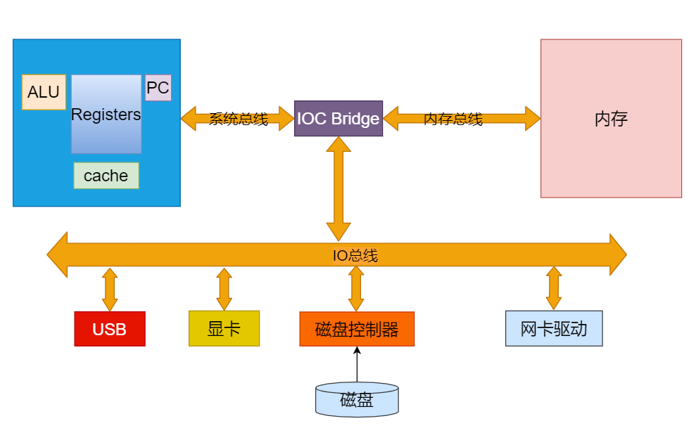
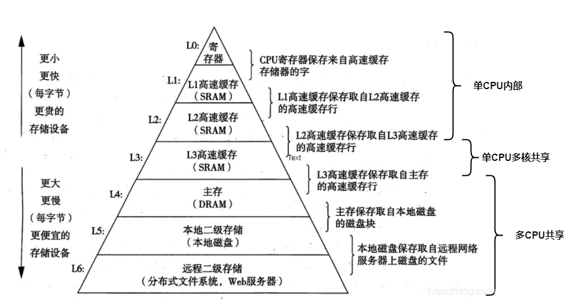
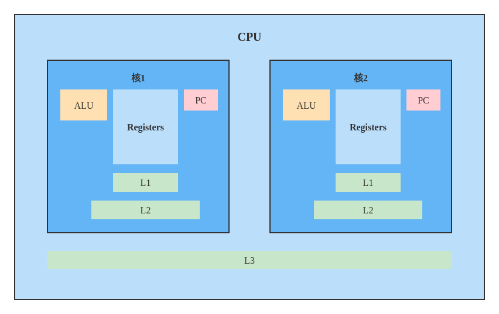
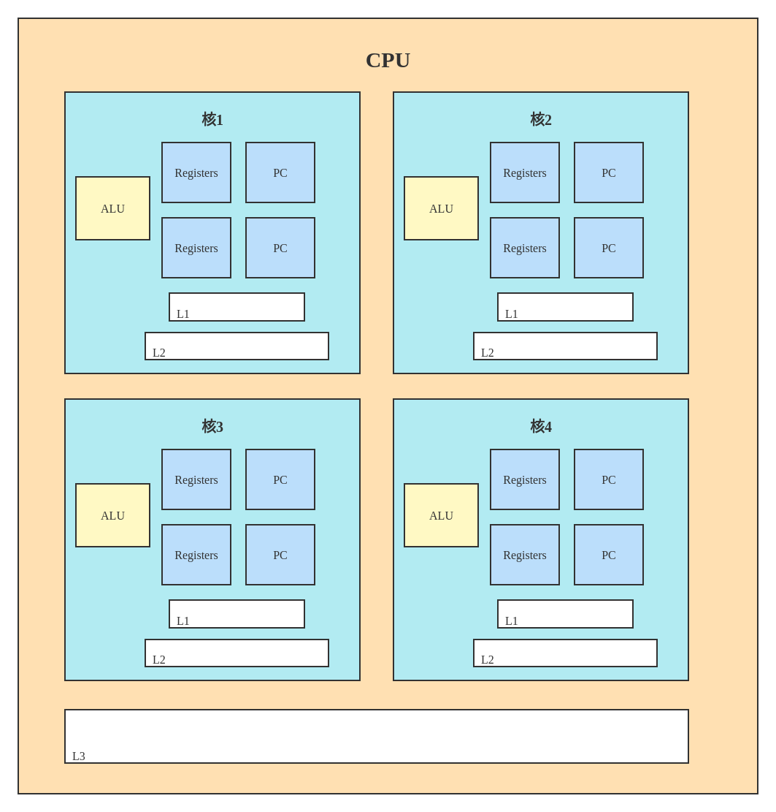
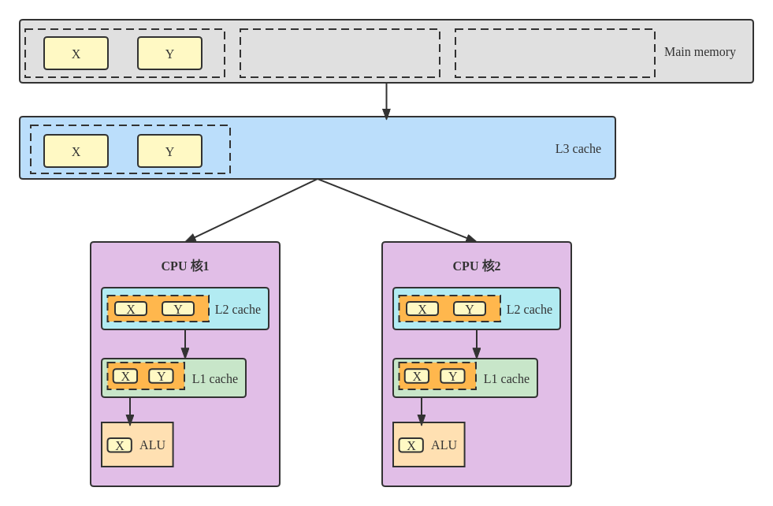
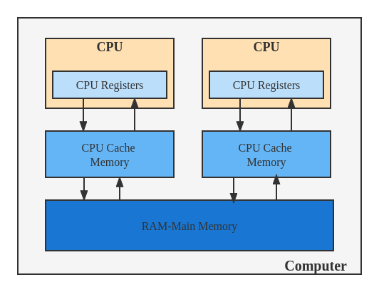
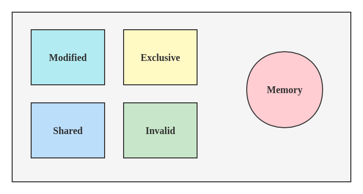

# Cache line

## 1. 计算机组成结构



* 当使用一个程序，程序从硬盘中加载到内存当中，然后CPU将程序中的下一条指令地址读取到PC中，然后将相关数据存储到Registers（寄存器）中

* **PC （Program Counter 程序计数器）** 
  记录这一个地址存放下一条执行的指令在哪里，cpu执行完一条就去内存取下一条。

* **Register寄存器** 
  执行指令中的数据放到CPU执行，存储数据的就是寄存器

* **ALU（Arithmetic Logic Unit）运算单元** 
  数据放到寄存器之后使用运算单元alu来运算，运算完写回到寄存器，寄存器再写回到内存里面去。

计算机从磁盘读取到CPU中的过程很慢，所以我们的计算机中有好几层存储结构，会将磁盘中的数据进行缓存，而不是每次都重新读取


## 2. 存储的层次解耦

### 2.1 缓存层次解构



这几层的存储的访问和存储容量也是不同的

### 2.2 缓存访问时间

| 从CPU到                                     | 大约需要的CPU周期 | 大约需要的时间 |
| ------------------------------------------- | ----------------- | -------------- |
| 主存                                        |                   | 约60~80纳秒    |
| QPI总线传输<br>(between sockets, not drawn) |                   | 约20ns         |
| L3 cache                                    | 约 40 ~ 45 cycles | 约 15ns        |
| L2 cache                                    | 约 10 cycles      | 约 3ns         |
| L1 cache                                    | 约 3 ~ 4 cycles   | 约 1ns         |
| 寄存器                                      | 1 cycle           |                |


## 3. 多核CPU的三级缓存存储



* 每个核中的一级缓存和二级缓存是每个核中单独拥有的，但是三级缓存是共同拥有的

* 对于一块CPU，可以有多个处理核心。每个核心内有自己的L1,L2缓存，多个核心共用同一个L3缓存。

* 但一个电脑如果有多个CPU插槽，各个CPU有自己的L3。

* 对于一个CPU核心来说，每个核心都有ALU，逻辑运算单元。负责对指令进行计算。Register 寄存器，记录线程执行对应的数据。PC：指令寄存器，记录线程执行到了哪个位置。里面存的是指令行数。通俗讲，就是记录线程执行到了哪一行指令（代码在进入CPU运行前，会被编译成指令）了。


## 4. 超线程



* 一个ALU对应多个PC|Registers的组合，就是所谓的超线程。图示的为四核八线程

* 线程在执行的时候，将当前线程对应的数据放入寄存器，将执行行数放到指令寄存器，然后执行过一个时间片后，如果线程没有执行完，将数据和指令保存，然后其他线程进入执行。

* 一般来说，同一个CPU核在同一个时间点，只能执行同一个线程，但是，如果一个核里面有两组寄存器，两个pc。那么就可以同时执行两组线程，在切换线程的时候，没必要再去等待寄存器的数据保存和数据载入。直接切换到下一组寄存器就可以。这就是超线程


## 5. 缓存行(Cache line)

### 5.1 概念及案例

* Cache 中的数据是按块读取的，当CPU访问某个数据时，会假设该数据附近的数据以后会被访问到，因此，第一次访问这一块区域时，会将该数据连同附近区域的数据（共64字节）一起读取进缓存中，那么这一块数据称为一个Cache Line 缓存行。

* 缓存系统是以缓存行为单位存储的。目前主流的CPU Cache的Cache Line大小都是64字节。

> 注意： 并不是所有数据都会被缓存，比如一些较大的数据，缓存行无法容下，那么就只能每次都去主内存中读取。

#### 5.1.1 案例 



CPU到内存之间有很多层的内存，如图所示，CPU需要经过L1，L2，L3及主内存才能读到数据。从主内存读取数据时的过程如下

* **读取数据** 
  * 当我左侧的CPU读取x的值的时候，按照下面L1——>L2——>L3，只有下一级没有才会去上一级查找。最后从主内存读入的时候，首先将内存数据读入L3，然后L2最后L1，然后再进行运算。
  * 读取时按块去读取（跟电脑的总线宽度有关，一次读取一块的数据，效率更高）。CPU读取X后，很可能会用到相邻的数据，所以在读X的时候，会把同一块中的Y数据也读进来。这样在用Y的时候，直接从L1中取数据就可以了。
  
* **读取的块就叫做缓存行，cache line ** 
  * 缓存行越大，局部性空间效率越高，但读取时间慢。
  * 缓存行越小，局部性空间效率越低，但读取时间快。
  * 目前多取一个平衡的值，64字节。
  

* **缓存行的效率问题** 

  * 如果你的X和y在同一块缓存行中，且两个字段都用volatile修饰了，那么将来两个线程再修改的时候，就需要将x和y发生修改的消息告诉另外一个线程，让它重新加载对应缓存，然而另外一个线程并没有使用该缓存行中对应的内容，只是因为缓存行读取的时候跟变量相邻，也会需要重新读取。这就会产生效率问题。

  * 可以使用缓存行对齐来解决这个问题，我们将数据中的两个volatile之间插入一些无用的内存，将第二个值挤出当前缓存行，那么执行的时候，就不会出现相应问题了。从而提高代码执行效率。

### 5.2 伪共享及案例

伪共享的非标准定义为：

- 缓存系统中是以缓存行（cache line）为单位存储的，当多线程修改互相独立的变量时，如果这些变量共享同一个缓存行，就会无意中影响彼此的性能，这就是伪共享。

#### 5.2.1 伪共享含义 

**什么是伪共享** 

* 如5.1.1的例子图所示：

  * CPU1想要修改X，CPU2想要修改Y，这两个频繁改动的变量是同意个缓存行，两个争夺缓存行的拥有权。

  * CPU1抢到后，更新X，那么CPU2上的缓存行的状态就会变成I状态（无效）——状态含义（MESI协议）

  * 当CPU2抢到，更新Y，CPU1上缓存行就会变成I状态（无效）

  > 轮番抢夺，不仅会带来大量的RFO消息，而且某个线程读取此行数据时，L1和L2缓存上都是失效数据，只有L3是同步好的。
  >
  > 表面上 X 和 Y 都是被独立线程操作的，而且两操作之间也没有任何关系。只不过它们共享了一个缓存行，但所有竞争冲突都是来源于共享。
  >
  > **因此，当两个以上CPU都要访问同一个缓存行大小的内存区域时，就会引起冲突，这种情况就叫“伪共享”** 

**为什么叫做伪共享** 

* 但是，这种情况里面又包含了“其实不是共享”的“伪共享”情况。
  比如，两个处理器各要访问一个word，这两个word却存在于同一个cache line大小的区域里，这时：
  * 从应用逻辑层面说，这两个处理器并没有共享内存，因为他们访问的是不同的内容（不同的word）。
  * 但是因为cache line的存在和限制，这两个CPU要访问这两个不同的word时，却一定要访问同一个cache line块，产生了事实上的“共享”。
  * 显然，由于cache line大小限制带来的这种“伪共享”是我们不想要的，会浪费系统资源。

#### 5.2.2 解决方案

1. 让不同线程操作的对象处于不同的缓存行。
2. 使用编译指示，强制使每一个变量对齐。

#### 5.2.3 案例

**不使用缓存行对齐** 

```java
public class T01_CacheLinePadding {
    // 测试循环次数
    public static long COUNT = 10_0000_0000L;

    private static class T {
        // 创建了一个T类型这里面只有一个long类型的x，8个字节
        public long x = 0L;
    }
    
    public static T[] arr = new T[2];

    // 静态初始化完成后，内存里面是有两个数组，这两个数组里面指向的是new来的对象，里面就只有一个8字节的long类型
    static {
        arr[0] = new T();
        arr[1] = new T();
    }

    // 启动两个线程
    public static void main(String[] args) throws InterruptedException {
        CountDownLatch latch = new CountDownLatch(2);

        // 第一个线程循环 10 亿次，不断让x的值发生改变，刚好这两个值位于同一个缓存行，又正好位于一个cpu，那么就会反生
        // 第一个CPU和第二个CPU不断更新的缓存行
        Thread t1 = new Thread(() -> {
            for (long i = 0; i < COUNT; i++) {
                arr[0].x = i;
            }

            latch.countDown();
        });

        Thread t2 = new Thread(() -> {
            for (long i = 0; i < COUNT; i++) {
                arr[1].x = i;
            }

            latch.countDown();
        });

        final long start = System.nanoTime();
        t1.start();
        t2.start();
        latch.await();
        System.out.println((System.nanoTime() - start) / 100_0000);
    }
}
```

**使用缓存行对齐** 

```java
public class T01_CacheLinePadding {
    // 测试循环次数
    public static long COUNT = 10_0000_0000L;

    // 伪共享，在x前后都加7个long类型的值，使x独占一个缓存行，这样效率就高了
    private static class T {
        private long p1, p2, p3, p4, p5, p6, p7;
        public long x = 0L;
        private long p9, p10, p11, p12, p13, p14, p15;
    }

    public static T[] arr = new T[2];

    static {
        arr[0] = new T();
        arr[1] = new T();
    }

    // 启动两个线程
    public static void main(String[] args) throws InterruptedException {
        CountDownLatch latch = new CountDownLatch(2);

        // 第一个线程循环 10 亿次，不断让x的值发生改变，由于x的值独占一个缓存行，理论上执行效率会高于第一个小案例
        Thread t1 = new Thread(() -> {
            for (long i = 0; i < COUNT; i++) {
                arr[0].x = i;
            }

            latch.countDown();
        });

        Thread t2 = new Thread(() -> {
            for (long i = 0; i < COUNT; i++) {
                arr[1].x = i;
            }

            latch.countDown();
        });

        final long start = System.nanoTime();
        t1.start();
        t2.start();
        latch.await();
        System.out.println((System.nanoTime() - start) / 100_0000);
    }
}
```

> 实验表明，使用缓存行对齐的方式，会使程序的执行效率有所提升。


## 6. 缓存一致性

### 6.1 缓存与主存间的结构

**CPU中缓存与主存之间的结构** 




### 6.2 缓存一致性问题

在多处理器系统中，每个处理器都有自己的高速缓存，而它们又共享同一主内存（MainMemory）。

基于高速缓存的存储交互很好地解决了处理器与内存的速度矛盾，但是也引入了新的问题：缓存一致性（CacheCoherence）。

当多个处理器的运算任务都涉及同一块主内存区域时，将可能导致各自的缓存数据不一致的情况，如果真的发生这种情况，那同步回到主内存时以谁的缓存数据为准呢？


为了解决一致性的问题，需要各个处理器访问缓存时都遵循一些协议，在读写时要根据协议来进行操作，这类协议有MSI、MESI（IllinoisProtocol）、MOSI、Synapse、Firefly及DragonProtocol，等等


### 6.3 缓存一致性协议 - MESI

我们以intel 的缓存一致性协议 **MESI** 为例来了解缓存一致性协议。可以参考以下文章:

https://www.cnblogs.com/z00377750/p/9180644.html




#### 6.3.1 MESI 概念

**`MESI`**（`Modified Exclusive Shared Or Invalid`）(也称为伊利诺斯协议，是因为该协议由伊利诺斯州立大学提出）是一种广泛使用的支持写回策略的缓存一致性协议。

#### 6.3.2 MESI协议中的状态

`CPU`中每个缓存行（`caceh line`)使用4种状态进行标记（使用额外的两位(`bit`)表示):

* **M: 被修改（Modified)** 

  该缓存行只被缓存在该`CPU`的缓存中，并且是被修改过的（`dirty`),即与主存中的数据不一致，该缓存行中的内存需要在未来的某个时间点（允许其它`CPU`读取请主存中相应内存之前）写回（`write back`）主存。

  当被写回主存之后，该缓存行的状态会变成独享（`exclusive`)状态。

* **E: 独享的（Exclusive)** 

  该缓存行只被缓存在该`CPU`的缓存中，它是未被修改过的（`clean`)，与主存中数据一致。该状态可以在任何时刻当有其它`CPU`读取该内存时变成共享状态（`shared`)。

  同样地，当`CPU`修改该缓存行中内容时，该状态可以变成`Modified`状态。

* **S: 共享的（Shared)** 

  该状态意味着该缓存行可能被多个`CPU`缓存，并且各个缓存中的数据与主存数据一致（`clean`)，当有一个`CPU`修改该缓存行中，其它`CPU`中该缓存行可以被作废（变成无效状态（`Invalid`））。

* **I: 无效的（Invalid）** 

  该缓存是无效的（可能有其它`CPU`修改了该缓存行）。

> 现代CPU的一致性实现 =  缓存锁(MESI 等等各种协议) + 总线锁


