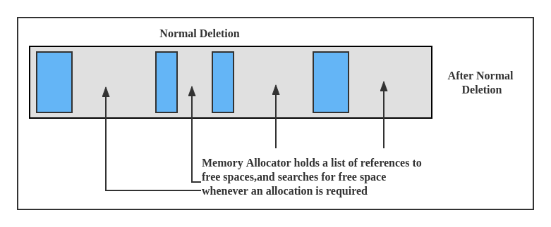

# JVM

## 1. JVM 入门

### 1.1 java 执行过程

​	一个普通JAVA文件执行javac命令之后变成一个class文件，当我们调用java命令的时候class文件就会被装载到内存叫ClassLoader。

>`xxx.java -> 执行javac -> xxx.class` 

​	一般情况下我们自己写类文件的时候也会用到java的类库，所以它要把java类库相关类也装载到内存中，装载完成后会调用字节码解释器或者即时编译器来进行解释或编译，编译完成之后由执行引擎开始执行，执行引擎下面面对的就是操作系统的硬件了。


### 1.2 java 与 jvm

**java 与 jvm 无关** 

* jvm是一种规范，它就定义了java虚拟机应该执行什么等等... java 虚拟机应该具备哪些模块，遇到什么样的指令应该做一些什么样的东西。
* jvm属于虚构出来的一台计算机
  * 字节码指令集 (汇编语言)
  * 内存管理:  栈、堆、方法区等

### 1.3 JDK、JRE、JVM

* JVM：全称Java Virtual Machine（Java虚拟机），是一种用于计算设备的规范，它是一个虚构出来的计算机，引入JVM后，Java语言在不同平台上运行时不需要重新编译。JVM是Java跨平台的核心。
* JRE：全称Java Runtime Environment，是指Java的运行环境，是可以在其上运行、测试和传输应用程序的Java平台。
* JDK：全称Java Development Kit，是 Java 语言的软件开发工具包，主要用于移动设备、嵌入式设备上的Java应用程序。JDK是整个Java开发的核心。


## 2. Class 文件格式

 整个 class 文件的格式就是一个二进制字节流，这个二进制字节流是由java虚拟机来解释的。

```java
package com.kohler.c1_bytecode;

public class T0100_ByteCode01 {
}
```

编译完成后，反汇编查看编译后的内容

```java
//
// Source code recreated from a .class file by IntelliJ IDEA
// (powered by FernFlower decompiler)
//

package com.kohler.c1_bytecode;

public class T0100_ByteCode01 {
    public T0100_ByteCode01() {
    }
}
```

可以看到，它会自动的生成默认的无参构造方法。


### 2.1 class 文件结构

使用16进制的编辑器打开可以看到如下内容


整个class文件格式就是个二进制字节流，这个二进制字节流是由java虚拟机进行解释的。class文件的结构如下所示: 

.png)

> u1: 代表无符号整数，一个字节
>
> u2: 代表无符号整数，两个字节
>
> u4: 代表无符号整数，四个字节
>
> u8: 代表无符号整数，八个字节
>
> ....


### 2.2 class 文件结构详解

.png)

前四个字节代表文件的统一标识符，当我们看到这个文件的统一标识符的时候，就知道它是class文件。

* CA FE BA BE：这是java文件编译完成后的class文件的开头四个字节，叫做 magic number。

* 00 00: minor version，表示的是次版本号。

* 00 32: major version，表示的是主版本号。

* 00 10: constant_pool_count，表示的是常量池中有多少个常量

  > 常量池存储的常量个数为 constant_pool_count - 1，常量池是从1开始的，数组是从0开始，所以要减去1。
  >
  > 原因是它有一个0存在于那里，将来没准哪天有些引用指向，表示不指向常量池的一项，那时候就可以用0来表示，保留一个可能性。


### 2.3 使用JClassLib 查看class文件

当然我们也可以使用 JClassLib（IDEA插件之一） 查看Class文件。


* General Information 通用的一些信息

* ConstantPool 常量池 - 常量池中的常量类型特别多，常量池是class 文件中最复杂的东西

  > 可以结合前面的 class 文件结构与 class 二进制码进行解读
  >
  > 例如：第一行最后两位07，我们去查 7 -> CONSTANT_Class_info，再去看Constant Pool中的2号是一个CONSTANT_Class_info，然后他的CONSTANT_Class_info又指向了我们当前自己类的名字它指向了14号，然后再去看看二进制码是否也指向了14号？
  >
  > 07是我们常量池的第二号的标记，接下来000e就是14

  

  

* Interfaces: 接口 - 我们并没有实现它所以没有任何属性

* Fileds: 属性 - 由于我们的class文件中并没有任何的属性，所以fileds中也没有任何东西

* Methods: 方法 - 它会给我们构造方法加一个无参构造方法

  > 一个方法的汇编翻译完之后如下如所示，这就是java的汇编，当一个java虚拟机读到一个class文件里面的内容的时候，它就会去查表里代表的是哪条指令。
  >
  > 其实这个方法还有附加属性，其中最主要的就是Code，其含义就是这个方法的代码是怎么实现的。这个方法的具体实现才是最重要的，当我们看的这个方法的时候我们会去里面找它的一条一条的指令。
  >
  > 在java虚拟机规范里面第7节，整个二进制码分别代表什么内容。

  

* Attributes: 附加属性


## 3. 详解Class加载过程

Class加载过程主要分为三大步: 

* **Loading：**蒋class文件加载到内存
* **Linking：** 主要过程分3个阶段：Vertification、Preparation、Resolution。
* **Initializing：**调用初始化代码`clint`,给静态成员变量赋初始值。

### 3.1 class 生命周期

`一个class的生命周期分为四步：` loading、linking、initalizing、被GC回收。

其中一个class变成`完全状态`是需要经过loading、linking、initalizing三步


### 3.2 loading

#### 3.2.1 loading过程

Loading就是把一个class加载到内存的过程。

在java中，是通过一种叫做`ClassLoader`的类进行对类的加载工作的。


`ClassLoader` 是一个顶级父类，针对这个类，有多种类型的子类。在这些类型中，有一个顶级的类加载器，叫做`Bootstrap ClassLoader` ，它是由C++实现的，负责加载java中的核心库，也因此它在java中并没有对应的对象类型，所以每当想要获取它的时候，都会得到null值。`Bootstrap ClassLoader` 不但会加载所有的核心类库，还负责蒋除它之外的所有其他类型的`ClassLoader` 进行加载。其他类型ClassLoader分为三种:

1. `Extension ClassLoader` : 负载加载java扩展包里面的class文件
2. `App ClassLoader` : 负载加载classpath指定的内容
3. `Custom ClassLoader` : 除了上述几种之外，用户还可以继承ClassLoader接口，实现自定义类加载器

案例: 

```java
public class T002_ClassLoaderLevel {
    public static void main(String[] args) {
        // 加载java核心包的classLoader
        System.out.println(String.class.getClassLoader());
        // 加载java核心包的classLoader
        System.out.println(sun.awt.HKSCS.class.getClassLoader());
        // 加载扩展包里的classLoader
        System.out.println(sun.net.spi.nameservice.dns.DNSNameService.class.getClassLoader());
        // 加载当前类的classLoader
        System.out.println(T002_ClassLoaderLevel.class.getClassLoader());
	// 加载扩展包里的classLoader的ClassLoader
        System.out.println(sun.net.spi.nameservice.dns.DNSNameService.class.getClassLoader().getClass().getClassLoader());
        // 加载当前类的classLoader的ClassLoader
        System.out.println(T002_ClassLoaderLevel.class.getClassLoader().getClass().getClassLoader());
    }
}
```

输出如下:

```java
null  // 为空，表明是Bootstrap ClassLoader
null  // 为空，表明是Bootstrap ClassLoader
sun.misc.Launcher$ExtClassLoader@677327b6  // ExtClassLoader
sun.misc.Launcher$AppClassLoader@18b4aac2 // AppClassLoder
null  // 为空，表明是Bootstrap ClassLoader  说明初Bootstrap ClassLoader之外的其他ClassLoader都是由Bootstrap ClassLoader进行加载的
null  // 为空，表明是Bootstrap ClassLoader   说明初Bootstrap ClassLoader之外的其他ClassLoader都是由Bootstrap ClassLoader进行加载的
```

> 各个 ClassLoad 它们之间的关系并不存在继承关系，但它们是存在引用关系的。
>
> 自定义类加载器 `parent` 属性指向 APP类加载器，App加载器 `parent` 属性指向Ext加载器，Ext加载器 `parent` 属性指向Bootstrap加载器。


#### 3.2.2 双亲委派机制

​		classloader的双亲委托机制是指多个类加载器之间存在父子关系的时候，某个class类具体由哪个加载器进行加载的问题。其具体的过程表现为：当一个类加载的过程中，它首先不会去加载，而是委托给自己的父类去加载，父类又委托给自己的父类。因此所有的类加载都会委托给顶层的父类，即Bootstrap Classloader进行加载，然后父类自己无法完成这个加载请求，子加载器才会尝试自己去加载。使用双亲委派模型，Java类随着它的加载器一起具备了一种带有优先级的层次关系，通过这种层次模型，可以避免类的重复加载，也可以避免核心类被不同的类加载器加载到内存中造成冲突和混乱，从而保证了Java核心库的安全。


双亲委托机制看起来比较复杂，但是其本身的核心代码逻辑却是非常的清晰简单，我们着重抽取了类加载的双亲委托的核心代码如下。

```java
protected Class<?> loadClass(String name, boolean resolve) throws ClassNotFoundException{
    synchronized (getClassLoadingLock(name)) {
        // First, check if the class has already been loaded
        Class<?> c = findLoadedClass(name);
        if (c == null) {
            long t0 = System.nanoTime();
            try {
                if (parent != null) {
                    c = parent.loadClass(name, false);
                } else {
                    c = findBootstrapClassOrNull(name);
                }
            } catch (ClassNotFoundException e) {
                // ClassNotFoundException thrown if class not found
                // from the non-null parent class loader
            }

            if (c == null) {
                // If still not found, then invoke findClass in order
                // to find the class.
                long t1 = System.nanoTime();
                c = findClass(name);

                // this is the defining class loader; record the stats
                sun.misc.PerfCounter.getParentDelegationTime().addTime(t1 - t0);
                sun.misc.PerfCounter.getFindClassTime().addElapsedTimeFrom(t1);
                sun.misc.PerfCounter.getFindClasses().increment();
            }
        }
        if (resolve) {
            resolveClass(c);
        }
        return c;
    }
}
```

ClassLoader源码中比较重要的一个函数是`loadClass()`，执行过程是：`findLoadedClass()`->`parrent.loadClass()`->`findClass()`,第一步是自底向上查询是否已经加载，第二步是自顶向下查找加载类。这里就规定或是说实现了双亲委派机制。

从上面的ClassLoader源码中大概能看出是如何实现了双亲委派机制的，可以通过2种方式打破该机制：

> 1. super(parent)指定parent会打破该机制
> 2. 自定义ClassLoader重写`loadClass()`也可以打破


#### 3.2.3 自定义类加载器

如何自定义ClassLoader？可以继承ClassLoader类，重新自己的`findClass()`,在里面调用`defineClass()`来实现自定义加载特定范围的类。

```java
import com.kohler.Hello;

import java.io.ByteArrayOutputStream;
import java.io.File;
import java.io.FileInputStream;

public class T01_MyClassLoader extends ClassLoader {

    @Override
    protected Class<?> findClass(String name) throws ClassNotFoundException {
        File f = new File("c:/test/", name.replace(".", "/").concat(".class"));
        try {
            FileInputStream fis = new FileInputStream(f);
            ByteArrayOutputStream baos = new ByteArrayOutputStream();
            int b = 0;

            while ((b=fis.read()) !=0) {
                baos.write(b);
            }

            byte[] bytes = baos.toByteArray();
            baos.close();
            fis.close();//可以写的更加严谨

            return defineClass(name, bytes, 0, bytes.length);
        } catch (Exception e) {
            e.printStackTrace();
        }
        return super.findClass(name); //throws ClassNotFoundException
    }

    public static void main(String[] args) throws Exception {
        ClassLoader l = new T01_MyClassLoader();
        Class clazz = l.loadClass("com.kohler.jvm.Hello");
        Class clazz1 = l.loadClass("com.kohler.jvm.Hello");

        System.out.println(clazz == clazz1);

        Hello h = (Hello)clazz.newInstance();
        h.m();

        System.out.println(l.getClass().getClassLoader());
        System.out.println(l.getParent());

        System.out.println(getSystemClassLoader());
    }
}
```


#### 3.2.4 lazyLoading(了解)

lazyLoading 严格来说应该叫lazyingInitializing。JVM 并没有规定何时加载，但是严格规定了什么时候必须初始化

- new getstatic  putstatic invokestatic指令，访问final变量除外
- java.lang.reflect对类进行反射访问调用时
- 初始化子类的时候，父类首先初始化
- 虚拟机启动是，被执行的主类必须初始化
- 动态语言支持java.lang.invoke.MethodHandle解析的结果为REF_getstatic REF_putstatic REF_invokestatic的方法句柄时，该类必须初始化。

#### 3.2.5 Class执行方式

Class执行方式分为3种：解释执行、编译执行、混合执行，各有优缺点，可通过参数指定。

- 1.解释执行：使用bytecode intepreter 解释器解释执行，该模式启动很快，执行稍慢，可通过`-Xint`参数指定该模式。
- 2.编译执行：使用 Just in time Complier JIT编译器编译执行，该模式执行很快，编译很慢，可通过`-Xcomp`参数指定该模式。
- 3.混合执行：默认的模式，解释器+热点代码编译，开始解释执行，启动较快，对热点代码进行实时监测和编译成本地代码执行，可通过`-Xmixed`参数指定该模式。

> 热点代码监测：多次被调用的方法用方法计数器，多次被调用的循环用循环计数器，可通过参数`-XX:CompileThreshold = 10000`指定触发JIT编译的阈值。


### 3.3 Linking

linking 过程主要分为三步:

1. **Verification (验证):**  就是验证文件是否符合jvm规定，格式不对我就不会进行下一步操作
2. **Preparation(准备):** 给静态成员变量赋默认值，在Initializing阶段的时候初始化这些值
3. **Resolution(解析):** 蒋类、方法、属性等符号引用解析为直接引用，蒋常量池中的各种符号引用解析为指针，偏移量等内存的直接应用。


### 3.4 Initializing

**调用类初始化代码，给静态成员变量赋初始值。** 

#### 3.4.1 小案例 （面试题）

```java
public class T001_ClassLoadingProcedure {
    public static void main(String[] args) {
        System.out.println(T.count);  
    }
}

class T {
    public static T t = new T(); // null
    public static int count = 2; //0

    private T() {
        count ++;
    }
}
```

> 思考: 上面代码最后打印的count的值是多少呢?

结果是2。我们可以来分析一下为什么:

T.count 这种调用静态属性在JVM规范中是一种必须要初始化类的行为，因此会触发T的初始化过程。而一个Class需要经过三大步才能完成加载。

1. Loading阶段:  蒋T这个Class通过ClassLoader装载到内存中

2. Linking阶段:  首先校验(Verification)class文件的格式，然后**进行preparation对静态变量赋默认值(引用类型是null，基本类型是0)** ，最后完成符号引用的替换。此时T的成员值应该是这样的:

   ```java
   public static T t = null;
   public static int count = 0;
   ```

3. Initializing阶段: 开始对静态变量赋初始值，调用静态方法。此时T的成员值是这样的:

   ```java
   public static T t = new T();
   ```

   这里会需要调用到T的构造方法中，然后把count++，然而count开始是0，此时就变成1了：

   ```java
   public static int count = 1;
   ```

   接下来，对count赋予初始值：

   ```java
   public static int count = 2;
   ```


若把count和t的顺序变一下，这样的话呢：

   ```java
   public class T001_ClassLoadingProcedure {
       public static void main(String[] args) {
           System.out.println(T.count);  
       }
   }
   
   class T {
       public static int count = 2; //0
       public static T t = new T(); // null
   
       private T() {
           count ++;
       }
   }
   ```

   > 思考: 上面代码最后打印的count的值是多少呢?

结果是3。再走一遍流程：

   1. 装载class不在赘述。

   2. 静态变量赋默认值，变成:

      ```java
      public static int count = 0;
      public static T t = null;
      ```

   3. 静态变量赋初始值，变成:

      ```java
      public static int count  = 2;
      ```

      ```java
      public static int T t = new T();
      ```

      这里会去调用T的构造方法，count++，count变成3。

#### 3.4.2 小结

上面面试题剖析了**静态变量的赋值**过程，分为三部：load -> 默认值 -> 初始值
而其实**对象变量的赋值**，也不是一步完成的，也是分为了2步：
1、当一个对象通过new，首先需要向内存申请空间，申请完内存后会首先把对象变量都赋予默认值
2、接下来再给对象里的属性赋予初始值


## 4 JMM

### 4.1 多任务和高并发的内存交互

​		多任务和高并发是衡量一台计算机处理器的能力重要指标之一。一般衡量一个服务器性能的高低好坏，使用每秒事务处理数(Transactions Per Second, TPS) 这个指标比较能说明问题，它代表着一秒内服务器平均能响应的请求数，而TPS值与程序的并发能力有着非常密切的关系，**物理机**的高并发问题与**虚拟机**的情况有许多相似之处，物理机对并发的处理方案对于虚拟机的实现也有相当大的参考意义。

​		由于计算机的存储设备与处理器的运算能力之间有几个数量级的差距，所以现代计算机系统都不得不加入一层读写速度尽可能接近处理器运算速度的**高速缓存(Cache)** 来作为内存与处理器之间的缓存：蒋运算需要使用到的数据复制到缓存中，让运算速度能快速进行，当运算结束后再从缓存同步回内存之中，这样处理器就无需等待缓慢的内存读写了。

​		基于高速缓存的存储交互很好地解决了处理器与内存的速度矛盾，但是引入了一个新的问题: **缓存一致性(Cache Coherence) ** 。在多处理器系统中，每个处理器都有自己的高速缓存，而他们又共享同一主存，如下图所示：多个处理器运算任务都涉及同一块主存，需要一种协议可以保障数据的一致性，这类协议有 MSI、MESI、MOSI 及 Dragon Protocol等。


​		除此之外，为了使得处理器内部的运算单元能几尽可能被充分利用，处理器可能会对输入的代码进行**乱序执行(Out-Of-Oder Execution)** 优化，处理器会在计算之后蒋乱序执行的代码进行结果重组，保证结果准确性。与处理器的乱序执行优化类似，Java虚拟机的即时编译器也有类似的**指令重排序(Instruction Recorder)** 优化。


### 4.2 Java内存模型

​		内存模型可以理解为在特定的操作协议下，对特定的内存或者高速缓存进行读写访问的过程的抽象，不同架构下的物理机拥有不一样的内存模型，Java虚拟机也有自己的内存模型，即Java内存模型(Java Memory Model, JMM)。在C/C++语言中直接使用物理硬件和操作系统内存模型，导致不同平台下并发访问出错。而JMM的出现，能够屏蔽掉各种硬件和操作系统的内存访问差异，实现平台一致性，使得Java程序能够“**一次编写，到处运行**”。

​		Java内存模型中规定了所有的变量都存储在主内存中，每条线程还有自己的工作内存（可以与前面讲的处理器的高速缓存类比），线程的工作内存中保存了该线程使用到的变量到主内存副本拷贝，线程对变量的所有操作（读取、赋值）都必须在工作内存中进行，而不能直接读写主内存中的变量。不同线程之间无法直接访问对方工作内存中的变量，线程间变量值的传递均需要在主内存来完成，线程、主内存和工作内存的交互关系如下图所示，和上图很类似。


> 注意： 这里的主内存、工作内存与Java内存区域的Java堆、栈、方法区不是同一层次内存划分，这两者基本上没有关系。

### 4.3 内存交互操作 (已弃用，了解即可)

​		由上面的交互关系可知，关于主内存与工作内存之间的具体交互协议，即一个变量如何从主内存拷贝到工作内存、如何从工作内存同步到主内存之间的实现细节，Java内存模型定义了以下八种操作来完成：

* lock（锁定）：作用于主内存的变量，把一个变量标识为一条线程独占状态。
* unlock（解锁）：作用于主内存变量，把一个处于锁定状态的变量释放出来，释放后的变量才可以被其他线程锁定。
* read（读取）：作用于主内存变量，把一个变量值从主内存传输到线程的工作内存中，以便随后的load动作使用
* load（载入）：作用于工作内存的变量，它把read操作从主内存中得到的变量值放入工作内存的变量副本中。
* use（使用）：作用于工作内存的变量，把工作内存中的一个变量值传递给执行引擎，每当虚拟机遇到一个需要使用变量的值的字节码指令时将会执行这个操作。
* assign（赋值）：作用于工作内存的变量，它把一个从执行引擎接收到的值赋值给工作内存的变量，每当虚拟机遇到一个给变量赋值的字节码指令时执行这个操作。
* store（存储）：作用于工作内存的变量，把工作内存中的一个变量的值传送到主内存中，以便随后的write的操作。
* write（写入）：作用于主内存的变量，它把store操作从工作内存中一个变量的值传送到主内存的变量中。

​		如果要把一个变量从主内存中复制到工作内存，就需要按顺寻地执行read和load操作，如果把变量从工作内存中同步回主内存中，就要按顺序地执行store和write操作。Java内存模型只要求上述两个操作必须按顺序执行，而没有保证必须是连续执行。也就是read和load之间，store和write之间是可以插入其他指令的，如对主内存中的变量a、b进行访问时，可能的顺序是read a，read b，load b， load a。Java内存模型还规定了在执行上述八种基本操作时，必须满足如下规则：

* 不允许read和load、store和write操作之一单独出现
* 不允许一个线程丢弃它的最近assign的操作，即变量在工作内存中改变了之后必须同步到主内存中。
* 不允许一个线程无原因地（没有发生过任何assign操作）把数据从工作内存同步回主内存中。
* 一个新的变量只能在主内存中诞生，不允许在工作内存中直接使用一个未被初始化（load或assign）的变量。即就是对一个变量实施use和store操作之前，必须先执行过了assign和load操作。
* 一个变量在同一时刻只允许一条线程对其进行lock操作，lock和unlock必须成对出现
* 如果对一个变量执行lock操作，将会清空工作内存中此变量的值，在执行引擎使用这个变量前需要重新执行load或assign操作初始化变量的值
* 如果一个变量事先没有被lock操作锁定，则不允许对它执行unlock操作；也不允许去unlock一个被其他线程锁定的变量。
* 对一个变量执行unlock操作之前，必须先把此变量同步到主内存中（执行store和write操作）。

这8种内存访问操作很繁琐，后文会使用一个等效判断原则，即先行发生（happens-before）原则来确定一个内存访问在并发环境下是否安全。


### 4.4 volatile变量规则

​		关键字volatile是JVM中最轻量的同步机制。volatile变量具有2中特性：

* **保证变量的可见性: **对一个volatile变量的读，总是能看到（任意线程）对这个volatile变量最后的写入，这个新值对于其他线程来说是立即可见的。
* **禁止指令重排序: ** 指令重排序是编译器和处理器为了高效堆程序进行优化的手段。

volatile语义并不能保证变量的原子性。对任意单个 volatile变量的读/写具有原子性，但类似于i++、i--这种复合操作不具有原子性，因为自增运算包括读取i的值、i值增加1、重新赋值3步操作，并不具备原子性。

由于volatile只能保证变量的可见性和禁止指令重排序，只有满足下面2条规则时，才能使用volatile来保证并发安全，否则就需要加锁（使用synchronized、lock或java.util.concurrent中的Atomic原子类）来保证并发中的原子性。

* 运算结果不存在数据依赖（重排序的数据依赖性），或者只有单一的线程修改变量的值（重排序的as-if-serial语义)
* 变量不需要与其他的状态变量共同参与不变约束

因为需要在本地代码中插入许多内存屏障指令在屏蔽特定条件下的重排序，volatile变量的写操作与读操作相比慢一些，但是其性能开销比锁低很多。

### 4.5 long/double非原子协定

​		JMM要求lock、unlock、read、load、assign、use、store、write这8个操作都必须具有原子性，但对于64为的数据类型（long和double，具有非原子协定：允许虚拟机将没有被volatile修饰的64位数据的读写操作划分为2次32位操作进行。（与此类似的是，在栈帧结构的局部变量表中，long和double类型的局部变量可以使用2个能存储32位变量的变量槽（Variable Slot）来存储的，关于这一部分的详细分析，详见详见周志明著《深入理解Java虚拟机》8.2.1节）

​		如果多个线程共享一个没有声明为volatile的long或double变量，并且同时读取和修改，某些线程可能会读取到一个既非原值，也不是其他线程修改值的代表了“半个变量”的数值。不过这种情况十分罕见。因为非原子协议换句话说，同样允许long和double的读写操作实现为原子操作，并且目前绝大多数的虚拟机都是这样做的。

### 4.6 原子性、可见性、有序性

* 原子性
  JMM保证的原子性变量操作包括read、load、assign、use、store、write，而long、double非原子协定导致的非原子性操作基本可以忽略。如果需要对更大范围的代码实行原子性操作，则需要JMM提供的lock、unlock、synchronized等来保证。

* 可见性
  前面分析volatile语义时已经提到，可见性是指当一个线程修改了共享变量的值，其他线程能够立即得知这个修改。JMM在变量修改后将新值同步回主内存，依赖主内存作为媒介，在变量被线程读取前从内存刷新变量新值，保证变量的可见性。普通变量和volatile变量都是如此，只不过volatile的特殊规则保证了这种可见性是立即得知的，而普通变量并不具备这种严格的可见性。除了volatile外，synchronized和final也能保证可见性。

* 有序性
  JMM的有序性表现为：如果在本线程内观察，所有的操作都是有序的；如果在一个线程中观察另一个线程，所有的操作都是无序的。前半句指“线程内表现为串行的语义”（as-if-serial），后半句值“指令重排序”和普通变量的”工作内存与主内存同步延迟“的现象。

* 重排序
  在执行程序时为了提高性能，编译器和处理器经常会对指令进行重排序。从硬件架构上来说，指令重排序是指CPU采用了允许将多条指令不按照程序规定的顺序，分开发送给各个相应电路单元处理，而不是指令任意重排。重排序分成三种类型：
  * 编译器优化的重排序。编译器在不改变单线程程序语义放入前提下，可以重新安排语句的执行顺序。
  * 指令级并行的重排序。现代处理器采用了指令级并行技术来将多条指令重叠执行。如果不存在数据依赖性，处理器可以改变语句对应机器指令的执行顺序。
  * 内存系统的重排序。由于处理器使用缓存和读写缓冲区，这使得加载和存储操作看上去可能是在乱序执行。


### 4.7 JMM的重排序屏障

​		从Java源代码到最终实际执行的指令序列，会经过三种重排序。但是，为了保证内存的可见性，Java编译器在生成指令序列的适当位置会插入内存屏障指令来禁止特定类型的处理器重排序。对于编译器的重排序，JMM会根据重排序规则禁止特定类型的编译器重排序；对于处理器重排序，JMM会插入特定类型的内存屏障，通过内存的屏障指令禁止特定类型的处理器重排序。这里讨论JMM对处理器的重排序，为了更深理解JMM对处理器重排序的处理，先来认识一下常见处理器的重排序规则：

| 处理器\规则 | Load-Load | Load-Store | Store-Store | Store-Load | 数据转换 |
| ----------- | --------- | ---------- | ----------- | ---------- | -------- |
| SPARC-TSO   | N         | N          | N           | Y          | N        |
| x86         | N         | N          | N           | Y          | N        |
| IA64        | Y         | Y          | Y           | Y          | N        |
| SPARC-TSO   | Y         | Y          | Y           | Y          | N        |

​		其中的N标识处理器不允许两个操作进行重排序，Y表示允许。其中Load-Load表示读-读操作、Load-Store表示读-写操作、Store-Store表示写-写操作、Store-Load表示写-读操作。可以看出：常见处理器对写-读操作都是允许重排序的，并且常见的处理器都不允许对存在数据依赖的操作进行重排序（对应上面数据转换那一列，都是N，所以处理器不允许这种重排序）。

​		那么这个结论对我们有什么作用呢？比如第一点：处理器允许写-读操作两者之间的重排序，那么在并发编程中读线程读到可能是一个未被初始化或者是一个NULL等，出现不可预知的错误，基于这点，JMM会在适当的位置插入内存屏障指令来禁止特定类型的处理器的重排序。内存屏障指令一共有4类：

* **LoadLoad Barriers：** 确保Load1数据的装载先于Load2以及所有后续装载指令
* **StoreStore Barriers：** 确保Store1的数据对其他处理器可见（会使缓存行无效，并刷新到内存中）先于Store2及所有后续存储指令的装载
* **LoadStore Barriers：** 确保Load1数据装载先于Store2及所有后续存储指令刷新到内存
* **StoreLoad Barriers：** 确保Store1数据对其他处理器可见（刷新到内存，并且其他处理器的缓存行无效）先于Load2及所有后续装载指令的装载。该指令会使得该屏障之前的所有内存访问指令完成之后，才能执行该屏障之后的内存访问指令。

#### 4.7.1 数据依赖性

​		根据上面的表格，处理器不会对存在数据依赖的操作进行重排序。这里数据依赖的准确定义是：如果两个操作同时访问一个变量，其中一个操作是写操作，此时这两个操作就构成了数据依赖。常见的具有这个特性的如i++、i—。如果改变了具有数据依赖的两个操作的执行顺序，那么最后的执行结果就会被改变。这也是不能进行重排序的原因。例如：

* 写后读：`a = 1; b = a; ` 
* 写后写：`a = 1; a = 2;` 
* 读后写：`a = b; b = 1;` 

​		重排序遵守数据依赖性，编译器和处理器不会改变存在数据依赖关系的两个操作的执行顺序。但是这里所说的数据依赖性仅针对单个处理器中执行的指令序列和单个线程中执行的操作，不同处理器之间和不同线程之间的数据依赖性不被编译器和处理器考虑。

#### 4.7.2 as-if-serial语义

​		as-if-serial语义的意思指：**不管怎么重排序（编译器和处理器为了提高并行度），（单线程）程序的执行结果不能被改变。** 编译器，runtime 和处理器都必须遵守as-if-serial语义。

​		as-if-serial语义把单线程程序保护了起来，遵守as-if-serial语义的编译器，runtime 和处理器共同为编写单线程程序的程序员创建了一个幻觉：单线程程序是按程序的顺序来执行的。as-if-serial语义使单线程程序员无需担心重排序会干扰他们，也无需担心内存可见性问题。

#### 4.7.3 重排序对多线程的影响

​		如果代码中存在控制依赖的时候，会影响指令序列执行的并行度（因为高效）。也是为此，编译器和处理器会采用猜测（Speculation）执行来克服控制的相关性。所以重排序破坏了程序顺序规则（该规则是说指令执行顺序与实际代码的执行顺序是一致的，但是处理器和编译器会进行重排序，只要最后的结果不会改变，该重排序就是合理的）。

​		在单线程程序中，由于as-ifserial语义的存在，对存在控制依赖的操作重排序，不会改变执行结果；但在多线程程序中，对存在控制依赖的操作重排序，可能会改变程序的执行结果。

### 4.8 先行发生原则（happens-before）

​		前面所述的内存交互操作必须要满足一定的规则，而happens-before就是定义这些规则的一个等效判断原则。happens-before是JMM定义的2个操作之间的偏序关系：如果操作A线性发生于操作B，则A产生的影响能被操作B观察到，“影响”包括修改了内存中共享变量的值、发送了消息、调用了方法等。如果两个操作满足happens-before原则，那么不需要进行同步操作，JVM能够保证操作具有顺序性，此时不能够随意的重排序。否则，无法保证顺序性，就能进行指令的重排序。

happens-before原则主要包括：

* 程序次序规则(Program Order Rule)：在同一个线程中，按照程序代码顺序，书写在前面的操作先行发生于书写在后面的操纵。准确的说是程序的控制流顺序，考虑分支和循环等。

* 管理锁定规则(Monitor Lock Rule)：一个unlock操作先行发生于后面（时间上的顺序）对同一个锁的lock操作。

* volatile变量规则(Volatile Variable Rule)：对一个volatile变量的写操作先行发生于后面（时间上的顺序）对该变量的读操作。

* 线程启动规则(Thread Start Rule)：Thread对象的start()方法先行发生于此线程的每一个动作。

* 线程终止规则(Thread Termination Rule)：线程的所有操作都先行发生于对此线程的终止检测，可以通过Thread.join()方法结束、Thread.isAlive()的返回值等手段检测到线程已经终止执行。

* 线程中断规则(Thread Interruption Rule)：对线程interrupt()方法的调用先行发生于被中断线程的代码检测到中断时事件的发生。Thread.interrupted()可以检测是否有中断发生。

* 对象终结规则(Finilizer Rule)：一个对象的初始化完成（构造函数执行结束）先行发生于它的finalize()的开始。

* 传递性(Transitivity)：如果操作A 先行发生于操作B，操作B 先行发生于操作C，那么可以得出A 先行发生于操作C。

  > 注意：不同操作时间先后顺序与先行发生原则之间没有关系，二者不能相互推断，衡量并发安全问题不能受到时间顺序的干扰，一切都要以happens-before原则为准 

示例代码1:

```java
private int value = 0;

public void setValue(int value) {
    this.value = value;
}

public int getValue() {
    return this.value;
}
对于上面的代码，假设线程A在时间上先调用setValue(1)，然后线程B调用getValue()方法，那么线程B收到的返回值一定是1吗？
```

按照happens-before原则，两个操作不在同一个线程、没有通道锁同步、线程的相关启动、终止和中断以及对象终结和传递性等规则都与此处没有关系，因此这两个操作是不符合happens-before原则的，这里的并发操作是不安全的，返回值并不一定是1。

对于该问题的修复，可以使用lock或者synchronized套用“管程锁定规则”实现先行发生关系；或者将value定义为volatile变量（两个方法的调用都不存在数据依赖性），套用“volatile变量规则”实现先行发生关系。如此一来，就能保证并发安全性。

示例代码2

```java
// 以下操作在同一个线程中
int i = 1;
int j = 2;
```

上面的代码符合“程序次序规则”，满足先行发生关系，但是第2条语句完全可能由于重排序而被处理器先执行，时间上先于第1条语句。


### 4.9 volatile 的实现细节

#### 4.9.1 字节码层面

示例代码: 

```java
public class Demo {
    int i;
    volatile int j;
}
```


在示例代码编译好之后，可以看到编译后的字节码，对于这个 i 的 Access flags 是一个 `0x0000`。 Access flags代表的是它前面写的修饰符(public/private/....)。对于 j 的 Access flags 是 `0x0040[volatile]`，这就表明了在字节码层面就只是加了一个 volatile 修饰符。

> 小结: **volatile 在字节码层面就是加了一个 ACC_VOLATILE** 

#### 4.9.2 JVM 层面

在JVM实现层级，它就是这样实现的:

* 对所有内存 volatile **写操作**前面加了 `StoreStoreBarrier` 后面也加了一个 `StoreLoadBarrier` 
* 对所有内存 volatile **读操作**前面加了 `LoadLoadBarrier` 后面也加了一个 `LoadStoreBarrier` 

在前面加了 `LodLoadBarrier` ，则上面的L1和下面的读操作一定不能重排序，下面加了 `LoadStoreBarrier` ，则上面这个读操作和下面任何的这种修改的操作肯定不重排序，所以保证了在读的过程中不会有任何不一致的情况，同样写操作也是一样。


> 小结: **volatile 在 JVM 层面在 *写操作* 和 *读操作* 前面和后面都加相应的内存屏障** 


#### 4.9.3 OS和硬件层面

在硬件层级是怎么实现的呢，可以使用 **hsdis-HotSpot Dis Assembler** 这个工具对虚拟机进行反汇编，查看其细节。

可以参考下面这篇文章，它讲了在Windows上的一个实现，在Linux上有可能又是另一个实现。

https://blog.csdn.net/qq_26222859/article/details/52235930

在windows上是 lock指令实现的。


### 4.10 synchronized 的实现细节

#### 4.10.1 字节码层面

实际上在字节码层面就是 `monitorenter`  和 `monitorexit` 指令，这两个就可以实现 synchronized了。

示例代码: 

```java
public class Demo1 {

    synchronized void m() {

    }

    void n() {
        synchronized(this) {

        }
    }
}
```


如上图，如果蒋 synchronized 关键字加在方法上，则它在字节码层面的实现就是在 **Access flags** 标志位上添加 synchronzied 标记，如果 synchronized 关键字不加在方法上，则它在字节码层面的实现就是添加两条指令 `monitorenter` 和 `monitorexit` 。但会发现有两条 `monitorexit` 指令，这是由于如果产生异常，则它会帮你自动退出。

> 小结:  
>
> 	1. synchronzied 加在方法上，会在 Access flag 标志位上添加 synchronized 标记 
> 	1. synchronized 不加在方法上，会添加两条指令 (`monitorenter` 、`monitorexit` )。但 `monitorenter` 只有一条，`monitorexit` 指令会有两条，这是由于如果产生异常它会帮你自动退出。


#### 4.10.2 JVM 层面

​		在这个层面实际就是C和C++调用了操作系统提供的同步机制。Linux和Windows内核都会给大家提供同步机制，所以这里是C 和 C++ 调用了操作系统提供的同步机制，这是JVM层的实现。


#### 4.10.3 OS和硬件层面

X86:  `lock cmpxchg xxxxx` 

硬件层面实际上是 lock 一条指令， synchronized 在字节码层面如果你是方法的话直接加一个 ACC_SYNCHRONIZED 这样一个修饰符，如果你是同步语句块的话就是 `monitorenter` 和 `monitoreixt`。在JVM层面当看到了那些东西后对应的是C和C++ 调用了操作系统提供的同步机制就是依赖于硬件cpu的。CPU级别是使用 lock 指令来实现的。

比如说我们要在 synchronized 某一块内存上加个数，把 i 的值从 0 变成 1，从 0 变成 1 的过程如果放在cpu去执行可能有好几条指令或不能同步，所以用 lock 指令。cmpxchg前面如果加了一个 lock 的话指的就是后面的指令执行的过程当中这块区域锁定，只有我这条指令能改，其他指令改不了。


## 5. 对象的内存布局

### 5.1 对象的创建过程

 一个简单的创建对象语句`Clazz instance = new Clazz();`包含的主要过程包括了类加载检查、对象分配内存、并发处理、内存空间初始化、对象设置、执行ini方法等。


主要流程如下: 


#### 5.1.1 **类加载检查** 

JVM遇到一条 new 指令时，首先将去检查这个指令的参数是否能在常量池中定位到这个类的符号引用，并且检查这个符号引用代表的类是否已被加载过、解析和初始化过。如果没有，那必须先执行相应的类加载过程。

#### 5.1.2 **对象分配内存** 

在 **类加载检查** 通过后，接下来JVM蒋为新生对象分配内存。对象所需内存的大小在类加载完成后便完全确定（**对象内存布局**），为对象分配空间的任务等同于把一块确定大小的内存从Java堆中划分出来。

根据Java堆中是否规整有两种内存的分配方式：（Java堆是否规整由所采用的垃圾收集器是否带有压缩整理功能决定）

* **指针碰撞(Bump the pointer)** 
  Java堆中的内存是规整的，所有用过的内存都放在一边，空闲的内存放在另一边，中间放着一个指针作为分界点的指示器，分配内存也就是把指针向空闲空间那边移动一段与内存大小相等的距离。例如：Serial、ParNew等收集器。
* **空闲列表(Free List)** 
  Java堆中的内存不是规整的，已使用的内存和空闲的内存相互交错，就没有办法简单的进行指针碰撞了。虚拟机必须维护一张列表，记录哪些内存块是可用的，在分配的时候从列表中找到一块足够大的空间划分给对象实例，并更新列表上的记录。例如：CMS这种基于Mark-Sweep算法的收集器。

#### 5.1.3 **并发处理** 

在创建对象的时候有一个很重要的问题，就是线程安全，因为在实际开发过程中，创建对象是非常频繁的事情，作为虚拟机来说，必须要保证线程是安全的，通常来说，虚拟机采用两种方式来保证线程安全：

* **CAS+失败重试：** CAS是乐观锁的一种实现方式。所谓乐观锁就是，每次不加锁而是假设没有冲突而去完成某项操作，如果因为冲突失败就重试，直到成功为止。**虚拟机采用CAS配上失败重试的方式保证更新操作的原子性。** 
* **TLAB：** 为每个线程预先在 Eden 区分配块内存，JVM在给线程中的对象分配内存时，首先在TLAB分配，当对象大于TLAB中的剩余内存或TLAB的内存已用尽时，再采用上述的CAS进行内存分配

#### 5.1.4 **内存空间初始化** 

内存分配完成后，虚拟机需要将分配的内存空间都初始化为零值（不包括对象头），如果使用了TLAB，这一工作过程可以提前至TLAB分配时进行。这一步操作保证了对象的实例字段在Java代码中可以不赋初始值就可以直接使用，程序能访问到这些字段的数据类型所对应的零值。

> 注意：类的成员变量可以不显示地初始化（Java虚拟机都会先自动给它初始化为默认值）。方法中的局部变量如果负责接收一个表达式的值，可以不初始化，但是参与运算和直接输出等其他情况的局部变量需要初始化。

#### 5.1.5 **设置对象头** 

内存空间初始化之后，**虚拟机要对对象进必要的设置**，例如这个对象是那个类的实例、如何才能找到类的元数据信息、对象的哈希码、对象的 GC 分代年龄等信息。**这些信息存放在对象头中**。另外，根据虚拟机当前运行状态的不同，如是否启用偏向锁等，对象头会有不同的设置方式。

#### 5.1.6 **执行 init 方法** 

在上面工作都完成之后，从虚拟机的角度来说，一个新的对象已经产生，但从 Java 程序的角度来说，对象创建才刚开始，`<init>` 方法还没有执行，所有的字段都为零。所以一般来说，执行new 指令之后会接着执行 `<init>` 方法，把对象按照程序员的意愿进行初始化，这样一个真正可用的对象才算完全产生出来。


### 5.2 对象的内存布局

在 Hotspot 虚拟机中，对象在内存中的布局可以分为3快区域：**对象头**、**实例数据**和**对齐填充**。

**Hotspot虚拟机的对象头包括两部分信息**，**第一部分用于存储对象自身的自身运行时数据**（哈希吗、GC分代年龄、锁状态标志等等），**另一部分是类型指针**，即对象指向它的类元数据的指针，虚拟机通过这个指针来确定这个对象是那个类的实例。

**实例数据部分是对象真正存储的有效信息**，也是在程序中所定义的各种类型的字段内容。

**对齐填充部分不是必然存在的，也没有什么特别的含义，仅仅起占位作用。** 因为Hotspot虚拟机的自动内存管理系统要求对象起始地址必须是8字节的整数倍，换句话说就是对象的大小必须是8字节的整数倍。而对象头部分正好是8字节的倍数（1倍或2倍），因此，当对象实例数据部分没有对齐时，就需要通过对齐填充来补全。

#### 5.2.1 对象的内存布局的两种对象

作为对象的内存布局来说分为两种:   **普通对象** 、**数组对象** 。

* **普通对象：**  

  * 对象头：在 hotspot 里面称为 **markword**，长度是 8 个字节。

  * ClassPointer指针：`-XX:+UseCompressedClassPointers`  为4个字节，不开启为8个字节。

  * 实例数据：

    引用类型:  `-XX:+UseCompressedOops` 为4个字节，不开启为8个字节

    Oops: Oridinary Object Pointers

  * Padding对齐：这个对齐是8的倍数。

* **数组对象：** 

  * 对象头：在 hotspot 里称为 **markword**，长度是8个字节。
  * ClassPointer指针：`-XX:+UseCompressedClassPointers` 为4个字节，不开启为8个字节。
  * 数组长度：4个字节
  * 数组数据
  * Padding对齐：这个对齐是8的倍数。

> **Hotspot 开启内存压缩的规则(64位机): ** 
>
> 1. 4G以下，直接砍掉32位
> 2. 4G ~ 32G，默认开启内存压缩 ClassPointers  Oops
> 3. 32G， 压缩无效，使用64位

#### 5.2.2 对象头包含的信息


如上图，**markword** 包含了：

* 锁信息 - 两位代表对象有没有被锁定；
* GC标记信息 - 这个对象被回收多少次了（分代年龄）。

> 当Java处于偏向锁、重量级锁状态时，hashCode值存储在哪里?
>
> 参考资料: 
>
> https://cloud.tencent.com/developer/article/1480590
>  https://cloud.tencent.com/developer/article/1484167
>
> https://cloud.tencent.com/developer/article/1485795
>
> https://cloud.tencent.com/developer/article/1482500


### 5.3 对象定位

建立对象就是为了使用对象，我们的Java程序通过栈上的 reference 数据来操作堆上的具体对象。对象的访问方式有虚拟机实现而定，目前主流的访问方式有**①使用句柄**和**②直接指针**两种：

#### 5.3.1 使用句柄

 如果使用句柄的话，那么Java堆中将会划分出一块内存来作为句柄池，reference 中存储的就是对象的句柄地址，而句柄中包含了对象实例数据与类型数据各自的具体地址信息；


#### 5.3.2 直接指针

如果使用直接指针访问，那么 Java 堆对像的布局中就必须考虑如何防止访问类型数据的相关信息，reference 中存储的直接就是对象的地址。


这两种对象访问方式各有优势。使用句柄来访问的最大好处是 reference 中存储的是稳定的句柄地址，在对象被移动时只会改变句柄中的实例数据指针，而 reference 本身不需要修改。使用直接指针访问方式最大的好处就是速度快，它节省了一次指针定位的时间开销。

> 扩展阅读:  https://blog.csdn.net/clover_lily/article/details/80095580


## 6. Java运行时数据区


### 6.1 ProgramCounterRegister - 程序计数器

程序计数器是一块较小的内存空间，可以看作是当前线程所执行的字节码的行号指示器。**字节码解释工作时通过改变这个计数器的值来选取下一条需要执行的字节码指令，分支、循环、跳转、异常处理、线程恢复等功能都需要依赖这个计数器来完成。** 

另外，**为了线程切换后能恢复到正确的执行位置，每条线程都需要有一个独立的程序计数器，各线程之间计数器互不影响，独立存储，我们称这类内存区域为“线程私有”的内存。** 

**从上面的介绍中我们知道程序计数器主要有两个作用：** 

1. 字节码解释通过改变程序计数器来依次读取指令，从而实现代码的控制流程。
2. 在多线程的情况下，程序计数器用于记录当前线程执行的位置，从而当线程别切换回来的时候能够知道该线程上次运行到哪里了。

> 注意：程序计数器是唯一一个 不会出现 OOM(OutOfMemoryError) 的内存区域，它的生命周期随着线程的创建而创建，随着线程的结束而死亡。


### 6.2 VM Stack - Java虚拟机栈 

**与程序计数器一样，Java虚拟机栈也是线程私有的，它的生命周期和线程相同，描述的是 Java 方法执行的内存模型。** 

**Java 内存可以粗糙的区分为堆内存（Heap）和栈内存(Stack),其中栈就是现在说的虚拟机栈，或者说是虚拟机栈中局部变量表部分。** （实际上，Java虚拟机栈是由一个个栈帧组成，而每个栈帧中都拥有：局部变量表、操作数栈、动态链接、方法出口信息。）

**局部变量表主要存放了编译器可知的各种数据类型**（boolean、byte、char、short、int、float、long、double）、**对象引用**（reference类型，它不同于对象本身，可能是一个指向对象起始地址的引用指针，也可能是指向一个代表对象的句柄或其他与此对象相关的位置）。

**Java 虚拟机栈会出现两种异常：StackOverFlowError 和 OutOfMemoryError。**

- **StackOverFlowError：** 若Java虚拟机栈的内存大小不允许动态扩展，那么当线程请求栈的深度超过当前Java虚拟机栈的最大深度的时候，就抛出StackOverFlowError异常。
- **OutOfMemoryError：** 若 Java 虚拟机栈的内存大小允许动态扩展，且当线程请求栈时内存用完了，无法再动态扩展了，此时抛出OutOfMemoryError异常。

Java 虚拟机栈也是线程私有的，每个线程都有各自的Java虚拟机栈，而且随着线程的创建而创建，随着线程的死亡而死亡。


### 6.3 Native Method Stack - 本地方法栈

和虚拟机栈所发挥的作用非常相似，区别是： **虚拟机栈为虚拟机执行 Java 方法 （也就是字节码）服务，而本地方法栈则为虚拟机使用到的 Native 方法服务。** 在 HotSpot 虚拟机中和 Java 虚拟机栈合二为一。

本地方法被执行的时候，在本地方法栈也会创建一个栈帧，用于存放该本地方法的局部变量表、操作数栈、动态链接、出口信息。

方法执行完毕后相应的栈帧也会出栈并释放内存空间，也会出现 StackOverFlowError 和 OutOfMemoryError 两种异常。


### 6.4 Heap - 堆

Java 虚拟机所管理的内存中最大的一块，Java 堆是所有线程共享的一块内存区域，在虚拟机启动时创建。**此内存区域的唯一目的就是存放对象实例，几乎所有的对象实例以及数组都在这里分配内存。** 

Java 堆是垃圾收集器管理的主要区域，因此也被称作**GC堆（Garbage Collected Heap）**.从垃圾回收的角度，由于现在收集器基本都采用分代垃圾收集算法，所以Java堆还可以细分为：新生代和老年代：在细致一点有：Eden空间、From Survivor、To Survivor空间等。**进一步划分的目的是更好地回收内存，或者更快地分配内存。** 

 **在 JDK 1.8中移除整个永久代，取而代之的是一个叫元空间（Metaspace）的区域（永久代使用的是JVM的堆内存空间，而元空间使用的是物理内存，直接受到本机的物理内存限制)。**  

> 拓展阅读:  
>
> 《Java8内存模型—永久代(PermGen)和元空间(Metaspace)》https://www.cnblogs.com/paddix/p/5309550.html


### 6.5 Method Area - 方法区

**方法区与 Java 堆一样，是各个线程共享的内存区域，它用于存储已被虚拟机加载的类信息、常量、静态变量、即时编译器编译后的代码等数据。虽然Java虚拟机规范把方法区描述为堆的一个逻辑部分，但是它却有一个别名叫做 Non-Heap（非堆），目的应该是与 Java 堆区分开来。 ** 

HotSpot 虚拟机中方法区也常被称为 **“永久代”**，本质上两者并不等价。仅仅是因为 HotSpot 虚拟机设计团队用永久代来实现方法区而已，这样 HotSpot 虚拟机的垃圾收集器就可以像管理 Java 堆一样管理这部分内存了。但是这并不是一个好主意，因为这样更容易遇到内存溢出问题。

**相对而言，垃圾收集行为在这个区域是比较少出现的，但并非数据进入方法区后就“永久存在”了** 


#### 6.5.1 运行时常量池

运行时常量池是方法区的一部分。Class 文件中除了有类的版本、字段、方法、接口等描述信息外，还有常量池信息（用于存放编译期生成的各种字面量和符号引用）

既然运行时常量池时方法区的一部分，自然受到方法区内存的限制，当常量池无法再申请到内存时会抛出 OutOfMemoryError 异常。

**JDK1.7及之后版本的 JVM 已经将运行时常量池从方法区中移了出来，在 Java 堆（Heap）中开辟了一块区域存放运行时常量池。**  

> 拓展阅读:  
>
> ​	《Java 中几种常量池的区分》https://blog.csdn.net/qq_26222859/article/details/73135660


### 6.6 直接内存

直接内存并不是虚拟机运行时数据区的一部分，也不是虚拟机规范中定义的内存区域，但是这部分内存也被频繁地使用。而且也可能导致OutOfMemoryError异常出现。

JDK1.4中新加入的 **NIO(New Input/Output) 类**，引入了一种基于**通道（Channel）** 与**缓存区（Buffer）** 的 I/O 方式，它可以直接使用Native函数库直接分配堆外内存，然后通过一个存储在 Java 堆中的 DirectByteBuffer 对象作为这块内存的引用进行操作。这样就能在一些场景中显著提高性能，因为**避免了在 Java 堆和 Native 堆之间来回复制数据**。

本机直接内存的分配不会收到 Java 堆的限制，但是，既然是内存就会受到本机总内存大小以及处理器寻址空间的限制。


## 7. String类和常量池

### 7.1 String 对象的两种创建方式

```java
     String str1 = "abcd";
     String str2 = new String("abcd");
     System.out.println(str1==str2);//false
```

这两种不同的创建方法是有差别的，第一种方式是在常量池中拿对象，第二种方式是直接在堆内存空间创建一个新的对象。


> 记住：只要使用new方法，便需要创建新的对象。


### 7.2 String 类型的常量池比较特殊。它的主要使用方式有两种

* 直接使用双引号声明出来的 String 对象会直接存储在常量池中。

* 如果不是用双引号声明的 String 对象，可以使用 String 提供的 intern 方String.intern() 是一个 Native 方法，它的作用是：如果运行时常量池中已经包含一个等于此 String 对象内容的字符串，则返回常量池中该字符串的引用；如果没有，则在常量池中创建与此 String 内容相同的字符串，并返回常量池中创建的字符串的引用。

```java
String s1 = new String("计算机");
String s2 = s1.intern();
String s3 = "计算机";
System.out.println(s2);//计算机
System.out.println(s1 == s2);//false，因为一个是堆内存中的String对象一个是常量池中的String对象，
System.out.println(s3 == s2);//true，因为两个都是常量池中的String对。
```


### 7.3 String 字符串拼接

```java
String str1 = "str";
String str2 = "ing";

String str3 = "str" + "ing";//常量池中的对象
String str4 = str1 + str2; //在堆上创建的新的对象	  
String str5 = "string";//常量池中的对象
System.out.println(str3 == str4);//false
System.out.println(str3 == str5);//true
System.out.println(str4 == str5);//false
```


> 尽量避免多个字符串拼接，因为这样会重新创建对象。如果需要改变字符串的话，可以使用 StringBuilder 或者 StringBuffer。


****

**`String s1 = new String("abc");`这句话创建了几个对象？**  

答案是: **创建了两个对象** 

**验证：** 

```java
String s1 = new String("abc");// 堆内存的地值值
String s2 = "abc";
System.out.println(s1 == s2);// 输出false,因为一个是堆内存，一个是常量池的内存，故两者是不同的。
System.out.println(s1.equals(s2));// 输出true
```

输出: 

```java
false
true
```

**解释：** 

先有字符串"abc"放入常量池，然后 new 了一份字符串"abc"放入Java堆(字符串常量"abc"在编译期就已经确定放入常量池，而 Java 堆上的"abc"是在运行期初始化阶段才确定)，然后 Java 栈的 str1 指向Java堆上的"abc"。

 

### 7.4  8种基本类型的包装类和常量池

* **Java 基本类型的包装类的大部分都实现了常量池技术，即Byte,Short,Integer,Long,Character,Boolean；这5种包装类默认创建了数值[-128，127]的相应类型的缓存数据，但是超出此范围仍然会去创建新的对象。** 

* **两种浮点数类型的包装类 Float,Double 并没有实现常量池技术。 ** 

```java
Integer i1 = 33;
Integer i2 = 33;
System.out.println(i1 == i2);// 输出true
Integer i11 = 333;
Integer i22 = 333;
System.out.println(i11 == i22);// 输出false
Double i3 = 1.2;
Double i4 = 1.2;
System.out.println(i3 == i4);// 输出false
```

**Integer 缓存源代码：** 

```java
/**
*此方法将始终缓存-128到127（包括端点）范围内的值，并可以缓存此范围之外的其他值。
*/
    public static Integer valueOf(int i) {
        if (i >= IntegerCache.low && i <= IntegerCache.high)
            return IntegerCache.cache[i + (-IntegerCache.low)];
        return new Integer(i);
    }
```

**应用场景：** 

1. Integer i1=40；Java 在编译的时候会直接将代码封装成Integer i1=Integer.valueOf(40);，从而使用常量池中的对象。
2. Integer i1 = new Integer(40);这种情况下会创建新的对象。

```java
  Integer i1 = 40;
  Integer i2 = new Integer(40);
  System.out.println(i1==i2);//输出false
```


## 8. GC

**GC 概念: ** 

* -Xms、-Xmx
  * -Xmn 
    * Eden
    * From Survivor 
    * To Survivor
  * Tenured / Old

> -Xms 、 -Xmx、-Xmn:  
>
> * X 是分标参数
> * m 是Memory 
> * s 是最小值
> * x 是最大值
> * n 是 new 新生代
>
> MinorGC/YGC：年轻代空间耗尽时触发
>
> MajorGC/FullGC：在老年代无法继续分配空间时触发，新生代老年代同时进行回收。

### 8.1 Find Algorithmes - 查找算法

#### 8.1.1 Reference Count - 引用计数算法

这个算法的实现是，给对象中添加一个引用计数器，每当一个地方引用这个对象时，计数器值+1；当引用失效时，计数器值-1。任何时刻计数值为0的对象就是不可能再被使用的。这种算法使用场景很多，但是，Java中却没有使用这种算法，因为这种算法很难解决对象之间相互引用的情况。看一段代码：

```java
public class ReferenceCountingGC
{
    private Object instance = null;
    private static final int _1MB = 1024 * 1024;
    
    /** 这个成员属性唯一的作用就是占用一点内存 */
    private byte[] bigSize = new byte[2 * _1MB];
    
    public static void main(String[] args)
    {
        ReferenceCountingGC objectA = new ReferenceCountingGC();
        ReferenceCountingGC objectB = new ReferenceCountingGC();
        objectA.instance = objectB;
        objectB.instance = objectA;
        objectA = null;
        objectB = null;
        
        System.gc();
    }
}
```

输出：

```java
[GC 4417K->288K(61440K), 0.0013498 secs]
[Full GC 288K->194K(61440K), 0.0094790 secs]
```

看到，两个对象相互引用着，但是虚拟机还是把这两个对象回收掉了，**这也说明虚拟机并不是通过引用计数法来判定对象是否存活的。** 

#### 8.1.2 Root Searching - 根可达搜索算法

这个算法的基本思想是通过一系列称为“GC Roots”的对象作为起始点，从这些节点向下搜索，搜索所走过的路径称为引用链，当一个对象到GC Roots没有任何引用链（即GC Roots到对象不可达）时，则证明此对象是不可用的。

在Java语言中，可以作为GCRoots的对象包括下面几种：

​		(1).  虚拟机栈（栈帧中的局部变量区，也叫做局部变量表）中引用的对象。

​		(2).  方法区中的类静态属性引用的对象。

​		(3).  方法区中常量引用的对象。

​		(4).  本地方法栈中JNI(Native方法)引用的对象。


由图可知, obj5、ojb6、ojb7都没有到GCRoots对象的引用链，即便obj5和obj6之间有引用，它们还是会被当成垃圾处理，可以进行回收。


### 8.2 GC Algorithms - 垃圾回收算法

GC 常用的算法有三种: 

1. Mark-Sweep  --- 标记清除
2. Copying --- 拷贝
3. Mark-Compact --- 标记压缩

#### 8.2.1 Mark-Sweep - 标记清除

 该算法采用的方式是从跟集合开始扫描，对存活的对象进行标记，标记完毕后，再扫描整个空间中未被标记的对象，并进行清除。标记和清除的过程如下：


上图中蓝色部分是有被引用的对象，褐色部分是没有被引用的对象。在Marking阶段，需要进行全盘扫描，这个过程是比较耗时的。



清除阶段清理的是没有被引用的对象，存活的对象被保留。

**标记-清除动作不需要移动对象，且仅对不存活的对象进行清理，在空间中存活对象较多的时候，效率较高，但由于只是清除，没有重新整理，因此会造成内存碎片** 


#### 8.2.2 Mark-Compact - 标记压缩

该算法与标记-清除算法类似，都是先对存活的对象进行标记，但是在清除后会把活的对象向左端空闲空间移动，然后再更新其引用对象的指针，如下图所示: 


**由于进行了移动规整动作，该算法避免了标记-清除的碎片问题，但由于需要进行移动，因此成本也增加了。（该算法适用于旧生代）** 


#### 8.2.3 Copying - 拷贝

拷贝算法采用的方式为从根集合进行扫描，将存活的对象移动到一块空闲的区域，如图所示：


**当存活的对象较少时，复制算法会比较高效（新生代的Eden区就是采用这种算法），其带来的成本是需要一块额外的空闲空间和对象的移动。** 


### 8.3 堆内存逻辑分区


**新生代分为: ** 

* Eden - 伊甸（默认比例8）： 是我们刚刚新 new 出来对象之后往里扔的那块区域。
* Survivor （默认比例1）：是回收一次之后跑的这个区域，这里面由于装的对象不同，所以采取的算法也不同。
* Survivor （默认比例1）

> 新生代存活对象特别少，死去的对象特别多，使用的算法是: Copying

**Old 老年代：** 

* ternured（终身）

> 老年代存活对象特别多适用于：Mark Compact 或 Mark Sweep 算法。


### 8.4 分代收集算法

现在的虚拟机垃圾收集大多采用这种方式，它根据对象的生存周期，将堆分为新生代(Young)和老年代(Tenure)。在新生代中，由于对象生存期短，每次回收都会有大量对象死去，那么这时就采用复制算法。老年代里的对象存活率较高，没有额外的空间进行分配担保，所以可以使用标记-整理 或者 标记-清除。


具体过程：**新生代(Young)分为 Eden 区，From Survivor 区与 To Survivor 区** 


当系统创建一个对象的时候，总是在Eden区操作，当这个区满了，那么就会触发一次*YoungGC*，也就是*年轻代的垃圾回收*。一般来说这时候不是所有的对象都没用了，所以就会把还能用的对象复制到From Survior区。 


这样整个Eden区就被清理干净了，可以继续创建新的对象，当Eden区再次被用完，就再触发一次YoungGC，然后呢，注意，这个时候跟刚才稍稍有点区别。这次触发YoungGC后，*会将Eden区与From Survivor 区还在被使用的对象复制到 To Survivor区*。 


再下一次YoungGC的时候，则是将*Eden区与 To Survivor 区中的还在被使用的对象复制到 From Survivor 区*。 


经过若干次YoungGC后，有些对象在 From Survivor 与 To Survivor 之间来回游荡，这时候From Survivor 区与 To Survivor 区亮出了底线（阈值），这些家伙要是到现在还没挂掉，对不起，一起复制老年代吧。 


老年代经过这么几次折腾，也就扛不住了（空间被用完），好，那就来次集体大扫除（*Full GC*），也就是全量回收。如果Full GC使用太频繁的话，无疑会对系统性能产生很大的影响。所以要合理设置年轻代与老年代的大小，尽量减少Full GC的操作。


### 8.5 栈上分配


栈上分配: 

* 线程私有小对象：小对象，线程私有的
* 无逃逸：就是在某一段代码中使用，出了这段代码就没人认识它了。
* 支持标量替换：意思是用普通的属性、把普通的类型代替对象就叫标量替换
* 无需调整

**栈上分配要比堆上分配要快** ，在栈上分配不下了，它会优先进行本地分配。

### 8.6 本地分配（TLAB - Thread Local Allocation Buffer）

在 Eden 区好多线程都往这里面分配对象，分配对象的时候一定会进行空间的征用，谁先占用就是谁的。多线程的同步，效率就会降低，所以设计了这么一个机制叫TLAB：

* 占用Eden，默认 1%：在 Eden 区取百分之一的空间，这块空间叫做这个线程独有。分配对象的时候首先往线程独有的这块空间里进行分配。
* 多线程的时候不用竞争 Eden 区就可以申请空间，提高效率
* 小对象
* 无需调整


### 8.7 栈上分配与本地分配小案例

```java
//-XX:-DoEscapeAnalysis -XX:-EliminateAllocations -XX:-UseTLAB -Xlog:c5_gc*
// 逃逸分析 标量替换 线程专有对象分配

public class TestTLAB {
    //User u;
    class User {
        int id;
        String name;

        public User(int id, String name) {
            this.id = id;
            this.name = name;
        }
    }

    void alloc(int i) {
        new User(i, "name " + i);
    }

    public static void main(String[] args) {
        TestTLAB t = new TestTLAB();
        long start = System.currentTimeMillis();
        for(int i=0; i<1000_0000; i++) t.alloc(i);
        long end = System.currentTimeMillis();
        System.out.println("程序运行时间: " + end - start);
    }
}
```

**不加 `-XX:-DoEscapeAnalysis -XX:-EliminateAllocations -XX:-UseTLAB`** 参数输入

```
程序运行时间: 411
```

**加上 `-XX:-DoEscapeAnalysis -XX:-EliminateAllocations -XX:-UseTLAB`** 参数输入

```
程序运行时间: 747
```

* `-XX:-DoEscapeAnalysis` : 去掉逃逸分析
* `-XX:-EliminateAllocations` : 去掉标量替换
* `-XX:-UseTLAB` : 去掉 TLAB


### 8.8 垃圾收集器

在JVM中，GC是由垃圾回收器来执行，所以，在实际应用场景中，我们需要选择合适的垃圾收集器，下面我们介绍一下垃圾收集器。

#### 8.8.1 Serial 收集器

`-XX:+UseSerialGC` 使用SerialGC 垃圾收集器

 Serial收集器是最基础、历史最悠久的收集器。大家只看名字就能够猜到，这个收集器是一个单线程工作的收集器，但它的“单线程”的意义并不仅仅是说明它只会使用一个处理器或一条收集线程去完成垃圾收集工作，更重要的是强调在它进行垃圾收集时，必须暂停其他所有工作线程，直到它收集结束。“Stop The World”这个词语也许听起来很酷，但这项工作是由虚拟机在后台自动发起和自动完成的，在用户不可知、不可控的情况下把用户的正常工作的线程全部停掉，这对很多应用来说都是不能接受的。下图为Serial/Serial Old收集器的运行过程。


#### 8.8.2 ParNew 收集器

`-XX：+UseParNewGC` 使用ParNewGC 收集器

ParNew收集器实质上是Serial收集器的多线程并行版本，除了同时使用多条线程进行垃圾收集之
外，其余的行为包括Serial收集器可用的所有控制参数（例如：-XX：SurvivorRatio、-XX：
PretenureSizeThreshold、-XX：HandlePromotionFailure等）、收集算法、Stop The World、对象分配规
则、回收策略等都与Serial收集器完全一致，在实现上这两种收集器也共用了相当多的代码。ParNew收
集器的工作过程如图所示。


#### 8.8.3 Parallel Scavenge

如果你在JVM没有做任何调优的话，默认的就是Parallel Scavenge 和 Parallel Old，简称 PS+PO。


> Parallel Scavenge 和 ParNew 很相似
>
> * ParNew 响应时间优先
>   * 配合CMS
> * Parallel Scavenge 吞吐量优先


#### 8.8.4 Serial Old 收集器

Serial Old是Serial收集器的老年代版本，它同样是一个单线程收集器，使用**标记-整理算法** 。这个收集器的主要意义也是供客户端模式下的HotSpot虚拟机使用。如果在服务端模式下，它也可能有两种用途：一种是在JDK 5以及之前的版本中与Parallel Scavenge收集器搭配使用  ，另外一种就是作为CMS收集器发生失败时的后备预案，在并发收集发生Concurrent Mode Failure时使用。Serial Old收集器的工作过程如图所示。


#### 8.8.5 Parallel Old 收集器

Parallel Old是Parallel Scavenge收集器的老年代版本，支持多线程并发收集，基于**标记-整理算法**实现。这个收集器是直到JDK 6时才开始提供的，在此之前，新生代的Parallel Scavenge收集器一直处于相当尴尬的状态，原因是如果新生代选择了Parallel Scavenge收集器，老年代除了Serial Old（PSM arkSweep）收集器以外别无选择，其他表现良好的老年代收集器，如CM S无法与它配合工作。由于老年代Serial Old收集器在服务端应用性能上的“拖累”，使用Parallel Scavenge收集器也未必能在整体上获得吞吐量最大化的效果。同样，由于单线程的老年代收集中无法充分利用服务器多处理器的并行处理能力，在老年代内存空间很大而且硬件规格比较高级的运行环境中，这种组合的总吞吐量甚至不一定比ParNew加CM S的组合来得优秀。
直到Parallel Old收集器出现后，“吞吐量优先”收集器终于有了比较名副其实的搭配组合，在注重吞吐量或者处理器资源较为稀缺的场合，都可以优先考虑Parallel Scavenge加Parallel Old收集器这个组合。Parallel Old收集器的工作过程如图所示。


#### 8.8.6 CMS 收集器

CMS（Concurrent Mark Sweep）收集器是一种以获取最短回收停顿时间为目标的收集器。目前很大一部分的Java应用集中在互联网网站或者基于浏览器的B/S系统的服务端上，这类应用通常都会较为关注服务的响应速度，希望系统停顿时间尽可能短，以给用户带来良好的交互体验。CM S收集器就非常符合这类应用的需求。
从名字（包含“Mark Sweep”）上就可以看出CM S收集器是基于**标记-清除算法**实现的，它的运作过程相对于前面几种收集器来说要更复杂一些，整个过程分为四个步骤，包括：
		1）初始标记（CM S initial mark）
		2）并发标记（CM S concurrent mark）
		3）重新标记（CM S remark）
		4）并发清除（CM S concurrent sweep）
其中初始标记、重新标记这两个步骤仍然需要“Stop The World”。初始标记仅仅只是标记一下GC Roots能直接关联到的对象，速度很快；并发标记阶段就是从GC Roots的直接关联对象开始遍历整个对象图的过程，这个过程耗时较长但是不需要停顿用户线程，可以与垃圾收集线程一起并发运行；而重新标记阶段则是为了修正并发标记期间，因用户程序继续运作而导致标记产生变动的那一部分对象的标记记录，这个阶段的停顿时间通常会比初始标记阶段稍长一些，但也远比并发标记阶段的时间短；最后是并发清除阶段，清理删除掉标记阶段判断的已经死亡的对象，由于不需要移动存活对象，所以这个阶段也是可以与用户线程同时并发的。由于在整个过程中耗时最长的并发标记和并发清除阶段中，垃圾收集器线程都可以与用户线程一起工作，所以从总体上来说，CMS收集器的内存回收过程是与用户线程一起并发执行的。下图可以比较清楚地看到CMS收集器的运作步骤中并发和需要停顿的阶段。


CMS收集器的优点：并发收集、低停顿，但远没有达到完美；

CMS收集器的缺点：

```
a.CMS收集器对CPU资源非常敏感，在并发阶段虽然不会导致用户停顿，但是会占用CPU资源而导致应用程序变慢，总吞吐量下降。
b.CMS收集器无法处理浮动垃圾，可能出现“Concurrnet Mode Failure”，失败而导致另一次的Full GC。
c.CMS收集器是基于标记-清除算法的实现，因此也会产生碎片。
```


#### 8.8.7 Garbage First - G1 收集器


