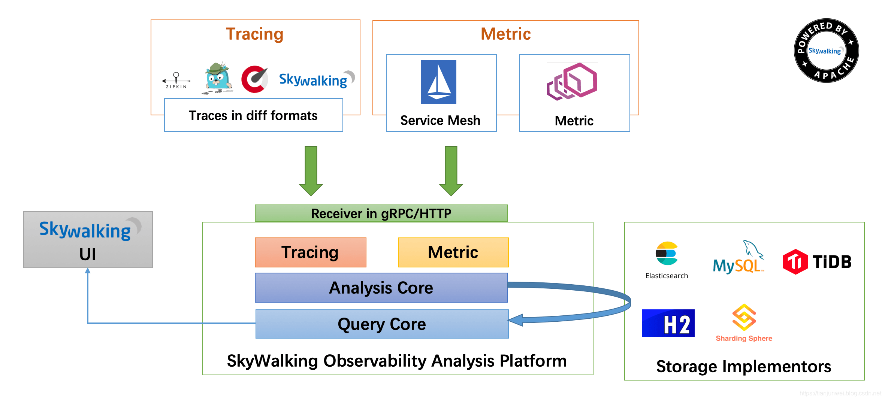
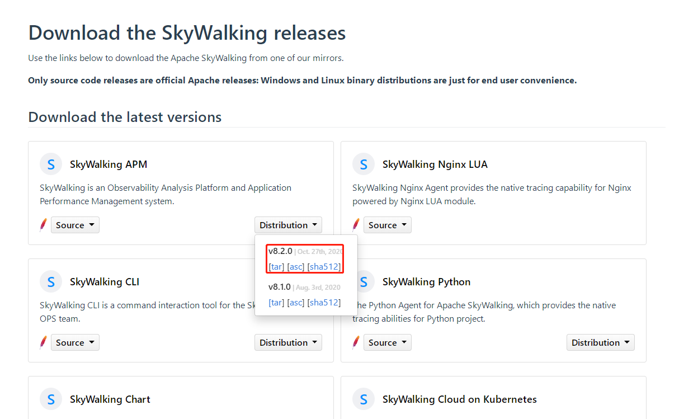
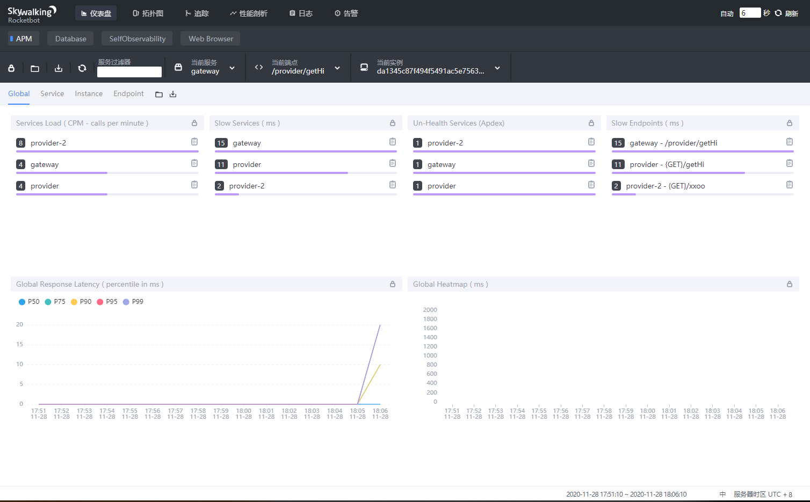

# Apache Skywalking

Application Performance Management,应用性能管理



**官方示例：**

http://122.112.182.72:8080/


## 安装部署

官方网站

http://skywalking.apache.org/

### 下载

http://skywalking.apache.org/downloads/



### 启动


## 服务接入探针

### 脚本

```
#!/bin/sh
# SkyWalking Agent配置
export SW_AGENT_NAME=boot-micrometer #Agent名字,一般使用`spring.application.name`
export SW_AGENT_COLLECTOR_BACKEND_SERVICES=127.0.0.1:11800 #配置 Collector 地址。
export SW_AGENT_SPAN_LIMIT=2000 #配置链路的最大Span数量，默认为 300。
export JAVA_AGENT=-javaagent:/root/apache-skywalking-apm-bin/agent/skywalking-agent.jar
java $JAVA_AGENT -jar springcloudalibaba-0.0.1-SNAPSHOT.jar #jar启动

```


### 集成ide

```
-javaagent:C:/dev/apache-skywalking-apm-8.2.0/apache-skywalking-apm-bin/agent/skywalking-agent.jar -Dskywalking.agent.service_name=provider -Dskywalking.collector.backend_service=192.168.150.113:11800
```


## 监控dashboard 仪表盘

dashboard：http://192.168.150.113:8080/

**数据收集端口：**

- Http默认端口 12800

- gRPC默认端口 11800




### Global全局维度

**Services load**：服务每分钟请求数

**Slow Services**：慢响应服务，单位ms

**Un-Health services(Apdex)**:Apdex性能指标，1为满分。

- Apdex 一个由众多网络分析技术公司和测量工业组成的联盟组织，它们联合起来开发了“应用性能指数”即“Apdex”(Application Performance Index)，用一句话来概括，Apdex是用户对应用性能满意度的量化值
- http://www.apdex.org/

**Slow Endpoints**: 慢响应端点，单位ms

**Global Response Latency**：百分比响应延时，不同百分比的延时时间，单位ms

**Global Heatmap**：服务响应时间热力分布图，根据时间段内不同响应时间的数量显示颜色深度


### Service服务维度

**Service Apdex（数字**）:当前服务的评分 

**Service Avg Response Times**：平均响应延时，单位ms

**Successful Rate（数字）**：请求成功率

**Servce Load（数字）**：每分钟请求数

**Service Apdex（折线图）**：不同时间的Apdex评分

**Service Response Time Percentile**：百分比响应延时

**Successful Rate（折线图）**：不同时间的请求成功率

**Servce Load（折线图）**：不同时间的每分钟请求数

**Servce Instances Load**：每个服务实例的每分钟请求数

**Slow Service Instance**：每个服务实例的最大延时

**Service Instance Successful Rate**：每个服务实例的请求成功率


### Instance

**Service Instance Load**：当前实例的每分钟请求数

**Service Instance Successful Rate**：当前实例的请求成功率

**Service Instance Latency**：当前实例的响应延时

**JVM CPU**:jvm占用CPU的百分比

**JVM Memory**：JVM内存占用大小，单位m

**JVM GC Time**：JVM垃圾回收时间，包含YGC和OGC

**JVM GC Count**：JVM垃圾回收次数，包含YGC和OGC

### Endpoint

**Endpoint Load in Current Service**：每个端点的每分钟请求数

**Slow Endpoints in Current Service**：每个端点的最慢请求时间，单位ms

**Successful Rate in Current Service**：每个端点的请求成功率

**Endpoint Load**：当前端点每个时间段的请求数据

**Endpoint Avg Response Time**：当前端点每个时间段的请求行响应时间

**Endpoint Response Time Percentile**：当前端点每个时间段的响应时间占比

**Endpoint Successful Rate**：当前端点每个时间段的请求成功率


