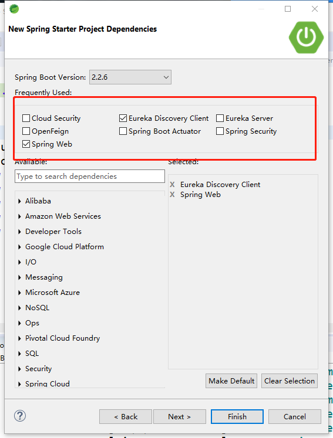
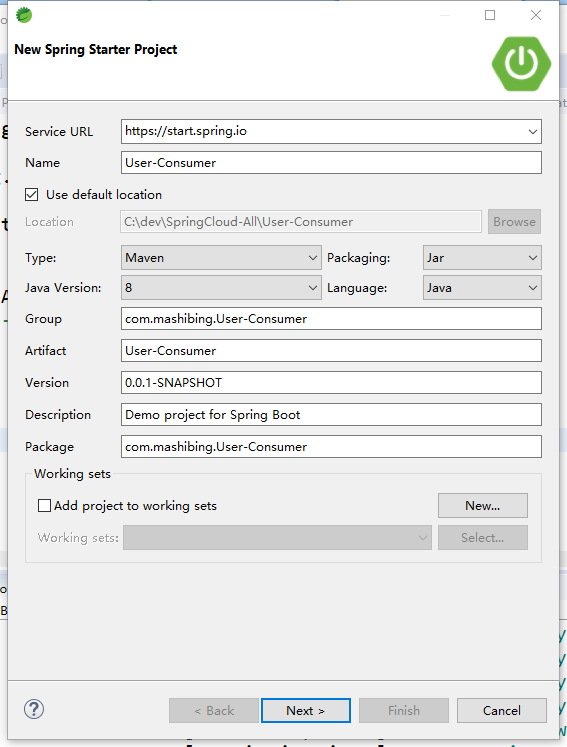
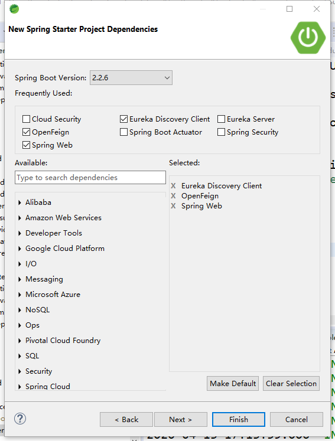

# Feign 与 OpenFeign

## 一、Feign

​		OpenFeign是Netflix 开发的声明式、模板化的HTTP请求客户端。可以更加便捷、优雅地调用http api。

​		OpenFeign会根据带有注解的函数信息构建出网络请求的模板，在发送网络请求之前，OpenFeign会将函数的参数值设置到这些请求模板中。

​		feign主要是构建微服务消费端。只要使用OpenFeign提供的注解修饰定义网络请求的接口类，就可以使用该接口的实例发送RESTful的网络请求。还可以集成Ribbon和Hystrix，提供负载均衡和断路器。

英文表意为“假装，伪装，变形”， 是一个 Http 请求调用的轻量级框架，可以以 Java 接口注解的方式调用 Http 请求，而不用像 Java 中通过封装 HTTP 请求报文的方式直接调用。通过处理注解，将请求模板化，当实际调用的时候，传入参数，根据参数再应用到请求上，进而转化成真正的请求，这种请求相对而言比较直观。Feign 封装 了HTTP 调用流程，面向接口编程，回想第一节课的SOP。


### 1. Feign和OpenFeign的关系

Feign本身不支持Spring MVC的注解，它有一套自己的注解

OpenFeign是Spring Cloud 在Feign的基础上支持了Spring MVC的注解，如@RequesMapping等等。
OpenFeign的`@FeignClient`可以解析SpringMVC的@RequestMapping注解下的接口，
并通过动态代理的方式产生实现类，实现类中做负载均衡并调用其他服务。


## 二、声明式服务调用

provider方提供公用API包，Feign通过SpringMVC的注解来加载URI

### 1.创建项目User-Provider


**选择依赖** 



### 2. 创建项目User-API

依赖 spring-boot-starter-web

#### 2.1 创建一个接口 RegisterApi

```java
package com.example.UserApi;

import org.springframework.web.bind.annotation.GetMapping;
import org.springframework.web.bind.annotation.RequestMapping;

/**
 * 用户操作相关接口
 */
@RequestMapping("/User")
public interface RegisterApi {

    @GetMapping("/isAlive")
    public String isAlive();
}
```

### 3. User-Provider 实现API

#### 3.1 配置文件

```properties
eureka.client.service-url.defaultZone=http://euk1.com:7001/eureka/

server.port=81

spring.application.name=user-provider
```

#### 3.2 引入API

1.maven install User-Api项目

2.User-Provider的Pom.xml添加依赖

```xml
<dependency>
    <groupId>com.mashibing.User-API</groupId>
    <artifactId>User-API</artifactId>
    <version>0.0.1-SNAPSHOT</version>
</dependency>
```

#### 3.3 创建UserController

实现Api的接口

```JAVA
package com.example.Controller;

import com.example.UserApi.RegisterApi;
import org.springframework.web.bind.annotation.RestController;

@RestController
public class UserController implements RegisterApi {
    @Override
    public String isAlive() {

        return "success";
    }
}
```

### 4. Consumer调用

#### 4.1 创建项目User-Consumer



#### 4.2 依赖



#### 4.3 引入API

Pom.xml添加依赖

```xml
<dependency>
    <groupId>com.mashibing.User-API</groupId>
    <artifactId>User-API</artifactId>
    <version>0.0.1-SNAPSHOT</version>
</dependency>
```

#### 4.4 配置文件

```properties
eureka.client.service-url.defaultZone=http://euk1.com:7001/eureka/

server.port=90

spring.application.name=consumer
```

#### 4.5 创建Service接口

```java
package com.example.service;

import com.example.UserApi.RegisterApi;
import org.springframework.cloud.openfeign.FeignClient;

@FeignClient("user-provider")
public interface UserConsumerService extends RegisterApi {

}
```

#### 4.6 创建Controller

```java
package com.example.controller;

import com.example.service.UserConsumerService;
import org.springframework.beans.factory.annotation.Autowired;
import org.springframework.web.bind.annotation.GetMapping;
import org.springframework.web.bind.annotation.RestController;

@RestController
public class ConsumerController {

    @Autowired
    private UserConsumerService consumerSrv;

    @GetMapping("alive")
    public String alive() {

        return consumerSrv.isAlive();
    }

}
```

#### 4.7 修改启动类

```java
package com.mashibing.UserConsumer;

import org.springframework.boot.SpringApplication;
import org.springframework.boot.autoconfigure.SpringBootApplication;
import org.springframework.cloud.openfeign.EnableFeignClients;

@SpringBootApplication
@EnableFeignClients
public class UserConsumerApplication {

	public static void main(String[] args) {
		SpringApplication.run(UserConsumerApplication.class, args);
	}

}
```

### 5.测试

访问 http://localhost:90/alive 即可完成声明式远程服务调用


## 三、Get和Post

Feign默认所有带参数的请求都是Post，想要使用指定的提交方式需引入依赖

```xml
<dependency>
    <groupId>io.github.openfeign</groupId>
    <artifactId>feign-httpclient</artifactId>
</dependency>
```

并指明提交方式

```xml
@RequestMapping(value = "/alived", method = RequestMethod.POST)
@GetMapping("/findById")
```

### 1. 带参请求

```java
@GetMapping("/findById")
public Map findById(@RequestParam("id") Integer id);

@PostMapping("/register")
public Map<String, String> reg(@RequestBody User user);
```


## 四、开启日志

### 1. 配置文件

```properties
logging.level.com.mashibing.UserConsumer:debug
```

### 2. 重写日志等级

```java
import org.springframework.context.annotation.Bean;
import org.springframework.context.annotation.Configuration;

import feign.Logger;

@Configuration
public class FeiginConfig {

	@Bean
	Logger.Level logLevel(){
		
		return Logger.Level.BASIC;
	}
}
```


## 五、超时

Feign默认支持Ribbon；Ribbon的重试机制和Feign的重试机制有冲突，所以源码中默认关闭Feign的重试机制,使用Ribbon的重试机制

```properties
#连接超时时间(ms)
ribbon.ConnectTimeout=1000
#业务逻辑超时时间(ms)
ribbon.ReadTimeout=6000
```


## 六、重试

```properties
#同一台实例最大重试次数,不包括首次调用
ribbon.MaxAutoRetries=1
#重试负载均衡其他的实例最大重试次数,不包括首次调用
ribbon.MaxAutoRetriesNextServer=1
#是否所有操作都重试
ribbon.OkToRetryOnAllOperations=false
```

> 使用ribbon重试机制，请求失败后，每个6秒会重新尝试
